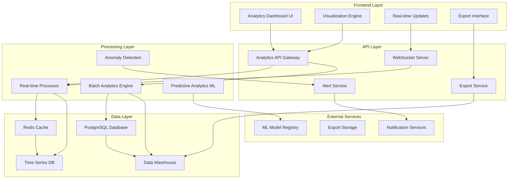
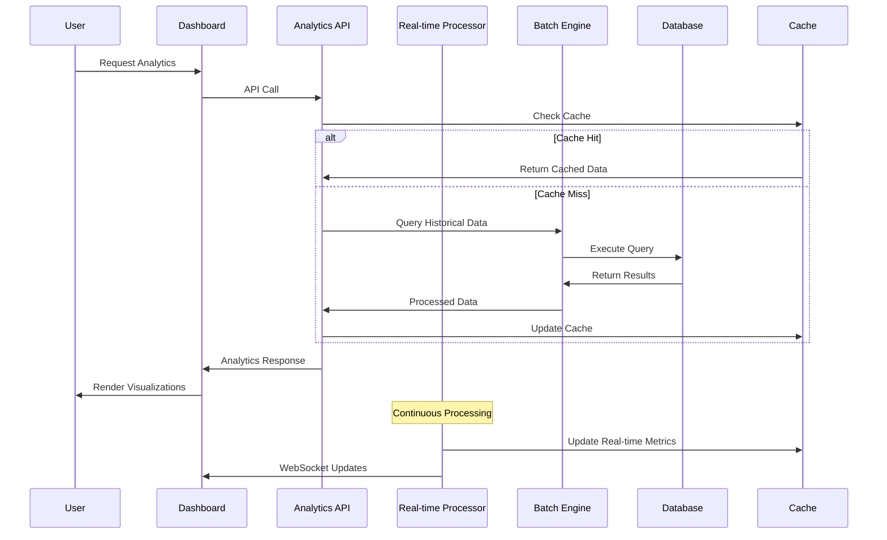

# Advanced Analytics & Business Intelligence Dashboard - Design

## Overview

The Advanced Analytics & Business Intelligence Dashboard is a comprehensive data visualization and insights platform that extends LinkDAO's existing analytics capabilities. Building on the current `analyticsService.ts` and `adminDashboardService.ts`, this system will provide enterprise-grade analytics with real-time processing, predictive modeling, and interactive visualizations.

The system leverages LinkDAO's existing data infrastructure including PostgreSQL with Drizzle ORM, Redis caching, and comprehensive user/transaction tracking to deliver actionable insights across all platform stakeholders.

## Architecture

### High-Level Architecture



### Data Flow Architecture



## Components and Interfaces

### 1. Analytics Dashboard Frontend

**Technology Stack:**
- React 18 with TypeScript
- D3.js for custom visualizations
- Chart.js/Recharts for standard charts
- WebSocket client for real-time updates
- React Query for data fetching and caching

**Key Components:**

```typescript
// Dashboard Layout Manager
interface DashboardLayout {
  id: string;
  name: string;
  widgets: WidgetConfig[];
  layout: GridLayout[];
  permissions: string[];
  isDefault: boolean;
}

// Widget Configuration
interface WidgetConfig {
  id: string;
  type: 'metric' | 'chart' | 'table' | 'heatmap' | 'funnel' | 'custom';
  title: string;
  dataSource: string;
  refreshInterval: number;
  filters: FilterConfig[];
  visualization: VisualizationConfig;
  size: { width: number; height: number };
  position: { x: number; y: number };
}

// Real-time Data Interface
interface RealTimeMetrics {
  timestamp: Date;
  activeUsers: number;
  transactionsPerSecond: number;
  revenue: number;
  systemHealth: SystemHealthMetrics;
  alerts: AlertSummary[];
}
```

### 2. Analytics API Gateway

**Endpoints:**

```typescript
// Core Analytics Endpoints
GET /api/analytics/overview
GET /api/analytics/users/behavior
GET /api/analytics/sales/performance
GET /api/analytics/sellers/{sellerId}
GET /api/analytics/financial/summary
GET /api/analytics/compliance/audit

// Real-time Endpoints
GET /api/analytics/realtime/metrics
WebSocket /ws/analytics/live-updates

// Custom Query Endpoints
POST /api/analytics/query/custom
GET /api/analytics/reports/{reportId}
POST /api/analytics/reports/generate

// Export Endpoints
POST /api/analytics/export/csv
POST /api/analytics/export/pdf
GET /api/analytics/export/{exportId}/status
```

### 3. Real-Time Processing Engine

**Architecture:**
- Apache Kafka for event streaming
- Redis Streams for real-time aggregation
- WebSocket connections for live updates
- Event-driven architecture with pub/sub patterns

**Processing Pipeline:**

```typescript
interface EventProcessor {
  processUserEvent(event: UserEvent): Promise<void>;
  processTransactionEvent(event: TransactionEvent): Promise<void>;
  processSystemEvent(event: SystemEvent): Promise<void>;
  aggregateMetrics(timeWindow: TimeWindow): Promise<AggregatedMetrics>;
}

interface RealTimeAggregator {
  updateActiveUsers(userId: string): void;
  updateTransactionMetrics(transaction: Transaction): void;
  updateSystemMetrics(metrics: SystemMetrics): void;
  publishUpdates(): void;
}
```

### 4. Predictive Analytics Module

**ML Pipeline:**
- Time series forecasting using ARIMA/Prophet
- User behavior prediction with collaborative filtering
- Anomaly detection using isolation forests
- Revenue forecasting with ensemble methods

**Model Interface:**

```typescript
interface PredictiveModel {
  name: string;
  version: string;
  type: 'forecasting' | 'classification' | 'anomaly_detection';
  
  predict(input: ModelInput): Promise<Prediction>;
  retrain(data: TrainingData): Promise<ModelMetrics>;
  evaluate(): Promise<ModelPerformance>;
}

interface ForecastingService {
  forecastRevenue(timeHorizon: number): Promise<RevenueForecast>;
  forecastUserGrowth(timeHorizon: number): Promise<UserGrowthForecast>;
  detectAnomalies(metrics: MetricsData): Promise<AnomalyAlert[]>;
}
```

## Data Models

### Analytics Data Schema

```sql
-- Enhanced Analytics Tables
CREATE TABLE analytics_events (
  id UUID PRIMARY KEY DEFAULT gen_random_uuid(),
  user_id UUID REFERENCES users(id),
  session_id VARCHAR(255),
  event_type VARCHAR(100) NOT NULL,
  event_data JSONB,
  page_url TEXT,
  user_agent TEXT,
  ip_address INET,
  country VARCHAR(2),
  city VARCHAR(100),
  device_type VARCHAR(50),
  browser VARCHAR(100),
  referrer TEXT,
  timestamp TIMESTAMPTZ DEFAULT NOW(),
  
  -- Indexes for performance
  INDEX idx_analytics_events_user_timestamp (user_id, timestamp),
  INDEX idx_analytics_events_type_timestamp (event_type, timestamp),
  INDEX idx_analytics_events_session (session_id),
  INDEX idx_analytics_events_country (country, timestamp)
);

-- Real-time Metrics Storage
CREATE TABLE realtime_metrics (
  id SERIAL PRIMARY KEY,
  metric_name VARCHAR(100) NOT NULL,
  metric_value NUMERIC,
  dimensions JSONB,
  timestamp TIMESTAMPTZ DEFAULT NOW(),
  
  INDEX idx_realtime_metrics_name_time (metric_name, timestamp),
  INDEX idx_realtime_metrics_dimensions (dimensions)
);

-- Aggregated Analytics
CREATE TABLE analytics_aggregations (
  id UUID PRIMARY KEY DEFAULT gen_random_uuid(),
  aggregation_type VARCHAR(100) NOT NULL,
  time_bucket TIMESTAMPTZ NOT NULL,
  bucket_size INTERVAL NOT NULL,
  dimensions JSONB,
  metrics JSONB,
  created_at TIMESTAMPTZ DEFAULT NOW(),
  
  UNIQUE(aggregation_type, time_bucket, bucket_size, dimensions)
);

-- Predictive Model Results
CREATE TABLE prediction_results (
  id UUID PRIMARY KEY DEFAULT gen_random_uuid(),
  model_name VARCHAR(100) NOT NULL,
  model_version VARCHAR(50) NOT NULL,
  prediction_type VARCHAR(100) NOT NULL,
  input_data JSONB,
  prediction_data JSONB,
  confidence_score NUMERIC(5,4),
  created_at TIMESTAMPTZ DEFAULT NOW(),
  
  INDEX idx_prediction_results_model (model_name, model_version),
  INDEX idx_prediction_results_type_time (prediction_type, created_at)
);

-- Custom Dashboards
CREATE TABLE custom_dashboards (
  id UUID PRIMARY KEY DEFAULT gen_random_uuid(),
  user_id UUID REFERENCES users(id),
  name VARCHAR(255) NOT NULL,
  description TEXT,
  layout_config JSONB NOT NULL,
  permissions JSONB,
  is_public BOOLEAN DEFAULT FALSE,
  created_at TIMESTAMPTZ DEFAULT NOW(),
  updated_at TIMESTAMPTZ DEFAULT NOW()
);

-- Scheduled Reports
CREATE TABLE scheduled_reports (
  id UUID PRIMARY KEY DEFAULT gen_random_uuid(),
  user_id UUID REFERENCES users(id),
  name VARCHAR(255) NOT NULL,
  report_config JSONB NOT NULL,
  schedule_config JSONB NOT NULL,
  last_run_at TIMESTAMPTZ,
  next_run_at TIMESTAMPTZ,
  is_active BOOLEAN DEFAULT TRUE,
  created_at TIMESTAMPTZ DEFAULT NOW()
);
```

### TypeScript Interfaces

```typescript
// Core Analytics Interfaces
interface AnalyticsQuery {
  metrics: string[];
  dimensions: string[];
  filters: QueryFilter[];
  timeRange: TimeRange;
  granularity: 'minute' | 'hour' | 'day' | 'week' | 'month';
  limit?: number;
  orderBy?: OrderBy[];
}

interface QueryFilter {
  field: string;
  operator: 'eq' | 'ne' | 'gt' | 'gte' | 'lt' | 'lte' | 'in' | 'nin' | 'contains';
  value: any;
}

interface AnalyticsResult {
  data: DataPoint[];
  metadata: ResultMetadata;
  executionTime: number;
  cached: boolean;
}

interface DataPoint {
  timestamp?: Date;
  dimensions: Record<string, any>;
  metrics: Record<string, number>;
}

// Dashboard Configuration
interface DashboardConfig {
  id: string;
  name: string;
  description?: string;
  layout: WidgetLayout[];
  filters: GlobalFilter[];
  refreshInterval: number;
  permissions: Permission[];
  theme: ThemeConfig;
}

interface WidgetLayout {
  id: string;
  type: WidgetType;
  title: string;
  query: AnalyticsQuery;
  visualization: VisualizationConfig;
  position: Position;
  size: Size;
  options: WidgetOptions;
}

// Predictive Analytics
interface PredictionRequest {
  modelType: 'revenue_forecast' | 'user_growth' | 'churn_prediction' | 'anomaly_detection';
  timeHorizon?: number;
  inputData: Record<string, any>;
  confidence?: number;
}

interface PredictionResult {
  predictions: PredictionPoint[];
  confidence: number;
  modelMetrics: ModelMetrics;
  explanation?: string;
}
```

## Error Handling

### Error Classification

```typescript
enum AnalyticsErrorType {
  QUERY_TIMEOUT = 'QUERY_TIMEOUT',
  INVALID_QUERY = 'INVALID_QUERY',
  INSUFFICIENT_PERMISSIONS = 'INSUFFICIENT_PERMISSIONS',
  DATA_NOT_AVAILABLE = 'DATA_NOT_AVAILABLE',
  RATE_LIMIT_EXCEEDED = 'RATE_LIMIT_EXCEEDED',
  MODEL_UNAVAILABLE = 'MODEL_UNAVAILABLE',
  EXPORT_FAILED = 'EXPORT_FAILED'
}

class AnalyticsError extends Error {
  constructor(
    public type: AnalyticsErrorType,
    public message: string,
    public details?: any
  ) {
    super(message);
  }
}
```

### Error Recovery Strategies

1. **Query Timeout Handling:**
   - Implement query cancellation
   - Provide cached results when available
   - Suggest query optimization

2. **Data Availability Issues:**
   - Graceful degradation with partial data
   - Clear messaging about missing data
   - Alternative data sources when possible

3. **Performance Issues:**
   - Automatic query optimization
   - Progressive data loading
   - Intelligent caching strategies

## Testing Strategy

### Unit Testing

```typescript
// Service Layer Tests
describe('AdvancedAnalyticsService', () => {
  test('should generate accurate revenue forecasts', async () => {
    const service = new AdvancedAnalyticsService();
    const forecast = await service.forecastRevenue(30);
    
    expect(forecast.predictions).toHaveLength(30);
    expect(forecast.confidence).toBeGreaterThan(0.7);
  });
  
  test('should detect anomalies in transaction patterns', async () => {
    const service = new AdvancedAnalyticsService();
    const anomalies = await service.detectAnomalies(mockTransactionData);
    
    expect(anomalies).toContainEqual(
      expect.objectContaining({
        type: 'transaction_spike',
        severity: 'high'
      })
    );
  });
});

// Component Tests
describe('AnalyticsDashboard', () => {
  test('should render widgets based on configuration', () => {
    const config = mockDashboardConfig;
    render(<AnalyticsDashboard config={config} />);
    
    expect(screen.getByText('Revenue Overview')).toBeInTheDocument();
    expect(screen.getByText('User Growth')).toBeInTheDocument();
  });
});
```

### Integration Testing

```typescript
describe('Analytics API Integration', () => {
  test('should handle complex multi-dimensional queries', async () => {
    const query = {
      metrics: ['revenue', 'transactions'],
      dimensions: ['country', 'device_type'],
      timeRange: { start: '2024-01-01', end: '2024-01-31' },
      granularity: 'day'
    };
    
    const response = await request(app)
      .post('/api/analytics/query/custom')
      .send(query)
      .expect(200);
    
    expect(response.body.data).toBeDefined();
    expect(response.body.executionTime).toBeLessThan(5000);
  });
});
```

### Performance Testing

```typescript
describe('Analytics Performance', () => {
  test('should handle high-volume real-time updates', async () => {
    const startTime = Date.now();
    
    // Simulate 1000 concurrent events
    const promises = Array.from({ length: 1000 }, (_, i) => 
      analyticsService.trackEvent({
        userId: `user_${i}`,
        eventType: 'page_view',
        data: { page: '/dashboard' }
      })
    );
    
    await Promise.all(promises);
    
    const endTime = Date.now();
    expect(endTime - startTime).toBeLessThan(2000); // 2 seconds max
  });
});
```

### Load Testing

- **Concurrent Users:** Support 1000+ concurrent dashboard users
- **Query Performance:** Complex queries under 5 seconds
- **Real-time Updates:** Sub-second latency for live metrics
- **Data Processing:** Handle 10,000+ events per second

## Security Considerations

### Data Access Control

```typescript
interface AnalyticsPermission {
  userId: string;
  role: 'admin' | 'analyst' | 'seller' | 'user';
  dataAccess: {
    userLevel: 'own' | 'team' | 'all';
    financialData: boolean;
    personalData: boolean;
    systemMetrics: boolean;
  };
  queryLimits: {
    maxTimeRange: number; // days
    maxDataPoints: number;
    allowedMetrics: string[];
  };
}
```

### Data Privacy

1. **PII Protection:**
   - Automatic data anonymization
   - Configurable data retention policies
   - GDPR compliance features

2. **Query Auditing:**
   - Log all analytics queries
   - Track data access patterns
   - Alert on suspicious activity

3. **Export Security:**
   - Watermarked exports
   - Access-controlled download links
   - Audit trail for all exports

## Performance Optimization

### Caching Strategy

```typescript
interface CacheStrategy {
  // Multi-level caching
  l1Cache: RedisCache; // Hot data, 5-minute TTL
  l2Cache: DatabaseCache; // Warm data, 1-hour TTL
  l3Cache: CDNCache; // Cold data, 24-hour TTL
  
  // Intelligent cache warming
  precomputePopularQueries(): Promise<void>;
  invalidateOnDataUpdate(dataType: string): Promise<void>;
}
```

### Query Optimization

1. **Automatic Query Rewriting:**
   - Convert complex queries to optimized forms
   - Use materialized views for common aggregations
   - Implement query result pagination

2. **Data Partitioning:**
   - Time-based partitioning for analytics tables
   - Horizontal sharding for high-volume data
   - Intelligent data archiving

3. **Real-time Processing:**
   - Stream processing for live metrics
   - Micro-batch processing for near real-time aggregations
   - Event sourcing for audit trails

## Deployment Architecture

### Microservices Structure

```yaml
services:
  analytics-api:
    image: linkdao/analytics-api:latest
    replicas: 3
    resources:
      cpu: "1000m"
      memory: "2Gi"
    
  realtime-processor:
    image: linkdao/realtime-processor:latest
    replicas: 2
    resources:
      cpu: "2000m"
      memory: "4Gi"
    
  ml-service:
    image: linkdao/ml-service:latest
    replicas: 1
    resources:
      cpu: "4000m"
      memory: "8Gi"
      gpu: "1"
    
  export-service:
    image: linkdao/export-service:latest
    replicas: 2
    resources:
      cpu: "500m"
      memory: "1Gi"
```

### Monitoring and Observability

```typescript
interface MonitoringConfig {
  metrics: {
    queryLatency: HistogramMetric;
    queryThroughput: CounterMetric;
    cacheHitRate: GaugeMetric;
    errorRate: CounterMetric;
  };
  
  alerts: {
    highQueryLatency: AlertRule;
    lowCacheHitRate: AlertRule;
    predictionModelDrift: AlertRule;
    dataQualityIssues: AlertRule;
  };
  
  dashboards: {
    systemHealth: GrafanaDashboard;
    businessMetrics: GrafanaDashboard;
    userBehavior: GrafanaDashboard;
  };
}
```

This comprehensive design provides a robust foundation for implementing an enterprise-grade analytics and business intelligence platform that seamlessly integrates with LinkDAO's existing infrastructure while providing powerful new capabilities for data-driven decision making.