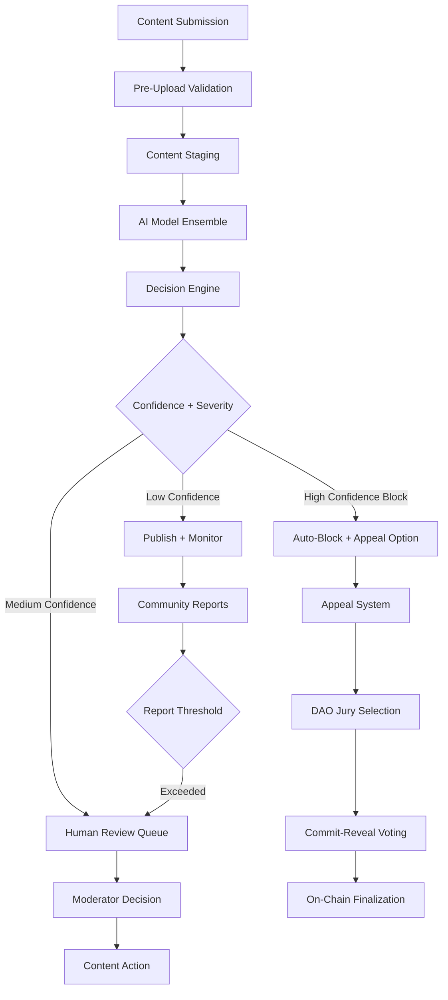

# AI Content Moderation System Design

## Overview

The AI Content Moderation System is a comprehensive, multi-layered solution that protects users while preserving crypto-native expression. It uses an ensemble of AI models, community reporting, human review, and DAO-backed appeals to moderate content across all platform surfaces including posts, comments, images, marketplace listings, and direct messages.

The system follows a vendor-agnostic approach with graceful degradation, integrates deeply with the existing Web3 infrastructure (Drizzle + Postgres, IPFS, AA wallets, DAO governance), and provides transparent, auditable decisions through immutable evidence storage.

## Architecture

### High-Level System Flow



### System Components

#### 1. Content Ingestion Pipeline
- **Pre-upload validation**: Client-side hints, file type/size checks
- **Staging storage**: Private S3/IPFS for content under review
- **Queue management**: Fast lane (1-3s) for text, slow lane (10-30s) for media
- **Batch processing**: Vendor API optimization and cost control

#### 2. AI Model Ensemble
- **Text Analysis**: OpenAI Moderation API, Perspective API, AWS Comprehend
- **Image/Video**: Google Vision API, AWS Rekognition, Azure Content Moderator
- **Link Safety**: Google Safe Browsing, PhishFort, custom blacklists
- **Custom Models**: Crypto-specific scam detection, NFT authenticity

#### 3. Decision Engine
- **Confidence scoring**: Weighted ensemble results
- **Reputation adjustment**: Dynamic thresholds based on user history
- **Policy matrix**: Configurable rules by content type and severity
- **Context awareness**: Wallet risk scores, on-chain reputation

#### 4. Human Review System
- **Moderator console**: Full context interface with evidence
- **Queue prioritization**: Weighted by reports, confidence, user impact
- **Decision templates**: One-click actions with policy compliance
- **Evidence preservation**: IPFS CIDs for audit trails

#### 5. Appeals and DAO Integration
- **Stake-to-appeal**: Economic deterrent for frivolous appeals
- **Juror selection**: Reputation + stake based randomization
- **Voting mechanism**: Commit-reveal to prevent coordination
- **On-chain finalization**: Immutable decision records

## Components and Interfaces

### Database Schema Extensions

Building on the existing Drizzle + Postgres setup:

```typescript
// Core moderation cases
export const moderation_cases = pgTable("moderation_cases", {
  id: serial("id").primaryKey(),
  contentId: varchar("content_id", { length: 64 }).notNull(),
  contentType: varchar("content_type", { length: 24 }).notNull(), // post|comment|listing|dm
  userId: uuid("user_id").notNull(),
  status: varchar("status", { length: 24 }).default("pending"),
  riskScore: numeric("risk_score").default("0"),
  decision: varchar("decision", { length: 24 }).nullable(),
  reasonCode: varchar("reason_code", { length: 48 }).nullable(),
  confidence: numeric("confidence").default("0"),
  vendorScores: jsonb("vendor_scores").$type<Record<string, number>>().default({}),
  evidenceCid: text("evidence_cid"), // IPFS evidence bundle
  createdAt: timestamp("created_at").defaultNow(),
  updatedAt: timestamp("updated_at").defaultNow(),
});

// User enforcement actions
export const moderation_actions = pgTable("moderation_actions", {
  id: serial("id").primaryKey(),
  userId: uuid("user_id").notNull(),
  contentId: varchar("content_id", { length: 64 }).notNull(),
  action: varchar("action", { length: 24 }).notNull(),
  durationSec: integer("duration_sec").default(0),
  appliedBy: varchar("applied_by", { length: 64 }),
  rationale: text("rationale"),
  createdAt: timestamp("created_at").defaultNow(),
});

// Community reports
export const content_reports = pgTable("content_reports", {
  id: serial("id").primaryKey(),
  contentId: varchar("content_id", { length: 64 }).notNull(),
  reporterId: uuid("reporter_id").notNull(),
  reason: varchar("reason", { length: 48 }).notNull(),
  details: text("details"),
  weight: numeric("weight").default("1"),
  status: varchar("status", { length: 24 }).default("open"),
  createdAt: timestamp("created_at").defaultNow(),
});

// Appeals system
export const moderation_appeals = pgTable("moderation_appeals", {
  id: serial("id").primaryKey(),
  caseId: integer("case_id").references(() => moderation_cases.id),
  appellantId: uuid("appellant_id").notNull(),
  status: varchar("status", { length: 24 }).default("open"),
  stakeAmount: numeric("stake_amount").default("0"),
  juryDecision: varchar("jury_decision", { length: 24 }).nullable(),
  decisionCid: text("decision_cid"),
  createdAt: timestamp("created_at").defaultNow(),
});
```

### API Interface Design

#### Public APIs
```typescript
// Content submission with moderation
POST /api/content
{
  type: 'post' | 'comment' | 'listing' | 'dm',
  content: string,
  media?: File[],
  metadata?: Record<string, any>
}
Response: { submissionId: string, status: 'pending' | 'approved' | 'rejected' }

// Moderation status check
GET /api/moderation/:contentId
Response: {
  status: 'allowed' | 'quarantined' | 'blocked',
  label?: string,
  canAppeal: boolean
}

// Community reporting
POST /api/reports
{
  contentId: string,
  reason: string,
  details?: string
}

// Appeals submission
POST /api/appeals
{
  caseId: number,
  stakeAmount: string,
  reasoning: string
}
```

#### Internal APIs
```typescript
// Trigger moderation scan
POST /api/_internal/moderation/scan
{
  contentId: string,
  priority: 'fast' | 'slow',
  rescan?: boolean
}

// Human moderator decision
POST /api/_internal/moderation/decision
{
  caseId: number,
  decision: 'allow' | 'limit' | 'block',
  reasoning: string,
  moderatorId: string
}

// Reputation updates
POST /api/_internal/moderation/reputation
{
  userId: string,
  action: 'violation' | 'helpful_report' | 'false_report',
  severity: number
}
```

### AI Model Integration

#### Ensemble Orchestrator
```typescript
interface ModerationResult {
  vendor: string;
  confidence: number;
  categories: string[];
  reasoning?: string;
  cost: number;
  latency: number;
}

interface EnsembleDecision {
  overallConfidence: number;
  primaryCategory: string;
  action: 'allow' | 'limit' | 'block' | 'review';
  vendorResults: ModerationResult[];
  evidenceHash: string;
}

class ModerationOrchestrator {
  async scanContent(content: ContentInput): Promise<EnsembleDecision> {
    const results = await Promise.allSettled([
      this.textAnalysis(content),
      this.imageAnalysis(content),
      this.linkSafety(content),
      this.contextualAnalysis(content)
    ]);
    
    return this.aggregateResults(results);
  }
}
```

## Data Models

### Content Moderation Models

```typescript
interface ContentInput {
  id: string;
  type: 'post' | 'comment' | 'listing' | 'dm' | 'username';
  text?: string;
  media?: MediaFile[];
  links?: string[];
  userId: string;
  userReputation: number;
  walletAddress: string;
  metadata: Record<string, any>;
}

interface ModerationCase {
  id: number;
  contentId: string;
  contentType: string;
  userId: string;
  status: 'pending' | 'quarantined' | 'blocked' | 'allowed' | 'appealed';
  riskScore: number;
  decision?: 'allow' | 'limit' | 'block';
  reasonCode?: string;
  confidence: number;
  vendorScores: Record<string, number>;
  evidenceCid?: string;
  createdAt: Date;
  updatedAt: Date;
}

interface PolicyRule {
  category: string;
  severity: 'low' | 'medium' | 'high' | 'critical';
  confidenceThreshold: number;
  action: 'allow' | 'limit' | 'block' | 'review';
  reputationModifier: number;
  description: string;
}
```

### Evidence and Audit Models

```typescript
interface EvidenceBundle {
  caseId: number;
  contentHash: string;
  screenshots?: string[];
  modelOutputs: Record<string, any>;
  decisionRationale: string;
  policyVersion: string;
  timestamp: Date;
  moderatorId?: string;
}

interface AuditLog {
  id: string;
  action: string;
  userId: string;
  contentId: string;
  oldState: any;
  newState: any;
  reasoning: string;
  timestamp: Date;
  ipfsHash: string;
}
```

## Error Handling

### Graceful Degradation Strategy

1. **Vendor Outages**
   - Fallback to single vendor when ensemble fails
   - Cached results for duplicate content
   - Publish with warning labels during degraded mode

2. **Performance Issues**
   - Circuit breaker pattern for slow vendors
   - Queue prioritization during high load
   - Async processing with status polling

3. **False Positive Mitigation**
   - Appeal system with economic incentives
   - Human review escalation paths
   - Continuous model retraining based on appeals

### Error Response Patterns

```typescript
interface ModerationError {
  code: string;
  message: string;
  retryable: boolean;
  fallbackAction: 'allow' | 'block' | 'queue';
}

class ModerationErrorHandler {
  handleVendorFailure(error: VendorError): ModerationDecision {
    if (error.isTemporary) {
      return { action: 'queue', reason: 'vendor_unavailable' };
    }
    return { action: 'allow', reason: 'degraded_mode', label: 'pending_review' };
  }
}
```

## Testing Strategy

### Unit Testing
- Model integration mocks and stubs
- Decision engine logic with various confidence scenarios
- Database operations and schema validation
- API endpoint functionality

### Integration Testing
- End-to-end moderation pipeline
- Vendor API integration with real and mock responses
- Queue processing and error handling
- Appeal system workflow

### Performance Testing
- Load testing with concurrent content submissions
- Vendor API latency and timeout handling
- Database query optimization under load
- Cache effectiveness and hit rates

### Security Testing
- Prompt injection and jailbreak attempts
- Adversarial image testing (obfuscation, low-light)
- PII detection accuracy and redaction
- Appeal system economic attack vectors

### A/B Testing Framework
- Policy threshold optimization
- Model ensemble weight tuning
- User experience impact measurement
- False positive/negative rate tracking

## Implementation Phases

### Phase 1: Core Infrastructure (Sprints 1-2)
- Database schema and migrations
- Basic API endpoints and queue system
- Text moderation with OpenAI + Perspective
- Simple decision engine with fixed thresholds

### Phase 2: Multi-Modal Detection (Sprints 3-4)
- Image/video moderation integration
- Link safety checking
- Evidence storage with IPFS CIDs
- Enhanced decision engine with reputation

### Phase 3: Human Review System (Sprint 5)
- Moderator console interface
- Review queue management
- Decision templates and bulk actions
- Audit logging and evidence preservation

### Phase 4: Appeals and DAO Integration (Sprint 6)
- Stake-to-appeal mechanism
- Juror selection and voting system
- On-chain decision finalization
- Reputation impact integration

### Phase 5: Advanced Features (Sprints 7-8)
- Marketplace-specific rules
- Custom scam detection models
- Performance optimizations
- Community reporting enhancements

### Phase 6: Production Readiness (Sprints 9-10)
- Comprehensive monitoring and alerting
- Privacy compliance features
- Canary deployment system
- Documentation and runbooks