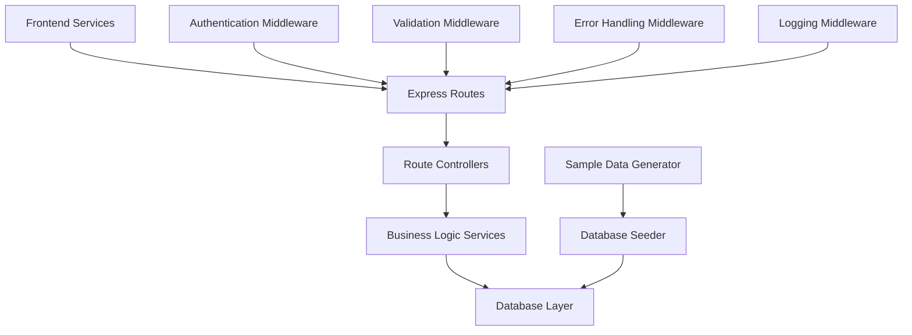

# Design Document

## Overview

This design implements the missing backend API infrastructure to complete marketplace functionality. The solution focuses on creating Express.js routes that integrate with existing frontend services, populating the database with sample data, and establishing proper API patterns for authentication, cart management, and seller operations. The design leverages existing backend services and database schema while adding the missing HTTP layer.

## Architecture

### API Layer Architecture



### Route Structure

```
/api
├── /marketplace
│   ├── GET /listings              # Browse products with filters
│   ├── GET /listings/:id          # Get product details
│   ├── GET /sellers/:id           # Get seller profile
│   ├── GET /sellers/:id/listings  # Get seller's products
│   └── GET /search               # Search products/sellers
├── /auth
│   ├── POST /wallet-connect      # Wallet authentication
│   ├── GET /profile              # Get user profile
│   ├── PUT /profile              # Update user profile
│   └── POST /logout              # User logout
├── /cart
│   ├── GET /                     # Get cart items
│   ├── POST /items               # Add to cart
│   ├── PUT /items/:id            # Update cart item
│   └── DELETE /items/:id         # Remove from cart
├── /sellers
│   ├── POST /listings            # Create listing
│   ├── PUT /listings/:id         # Update listing
│   ├── DELETE /listings/:id      # Delete listing
│   ├── GET /dashboard            # Seller analytics
│   └── PUT /profile              # Update seller profile
└── /orders
    ├── POST /                    # Create order
    ├── GET /                     # Get user orders
    └── GET /:id                  # Get order details
```

## Components and Interfaces

### 1. Core Marketplace Routes

**Implementation:**
```typescript
// routes/marketplaceRoutes.ts
import express from 'express';
import { marketplaceController } from '../controllers/marketplaceController';
import { validateRequest } from '../middleware/validation';
import { cacheMiddleware } from '../middleware/cache';

const router = express.Router();

// GET /api/marketplace/listings/:id
router.get('/listings/:id', 
  validateRequest({
    params: {
      id: Joi.string().required()
    }
  }),
  cacheMiddleware(300), // 5 minute cache
  marketplaceController.getListingById
);

// GET /api/marketplace/listings
router.get('/listings',
  validateRequest({
    query: {
      page: Joi.number().min(1).default(1),
      limit: Joi.number().min(1).max(100).default(20),
      category: Joi.string().optional(),
      minPrice: Joi.number().min(0).optional(),
      maxPrice: Joi.number().min(0).optional(),
      sellerId: Joi.string().optional(),
      search: Joi.string().optional()
    }
  }),
  cacheMiddleware(60), // 1 minute cache
  marketplaceController.getListings
);

// GET /api/marketplace/sellers/:id
router.get('/sellers/:id',
  validateRequest({
    params: {
      id: Joi.string().required()
    }
  }),
  cacheMiddleware(300),
  marketplaceController.getSellerById
);

// GET /api/marketplace/sellers/:id/listings
router.get('/sellers/:id/listings',
  validateRequest({
    params: {
      id: Joi.string().required()
    },
    query: {
      page: Joi.number().min(1).default(1),
      limit: Joi.number().min(1).max(100).default(20)
    }
  }),
  cacheMiddleware(60),
  marketplaceController.getSellerListings
);

export default router;
```

**Controller Implementation:**
```typescript
// controllers/marketplaceController.ts
import { Request, Response } from 'express';
import { marketplaceListingsService } from '../services/marketplaceListingsService';
import { sellerProfileService } from '../services/sellerProfileService';
import { ApiResponse } from '../utils/apiResponse';

export const marketplaceController = {
  async getListingById(req: Request, res: Response) {
    try {
      const { id } = req.params;
      const listing = await marketplaceListingsService.getById(id);
      
      if (!listing) {
        return ApiResponse.notFound(res, 'Product not found');
      }

      // Transform data to match frontend expectations
      const transformedListing = {
        id: listing.id,
        title: listing.title,
        description: listing.description,
        price: {
          crypto: listing.cryptoPrice,
          cryptoSymbol: listing.cryptoCurrency,
          fiat: listing.fiatPrice,
          fiatSymbol: listing.fiatCurrency
        },
        images: listing.images || [],
        seller: {
          id: listing.seller.id,
          name: listing.seller.displayName,
          avatar: listing.seller.profileImageUrl,
          verified: listing.seller.verified,
          reputation: listing.seller.reputation
        },
        category: listing.category,
        isDigital: listing.isDigital,
        isNFT: listing.isNFT,
        inventory: listing.inventory,
        createdAt: listing.createdAt
      };

      return ApiResponse.success(res, transformedListing);
    } catch (error) {
      console.error('Error fetching listing:', error);
      return ApiResponse.serverError(res, 'Failed to fetch product details');
    }
  },

  async getListings(req: Request, res: Response) {
    try {
      const { page, limit, category, minPrice, maxPrice, sellerId, search } = req.query;
      
      const filters = {
        category: category as string,
        minPrice: minPrice ? Number(minPrice) : undefined,
        maxPrice: maxPrice ? Number(maxPrice) : undefined,
        sellerId: sellerId as string,
        search: search as string
      };

      const result = await marketplaceListingsService.getListings({
        page: Number(page),
        limit: Number(limit),
        filters
      });

      const transformedListings = result.listings.map(listing => ({
        id: listing.id,
        title: listing.title,
        description: listing.description,
        price: {
          amount: listing.cryptoPrice,
          currency: listing.cryptoCurrency,
          usdEquivalent: listing.fiatPrice
        },
        images: listing.images || [],
        seller: {
          id: listing.seller.id,
          name: listing.seller.displayName,
          reputation: listing.seller.reputation
        },
        category: listing.category,
        createdAt: listing.createdAt
      }));

      return ApiResponse.success(res, {
        listings: transformedListings,
        pagination: {
          page: result.page,
          limit: result.limit,
          total: result.total,
          totalPages: Math.ceil(result.total / result.limit)
        }
      });
    } catch (error) {
      console.error('Error fetching listings:', error);
      return ApiResponse.serverError(res, 'Failed to fetch marketplace listings');
    }
  }
};
```

### 2. Authentication Routes

**Implementation:**
```typescript
// routes/authRoutes.ts
import express from 'express';
import { authController } from '../controllers/authController';
import { authMiddleware } from '../middleware/authMiddleware';
import { validateRequest } from '../middleware/validation';

const router = express.Router();

// POST /api/auth/wallet-connect
router.post('/wallet-connect',
  validateRequest({
    body: {
      walletAddress: Joi.string().required(),
      signature: Joi.string().required(),
      message: Joi.string().required()
    }
  }),
  authController.walletConnect
);

// GET /api/auth/profile
router.get('/profile',
  authMiddleware,
  authController.getProfile
);

// PUT /api/auth/profile
router.put('/profile',
  authMiddleware,
  validateRequest({
    body: {
      displayName: Joi.string().optional(),
      bio: Joi.string().optional(),
      profileImageUrl: Joi.string().uri().optional(),
      ensName: Joi.string().optional()
    }
  }),
  authController.updateProfile
);

export default router;
```

### 3. Shopping Cart Routes

**Implementation:**
```typescript
// routes/cartRoutes.ts
import express from 'express';
import { cartController } from '../controllers/cartController';
import { authMiddleware } from '../middleware/authMiddleware';
import { validateRequest } from '../middleware/validation';

const router = express.Router();

// All cart routes require authentication
router.use(authMiddleware);

// GET /api/cart
router.get('/', cartController.getCart);

// POST /api/cart/items
router.post('/items',
  validateRequest({
    body: {
      productId: Joi.string().required(),
      quantity: Joi.number().min(1).required()
    }
  }),
  cartController.addItem
);

// PUT /api/cart/items/:id
router.put('/items/:id',
  validateRequest({
    params: {
      id: Joi.string().required()
    },
    body: {
      quantity: Joi.number().min(1).required()
    }
  }),
  cartController.updateItem
);

// DELETE /api/cart/items/:id
router.delete('/items/:id',
  validateRequest({
    params: {
      id: Joi.string().required()
    }
  }),
  cartController.removeItem
);

export default router;
```

### 4. Database Seeding System

**Sample Data Generator:**
```typescript
// scripts/seedDatabase.ts
import { faker } from '@faker-js/faker';
import { db } from '../src/db/connection';
import { users, products, sellers } from '../src/db/schema';

interface SeedOptions {
  users: number;
  sellers: number;
  products: number;
}

export class DatabaseSeeder {
  async seed(options: SeedOptions = { users: 20, sellers: 10, products: 50 }) {
    console.log('🌱 Starting database seeding...');

    // Clear existing data
    await this.clearData();

    // Seed users
    const createdUsers = await this.seedUsers(options.users);
    console.log(`✅ Created ${createdUsers.length} users`);

    // Seed sellers (subset of users)
    const createdSellers = await this.seedSellers(createdUsers.slice(0, options.sellers));
    console.log(`✅ Created ${createdSellers.length} sellers`);

    // Seed products
    const createdProducts = await this.seedProducts(createdSellers, options.products);
    console.log(`✅ Created ${createdProducts.length} products`);

    console.log('🎉 Database seeding completed!');
  }

  private async seedUsers(count: number) {
    const users = [];
    for (let i = 0; i < count; i++) {
      users.push({
        id: faker.string.uuid(),
        walletAddress: faker.finance.ethereumAddress(),
        displayName: faker.person.fullName(),
        bio: faker.lorem.paragraph(),
        profileImageUrl: faker.image.avatar(),
        ensName: Math.random() > 0.7 ? `${faker.internet.userName()}.eth` : null,
        reputation: faker.number.int({ min: 0, max: 100 }),
        isVerified: Math.random() > 0.8,
        createdAt: faker.date.past({ years: 2 }),
        updatedAt: new Date()
      });
    }

    return await db.insert(users).values(users).returning();
  }

  private async seedSellers(userList: any[]) {
    const sellers = userList.map(user => ({
      id: faker.string.uuid(),
      userId: user.id,
      storeName: faker.company.name(),
      storeDescription: faker.lorem.paragraphs(2),
      coverImageUrl: faker.image.urlPicsumPhotos({ width: 1200, height: 400 }),
      totalSales: faker.number.int({ min: 0, max: 1000 }),
      averageRating: faker.number.float({ min: 3.0, max: 5.0, fractionDigits: 1 }),
      isActive: true,
      createdAt: faker.date.past({ years: 1 }),
      updatedAt: new Date()
    }));

    return await db.insert(sellers).values(sellers).returning();
  }

  private async seedProducts(sellerList: any[], count: number) {
    const categories = ['Electronics', 'Fashion', 'Home & Garden', 'Sports', 'Books', 'Art', 'Digital', 'NFTs'];
    const products = [];

    for (let i = 0; i < count; i++) {
      const seller = faker.helpers.arrayElement(sellerList);
      const category = faker.helpers.arrayElement(categories);
      const isDigital = category === 'Digital' || category === 'NFTs';
      const isNFT = category === 'NFTs';

      products.push({
        id: faker.string.uuid(),
        sellerId: seller.id,
        title: faker.commerce.productName(),
        description: faker.commerce.productDescription(),
        category,
        cryptoPrice: faker.number.float({ min: 0.001, max: 10, fractionDigits: 6 }),
        cryptoCurrency: 'ETH',
        fiatPrice: faker.number.float({ min: 1, max: 5000, fractionDigits: 2 }),
        fiatCurrency: 'USD',
        images: [
          faker.image.urlPicsumPhotos({ width: 800, height: 600 }),
          faker.image.urlPicsumPhotos({ width: 800, height: 600 }),
          faker.image.urlPicsumPhotos({ width: 800, height: 600 })
        ],
        isDigital,
        isNFT,
        inventory: isDigital ? null : faker.number.int({ min: 1, max: 100 }),
        status: 'active',
        tags: faker.helpers.arrayElements(['popular', 'trending', 'new', 'sale', 'featured'], { min: 0, max: 3 }),
        createdAt: faker.date.past({ years: 1 }),
        updatedAt: new Date()
      });
    }

    return await db.insert(products).values(products).returning();
  }

  private async clearData() {
    console.log('🧹 Clearing existing data...');
    await db.delete(products);
    await db.delete(sellers);
    await db.delete(users);
  }
}

// CLI script
if (require.main === module) {
  const seeder = new DatabaseSeeder();
  seeder.seed().then(() => process.exit(0)).catch(console.error);
}
```

## Data Models

### API Response Format
```typescript
interface ApiResponse<T = any> {
  success: boolean;
  data?: T;
  error?: {
    message: string;
    code?: string;
    details?: any;
  };
  pagination?: {
    page: number;
    limit: number;
    total: number;
    totalPages: number;
  };
}

// Utility class for consistent responses
export class ApiResponse {
  static success<T>(res: Response, data: T, pagination?: any) {
    return res.status(200).json({
      success: true,
      data,
      ...(pagination && { pagination })
    });
  }

  static created<T>(res: Response, data: T) {
    return res.status(201).json({
      success: true,
      data
    });
  }

  static badRequest(res: Response, message: string, details?: any) {
    return res.status(400).json({
      success: false,
      error: {
        message,
        code: 'BAD_REQUEST',
        details
      }
    });
  }

  static notFound(res: Response, message: string = 'Resource not found') {
    return res.status(404).json({
      success: false,
      error: {
        message,
        code: 'NOT_FOUND'
      }
    });
  }

  static serverError(res: Response, message: string = 'Internal server error') {
    return res.status(500).json({
      success: false,
      error: {
        message,
        code: 'INTERNAL_ERROR'
      }
    });
  }
}
```

### Frontend Service Integration
```typescript
// Frontend: Enhanced integration with backend
export class EnhancedMarketplaceService {
  private baseURL = process.env.NEXT_PUBLIC_API_URL || 'http://localhost:3001/api';

  async getListingById(id: string): Promise<ApiResponse<ProductDetail>> {
    const response = await this.makeRequest(`/marketplace/listings/${id}`);
    
    if (!response.success) {
      throw new Error(response.error?.message || 'Failed to fetch listing');
    }

    return response;
  }

  async getListings(params: {
    page?: number;
    limit?: number;
    category?: string;
    search?: string;
    minPrice?: number;
    maxPrice?: number;
  } = {}): Promise<ApiResponse<{ listings: Product[]; pagination: any }>> {
    const queryParams = new URLSearchParams();
    Object.entries(params).forEach(([key, value]) => {
      if (value !== undefined) {
        queryParams.append(key, value.toString());
      }
    });

    const response = await this.makeRequest(`/marketplace/listings?${queryParams}`);
    
    if (!response.success) {
      throw new Error(response.error?.message || 'Failed to fetch listings');
    }

    return response;
  }

  private async makeRequest(endpoint: string, options: RequestInit = {}): Promise<any> {
    const url = `${this.baseURL}${endpoint}`;
    
    const response = await fetch(url, {
      headers: {
        'Content-Type': 'application/json',
        ...options.headers
      },
      ...options
    });

    return await response.json();
  }
}
```

## Error Handling

### Global Error Handler
```typescript
// middleware/errorHandler.ts
import { Request, Response, NextFunction } from 'express';
import { ApiResponse } from '../utils/apiResponse';

export const globalErrorHandler = (
  error: any,
  req: Request,
  res: Response,
  next: NextFunction
) => {
  console.error('Global error handler:', error);

  // Validation errors
  if (error.name === 'ValidationError') {
    return ApiResponse.badRequest(res, 'Validation failed', error.details);
  }

  // Database errors
  if (error.code === 'SQLITE_CONSTRAINT') {
    return ApiResponse.badRequest(res, 'Database constraint violation');
  }

  // JWT errors
  if (error.name === 'JsonWebTokenError') {
    return res.status(401).json({
      success: false,
      error: {
        message: 'Invalid authentication token',
        code: 'INVALID_TOKEN'
      }
    });
  }

  // Default server error
  return ApiResponse.serverError(res, 'An unexpected error occurred');
};
```

## Testing Strategy

### Integration Tests
```typescript
// tests/integration/marketplace.test.ts
import request from 'supertest';
import { app } from '../../src/app';
import { DatabaseSeeder } from '../../scripts/seedDatabase';

describe('Marketplace API', () => {
  beforeAll(async () => {
    const seeder = new DatabaseSeeder();
    await seeder.seed({ users: 5, sellers: 3, products: 10 });
  });

  describe('GET /api/marketplace/listings', () => {
    it('should return paginated product listings', async () => {
      const response = await request(app)
        .get('/api/marketplace/listings')
        .expect(200);

      expect(response.body.success).toBe(true);
      expect(response.body.data.listings).toBeInstanceOf(Array);
      expect(response.body.data.pagination).toBeDefined();
    });

    it('should filter by category', async () => {
      const response = await request(app)
        .get('/api/marketplace/listings?category=Electronics')
        .expect(200);

      expect(response.body.success).toBe(true);
      response.body.data.listings.forEach((listing: any) => {
        expect(listing.category).toBe('Electronics');
      });
    });
  });

  describe('GET /api/marketplace/listings/:id', () => {
    it('should return product details for valid ID', async () => {
      // First get a listing ID
      const listingsResponse = await request(app)
        .get('/api/marketplace/listings')
        .expect(200);

      const listingId = listingsResponse.body.data.listings[0].id;

      const response = await request(app)
        .get(`/api/marketplace/listings/${listingId}`)
        .expect(200);

      expect(response.body.success).toBe(true);
      expect(response.body.data.id).toBe(listingId);
      expect(response.body.data.seller).toBeDefined();
    });

    it('should return 404 for invalid ID', async () => {
      const response = await request(app)
        .get('/api/marketplace/listings/invalid-id')
        .expect(404);

      expect(response.body.success).toBe(false);
      expect(response.body.error.code).toBe('NOT_FOUND');
    });
  });
});
```

## Implementation Phases

### Phase 1: Core API Routes (Priority: Critical)
1. Implement marketplace listing routes
2. Create route controllers with proper error handling
3. Add request validation middleware
4. Test basic API functionality

### Phase 2: Authentication Integration (Priority: High)
1. Implement wallet authentication routes
2. Add JWT token generation and validation
3. Create authentication middleware
4. Test authentication flows

### Phase 3: Database Seeding (Priority: High)
1. Create sample data generator
2. Implement database seeding scripts
3. Add realistic product and seller data
4. Test with seeded data

### Phase 4: Cart and Order Management (Priority: Medium)
1. Implement cart management routes
2. Add order creation endpoints
3. Integrate with existing cart services
4. Test cart persistence

### Phase 5: Performance and Monitoring (Priority: Low)
1. Add response caching
2. Implement API monitoring
3. Add performance logging
4. Optimize database queries

## Security Considerations

- Implement rate limiting on all API endpoints
- Validate and sanitize all user inputs
- Use parameterized queries to prevent SQL injection
- Implement proper CORS configuration
- Add request logging for security monitoring
- Validate JWT tokens on protected routes
- Implement proper error handling without information leakage

## Performance Optimizations

- Add Redis caching for frequently accessed data
- Implement database connection pooling
- Use compression middleware for response optimization
- Add database indexes for common query patterns
- Implement pagination for large datasets
- Use lazy loading for related data
- Monitor and log slow queries for optimization