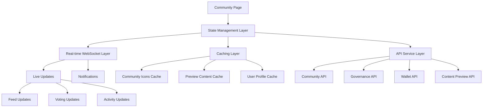

# Design Document

## Overview

The Community Page Enhancements design builds upon the existing Reddit-style community layout and social dashboard architecture to deliver sophisticated improvements across the left sidebar, central feed, right sidebar, and overall user experience. The design emphasizes visual hierarchy, micro-interactions, real-time updates, and Web3-native features while maintaining performance and accessibility standards.

The architecture leverages React components with TypeScript, integrates with existing Web3 services, and implements modern UI patterns including glassmorphism effects, skeleton loading, and smooth animations. The design ensures seamless integration with current systems while providing extensible patterns for future enhancements.

## Architecture

### Component Hierarchy

```
CommunityPageEnhanced/
├── EnhancedLeftSidebar/
│   ├── CommunityIconList/
│   ├── MultiSelectFilters/
│   ├── QuickNavigationPanel/
│   └── CommunitySearchBar/
├── EnhancedCentralFeed/
│   ├── StickyFilterBar/
│   ├── PostTypeIndicators/
│   ├── InlinePreviewSystem/
│   ├── MicroInteractionLayer/
│   └── InfiniteScrollContainer/
├── EnhancedRightSidebar/
│   ├── ExpandedGovernanceWidget/
│   ├── WalletActivityFeed/
│   ├── SuggestedCommunitiesWidget/
│   └── RealTimeNotificationPanel/
└── SharedComponents/
    ├── MiniProfileCard/
    ├── LoadingSkeletons/
    ├── AnimationProvider/
    └── PreviewModal/
```

### Data Flow Architecture



### Integration Points

- **Existing Community Service**: Extends current community data fetching
- **Wallet Integration**: Leverages existing wallet connection and transaction services
- **Governance System**: Integrates with current DAO voting mechanisms
- **Notification System**: Extends existing notification infrastructure
- **Theme System**: Works with current light/dark theme implementation

## Components and Interfaces

### Enhanced Left Sidebar Components

#### CommunityIconList Component
```typescript
interface CommunityIconListProps {
  communities: EnhancedCommunity[];
  selectedCommunity?: string;
  onCommunitySelect: (communityId: string) => void;
  showBadges?: boolean;
}

interface EnhancedCommunity {
  id: string;
  name: string;
  icon: string;
  memberCount: number;
  userReputation?: number;
  tokenBalance?: number;
  isJoined: boolean;
  activityLevel: 'high' | 'medium' | 'low';
}
```

#### MultiSelectFilters Component
```typescript
interface MultiSelectFiltersProps {
  availableFilters: FilterOption[];
  selectedFilters: string[];
  onFiltersChange: (filters: string[]) => void;
  allowCombinations?: boolean;
}

interface FilterOption {
  id: string;
  label: string;
  icon?: string;
  color?: string;
  combinableWith?: string[];
}
```

### Enhanced Central Feed Components

#### PostTypeIndicators Component
```typescript
interface PostTypeIndicatorProps {
  postType: PostType;
  priority?: 'high' | 'medium' | 'low';
  animated?: boolean;
}

type PostType = 'proposal' | 'analysis' | 'showcase' | 'discussion' | 'announcement';
```

#### InlinePreviewSystem Component
```typescript
interface InlinePreviewProps {
  content: PreviewableContent;
  previewType: PreviewType;
  onPreviewClick?: () => void;
  loadingState?: boolean;
}

interface PreviewableContent {
  nft?: NFTPreview;
  proposal?: ProposalPreview;
  defi?: DeFiPreview;
  link?: LinkPreview;
}

interface NFTPreview {
  tokenId: string;
  collection: string;
  image: string;
  floorPrice?: number;
  rarity?: string;
}

interface ProposalPreview {
  id: string;
  title: string;
  votingProgress: number;
  timeRemaining: number;
  currentStatus: 'active' | 'passed' | 'failed' | 'pending';
}
```

#### MicroInteractionLayer Component
```typescript
interface MicroInteractionProps {
  children: React.ReactNode;
  interactionType: 'hover' | 'click' | 'vote' | 'tip';
  animationConfig?: AnimationConfig;
  hapticFeedback?: boolean;
}

interface AnimationConfig {
  duration: number;
  easing: string;
  scale?: number;
  color?: string;
}
```

### Enhanced Right Sidebar Components

#### ExpandedGovernanceWidget Component
```typescript
interface GovernanceWidgetProps {
  activeProposals: GovernanceProposal[];
  userVotingPower: number;
  onVoteClick: (proposalId: string) => void;
  showProgressBars?: boolean;
}

interface GovernanceProposal {
  id: string;
  title: string;
  description: string;
  votingProgress: VotingProgress;
  deadline: Date;
  userHasVoted: boolean;
  priority: 'urgent' | 'normal' | 'low';
}

interface VotingProgress {
  totalVotes: number;
  yesVotes: number;
  noVotes: number;
  abstainVotes: number;
  participationRate: number;
}
```

#### WalletActivityFeed Component
```typescript
interface WalletActivityFeedProps {
  activities: WalletActivity[];
  maxItems?: number;
  showRealTimeUpdates?: boolean;
  onActivityClick?: (activity: WalletActivity) => void;
}

interface WalletActivity {
  id: string;
  type: 'tip_received' | 'transaction' | 'badge_earned' | 'reward_claimed';
  amount?: number;
  token?: string;
  timestamp: Date;
  description: string;
  relatedUser?: string;
  celebratory?: boolean;
}
```

### Shared Components

#### MiniProfileCard Component
```typescript
interface MiniProfileCardProps {
  userId: string;
  trigger: React.ReactNode;
  position?: 'top' | 'bottom' | 'left' | 'right';
  showWalletInfo?: boolean;
  showMutualConnections?: boolean;
}

interface UserProfile {
  id: string;
  username: string;
  ensName?: string;
  avatar: string;
  reputation: number;
  badges: Badge[];
  walletAddress: string;
  mutualConnections: number;
  isFollowing: boolean;
}
```

## Data Models

### Enhanced Community Model
```typescript
interface EnhancedCommunityData {
  // Base community data
  id: string;
  name: string;
  description: string;
  memberCount: number;
  
  // Visual enhancements
  icon: string;
  bannerImage?: string;
  brandColors: {
    primary: string;
    secondary: string;
    accent: string;
  };
  
  // User-specific data
  userMembership: {
    isJoined: boolean;
    joinDate: Date;
    reputation: number;
    tokenBalance: number;
    role?: 'member' | 'moderator' | 'admin';
  };
  
  // Activity metrics
  activityMetrics: {
    postsToday: number;
    activeMembers: number;
    trendingScore: number;
    engagementRate: number;
  };
  
  // Governance data
  governance: {
    activeProposals: number;
    userVotingPower: number;
    participationRate: number;
    nextDeadline?: Date;
  };
}
```

### Enhanced Post Model
```typescript
interface EnhancedPost {
  // Base post data
  id: string;
  title: string;
  content: string;
  author: UserProfile;
  timestamp: Date;
  
  // Type and categorization
  postType: PostType;
  flair?: PostFlair;
  priority: 'pinned' | 'featured' | 'normal';
  
  // Engagement data
  engagement: {
    upvotes: number;
    downvotes: number;
    comments: number;
    tips: TipData[];
    reactions: ReactionData[];
  };
  
  // Preview content
  previews: {
    nft?: NFTPreview;
    proposal?: ProposalPreview;
    defi?: DeFiPreview;
    link?: LinkPreview;
    media?: MediaPreview;
  };
  
  // Real-time data
  realTimeData: {
    isLive: boolean;
    liveViewers?: number;
    recentActivity: ActivityEvent[];
  };
}
```

### Filter and Sorting Models
```typescript
interface FilterConfiguration {
  id: string;
  name: string;
  filters: AppliedFilter[];
  sortOrder: SortOption;
  isDefault: boolean;
  isCustom: boolean;
}

interface AppliedFilter {
  type: 'postType' | 'flair' | 'author' | 'timeRange' | 'engagement';
  value: string | string[];
  operator: 'equals' | 'contains' | 'greaterThan' | 'lessThan';
}

type SortOption = 'hot' | 'new' | 'top' | 'rising' | 'mostTipped' | 'controversial' | 'trending';
```

## Error Handling

### Graceful Degradation Strategy

1. **Icon Loading Failures**
   - Fallback to default community avatars
   - Show loading skeletons during fetch
   - Retry mechanism with exponential backoff

2. **Preview Generation Failures**
   - Display fallback content cards
   - Show appropriate error messages
   - Provide manual refresh options

3. **Real-time Connection Issues**
   - Fall back to polling for updates
   - Show connection status indicators
   - Queue actions for retry when connection restored

4. **Performance Degradation**
   - Disable non-essential animations
   - Reduce preview complexity
   - Implement virtual scrolling for large lists

### Error Boundaries and Recovery

```typescript
interface ErrorBoundaryState {
  hasError: boolean;
  errorType: 'network' | 'rendering' | 'data' | 'unknown';
  retryCount: number;
  fallbackComponent?: React.ComponentType;
}

class CommunityEnhancementErrorBoundary extends React.Component<Props, ErrorBoundaryState> {
  // Handles errors in community enhancement components
  // Provides appropriate fallbacks and retry mechanisms
  // Logs errors for monitoring and debugging
}
```

## Testing Strategy

### Unit Testing Approach

1. **Component Testing**
   - Test all interactive elements and state changes
   - Mock external dependencies (APIs, WebSocket connections)
   - Test accessibility features and keyboard navigation
   - Verify animation performance and cleanup

2. **Hook Testing**
   - Test custom hooks for data fetching and state management
   - Test real-time update handling
   - Test filter and sorting logic
   - Test caching and performance optimizations

3. **Service Testing**
   - Test API integration layers
   - Test WebSocket connection handling
   - Test caching strategies
   - Test error handling and retry logic

### Integration Testing

1. **Cross-Component Integration**
   - Test data flow between sidebar, feed, and preview components
   - Test real-time updates across multiple components
   - Test theme switching and responsive behavior

2. **External Service Integration**
   - Test wallet connection and transaction handling
   - Test governance API integration
   - Test notification system integration
   - Test performance monitoring integration

### Performance Testing

1. **Load Testing**
   - Test with large numbers of communities and posts
   - Test real-time update performance under load
   - Test memory usage with long browsing sessions

2. **Animation Performance**
   - Test 60fps maintenance during interactions
   - Test battery impact on mobile devices
   - Test performance on lower-end devices

### Accessibility Testing

1. **Screen Reader Compatibility**
   - Test all enhanced features with screen readers
   - Verify proper ARIA labels and descriptions
   - Test keyboard navigation paths

2. **Visual Accessibility**
   - Test color contrast ratios
   - Test with various zoom levels
   - Test with reduced motion preferences

## Implementation Phases

### Phase 1: Foundation (Week 1-2)
- Implement enhanced data models and TypeScript interfaces
- Create base component structure and styling system
- Set up caching layer and performance monitoring
- Implement error boundaries and fallback systems

### Phase 2: Left Sidebar Enhancements (Week 3)
- Implement community icon system with caching
- Create multi-select filter components
- Add reputation and token balance badges
- Implement search and quick navigation

### Phase 3: Central Feed Enhancements (Week 4-5)
- Implement post type indicators and color coding
- Create inline preview system for NFTs, proposals, and DeFi
- Add micro-interaction layer with animations
- Implement sticky filter bar and infinite scroll

### Phase 4: Right Sidebar Enhancements (Week 6)
- Create expanded governance widget with progress bars
- Implement wallet activity feed with real-time updates
- Add enhanced suggested communities with mutual connections
- Integrate notification panel

### Phase 5: Polish and Integration (Week 7-8)
- Implement mini-profile cards and ENS/SNS clickability
- Add comprehensive loading states and skeletons
- Optimize performance and implement virtual scrolling
- Complete accessibility testing and improvements

### Phase 6: Testing and Deployment (Week 9-10)
- Comprehensive testing across all components
- Performance optimization and monitoring setup
- User acceptance testing and feedback integration
- Production deployment and monitoring