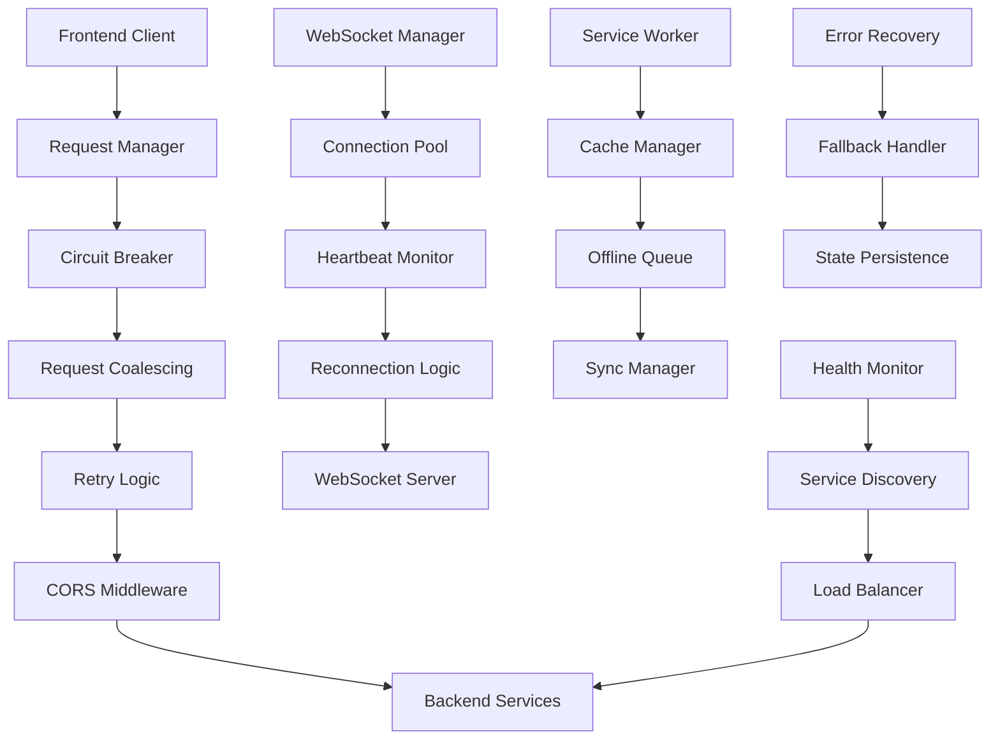
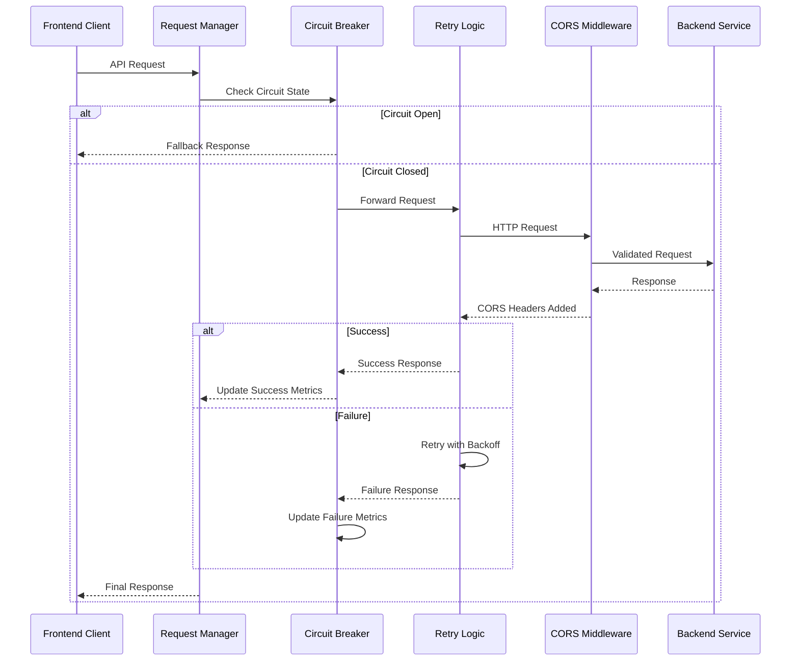

# Design Document

## Overview

This design addresses critical connectivity issues preventing users from creating posts, communities, and product listings in the LinkDAO application. The current problems include 503 Service Unavailable errors due to Render free tier resource constraints, excessive duplicate requests causing rate limiting, lack of graceful degradation when services fail, and poor error handling that crashes UI components. The solution implements a multi-layered approach including intelligent request management, circuit breaker patterns, graceful degradation with cached data, backend resource optimization, and comprehensive error handling. The design focuses on creating a resilient communication layer that maintains core functionality even during service outages while optimizing resource usage for deployment constraints.

## Architecture

### System Communication Architecture



### Request Flow Architecture



## Components and Interfaces

### 1. Enhanced CORS Configuration System

**Implementation:**
```typescript
// middleware/enhancedCorsMiddleware.ts
import cors from 'cors';
import { Request, Response, NextFunction } from 'express';
import { logger } from '../utils/logger';

interface CorsConfig {
  allowedOrigins: string[];
  allowedMethods: string[];
  allowedHeaders: string[];
  exposedHeaders: string[];
  credentials: boolean;
  maxAge: number;
  dynamicOrigins: boolean;
}

export class EnhancedCorsManager {
  private config: CorsConfig;
  private originCache = new Map<string, boolean>();
  private cacheExpiry = new Map<string, number>();

  constructor() {
    this.config = this.loadConfiguration();
  }

  private loadConfiguration(): CorsConfig {
    const env = process.env.NODE_ENV || 'development';
    
    const baseConfig = {
      allowedMethods: ['GET', 'POST', 'PUT', 'DELETE', 'PATCH', 'OPTIONS', 'HEAD'],
      allowedHeaders: [
        'Origin', 'X-Requested-With', 'Content-Type', 'Accept', 'Authorization',
        'X-Request-ID', 'X-Correlation-ID', 'X-Session-ID', 'X-Wallet-Address',
        'X-Chain-ID', 'X-CSRF-Token', 'x-csrf-token', 'Cache-Control',
        'X-Client-Version', 'X-Device-ID', 'X-Session-Token', 'X-Refresh-Token'
      ],
      exposedHeaders: [
        'X-Request-ID', 'X-RateLimit-Limit', 'X-RateLimit-Remaining',
        'X-RateLimit-Reset', 'RateLimit-Policy', 'X-Total-Count', 'X-Response-Time'
      ],
      credentials: true,
      maxAge: 86400,
      dynamicOrigins: true
    };

    const environmentOrigins = {
      development: [
        'http://localhost:3000', 'http://localhost:3001', 'http://localhost:8080',
        'http://127.0.0.1:3000', 'http://127.0.0.1:3001', 'http://127.0.0.1:8080',
        'https://localhost:3000', 'https://localhost:3001', 'https://localhost:8080'
      ],
      production: [
        'https://www.linkdao.io', 'https://linkdao.io', 'https://app.linkdao.io',
        'https://marketplace.linkdao.io', 'https://linkdao.vercel.app',
        /^https:\/\/linkdao-.*\.vercel\.app$/, /^https:\/\/.*\.vercel\.app$/,
        'https://api.linkdao.io', 'https://linkdao-backend.onrender.com'
      ],
      staging: [
        'https://staging.linkdao.io', 'https://staging-app.linkdao.io',
        'https://staging-marketplace.linkdao.io'
      ]
    };

    return {
      ...baseConfig,
      allowedOrigins: environmentOrigins[env as keyof typeof environmentOrigins] || environmentOrigins.development
    };
  }

  public createCorsMiddleware() {
    return cors({
      origin: (origin, callback) => {
        // Allow requests with no origin (mobile apps, Postman, etc.)
        if (!origin) {
          return callback(null, true);
        }

        // Check cache first
        if (this.isOriginCached(origin)) {
          return callback(null, this.originCache.get(origin));
        }

        // Validate origin
        const isAllowed = this.validateOrigin(origin);
        
        // Cache result
        this.cacheOriginResult(origin, isAllowed);

        if (isAllowed) {
          logger.debug('CORS origin allowed', { origin });
          return callback(null, true);
        }

        logger.warn('CORS origin blocked', { 
          origin, 
          allowedOrigins: this.config.allowedOrigins,
          timestamp: new Date().toISOString()
        });

        const error = new Error(`Origin ${origin} not allowed by CORS policy`);
        (error as any).status = 403;
        callback(error, false);
      },
      
      methods: this.config.allowedMethods,
      allowedHeaders: this.config.allowedHeaders,
      exposedHeaders: this.config.exposedHeaders,
      credentials: this.config.credentials,
      maxAge: this.config.maxAge,
      preflightContinue: false,
      optionsSuccessStatus: 200
    });
  }

  private validateOrigin(origin: string): boolean {
    return this.config.allowedOrigins.some(allowed => {
      if (typeof allowed === 'string') {
        // Exact match
        if (allowed === origin) return true;
        
        // Wildcard pattern matching
        if (allowed.includes('*')) {
          const pattern = allowed.replace(/\./g, '\\.').replace(/\*/g, '.*');
          const regex = new RegExp(`^${pattern}$`);
          return regex.test(origin);
        }
        
        return false;
      } else if (allowed instanceof RegExp) {
        return allowed.test(origin);
      }
      
      return false;
    });
  }

  private isOriginCached(origin: string): boolean {
    const expiry = this.cacheExpiry.get(origin);
    if (!expiry || Date.now() > expiry) {
      this.originCache.delete(origin);
      this.cacheExpiry.delete(origin);
      return false;
    }
    return this.originCache.has(origin);
  }

  private cacheOriginResult(origin: string, isAllowed: boolean): void {
    this.originCache.set(origin, isAllowed);
    this.cacheExpiry.set(origin, Date.now() + 300000); // 5 minutes
  }
}

// Enhanced CORS middleware with additional security
export const enhancedCorsMiddleware = (req: Request, res: Response, next: NextFunction): void => {
  const origin = req.get('Origin');
  const referer = req.get('Referer');
  const userAgent = req.get('User-Agent') || '';

  // Add security headers
  res.set({
    'X-Content-Type-Options': 'nosniff',
    'X-Frame-Options': 'SAMEORIGIN',
    'X-XSS-Protection': '1; mode=block',
    'Referrer-Policy': 'strict-origin-when-cross-origin',
    'Cross-Origin-Resource-Policy': 'cross-origin'
  });

  // Log suspicious requests
  const suspiciousPatterns = [
    /bot|crawler|spider/i,
    /scanner|exploit|hack/i
  ];

  if (suspiciousPatterns.some(pattern => pattern.test(userAgent))) {
    logger.warn('Suspicious CORS request', {
      origin, referer, userAgent, ip: req.ip, path: req.path
    });
  }

  // Apply CORS middleware
  const corsManager = new EnhancedCorsManager();
  corsManager.createCorsMiddleware()(req, res, next);
};
```

### 2. Resilient Request Manager

**Implementation:**
```typescript
// services/resilientRequestManager.ts
import axios, { AxiosInstance, AxiosRequestConfig, AxiosResponse } from 'axios';
import { CircuitBreaker } from './circuitBreaker';
import { RequestCoalescer } from './requestCoalescer';

interface RequestConfig extends AxiosRequestConfig {
  retries?: number;
  retryDelay?: number;
  timeout?: number;
  circuitBreaker?: boolean;
  coalesce?: boolean;
}

interface RetryConfig {
  maxRetries: number;
  baseDelay: number;
  maxDelay: number;
  backoffFactor: number;
}

export class ResilientRequestManager {
  private axiosInstance: AxiosInstance;
  private circuitBreaker: CircuitBreaker;
  private requestCoalescer: RequestCoalescer;
  private retryConfig: RetryConfig;

  constructor() {
    this.retryConfig = {
      maxRetries: 3,
      baseDelay: 1000,
      maxDelay: 10000,
      backoffFactor: 2
    };

    this.axiosInstance = axios.create({
      timeout: 30000,
      headers: {
        'Content-Type': 'application/json',
        'X-Client-Version': process.env.NEXT_PUBLIC_APP_VERSION || '1.0.0'
      }
    });

    this.circuitBreaker = new CircuitBreaker({
      failureThreshold: 5,
      recoveryTimeout: 30000,
      monitoringPeriod: 60000
    });

    this.requestCoalescer = new RequestCoalescer();

    this.setupInterceptors();
  }

  private setupInterceptors(): void {
    // Request interceptor
    this.axiosInstance.interceptors.request.use(
      (config) => {
        config.headers['X-Request-ID'] = this.generateRequestId();
        config.headers['X-Timestamp'] = Date.now().toString();
        
        console.debug('Making request:', {
          method: config.method,
          url: config.url,
          headers: config.headers
        });

        return config;
      },
      (error) => {
        console.error('Request interceptor error:', error);
        return Promise.reject(error);
      }
    );

    // Response interceptor
    this.axiosInstance.interceptors.response.use(
      (response) => {
        console.debug('Request successful:', {
          status: response.status,
          url: response.config.url,
          responseTime: this.calculateResponseTime(response.config.headers['X-Timestamp'])
        });

        return response;
      },
      (error) => {
        console.error('Request failed:', {
          status: error.response?.status,
          url: error.config?.url,
          message: error.message
        });

        return Promise.reject(error);
      }
    );
  }

  public async request<T = any>(config: RequestConfig): Promise<AxiosResponse<T>> {
    const requestKey = this.generateRequestKey(config);

    // Check if request should be coalesced
    if (config.coalesce !== false && config.method?.toLowerCase() === 'get') {
      const coalescedRequest = this.requestCoalescer.coalesce(requestKey, () => 
        this.executeRequest(config)
      );
      return coalescedRequest;
    }

    return this.executeRequest(config);
  }

  private async executeRequest<T = any>(config: RequestConfig): Promise<AxiosResponse<T>> {
    // Check circuit breaker
    if (config.circuitBreaker !== false && this.circuitBreaker.isOpen()) {
      throw new Error('Circuit breaker is open - service unavailable');
    }

    let lastError: any;
    const maxRetries = config.retries ?? this.retryConfig.maxRetries;

    for (let attempt = 0; attempt <= maxRetries; attempt++) {
      try {
        const response = await this.axiosInstance.request<T>(config);
        
        // Record success for circuit breaker
        if (config.circuitBreaker !== false) {
          this.circuitBreaker.recordSuccess();
        }

        return response;
      } catch (error: any) {
        lastError = error;

        // Record failure for circuit breaker
        if (config.circuitBreaker !== false) {
          this.circuitBreaker.recordFailure();
        }

        // Don't retry on certain errors
        if (this.shouldNotRetry(error) || attempt === maxRetries) {
          break;
        }

        // Calculate delay for next attempt
        const delay = this.calculateRetryDelay(attempt);
        console.warn(`Request failed, retrying in ${delay}ms (attempt ${attempt + 1}/${maxRetries})`, {
          error: error.message,
          url: config.url
        });

        await this.sleep(delay);
      }
    }

    throw lastError;
  }

  private shouldNotRetry(error: any): boolean {
    // Don't retry on client errors (4xx) except for specific cases
    const status = error.response?.status;
    if (status >= 400 && status < 500) {
      // Retry on rate limiting and authentication errors
      return ![401, 408, 429].includes(status);
    }

    // Don't retry on network errors that indicate permanent issues
    if (error.code === 'ENOTFOUND' || error.code === 'ECONNREFUSED') {
      return true;
    }

    return false;
  }

  private calculateRetryDelay(attempt: number): number {
    const delay = this.retryConfig.baseDelay * Math.pow(this.retryConfig.backoffFactor, attempt);
    const jitter = Math.random() * 0.1 * delay; // Add 10% jitter
    return Math.min(delay + jitter, this.retryConfig.maxDelay);
  }

  private generateRequestKey(config: RequestConfig): string {
    return `${config.method?.toUpperCase()}_${config.url}_${JSON.stringify(config.params || {})}`;
  }

  private generateRequestId(): string {
    return `req_${Date.now()}_${Math.random().toString(36).substr(2, 9)}`;
  }

  private calculateResponseTime(startTime: string): number {
    return Date.now() - parseInt(startTime);
  }

  private sleep(ms: number): Promise<void> {
    return new Promise(resolve => setTimeout(resolve, ms));
  }
}
```

### 3. WebSocket Connection Manager

**Implementation:**
```typescript
// services/webSocketManager.ts
import { io, Socket } from 'socket.io-client';

interface WebSocketConfig {
  url: string;
  reconnectionAttempts: number;
  reconnectionDelay: number;
  maxReconnectionDelay: number;
  heartbeatInterval: number;
  timeout: number;
}

interface ConnectionState {
  isConnected: boolean;
  isReconnecting: boolean;
  reconnectAttempts: number;
  lastConnected: Date | null;
  lastError: Error | null;
}

export class WebSocketManager {
  private socket: Socket | null = null;
  private config: WebSocketConfig;
  private state: ConnectionState;
  private heartbeatInterval: NodeJS.Timeout | null = null;
  private reconnectTimeout: NodeJS.Timeout | null = null;
  private eventListeners = new Map<string, Function[]>();

  constructor(config: Partial<WebSocketConfig> = {}) {
    this.config = {
      url: process.env.NEXT_PUBLIC_WS_URL || 'wss://api.linkdao.io',
      reconnectionAttempts: 10,
      reconnectionDelay: 1000,
      maxReconnectionDelay: 30000,
      heartbeatInterval: 30000,
      timeout: 20000,
      ...config
    };

    this.state = {
      isConnected: false,
      isReconnecting: false,
      reconnectAttempts: 0,
      lastConnected: null,
      lastError: null
    };
  }

  public connect(): Promise<void> {
    return new Promise((resolve, reject) => {
      if (this.socket?.connected) {
        resolve();
        return;
      }

      console.log('Connecting to WebSocket:', this.config.url);

      this.socket = io(this.config.url, {
        transports: ['websocket', 'polling'],
        timeout: this.config.timeout,
        forceNew: true,
        reconnection: false, // We handle reconnection manually
        withCredentials: true,
        extraHeaders: {
          'Origin': window.location.origin
        }
      });

      this.setupEventHandlers();

      const connectTimeout = setTimeout(() => {
        reject(new Error('WebSocket connection timeout'));
      }, this.config.timeout);

      this.socket.on('connect', () => {
        clearTimeout(connectTimeout);
        this.handleConnection();
        resolve();
      });

      this.socket.on('connect_error', (error) => {
        clearTimeout(connectTimeout);
        this.handleConnectionError(error);
        reject(error);
      });
    });
  }

  private setupEventHandlers(): void {
    if (!this.socket) return;

    this.socket.on('connect', () => {
      this.handleConnection();
    });

    this.socket.on('disconnect', (reason) => {
      this.handleDisconnection(reason);
    });

    this.socket.on('connect_error', (error) => {
      this.handleConnectionError(error);
    });

    this.socket.on('pong', () => {
      console.debug('WebSocket pong received');
    });

    // Handle authentication
    this.socket.on('authenticated', (data) => {
      console.log('WebSocket authenticated:', data);
      this.emit('authenticated', data);
    });

    this.socket.on('auth_error', (error) => {
      console.error('WebSocket authentication error:', error);
      this.emit('auth_error', error);
    });
  }

  private handleConnection(): void {
    console.log('WebSocket connected successfully');
    
    this.state.isConnected = true;
    this.state.isReconnecting = false;
    this.state.reconnectAttempts = 0;
    this.state.lastConnected = new Date();
    this.state.lastError = null;

    this.startHeartbeat();
    this.emit('connected');
  }

  private handleDisconnection(reason: string): void {
    console.log('WebSocket disconnected:', reason);
    
    this.state.isConnected = false;
    this.stopHeartbeat();
    
    this.emit('disconnected', reason);

    // Attempt reconnection for certain disconnect reasons
    if (this.shouldReconnect(reason)) {
      this.scheduleReconnection();
    }
  }

  private handleConnectionError(error: Error): void {
    console.error('WebSocket connection error:', error);
    
    this.state.lastError = error;
    this.emit('error', error);

    if (this.state.reconnectAttempts < this.config.reconnectionAttempts) {
      this.scheduleReconnection();
    } else {
      console.error('Max reconnection attempts reached');
      this.emit('max_reconnect_attempts');
    }
  }

  private shouldReconnect(reason: string): boolean {
    // Don't reconnect for certain reasons
    const noReconnectReasons = ['io server disconnect', 'io client disconnect'];
    return !noReconnectReasons.includes(reason);
  }

  private scheduleReconnection(): void {
    if (this.state.isReconnecting || this.reconnectTimeout) {
      return;
    }

    this.state.isReconnecting = true;
    this.state.reconnectAttempts++;

    const delay = Math.min(
      this.config.reconnectionDelay * Math.pow(2, this.state.reconnectAttempts - 1),
      this.config.maxReconnectionDelay
    );

    console.log(`Scheduling WebSocket reconnection in ${delay}ms (attempt ${this.state.reconnectAttempts})`);

    this.reconnectTimeout = setTimeout(() => {
      this.reconnectTimeout = null;
      this.connect().catch((error) => {
        console.error('Reconnection failed:', error);
      });
    }, delay);
  }

  private startHeartbeat(): void {
    this.stopHeartbeat();
    
    this.heartbeatInterval = setInterval(() => {
      if (this.socket?.connected) {
        this.socket.emit('ping');
      }
    }, this.config.heartbeatInterval);
  }

  private stopHeartbeat(): void {
    if (this.heartbeatInterval) {
      clearInterval(this.heartbeatInterval);
      this.heartbeatInterval = null;
    }
  }

  public authenticate(token: string): void {
    if (this.socket?.connected) {
      this.socket.emit('authenticate', { token });
    }
  }

  public emit(event: string, data?: any): void {
    if (this.socket?.connected) {
      this.socket.emit(event, data);
    }

    // Also emit to local listeners
    const listeners = this.eventListeners.get(event) || [];
    listeners.forEach(listener => listener(data));
  }

  public on(event: string, callback: Function): void {
    if (!this.eventListeners.has(event)) {
      this.eventListeners.set(event, []);
    }
    this.eventListeners.get(event)!.push(callback);

    // Also listen on socket if connected
    if (this.socket) {
      this.socket.on(event, callback as any);
    }
  }

  public off(event: string, callback?: Function): void {
    if (callback) {
      const listeners = this.eventListeners.get(event) || [];
      const index = listeners.indexOf(callback);
      if (index > -1) {
        listeners.splice(index, 1);
      }
    } else {
      this.eventListeners.delete(event);
    }

    if (this.socket) {
      this.socket.off(event, callback as any);
    }
  }

  public disconnect(): void {
    if (this.reconnectTimeout) {
      clearTimeout(this.reconnectTimeout);
      this.reconnectTimeout = null;
    }

    this.stopHeartbeat();

    if (this.socket) {
      this.socket.disconnect();
      this.socket = null;
    }

    this.state.isConnected = false;
    this.state.isReconnecting = false;
  }

  public getState(): ConnectionState {
    return { ...this.state };
  }
}
```

### 4. Circuit Breaker Implementation

**Implementation:**
```typescript
// services/circuitBreaker.ts
interface CircuitBreakerConfig {
  failureThreshold: number;
  recoveryTimeout: number;
  monitoringPeriod: number;
}

enum CircuitState {
  CLOSED = 'CLOSED',
  OPEN = 'OPEN',
  HALF_OPEN = 'HALF_OPEN'
}

interface CircuitMetrics {
  failures: number;
  successes: number;
  requests: number;
  lastFailureTime: number;
  lastSuccessTime: number;
}

export class CircuitBreaker {
  private state: CircuitState = CircuitState.CLOSED;
  private metrics: CircuitMetrics;
  private config: CircuitBreakerConfig;
  private nextAttempt: number = 0;

  constructor(config: CircuitBreakerConfig) {
    this.config = config;
    this.metrics = {
      failures: 0,
      successes: 0,
      requests: 0,
      lastFailureTime: 0,
      lastSuccessTime: 0
    };
  }

  public isOpen(): boolean {
    return this.state === CircuitState.OPEN;
  }

  public isClosed(): boolean {
    return this.state === CircuitState.CLOSED;
  }

  public isHalfOpen(): boolean {
    return this.state === CircuitState.HALF_OPEN;
  }

  public recordSuccess(): void {
    this.metrics.successes++;
    this.metrics.requests++;
    this.metrics.lastSuccessTime = Date.now();

    if (this.state === CircuitState.HALF_OPEN) {
      this.state = CircuitState.CLOSED;
      this.resetMetrics();
      console.log('Circuit breaker closed - service recovered');
    }
  }

  public recordFailure(): void {
    this.metrics.failures++;
    this.metrics.requests++;
    this.metrics.lastFailureTime = Date.now();

    if (this.shouldOpenCircuit()) {
      this.openCircuit();
    }
  }

  private shouldOpenCircuit(): boolean {
    if (this.state === CircuitState.OPEN) {
      return false;
    }

    const failureRate = this.metrics.failures / this.metrics.requests;
    return this.metrics.failures >= this.config.failureThreshold || failureRate > 0.5;
  }

  private openCircuit(): void {
    this.state = CircuitState.OPEN;
    this.nextAttempt = Date.now() + this.config.recoveryTimeout;
    
    console.warn('Circuit breaker opened - service marked as unavailable', {
      failures: this.metrics.failures,
      requests: this.metrics.requests,
      recoveryTime: new Date(this.nextAttempt).toISOString()
    });

    // Schedule automatic transition to half-open
    setTimeout(() => {
      if (this.state === CircuitState.OPEN) {
        this.state = CircuitState.HALF_OPEN;
        console.log('Circuit breaker half-open - allowing test requests');
      }
    }, this.config.recoveryTimeout);
  }

  private resetMetrics(): void {
    this.metrics = {
      failures: 0,
      successes: 0,
      requests: 0,
      lastFailureTime: 0,
      lastSuccessTime: 0
    };
  }

  public getMetrics(): CircuitMetrics & { state: CircuitState } {
    return {
      ...this.metrics,
      state: this.state
    };
  }
}
```

## Data Models

### Request/Response Models
```typescript
// types/connectivity.ts
export interface ApiResponse<T = any> {
  success: boolean;
  data?: T;
  error?: {
    message: string;
    code: string;
    details?: any;
    retryable?: boolean;
  };
  metadata?: {
    requestId: string;
    timestamp: number;
    responseTime: number;
    cached?: boolean;
  };
}

export interface ConnectionHealth {
  status: 'healthy' | 'degraded' | 'unhealthy';
  services: {
    api: ServiceHealth;
    websocket: ServiceHealth;
    database: ServiceHealth;
  };
  metrics: {
    responseTime: number;
    errorRate: number;
    uptime: number;
  };
}

export interface ServiceHealth {
  status: 'up' | 'down' | 'degraded';
  lastCheck: Date;
  responseTime: number;
  errorCount: number;
  message?: string;
}

export interface NetworkStatus {
  online: boolean;
  effectiveType: string;
  downlink: number;
  rtt: number;
}
```

## Error Handling

### Comprehensive Error Recovery System
```typescript
// services/errorRecoveryService.ts
export class ErrorRecoveryService {
  private fallbackData = new Map<string, any>();
  private retryQueues = new Map<string, Array<() => Promise<any>>>();

  public async handleApiError(error: any, context: {
    url: string;
    method: string;
    data?: any;
  }): Promise<any> {
    console.error('API Error:', error, context);

    // Check if we have fallback data
    const fallbackKey = `${context.method}_${context.url}`;
    if (this.fallbackData.has(fallbackKey)) {
      console.log('Using fallback data for:', fallbackKey);
      return this.fallbackData.get(fallbackKey);
    }

    // Queue for retry if appropriate
    if (this.isRetryableError(error)) {
      this.queueForRetry(context);
    }

    // Return user-friendly error
    throw new Error(this.getUserFriendlyMessage(error));
  }

  private isRetryableError(error: any): boolean {
    const retryableStatuses = [408, 429, 500, 502, 503, 504];
    const retryableCodes = ['ECONNRESET', 'ETIMEDOUT', 'ENOTFOUND'];
    
    return retryableStatuses.includes(error.response?.status) ||
           retryableCodes.includes(error.code);
  }

  private getUserFriendlyMessage(error: any): string {
    const status = error.response?.status;
    
    switch (status) {
      case 404:
        return 'The requested resource was not found';
      case 429:
        return 'Too many requests. Please try again later';
      case 500:
        return 'Server error. Please try again';
      case 503:
        return 'Service temporarily unavailable';
      default:
        return 'Network error. Please check your connection';
    }
  }

  public cacheFallbackData(key: string, data: any): void {
    this.fallbackData.set(key, data);
  }

  private queueForRetry(context: any): void {
    // Implementation for retry queue
  }
}
```

## Testing Strategy

### Integration Tests for Connectivity
```typescript
// tests/connectivity.test.ts
describe('Connectivity and CORS', () => {
  describe('CORS Configuration', () => {
    it('should allow requests from legitimate origins', async () => {
      const response = await request(app)
        .options('/api/marketplace/listings')
        .set('Origin', 'https://linkdao.io')
        .expect(200);

      expect(response.headers['access-control-allow-origin']).toBe('https://linkdao.io');
    });

    it('should block requests from unauthorized origins', async () => {
      await request(app)
        .options('/api/marketplace/listings')
        .set('Origin', 'https://malicious-site.com')
        .expect(403);
    });
  });

  describe('Request Resilience', () => {
    it('should retry failed requests with exponential backoff', async () => {
      // Mock failing service
      const mockService = jest.fn()
        .mockRejectedValueOnce(new Error('Network error'))
        .mockRejectedValueOnce(new Error('Network error'))
        .mockResolvedValueOnce({ data: 'success' });

      const result = await resilientRequestManager.request({
        url: '/test',
        retries: 3
      });

      expect(mockService).toHaveBeenCalledTimes(3);
      expect(result.data).toBe('success');
    });
  });

  describe('WebSocket Reliability', () => {
    it('should reconnect automatically on connection loss', async () => {
      const wsManager = new WebSocketManager();
      await wsManager.connect();

      // Simulate connection loss
      wsManager.socket.disconnect();

      // Wait for reconnection
      await new Promise(resolve => {
        wsManager.on('connected', resolve);
      });

      expect(wsManager.getState().isConnected).toBe(true);
    });
  });
});
```

## Implementation Phases

### Phase 1: Core CORS and Request Infrastructure (Critical Priority)
1. Implement enhanced CORS middleware with dynamic origin validation
2. Create resilient request manager with retry logic and circuit breaker
3. Add comprehensive error handling and logging
4. Test basic connectivity and CORS functionality

### Phase 2: WebSocket Reliability (High Priority)
1. Implement WebSocket connection manager with auto-reconnection
2. Add heartbeat monitoring and connection health checks
3. Create WebSocket authentication and session management
4. Test real-time communication reliability

### Phase 3: Advanced Resilience Features (Medium Priority)
1. Implement request coalescing and deduplication
2. Add intelligent caching and offline support
3. Create service health monitoring and discovery
4. Implement performance optimization features

### Phase 4: Monitoring and Debugging (Low Priority)
1. Add comprehensive connectivity monitoring
2. Create debugging tools and diagnostics
3. Implement performance metrics collection
4. Add alerting and notification systems

## Security Considerations

- Implement strict CORS validation with origin caching
- Add rate limiting with intelligent thresholds
- Use secure WebSocket connections with proper authentication
- Implement request signing for critical operations
- Add comprehensive logging without exposing sensitive data
- Validate all input parameters and sanitize responses
- Implement proper session management and token refresh

## Performance Optimizations

- Cache CORS validation results to reduce processing overhead
- Implement request coalescing to prevent duplicate API calls
- Use connection pooling for HTTP and WebSocket connections
- Add intelligent retry strategies with exponential backoff
- Implement response compression and optimization
- Use service workers for offline caching and background sync
- Monitor and optimize critical path performance metrics