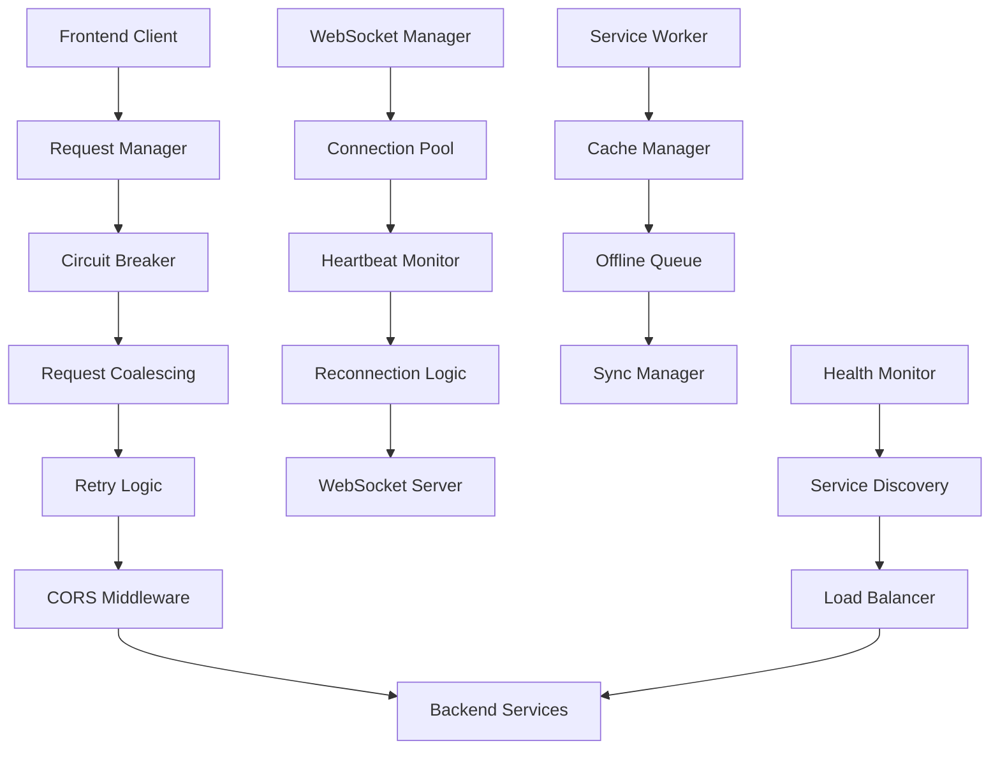

# CORS Connectivity Fixes - Documentation

## Overview

This documentation provides comprehensive guidance for implementing, deploying, and maintaining the CORS connectivity fixes for the LinkDAO application. The fixes address critical connectivity issues including CORS policy errors, rate limiting problems, WebSocket connection failures, and backend resource constraints.

## Documentation Structure

### 📋 [Troubleshooting Guide](./TROUBLESHOOTING_GUIDE.md)
**Purpose**: Solve common connectivity issues quickly  
**Audience**: Developers, DevOps, Support teams  
**Contents**:
- Common CORS policy errors and solutions
- Rate limiting issue diagnosis and fixes
- WebSocket connection troubleshooting
- Backend service unavailability (503 errors)
- Authentication and session problems
- Emergency procedures and recovery steps

### 🚀 [Render Deployment Guide](./RENDER_DEPLOYMENT_GUIDE.md)
**Purpose**: Deploy backend services optimized for Render platform  
**Audience**: DevOps engineers, Backend developers  
**Contents**:
- Pre-deployment checklist and preparation
- Render-specific configuration and optimization
- Resource constraint handling for free/starter tiers
- Environment variable setup
- Database and SSL configuration
- Performance monitoring and scaling considerations

### 🔧 [Developer Debug Guide](./DEVELOPER_DEBUG_GUIDE.md)
**Purpose**: Debug and monitor connectivity issues during development  
**Audience**: Frontend and Backend developers  
**Contents**:
- Debug environment setup
- Frontend debugging tools and techniques
- Backend monitoring and logging systems
- Performance analysis and profiling
- Automated debug scripts and CI/CD integration
- Debug data collection and analysis

### 📚 [Best Practices Guide](./BEST_PRACTICES_GUIDE.md)
**Purpose**: Maintain reliable communication under resource constraints  
**Audience**: Senior developers, Architects, Team leads  
**Contents**:
- Architecture patterns for robust communication
- Request management and optimization strategies
- Caching and performance best practices
- Error handling and graceful degradation
- Security considerations and monitoring
- Testing strategies and maintenance procedures

## Quick Start

### For Immediate Issues
1. **Service Down**: Check [Troubleshooting Guide - Backend Service Unavailability](./TROUBLESHOOTING_GUIDE.md#4-backend-service-unavailability-503-errors)
2. **CORS Errors**: See [Troubleshooting Guide - CORS Policy Errors](./TROUBLESHOOTING_GUIDE.md#1-cors-policy-errors)
3. **Rate Limiting**: Review [Troubleshooting Guide - Rate Limiting Issues](./TROUBLESHOOTING_GUIDE.md#2-rate-limiting-issues)

### For New Deployments
1. Follow [Render Deployment Guide](./RENDER_DEPLOYMENT_GUIDE.md) step by step
2. Use the [Pre-deployment Checklist](./RENDER_DEPLOYMENT_GUIDE.md#pre-deployment-checklist)
3. Verify deployment with [Deployment Verification](./RENDER_DEPLOYMENT_GUIDE.md#deployment-verification)

### For Development Setup
1. Set up [Debug Environment](./DEVELOPER_DEBUG_GUIDE.md#debug-environment-setup)
2. Install [Debug Tools](./DEVELOPER_DEBUG_GUIDE.md#debug-tools-installation)
3. Configure [Frontend Debugging](./DEVELOPER_DEBUG_GUIDE.md#frontend-debugging-tools)

## Implementation Status

### ✅ Completed Components
- Enhanced CORS middleware with dynamic origin validation
- Circuit breaker pattern implementation
- Request deduplication and coalescing
- Intelligent retry logic with exponential backoff
- WebSocket connection management with auto-reconnection
- Memory optimization for Render deployment
- Comprehensive error handling and user feedback
- Performance monitoring and metrics collection

### 🔄 Integration Points
- Request manager integration with existing services
- Circuit breaker integration with API calls
- WebSocket fallback to polling mechanisms
- Cache invalidation strategies
- Error boundary implementations

### 📊 Monitoring Coverage
- Request/response metrics
- Circuit breaker state monitoring
- Memory usage tracking
- WebSocket connection health
- Cache hit/miss rates
- Error rate analysis

## Architecture Overview



## Key Features

### 🛡️ Resilience Features
- **Circuit Breaker**: Prevents cascading failures with configurable thresholds
- **Graceful Degradation**: Falls back to cached data when services are unavailable
- **Request Coalescing**: Prevents duplicate API calls and reduces server load
- **Intelligent Retry**: Exponential backoff with jitter for failed requests

### ⚡ Performance Optimizations
- **Multi-level Caching**: Memory, localStorage, and IndexedDB caching strategies
- **Request Deduplication**: Eliminates redundant network requests
- **Resource-aware Operations**: Adapts behavior based on memory and network conditions
- **Compression**: Automatic request/response compression

### 🔒 Security Enhancements
- **Dynamic CORS Validation**: Supports wildcard patterns for deployment previews
- **Request Signing**: Cryptographic signatures for critical operations
- **Input Sanitization**: Comprehensive validation and sanitization
- **Rate Limiting**: Intelligent rate limiting with user-specific thresholds

### 📈 Monitoring & Observability
- **Real-time Metrics**: Performance, error rates, and resource usage
- **Alerting System**: Configurable alerts for critical issues
- **Debug Tools**: Comprehensive debugging utilities for development
- **Health Checks**: Multi-level health monitoring

## Configuration Examples

### Environment Variables
```bash
# CORS Configuration
CORS_ORIGINS=https://linkdao.io,https://www.linkdao.io
CORS_CREDENTIALS=true
CORS_MAX_AGE=86400

# Circuit Breaker
CIRCUIT_BREAKER_FAILURE_THRESHOLD=5
CIRCUIT_BREAKER_RECOVERY_TIMEOUT=30000

# Rate Limiting
RATE_LIMIT_REQUESTS_PER_MINUTE=10
RATE_LIMIT_BURST_LIMIT=5

# Memory Management
MAX_MEMORY_MB=512
GC_INTERVAL_MS=60000
MEMORY_THRESHOLD_MB=400
```

### Frontend Configuration
```typescript
// Request manager configuration
const requestConfig = {
  retries: 3,
  timeout: 30000,
  circuitBreaker: true,
  coalesce: true,
  cache: {
    ttl: 300,
    strategy: 'stale-while-revalidate'
  }
};

// WebSocket configuration
const wsConfig = {
  url: process.env.NEXT_PUBLIC_WS_URL,
  reconnectionAttempts: 10,
  reconnectionDelay: 1000,
  maxReconnectionDelay: 30000,
  heartbeatInterval: 30000
};
```

## Testing Strategy

### Unit Tests
- Circuit breaker functionality
- Request deduplication logic
- Cache invalidation strategies
- Error handling mechanisms

### Integration Tests
- CORS configuration validation
- WebSocket connection reliability
- End-to-end request flows
- Fallback mechanism verification

### Performance Tests
- Load testing with rate limiting
- Memory usage under stress
- Cache performance benchmarks
- WebSocket connection scaling

### E2E Tests
- User workflow completion during service outages
- Authentication persistence across network interruptions
- Real-time feature functionality
- Mobile device compatibility

## Deployment Checklist

### Pre-deployment
- [ ] Environment variables configured
- [ ] Database migrations applied
- [ ] SSL certificates verified
- [ ] CORS origins updated
- [ ] Rate limits configured

### Deployment
- [ ] Health checks passing
- [ ] Memory usage within limits
- [ ] WebSocket connections working
- [ ] Cache warming completed
- [ ] Monitoring alerts configured

### Post-deployment
- [ ] Performance metrics baseline established
- [ ] Error rates within acceptable limits
- [ ] User acceptance testing completed
- [ ] Rollback procedures tested
- [ ] Documentation updated

## Support and Maintenance

### Regular Maintenance Tasks
- **Daily**: Monitor error rates and performance metrics
- **Weekly**: Review slow queries and optimize database performance
- **Monthly**: Update dependencies and security patches
- **Quarterly**: Performance benchmarking and capacity planning

### Emergency Procedures
1. **Service Outage**: Follow [Emergency Procedures](./TROUBLESHOOTING_GUIDE.md#emergency-procedures)
2. **High Error Rates**: Use [Performance Analysis Tools](./DEVELOPER_DEBUG_GUIDE.md#performance-analysis-tools)
3. **Memory Issues**: Apply [Memory Optimization](./RENDER_DEPLOYMENT_GUIDE.md#resource-optimization-for-render)

### Contact Information
- **Development Team**: dev@linkdao.io
- **DevOps Team**: devops@linkdao.io
- **Emergency Hotline**: emergency@linkdao.io
- **Documentation Issues**: docs@linkdao.io

## Contributing

### Documentation Updates
1. Follow the existing documentation structure
2. Include code examples and practical guidance
3. Test all procedures before documenting
4. Update the main README when adding new sections

### Code Contributions
1. Ensure all changes are covered by tests
2. Update relevant documentation
3. Follow the established patterns and best practices
4. Include performance impact analysis

## Version History

### v1.0.0 - Initial Implementation
- Basic CORS middleware implementation
- Circuit breaker pattern
- Request retry logic
- WebSocket connection management

### v1.1.0 - Performance Optimizations
- Request deduplication
- Multi-level caching
- Memory optimization for Render
- Performance monitoring

### v1.2.0 - Enhanced Resilience
- Graceful degradation
- Offline support
- Action queuing
- Comprehensive error handling

### v1.3.0 - Monitoring & Debugging
- Debug tools and utilities
- Metrics collection
- Alerting system
- Performance profiling

## Related Documentation

- [LinkDAO API Documentation](../../backend-api-integration/docs/api-documentation.md)
- [Frontend Architecture Guide](../../frontend/docs/architecture.md)
- [Security Implementation Guide](../../security/docs/security-guide.md)
- [Performance Optimization Guide](../../performance/docs/optimization-guide.md)

---

**Last Updated**: November 2024  
**Version**: 1.3.0  
**Maintainers**: LinkDAO Development Team