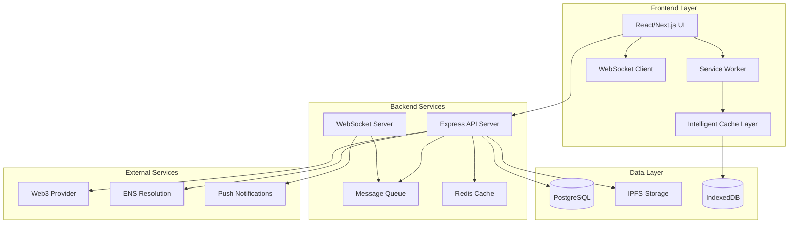

# Design Document

## Overview

This design document outlines the architecture for an interconnected social platform that seamlessly integrates Facebook-style feeds, Reddit-style communities, and wallet-to-wallet messaging. The system leverages intelligent caching, service worker optimization, and real-time updates to provide a high-performance, responsive user experience.

The platform is built on a modern web architecture with React/Next.js frontend, Node.js/Express backend, and utilizes Web3 technologies for wallet integration and decentralized features.

## Architecture

### High-Level System Architecture



### Component Architecture

The system is organized into three main feature domains with shared services:

1. **Feed System**: Aggregates and displays content from multiple sources
2. **Community System**: Manages topic-based discussion groups
3. **Messaging System**: Handles direct wallet-to-wallet communication
4. **Shared Services**: Caching, real-time updates, and cross-feature integration

## Components and Interfaces

### Frontend Components

#### Feed Components
- **FeedPage**: Main feed interface with infinite scroll and filtering
- **FeedPostList**: Virtualized list component for optimal performance
- **PostCard**: Individual post display with reactions and interactions
- **PostComposer**: Rich text editor for creating new posts
- **FeedFilters**: Sorting and filtering controls (Hot, New, Top, Communities)

#### Community Components
- **CommunityPage**: Community overview with posts and sidebar information
- **CommunityHeader**: Community branding, join/leave, and stats
- **CommunityPostList**: Community-specific post feed
- **CommunityDiscovery**: Browse and search communities
- **CommunityModeration**: Moderation tools for community managers

#### Messaging Components
- **MessagingPage**: Main messaging interface with conversation list
- **ConversationList**: List of active conversations with unread counts
- **ConversationView**: Individual conversation thread
- **MessageInput**: Compose and send messages
- **MessageBubble**: Individual message display with encryption indicators

#### Shared Components
- **NotificationSystem**: Real-time notifications across all features
- **SearchInterface**: Global search across posts, communities, and users
- **UserProfile**: User information and activity display
- **WalletConnector**: Web3 wallet integration and management

### Backend API Endpoints

#### Feed API
```typescript
// Feed endpoints
GET /api/feed/enhanced - Get personalized feed with filtering
GET /api/feed/trending - Get trending posts
POST /api/posts - Create new post
PUT /api/posts/:id - Update post
DELETE /api/posts/:id - Delete post
POST /api/posts/:id/react - Add reaction to post
POST /api/posts/:id/tip - Send tip to post author
GET /api/posts/:id/engagement - Get detailed engagement data
```

#### Community API
```typescript
// Community endpoints
GET /api/communities - List communities with filtering
GET /api/communities/:id - Get community details
POST /api/communities - Create new community
PUT /api/communities/:id - Update community
POST /api/communities/:id/join - Join community
DELETE /api/communities/:id/leave - Leave community
GET /api/communities/:id/posts - Get community posts
POST /api/communities/:id/posts - Create post in community
GET /api/communities/:id/members - Get community members
POST /api/communities/:id/moderate - Moderation actions
```

#### Messaging API
```typescript
// Messaging endpoints
GET /api/conversations - Get user's conversations
POST /api/conversations - Start new conversation
GET /api/conversations/:id/messages - Get conversation messages
POST /api/conversations/:id/messages - Send message
PUT /api/conversations/:id/read - Mark conversation as read
DELETE /api/conversations/:id - Delete conversation
POST /api/messages/:id/encrypt - Encrypt message content
POST /api/messages/:id/decrypt - Decrypt message content
```

#### Integration API
```typescript
// Cross-feature integration endpoints
POST /api/share/to-dm - Share content to direct message
GET /api/mentions/:address - Get mentions for wallet address
POST /api/notifications/subscribe - Subscribe to push notifications
GET /api/search/global - Global search across all content types
GET /api/user/:address/activity - Get user activity feed
POST /api/user/preferences - Update user preferences
```

### Service Worker Cache Strategies

#### Cache Strategy Implementation
```typescript
interface CacheStrategy {
  name: 'NetworkFirst' | 'CacheFirst' | 'StaleWhileRevalidate' | 'NetworkOnly';
  cacheName: string;
  maxAge?: number;
  maxEntries?: number;
}

const cacheStrategies: Record<string, CacheStrategy> = {
  // Feed content - fresh data preferred, fallback to cache
  feed: {
    name: 'NetworkFirst',
    cacheName: 'feed-v1',
    maxAge: 5 * 60 * 1000, // 5 minutes
    maxEntries: 100
  },
  
  // Community data - can be slightly stale
  communities: {
    name: 'StaleWhileRevalidate',
    cacheName: 'communities-v1',
    maxAge: 10 * 60 * 1000, // 10 minutes
    maxEntries: 50
  },
  
  // User profiles - cache first for performance
  profiles: {
    name: 'CacheFirst',
    cacheName: 'profiles-v1',
    maxAge: 30 * 60 * 1000, // 30 minutes
    maxEntries: 200
  },
  
  // Messages - never cache (privacy)
  messages: {
    name: 'NetworkOnly',
    cacheName: 'no-cache'
  }
};
```

#### Intelligent Cache Integration
```typescript
class IntelligentCacheManager {
  // Predictive preloading based on user behavior
  async analyzeAndPreload(userId: string, action: string, context: any): Promise<void> {
    const predictions = await this.predictNextActions(userId, action, context);
    
    for (const prediction of predictions) {
      await this.preloadContent(prediction.url, prediction.priority);
    }
  }
  
  // Cache invalidation with tags
  async invalidateByTags(tags: string[]): Promise<void> {
    for (const tag of tags) {
      await this.invalidateTaggedContent(tag);
    }
  }
  
  // Offline action queuing
  async queueOfflineAction(action: OfflineAction): Promise<void> {
    const queue = await this.getOfflineQueue();
    queue.push(action);
    await this.saveOfflineQueue(queue);
  }
}
```

## Data Models

### Core Data Models

#### Post Model
```typescript
interface Post {
  id: string;
  authorAddress: string;
  communityId?: string;
  content: string;
  mediaUrls: string[];
  tags: string[];
  createdAt: Date;
  updatedAt: Date;
  reactions: Reaction[];
  tips: Tip[];
  comments: Comment[];
  shares: number;
  views: number;
  engagementScore: number;
  isDeleted: boolean;
  moderationStatus: 'approved' | 'pending' | 'rejected';
}
```

#### Community Model
```typescript
interface Community {
  id: string;
  name: string;
  displayName: string;
  description: string;
  iconUrl: string;
  bannerUrl: string;
  category: string;
  tags: string[];
  isPublic: boolean;
  memberCount: number;
  postCount: number;
  createdAt: Date;
  rules: CommunityRule[];
  moderators: string[];
  governanceEnabled: boolean;
  stakingRequired: boolean;
  minimumStake?: number;
}
```

#### Conversation Model
```typescript
interface Conversation {
  id: string;
  participants: string[];
  lastMessage?: Message;
  lastActivity: Date;
  unreadCounts: Record<string, number>;
  isEncrypted: boolean;
  metadata: {
    title?: string;
    type: 'direct' | 'group' | 'announcement';
    communityId?: string;
  };
}
```

#### Message Model
```typescript
interface Message {
  id: string;
  conversationId: string;
  fromAddress: string;
  content: string; // Encrypted content
  contentType: 'text' | 'image' | 'file' | 'post_share';
  timestamp: Date;
  encryptionKey: string; // Encrypted with recipient's public key
  deliveryStatus: 'sent' | 'delivered' | 'read';
  replyToId?: string;
  attachments: MessageAttachment[];
}
```

### Database Schema Design

#### PostgreSQL Tables
```sql
-- Posts table with full-text search
CREATE TABLE posts (
  id UUID PRIMARY KEY DEFAULT gen_random_uuid(),
  author_address VARCHAR(42) NOT NULL,
  community_id UUID REFERENCES communities(id),
  content TEXT NOT NULL,
  media_urls TEXT[],
  tags TEXT[],
  created_at TIMESTAMP WITH TIME ZONE DEFAULT NOW(),
  updated_at TIMESTAMP WITH TIME ZONE DEFAULT NOW(),
  engagement_score INTEGER DEFAULT 0,
  is_deleted BOOLEAN DEFAULT FALSE,
  moderation_status VARCHAR(20) DEFAULT 'approved',
  search_vector tsvector GENERATED ALWAYS AS (to_tsvector('english', content)) STORED
);

-- Communities table with membership tracking
CREATE TABLE communities (
  id UUID PRIMARY KEY DEFAULT gen_random_uuid(),
  name VARCHAR(100) UNIQUE NOT NULL,
  display_name VARCHAR(200) NOT NULL,
  description TEXT,
  icon_url TEXT,
  banner_url TEXT,
  category VARCHAR(50),
  tags TEXT[],
  is_public BOOLEAN DEFAULT TRUE,
  member_count INTEGER DEFAULT 0,
  post_count INTEGER DEFAULT 0,
  created_at TIMESTAMP WITH TIME ZONE DEFAULT NOW(),
  governance_enabled BOOLEAN DEFAULT FALSE,
  staking_required BOOLEAN DEFAULT FALSE,
  minimum_stake DECIMAL(18,8)
);

-- Conversations table for messaging
CREATE TABLE conversations (
  id UUID PRIMARY KEY DEFAULT gen_random_uuid(),
  participants TEXT[] NOT NULL,
  last_activity TIMESTAMP WITH TIME ZONE DEFAULT NOW(),
  is_encrypted BOOLEAN DEFAULT TRUE,
  conversation_type VARCHAR(20) DEFAULT 'direct',
  community_id UUID REFERENCES communities(id),
  metadata JSONB DEFAULT '{}'
);

-- Messages table with encryption
CREATE TABLE messages (
  id UUID PRIMARY KEY DEFAULT gen_random_uuid(),
  conversation_id UUID REFERENCES conversations(id),
  from_address VARCHAR(42) NOT NULL,
  encrypted_content TEXT NOT NULL,
  content_type VARCHAR(20) DEFAULT 'text',
  timestamp TIMESTAMP WITH TIME ZONE DEFAULT NOW(),
  encryption_metadata JSONB,
  delivery_status VARCHAR(20) DEFAULT 'sent',
  reply_to_id UUID REFERENCES messages(id)
);
```

#### IndexedDB Schema (Client-side)
```typescript
// IndexedDB stores for offline functionality
const dbSchema = {
  name: 'SocialPlatformDB',
  version: 1,
  stores: {
    // Cached posts for offline viewing
    cachedPosts: {
      keyPath: 'id',
      indexes: {
        communityId: 'communityId',
        authorAddress: 'authorAddress',
        timestamp: 'createdAt'
      }
    },
    
    // Offline actions queue
    offlineActions: {
      keyPath: 'id',
      indexes: {
        type: 'type',
        timestamp: 'timestamp',
        priority: 'priority'
      }
    },
    
    // Encrypted message storage
    messageCache: {
      keyPath: 'id',
      indexes: {
        conversationId: 'conversationId',
        timestamp: 'timestamp'
      }
    },
    
    // User preferences and settings
    userPreferences: {
      keyPath: 'key'
    }
  }
};
```

## Error Handling

### Error Handling Strategy

#### Frontend Error Boundaries
```typescript
class FeatureErrorBoundary extends React.Component {
  constructor(props) {
    super(props);
    this.state = { hasError: false, errorInfo: null };
  }
  
  static getDerivedStateFromError(error) {
    return { hasError: true };
  }
  
  componentDidCatch(error, errorInfo) {
    // Log error to monitoring service
    this.logErrorToService(error, errorInfo);
    
    // Attempt graceful degradation
    this.attemptGracefulDegradation(error);
  }
  
  render() {
    if (this.state.hasError) {
      return <FallbackUI onRetry={this.handleRetry} />;
    }
    
    return this.props.children;
  }
}
```

#### Backend Error Handling
```typescript
class ErrorHandler {
  static handleAPIError(error: Error, req: Request, res: Response) {
    const errorResponse = {
      error: error.message,
      code: this.getErrorCode(error),
      timestamp: new Date().toISOString(),
      requestId: req.headers['x-request-id']
    };
    
    // Log error with context
    logger.error('API Error', {
      error: error.stack,
      request: {
        method: req.method,
        url: req.url,
        userAgent: req.headers['user-agent']
      }
    });
    
    // Return appropriate HTTP status
    const statusCode = this.getStatusCode(error);
    res.status(statusCode).json(errorResponse);
  }
}
```

#### Offline Error Handling
```typescript
class OfflineErrorHandler {
  static async handleOfflineAction(action: OfflineAction): Promise<void> {
    try {
      // Attempt to execute action
      await this.executeAction(action);
    } catch (error) {
      // Queue for retry with exponential backoff
      await this.queueForRetry(action, error);
    }
  }
  
  static async retryQueuedActions(): Promise<void> {
    const queue = await this.getRetryQueue();
    
    for (const action of queue) {
      if (this.shouldRetry(action)) {
        try {
          await this.executeAction(action);
          await this.removeFromQueue(action);
        } catch (error) {
          await this.updateRetryCount(action);
        }
      }
    }
  }
}
```

## Testing Strategy

### Testing Approach

#### Unit Testing
- **Component Testing**: Test individual React components with React Testing Library
- **Service Testing**: Test API services and business logic with Jest
- **Cache Testing**: Test caching strategies and offline functionality
- **Integration Testing**: Test cross-feature interactions and data flow

#### End-to-End Testing
- **User Journey Testing**: Test complete user workflows across features
- **Performance Testing**: Test loading times and responsiveness
- **Offline Testing**: Test offline functionality and sync behavior
- **Cross-browser Testing**: Ensure compatibility across different browsers

#### Testing Infrastructure
```typescript
// Test utilities for cross-feature testing
class TestUtils {
  static async setupTestEnvironment(): Promise<TestEnvironment> {
    const mockWallet = await this.createMockWallet();
    const mockBackend = await this.setupMockBackend();
    const testCache = await this.initializeTestCache();
    
    return {
      wallet: mockWallet,
      backend: mockBackend,
      cache: testCache
    };
  }
  
  static async simulateUserJourney(steps: UserJourneyStep[]): Promise<TestResult> {
    for (const step of steps) {
      await this.executeStep(step);
      await this.verifyExpectedState(step.expectedState);
    }
    
    return this.generateTestReport();
  }
}
```

### Performance Testing
- **Load Testing**: Test system performance under high user load
- **Cache Performance**: Measure cache hit rates and response times
- **Memory Usage**: Monitor memory consumption and garbage collection
- **Network Optimization**: Test with various network conditions

## Security Considerations

### Security Architecture

#### Message Encryption
```typescript
class MessageEncryption {
  static async encryptMessage(
    content: string, 
    recipientPublicKey: string
  ): Promise<EncryptedMessage> {
    // Generate symmetric key for message
    const symmetricKey = await crypto.subtle.generateKey(
      { name: 'AES-GCM', length: 256 },
      true,
      ['encrypt', 'decrypt']
    );
    
    // Encrypt message content with symmetric key
    const encryptedContent = await crypto.subtle.encrypt(
      { name: 'AES-GCM', iv: crypto.getRandomValues(new Uint8Array(12)) },
      symmetricKey,
      new TextEncoder().encode(content)
    );
    
    // Encrypt symmetric key with recipient's public key
    const encryptedKey = await crypto.subtle.encrypt(
      { name: 'RSA-OAEP' },
      recipientPublicKey,
      await crypto.subtle.exportKey('raw', symmetricKey)
    );
    
    return {
      encryptedContent: Array.from(new Uint8Array(encryptedContent)),
      encryptedKey: Array.from(new Uint8Array(encryptedKey)),
      iv: Array.from(crypto.getRandomValues(new Uint8Array(12)))
    };
  }
}
```

#### Input Validation and Sanitization
```typescript
class SecurityValidator {
  static validatePostContent(content: string): ValidationResult {
    // Check for malicious scripts
    if (this.containsScript(content)) {
      return { valid: false, error: 'Script content not allowed' };
    }
    
    // Validate length
    if (content.length > MAX_POST_LENGTH) {
      return { valid: false, error: 'Content too long' };
    }
    
    // Sanitize HTML
    const sanitized = DOMPurify.sanitize(content);
    
    return { valid: true, sanitizedContent: sanitized };
  }
  
  static validateWalletAddress(address: string): boolean {
    return /^0x[a-fA-F0-9]{40}$/.test(address);
  }
}
```

#### Rate Limiting and Abuse Prevention
```typescript
class RateLimiter {
  static async checkRateLimit(
    userId: string, 
    action: string
  ): Promise<RateLimitResult> {
    const key = `rate_limit:${userId}:${action}`;
    const current = await redis.get(key);
    
    const limits = this.getRateLimits(action);
    
    if (current && parseInt(current) >= limits.maxRequests) {
      return {
        allowed: false,
        resetTime: await redis.ttl(key)
      };
    }
    
    await redis.incr(key);
    await redis.expire(key, limits.windowSeconds);
    
    return { allowed: true };
  }
}
```

This design provides a comprehensive architecture for building an interconnected social platform with intelligent caching, real-time features, and robust security. The modular approach allows for incremental development while maintaining system coherence and performance.