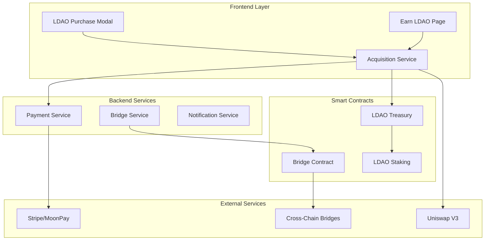

# LDAO Token Acquisition System Design

## Overview

The LDAO Token Acquisition System provides a comprehensive multi-channel approach for users to acquire LDAO tokens through direct purchases, DEX trading, and earn-to-own mechanisms. The system integrates smart contracts, payment processors, and frontend services to create a seamless token acquisition experience while maintaining security and regulatory compliance.

## Architecture

### High-Level Architecture



### Component Architecture

The system follows a modular architecture with clear separation of concerns:

1. **Frontend Components**: User interfaces for token acquisition
2. **Service Layer**: Business logic and external integrations
3. **Smart Contract Layer**: On-chain token management and security
4. **External Integrations**: Third-party payment and DEX services

## Components and Interfaces

### 1. LDAO Treasury Smart Contract

**Purpose**: Manages direct token sales, pricing, and treasury operations

**Key Functions**:
```solidity
interface ILDAOTreasury {
    function purchaseTokens(uint256 amount, address paymentToken) external payable;
    function setDynamicPrice(uint256 newPrice) external;
    function applyVolumeDiscount(uint256 purchaseAmount) external view returns (uint256);
    function enableKYCPurchase(address user, uint256 limit) external;
    function withdrawTreasuryFunds(address token, uint256 amount) external;
}
```

**Features**:
- Dynamic pricing engine starting at $0.01 per LDAO
- Volume-based discount tiers (5%-15%)
- KYC integration for higher purchase limits
- Multi-signature admin controls
- Emergency pause functionality

### 2. LDAO Acquisition Service

**Purpose**: Orchestrates token acquisition workflows and external integrations

**Key Methods**:
```typescript
interface ILDAOAcquisitionService {
    purchaseWithFiat(amount: number, paymentMethod: PaymentMethod): Promise<PurchaseResult>;
    purchaseWithCrypto(amount: number, token: string): Promise<PurchaseResult>;
    swapOnDEX(fromToken: string, toToken: string, amount: number): Promise<SwapResult>;
    earnTokens(activity: EarnActivity, userId: string): Promise<EarnResult>;
    bridgeTokens(fromChain: string, toChain: string, amount: number): Promise<BridgeResult>;
}
```

**Integrations**:
- Stripe for fiat payments
- MoonPay for crypto on-ramps
- Uniswap V3 for DEX trading
- Cross-chain bridge protocols

### 3. Frontend Components

#### LDAO Purchase Modal
- Multi-step purchase flow
- Payment method selection
- Real-time price quotes
- Transaction status tracking

#### Earn LDAO Page
- Gamified earning interface
- Progress tracking
- Reward history
- Achievement system

### 4. Payment Processing Integration

**Fiat Payment Flow**:
1. User selects fiat payment option
2. Stripe processes payment
3. Backend converts fiat to crypto
4. Treasury contract mints tokens
5. Tokens transferred to user wallet

**Crypto Payment Flow**:
1. User connects wallet
2. Approves token spending
3. Treasury contract processes payment
4. Tokens minted and transferred

## Data Models

### Purchase Transaction
```typescript
interface PurchaseTransaction {
    id: string;
    userId: string;
    amount: number;
    paymentMethod: 'fiat' | 'crypto';
    paymentToken: string;
    pricePerToken: number;
    discountApplied: number;
    status: 'pending' | 'completed' | 'failed';
    txHash?: string;
    createdAt: Date;
    completedAt?: Date;
}
```

### Earning Activity
```typescript
interface EarningActivity {
    id: string;
    userId: string;
    activityType: 'post' | 'comment' | 'referral' | 'marketplace';
    tokensEarned: number;
    multiplier: number;
    isPremiumBonus: boolean;
    createdAt: Date;
}
```

### Staking Position
```typescript
interface StakingPosition {
    id: string;
    userId: string;
    amount: number;
    lockPeriod: number; // in days
    aprRate: number;
    startDate: Date;
    endDate: Date;
    isAutoCompound: boolean;
    status: 'active' | 'completed' | 'withdrawn';
}
```

## Error Handling

### Smart Contract Error Handling
- Custom error messages for different failure scenarios
- Circuit breaker pattern for emergency stops
- Reentrancy guards on all state-changing functions
- Input validation and bounds checking

### Frontend Error Handling
- Graceful degradation for network issues
- User-friendly error messages
- Retry mechanisms for failed transactions
- Fallback payment methods

### Backend Error Handling
- Comprehensive logging and monitoring
- Transaction rollback mechanisms
- Rate limiting and abuse prevention
- Automated alerting for critical failures

## Testing Strategy

### Smart Contract Testing
```typescript
describe('LDAO Treasury Contract', () => {
    it('should apply correct volume discounts');
    it('should enforce purchase limits');
    it('should handle emergency pause');
    it('should prevent unauthorized access');
    it('should calculate dynamic pricing correctly');
});
```

### Integration Testing
- End-to-end purchase flows
- Payment processor integrations
- DEX swap functionality
- Cross-chain bridge operations
- Earning mechanism validation

### Security Testing
- Smart contract audits
- Penetration testing
- Vulnerability assessments
- Gas optimization analysis
- Access control verification

## Security Considerations

### Smart Contract Security
- Multi-signature wallet for admin functions
- Time-locked upgrades
- Emergency pause mechanisms
- Reentrancy protection
- Integer overflow/underflow protection

### Payment Security
- PCI DSS compliance for fiat payments
- Secure API key management
- Transaction encryption
- Fraud detection mechanisms
- AML/KYC compliance

### Frontend Security
- Input sanitization
- XSS protection
- CSRF tokens
- Secure wallet connections
- Rate limiting

## Performance Optimization

### Caching Strategy
- Token price caching (5-minute TTL)
- User balance caching
- Transaction history pagination
- DEX quote caching (30-second TTL)

### Database Optimization
- Indexed queries for transaction lookups
- Partitioned tables for historical data
- Connection pooling
- Read replicas for analytics

### Frontend Optimization
- Lazy loading of components
- Optimistic UI updates
- Background data fetching
- Service worker caching

## Monitoring and Analytics

### Key Metrics
- Token purchase volume
- Conversion rates by payment method
- User acquisition through earning
- Staking participation rates
- Cross-chain bridge usage

### Alerting
- Failed transaction thresholds
- Unusual trading patterns
- Smart contract anomalies
- Payment processor issues
- Bridge operation failures

## Deployment Strategy

### Phase 1: Core Infrastructure (2 weeks)
- Deploy LDAO Treasury contract
- Implement basic purchase flows
- Integrate Stripe payments
- Set up monitoring

### Phase 2: DEX Integration (2-4 weeks)
- Uniswap V3 integration
- Multi-chain support
- Advanced trading features
- Liquidity management

### Phase 3: Earn-to-Own System (4-6 weeks)
- Gamified earning interface
- Activity tracking
- Reward distribution
- Premium member benefits

### Phase 4: Advanced Features (6-8 weeks)
- Cross-chain bridges
- Advanced staking options
- Analytics dashboard
- Mobile optimization

## Risk Mitigation

### Technical Risks
- Smart contract bugs: Comprehensive testing and audits
- Scalability issues: Layer 2 integration and optimization
- Integration failures: Fallback mechanisms and monitoring

### Business Risks
- Regulatory compliance: Legal review and KYC integration
- Market volatility: Dynamic pricing and risk management
- User adoption: Incentive programs and user education

### Operational Risks
- Key management: Hardware security modules
- Service availability: Redundancy and failover systems
- Data security: Encryption and access controls