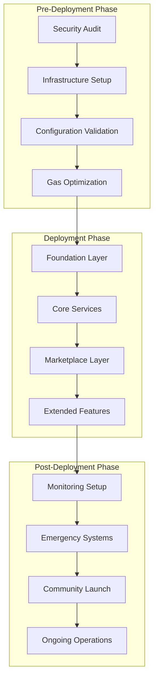
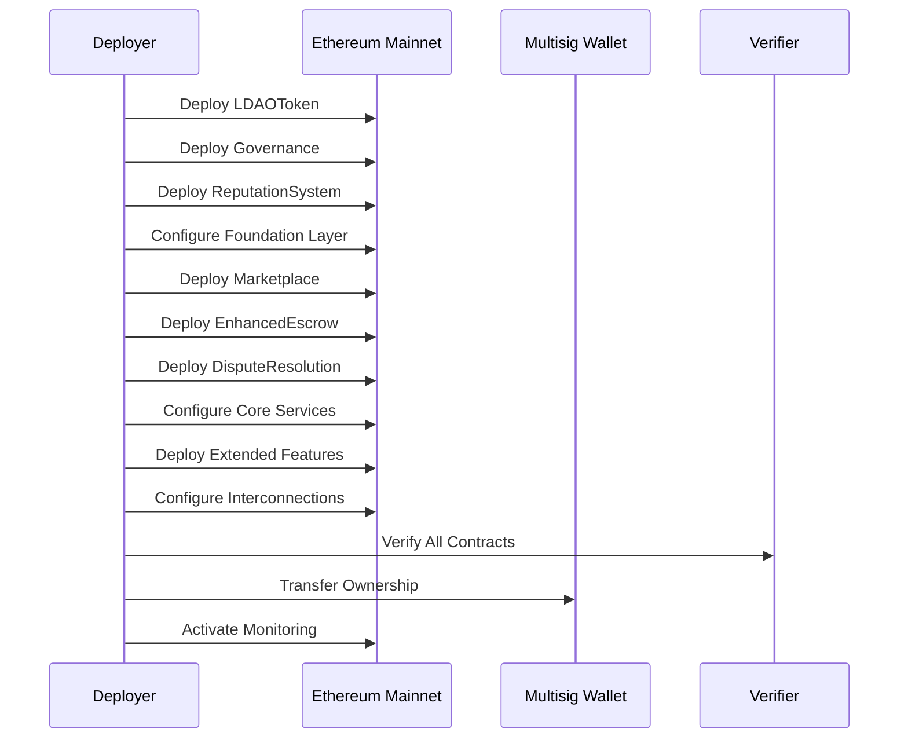

# LinkDAO Mainnet Deployment Plan - Design Document

## Overview

This design document outlines the comprehensive architecture and implementation strategy for deploying the LinkDAO smart contract ecosystem to Ethereum mainnet. The deployment encompasses a production-ready Web3 social platform with governance, marketplace, reputation, and DeFi features, built on a foundation of 7 core smart contracts with extensive monitoring and emergency response capabilities.

## Architecture

### Deployment Architecture



### Smart Contract Deployment Sequence



## Components and Interfaces

### 1. Pre-Deployment Security Layer

#### Security Audit System
- **Purpose**: Comprehensive security validation before mainnet deployment
- **Components**:
  - Automated security analysis (392-line checklist)
  - Penetration testing framework
  - Vulnerability scanning
  - Gas optimization analysis
  - Emergency procedure testing

#### Infrastructure Preparation
- **Network Configuration**: Ethereum mainnet with fallback to Sepolia testnet
- **Gas Price Management**: Dynamic gas pricing with optimization
- **Multisig Setup**: Treasury and emergency response wallets
- **Monitoring Infrastructure**: Real-time contract health tracking

### 2. Core Deployment Engine

#### Production Deployer (424-line system)
- **7-Phase Deployment Process**:
  1. **Foundation Layer**: LDAOToken, Governance, ReputationSystem
  2. **Core Services**: Marketplace, EnhancedEscrow, DisputeResolution
  3. **Extended Features**: NFT systems, social features, payment routing
  4. **Configuration**: Contract interconnections and parameter setup
  5. **Verification**: Etherscan contract verification
  6. **Ownership Transfer**: Transfer to multisig wallets
  7. **Activation**: Enable monitoring and emergency systems

#### Deployment Configuration
```typescript
interface DeploymentConfig {
  network: 'mainnet' | 'sepolia' | 'localhost';
  gasPrice: {
    maxFeePerGas: string;
    maxPriorityFeePerGas: string;
  };
  confirmations: {
    mainnet: 5;
    testnet: 2;
  };
  multisig: {
    treasury: string;
    emergency: string;
    governance: string;
  };
  verification: {
    etherscan: boolean;
    apiKey: string;
  };
}
```

### 3. Smart Contract Layer

#### Foundation Contracts
- **LDAOToken**: Enhanced ERC-20 with staking and governance features
- **Governance**: Multi-category proposal system with weighted voting
- **ReputationSystem**: Community-driven trust scoring with anti-gaming

#### Core Service Contracts
- **Marketplace**: Multi-asset trading with auction support
- **EnhancedEscrow**: Multi-signature escrow with time-locks
- **DisputeResolution**: Community arbitration with escalation paths

#### Extended Feature Contracts
- **NFTMarketplace**: ERC721/ERC1155 trading platform
- **PaymentRouter**: Multi-token payment processing
- **RewardPool**: Staking rewards and incentive distribution

### 4. Monitoring and Observability Layer

#### Contract Health Monitoring (362-line system)
```typescript
interface MonitoringMetrics {
  contractHealth: {
    balances: Record<string, string>;
    transactionCounts: Record<string, number>;
    lastActivity: Record<string, number>;
    status: 'healthy' | 'warning' | 'critical';
  };
  gasMetrics: {
    currentPrice: string;
    alertThresholds: {
      normal: string;
      high: string;
      critical: string;
    };
  };
  alerting: {
    slack: string;
    discord: string;
    email: string[];
  };
}
```

#### Real-Time Alerting System
- **Multi-Channel Notifications**: Slack, Discord, Email integration
- **Severity-Based Alerts**: Info, Warning, Critical classifications
- **Automated Response**: Circuit breakers and emergency procedures
- **Monitoring Dashboard**: Web-based real-time status display

### 5. Emergency Response System

#### Emergency Procedures (508-line system)
```typescript
interface EmergencyActions {
  pause: {
    contracts: string[];
    confirmations: number;
    executionTime: number;
  };
  withdraw: {
    sources: string[];
    destination: string;
    amounts: Record<string, string>;
  };
  ownership: {
    contracts: string[];
    newOwner: string;
    multisigRequired: boolean;
  };
}
```

#### Incident Response Procedures
1. **Contract Exploit Response**: Automated pause and fund protection
2. **High Gas Price Attack**: Manual intervention with rate limiting
3. **Governance Attack**: Emergency governance override
4. **Oracle Manipulation**: Automated price feed validation
5. **Network Congestion**: Dynamic gas price adjustment

## Data Models

### Deployment State Management
```typescript
interface DeploymentState {
  phase: 'pre-deployment' | 'deploying' | 'post-deployment' | 'operational';
  contracts: {
    [contractName: string]: {
      address: string;
      deploymentTx: string;
      verified: boolean;
      owner: string;
      status: 'deployed' | 'configured' | 'active';
    };
  };
  configuration: {
    networkId: number;
    gasUsed: string;
    totalCost: string;
    deploymentTime: number;
  };
  monitoring: {
    enabled: boolean;
    lastCheck: number;
    alertsActive: boolean;
  };
}
```

### Treasury Configuration
```typescript
interface TreasuryConfig {
  multisig: {
    address: string;
    signers: string[];
    threshold: number;
  };
  tokenomics: {
    totalSupply: string;
    initialDistribution: {
      treasury: string;
      team: string;
      community: string;
      liquidity: string;
    };
  };
  staking: {
    tiers: Array<{
      duration: number;
      apr: number;
      minAmount: string;
    }>;
  };
}
```

## Error Handling

### Deployment Error Recovery
- **Transaction Failure**: Automatic retry with increased gas
- **Network Issues**: Fallback to alternative RPC endpoints
- **Verification Failure**: Manual verification with backup API keys
- **Configuration Errors**: Rollback to previous stable state

### Runtime Error Management
- **Contract Pausing**: Automated pause on critical errors
- **Fund Recovery**: Emergency withdrawal procedures
- **Governance Override**: Emergency proposal fast-tracking
- **Communication**: Automated stakeholder notifications

## Testing Strategy

### Pre-Deployment Testing
1. **Security Testing**: Comprehensive audit execution
2. **Integration Testing**: Cross-contract interaction validation
3. **Performance Testing**: Gas optimization and load testing
4. **User Acceptance Testing**: End-to-end workflow validation

### Post-Deployment Validation
1. **Functionality Testing**: All features operational verification
2. **Performance Monitoring**: Real-time metrics validation
3. **Security Monitoring**: Continuous threat detection
4. **User Experience Testing**: Community feedback integration

### Continuous Testing Framework
```typescript
interface TestingSuite {
  preDeployment: {
    security: string[];
    integration: string[];
    performance: string[];
  };
  postDeployment: {
    functionality: string[];
    monitoring: string[];
    userAcceptance: string[];
  };
  ongoing: {
    healthChecks: string[];
    performanceMetrics: string[];
    securityScans: string[];
  };
}
```

## Deployment Timeline

### Phase 1: Pre-Deployment (Week 1-2)
- Security audit completion and remediation
- Infrastructure setup and configuration
- Final testing and validation
- Community preparation and communication

### Phase 2: Mainnet Deployment (Week 3)
- Foundation layer deployment (Day 1)
- Core services deployment (Day 2)
- Extended features deployment (Day 3)
- Configuration and verification (Day 4-5)
- Monitoring activation (Day 6-7)

### Phase 3: Post-Deployment (Week 4)
- Community launch and onboarding
- Performance monitoring and optimization
- Issue resolution and hotfixes
- Documentation and support materials

### Phase 4: Ongoing Operations (Week 5+)
- Regular health monitoring
- Community governance activation
- Feature enhancements and upgrades
- Ecosystem growth and partnerships

## Risk Mitigation

### Technical Risks
- **Smart Contract Bugs**: Comprehensive testing and auditing
- **Gas Price Volatility**: Dynamic pricing and optimization
- **Network Congestion**: Multiple deployment windows
- **Oracle Failures**: Redundant price feeds and validation

### Operational Risks
- **Key Management**: Hardware security modules and multisig
- **Team Availability**: 24/7 monitoring and on-call rotation
- **Communication**: Multiple notification channels and escalation
- **Regulatory**: Legal compliance monitoring and adaptation

### Financial Risks
- **Deployment Costs**: Gas optimization and cost estimation
- **Treasury Security**: Multisig protection and insurance
- **Market Volatility**: Stablecoin reserves and hedging
- **Liquidity**: Initial liquidity provision and market making

## Success Metrics

### Deployment Success Criteria
- All contracts deployed and verified successfully
- Zero critical security vulnerabilities
- Monitoring systems operational with <1 minute alert latency
- Community launch with >1000 active users in first week

### Operational Success Metrics
- 99.9% platform uptime
- <2 second average transaction confirmation
- Zero successful attacks or exploits
- >90% user satisfaction in community feedback

### Growth Metrics
- Monthly active users growth >20%
- Total value locked growth >50% monthly
- Governance participation >30% of token holders
- Marketplace transaction volume >$1M monthly