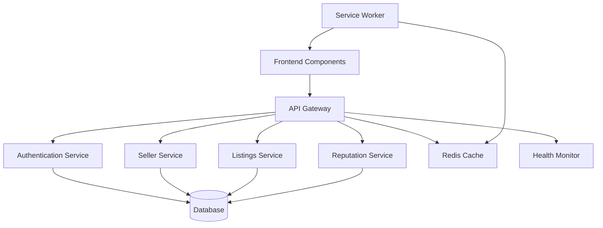

# Design Document

## Overview

This design addresses the critical API endpoint gaps preventing the marketplace frontend from functioning properly. The solution implements a comprehensive backend API layer that matches the exact endpoints the frontend expects, with proper error handling, authentication integration, and service reliability.

The design follows a service-oriented architecture where each major functionality area (seller management, listings, authentication, reputation) has dedicated services with standardized interfaces. This ensures maintainability while providing the immediate fixes needed for the console errors.

## Architecture

### High-Level Architecture



### Service Layer Design

The backend will implement these core services:

1. **Seller Profile Service** - Handles seller CRUD operations and onboarding
2. **Marketplace Listings Service** - Manages product listings and discovery
3. **Authentication Service** - Wallet connection and session management
4. **Reputation Service** - User reputation calculation and caching
5. **Health Monitoring Service** - System status and error tracking

## Components and Interfaces

### 1. Seller Profile Service

**Purpose**: Provide seller profile management matching frontend expectations

**Key Interfaces**:
```typescript
interface SellerProfileService {
  getProfile(walletAddress: string): Promise<SellerProfile | null>
  createProfile(profileData: CreateSellerProfileRequest): Promise<SellerProfile>
  updateProfile(walletAddress: string, updates: UpdateSellerProfileRequest): Promise<SellerProfile>
  getOnboardingStatus(walletAddress: string): Promise<OnboardingStatus>
}

interface SellerProfile {
  walletAddress: string
  displayName?: string
  ensHandle?: string
  storeDescription?: string
  coverImageUrl?: string
  isVerified: boolean
  createdAt: Date
  updatedAt: Date
}
```

**API Endpoints**:
- `GET /api/marketplace/seller/{walletAddress}` - Get seller profile
- `POST /api/marketplace/seller/profile` - Create/update seller profile  
- `GET /api/marketplace/seller/onboarding/{walletAddress}` - Get onboarding status

### 2. Marketplace Listings Service

**Purpose**: Provide product listings with filtering and pagination

**Key Interfaces**:
```typescript
interface ListingsService {
  getListings(filters: ListingFilters): Promise<PaginatedListings>
  getListingById(id: string): Promise<Listing | null>
  createListing(sellerAddress: string, listingData: CreateListingRequest): Promise<Listing>
}

interface ListingFilters {
  limit?: number
  offset?: number
  sortBy?: 'createdAt' | 'price' | 'popularity'
  sortOrder?: 'asc' | 'desc'
  category?: string
  priceRange?: { min: number; max: number }
}
```

**API Endpoints**:
- `GET /marketplace/listings` - Get paginated listings with filters
- `GET /marketplace/listings/{id}` - Get specific listing
- `POST /marketplace/listings` - Create new listing

### 3. Authentication Service

**Purpose**: Handle wallet authentication with proper error handling

**Key Interfaces**:
```typescript
interface AuthenticationService {
  authenticateWallet(walletAddress: string, signature: string, message: string): Promise<AuthResult>
  validateSession(sessionToken: string): Promise<SessionInfo | null>
  refreshSession(refreshToken: string): Promise<AuthResult>
}

interface AuthResult {
  success: boolean
  sessionToken?: string
  refreshToken?: string
  error?: AuthError
}
```

**API Endpoints**:
- `POST /api/auth/wallet` - Authenticate wallet signature
- `POST /api/auth/refresh` - Refresh authentication session
- `GET /api/auth/status` - Check authentication status

### 4. Reputation Service

**Purpose**: Provide user reputation data with caching and fallbacks

**Key Interfaces**:
```typescript
interface ReputationService {
  getReputation(walletAddress: string): Promise<ReputationData>
  updateReputation(walletAddress: string, transaction: ReputationTransaction): Promise<void>
  calculateReputation(walletAddress: string): Promise<number>
}

interface ReputationData {
  walletAddress: string
  score: number
  totalTransactions: number
  positiveReviews: number
  negativeReviews: number
  lastUpdated: Date
}
```

**API Endpoints**:
- `GET /marketplace/reputation/{walletAddress}` - Get reputation data
- `POST /marketplace/reputation/{walletAddress}` - Update reputation
- `GET /marketplace/reputation/{walletAddress}/history` - Get reputation history

## Data Models

### Database Schema

```sql
-- Seller Profiles
CREATE TABLE seller_profiles (
  wallet_address VARCHAR(42) PRIMARY KEY,
  display_name VARCHAR(255),
  ens_handle VARCHAR(255),
  store_description TEXT,
  cover_image_url VARCHAR(500),
  is_verified BOOLEAN DEFAULT FALSE,
  onboarding_completed BOOLEAN DEFAULT FALSE,
  created_at TIMESTAMP DEFAULT CURRENT_TIMESTAMP,
  updated_at TIMESTAMP DEFAULT CURRENT_TIMESTAMP ON UPDATE CURRENT_TIMESTAMP
);

-- Marketplace Listings
CREATE TABLE marketplace_listings (
  id UUID PRIMARY KEY DEFAULT gen_random_uuid(),
  seller_address VARCHAR(42) NOT NULL,
  title VARCHAR(255) NOT NULL,
  description TEXT,
  price DECIMAL(18,8) NOT NULL,
  currency VARCHAR(10) DEFAULT 'ETH',
  category VARCHAR(100),
  images JSON,
  is_active BOOLEAN DEFAULT TRUE,
  created_at TIMESTAMP DEFAULT CURRENT_TIMESTAMP,
  updated_at TIMESTAMP DEFAULT CURRENT_TIMESTAMP ON UPDATE CURRENT_TIMESTAMP,
  FOREIGN KEY (seller_address) REFERENCES seller_profiles(wallet_address)
);

-- User Reputation
CREATE TABLE user_reputation (
  wallet_address VARCHAR(42) PRIMARY KEY,
  reputation_score DECIMAL(3,2) DEFAULT 0.00,
  total_transactions INTEGER DEFAULT 0,
  positive_reviews INTEGER DEFAULT 0,
  negative_reviews INTEGER DEFAULT 0,
  last_calculated TIMESTAMP DEFAULT CURRENT_TIMESTAMP,
  FOREIGN KEY (wallet_address) REFERENCES seller_profiles(wallet_address)
);

-- Authentication Sessions
CREATE TABLE auth_sessions (
  session_id UUID PRIMARY KEY DEFAULT gen_random_uuid(),
  wallet_address VARCHAR(42) NOT NULL,
  session_token VARCHAR(255) NOT NULL,
  refresh_token VARCHAR(255) NOT NULL,
  expires_at TIMESTAMP NOT NULL,
  created_at TIMESTAMP DEFAULT CURRENT_TIMESTAMP
);
```

## Error Handling

### Standardized Error Response Format

```typescript
interface APIError {
  code: string
  message: string
  details?: any
  timestamp: string
  requestId: string
}

interface APIResponse<T> {
  success: boolean
  data?: T
  error?: APIError
  metadata?: {
    pagination?: PaginationInfo
    requestId: string
    timestamp: string
  }
}
```

### Error Handling Strategy

1. **404 Errors**: Return null data with success=true instead of throwing errors
2. **500 Errors**: Log detailed error info and return fallback data when possible
3. **Authentication Errors**: Provide clear error messages and retry mechanisms
4. **Validation Errors**: Return field-specific error details
5. **Service Unavailable**: Implement circuit breakers and fallback responses

### Error Recovery Mechanisms

```typescript
class ErrorRecoveryService {
  async withFallback<T>(
    primaryOperation: () => Promise<T>,
    fallbackOperation: () => Promise<T>,
    errorHandler?: (error: Error) => void
  ): Promise<T> {
    try {
      return await primaryOperation()
    } catch (error) {
      errorHandler?.(error)
      return await fallbackOperation()
    }
  }
}
```

## Testing Strategy

### Unit Testing
- Service layer methods with mocked dependencies
- Error handling scenarios and edge cases
- Data validation and transformation logic
- Authentication and authorization flows

### Integration Testing
- API endpoint responses and error codes
- Database operations and data integrity
- Service-to-service communication
- Cache invalidation and consistency

### End-to-End Testing
- Complete user workflows (seller onboarding, listing creation)
- Frontend-to-backend integration scenarios
- Error recovery and fallback mechanisms
- Performance under load conditions

### Test Coverage Requirements
- Minimum 80% code coverage for service layer
- 100% coverage for critical authentication flows
- All error handling paths must be tested
- Performance benchmarks for API response times

## Performance Considerations

### Caching Strategy

```typescript
interface CacheService {
  get<T>(key: string): Promise<T | null>
  set<T>(key: string, value: T, ttl?: number): Promise<void>
  invalidate(pattern: string): Promise<void>
}

// Cache TTL Configuration
const CACHE_TTL = {
  SELLER_PROFILE: 300, // 5 minutes
  LISTINGS: 60,        // 1 minute
  REPUTATION: 600,     // 10 minutes
  AUTH_SESSION: 3600   // 1 hour
}
```

### Database Optimization
- Index on frequently queried fields (wallet_address, created_at)
- Connection pooling for high concurrency
- Read replicas for listing queries
- Prepared statements for security and performance

### Rate Limiting
```typescript
interface RateLimitConfig {
  windowMs: number
  maxRequests: number
  skipSuccessfulRequests?: boolean
  keyGenerator?: (req: Request) => string
}

const RATE_LIMITS = {
  GENERAL: { windowMs: 60000, maxRequests: 100 },
  AUTH: { windowMs: 60000, maxRequests: 10 },
  PROFILE_UPDATE: { windowMs: 60000, maxRequests: 5 }
}
```

## Security Measures

### Authentication Security
- JWT tokens with short expiration times
- Refresh token rotation
- Signature verification for wallet authentication
- Session invalidation on suspicious activity

### Data Protection
- Input validation and sanitization
- SQL injection prevention with parameterized queries
- XSS protection with content security policies
- Rate limiting to prevent abuse

### API Security
- CORS configuration for allowed origins
- Request size limits
- API key validation for internal services
- Audit logging for sensitive operations

## Monitoring and Observability

### Health Check Endpoints
```typescript
interface HealthCheck {
  service: string
  status: 'healthy' | 'degraded' | 'unhealthy'
  timestamp: string
  details?: any
}

// Health check endpoints
GET /health - Overall system health
GET /health/database - Database connectivity
GET /health/cache - Cache service status
GET /health/external - External service dependencies
```

### Metrics Collection
- API response times and error rates
- Database query performance
- Cache hit/miss ratios
- Authentication success/failure rates
- User activity patterns

### Alerting Strategy
- Critical errors trigger immediate alerts
- Performance degradation warnings
- Service dependency failures
- Unusual traffic patterns or potential attacks

## Deployment Strategy

### Environment Configuration
- Development: Local database and cache
- Staging: Production-like environment for testing
- Production: Scaled infrastructure with redundancy

### Database Migrations
- Version-controlled schema changes
- Rollback procedures for failed migrations
- Data migration scripts with validation
- Zero-downtime deployment strategies

### Service Deployment
- Blue-green deployment for zero downtime
- Health checks before traffic routing
- Gradual rollout with monitoring
- Automatic rollback on failure detection