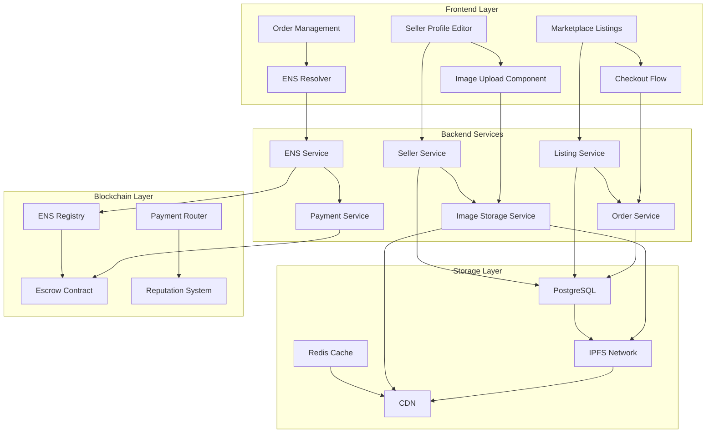

# Design Document

## Overview

This design addresses critical marketplace functionality gaps through four integrated enhancement areas: enhanced seller profile management with ENS support, comprehensive image storage infrastructure, proper listing visibility and database integration, and a functional checkout process with order management. The solution leverages existing database schema while adding necessary extensions and implements a robust image storage system using IPFS with CDN optimization.

## Architecture

### Current Payment System Analysis

The existing marketplace supports three payment methods:

1. **Crypto Payments**: Direct wallet-to-wallet transfers using ETH/USDC
   - Requires sufficient balance validation before transaction
   - Uses Web3 wallet integration (MetaMask, WalletConnect)
   - No escrow protection for direct payments

2. **Fiat Payments**: Traditional payment processing via Stripe
   - Supports credit cards, bank transfers, PayPal, Apple Pay, Google Pay
   - Automatic conversion to crypto if needed
   - No crypto balance requirements

3. **Escrow Payments**: Smart contract-based escrow using EnhancedEscrow.sol
   - Requires sufficient crypto balance to lock funds in escrow
   - Provides buyer protection through dispute resolution
   - Funds released after delivery confirmation or dispute resolution

**Current Issue**: The system incorrectly allows escrow transactions to proceed without sufficient balance, leading to failed transactions that still create order records.

### System Components



### Data Flow Architecture

1. **Profile Enhancement Flow**: User updates profile → ENS validation → Database update → Cache invalidation
2. **Image Upload Flow**: File upload → IPFS storage → CDN distribution → Database URL storage
3. **Listing Creation Flow**: Form submission → Image processing → Database insertion → Search index update
4. **Checkout Flow**: Payment initiation → Escrow validation → Order creation → Status tracking

## Components and Interfaces

### Enhanced Seller Profile Management

#### Database Schema Extensions

```sql
-- Add optional ENS support to sellers table
ALTER TABLE sellers ADD COLUMN ens_handle VARCHAR(255) NULL; -- Nullable - ENS is optional
ALTER TABLE sellers ADD COLUMN ens_verified BOOLEAN DEFAULT FALSE;
ALTER TABLE sellers ADD COLUMN ens_last_verified TIMESTAMP NULL;

-- Add image storage fields
ALTER TABLE sellers ADD COLUMN profile_image_ipfs VARCHAR(255);
ALTER TABLE sellers ADD COLUMN cover_image_ipfs VARCHAR(255);
ALTER TABLE sellers ADD COLUMN image_cdn_urls TEXT; -- JSON object

-- Add enhanced profile fields
ALTER TABLE sellers ADD COLUMN website_url VARCHAR(500);
ALTER TABLE sellers ADD COLUMN twitter_handle VARCHAR(100);
ALTER TABLE sellers ADD COLUMN discord_handle VARCHAR(100);
ALTER TABLE sellers ADD COLUMN telegram_handle VARCHAR(100);
```

#### ENS Integration Service

```typescript
interface ENSService {
  validateENSHandle(ensName: string): Promise<boolean>;
  resolveENSToAddress(ensName: string): Promise<string | null>;
  reverseResolveAddress(address: string): Promise<string | null>;
  verifyENSOwnership(ensName: string, walletAddress: string): Promise<boolean>;
  isENSHandleAvailable(ensName: string): Promise<boolean>;
  suggestENSAlternatives(baseName: string): Promise<string[]>;
}

// ENS is completely optional - users can operate without it
interface ENSValidationOptions {
  required: false; // ENS is never required
  showSuggestions: boolean;
  validateOwnership: boolean;
}
```

#### Enhanced Profile Editor Component

```typescript
interface EnhancedSellerProfile extends SellerProfile {
  ensHandle?: string; // Optional - can be null/undefined
  ensVerified: boolean; // False if no ENS handle provided
  profileImageUrl?: string;
  coverImageUrl?: string;
  websiteUrl?: string;
  socialHandles: {
    twitter?: string;
    discord?: string;
    telegram?: string;
  };
}

interface ProfileFormValidation {
  requiredFields: string[]; // ENS is NOT in this list
  optionalFields: string[]; // ENS is in this list
  validationRules: {
    ensHandle?: (value: string) => Promise<ValidationResult>;
    // Other validation rules
  };
}
```

### Comprehensive Image Storage Solution

#### Image Storage Architecture

```typescript
interface ImageStorageService {
  uploadImage(file: File, category: 'profile' | 'cover' | 'listing'): Promise<ImageUploadResult>;
  optimizeImage(buffer: Buffer, options: ImageOptimizationOptions): Promise<Buffer>;
  generateThumbnails(imageBuffer: Buffer): Promise<ThumbnailSet>;
  storeToIPFS(buffer: Buffer, metadata: ImageMetadata): Promise<string>;
  distributeToCDN(ipfsHash: string): Promise<string>;
  deleteImage(ipfsHash: string): Promise<void>;
}

interface ImageUploadResult {
  ipfsHash: string;
  cdnUrl: string;
  thumbnails: {
    small: string;
    medium: string;
    large: string;
  };
  metadata: {
    width: number;
    height: number;
    format: string;
    size: number;
  };
}
```

#### Image Processing Pipeline

1. **Upload Validation**: File type, size, and content validation
2. **Image Optimization**: Compression and format conversion
3. **Thumbnail Generation**: Multiple sizes for different use cases
4. **IPFS Storage**: Decentralized storage with content addressing
5. **CDN Distribution**: Fast global delivery through CloudFront/similar
6. **Database Recording**: Store URLs and metadata for quick access

### Listing Visibility and Database Integration

#### Enhanced Listing Service

```typescript
interface EnhancedListingService {
  createListing(listingData: CreateListingRequest): Promise<Listing>;
  updateListingImages(listingId: string, images: ImageUploadResult[]): Promise<void>;
  publishListing(listingId: string): Promise<void>;
  getMarketplaceListings(filters: ListingFilters): Promise<PaginatedListings>;
  searchListings(query: SearchQuery): Promise<SearchResults>;
}

interface CreateListingRequest {
  sellerId: string;
  title: string;
  description: string;
  price: number;
  currency: string;
  category: string;
  images: File[];
  metadata: ListingMetadata;
  escrowEnabled: boolean;
}
```

#### Real-time Listing Updates

```typescript
interface ListingEventService {
  onListingCreated(listing: Listing): Promise<void>;
  onListingUpdated(listingId: string, changes: Partial<Listing>): Promise<void>;
  onListingStatusChanged(listingId: string, status: ListingStatus): Promise<void>;
  notifySubscribers(event: ListingEvent): Promise<void>;
}
```

### Functional Checkout and Order Management

#### Enhanced Order Processing

```typescript
interface OrderProcessingService {
  initiateCheckout(checkoutData: CheckoutRequest): Promise<CheckoutSession>;
  validatePaymentMethod(paymentData: PaymentValidationRequest): Promise<PaymentValidationResult>;
  processPayment(sessionId: string, paymentData: PaymentData): Promise<PaymentResult>;
  createOrder(paymentResult: PaymentResult): Promise<Order>;
  handleEscrowPayment(orderData: EscrowOrderData): Promise<EscrowResult>;
  updateOrderStatus(orderId: string, status: OrderStatus): Promise<void>;
}

interface CheckoutRequest {
  listingId: string;
  buyerId: string;
  quantity: number;
  paymentMethod: 'crypto' | 'fiat' | 'escrow';
  paymentDetails: CryptoPaymentDetails | FiatPaymentDetails | EscrowPaymentDetails;
  shippingAddress?: ShippingAddress;
  specialInstructions?: string;
}

interface PaymentValidationRequest {
  paymentMethod: 'crypto' | 'fiat' | 'escrow';
  amount: number;
  currency: string;
  userAddress: string;
  paymentDetails: any;
}

interface PaymentValidationResult {
  isValid: boolean;
  hasSufficientBalance: boolean;
  errors: string[];
  warnings: string[];
  suggestedAlternatives?: PaymentAlternative[];
}

interface PaymentAlternative {
  method: 'crypto' | 'fiat' | 'escrow';
  description: string;
  available: boolean;
  estimatedTotal: number;
  currency: string;
}
```

#### Order Status Tracking

```typescript
interface OrderTrackingService {
  trackOrder(orderId: string): Promise<OrderStatus>;
  updateTrackingInfo(orderId: string, trackingData: TrackingData): Promise<void>;
  notifyStatusChange(orderId: string, newStatus: OrderStatus): Promise<void>;
  getOrderHistory(userId: string): Promise<Order[]>;
}
```

## Data Models

### Enhanced Database Schema

```sql
-- Enhanced products table for better listing management
ALTER TABLE products ADD COLUMN listing_status VARCHAR(20) DEFAULT 'draft';
ALTER TABLE products ADD COLUMN published_at TIMESTAMP;
ALTER TABLE products ADD COLUMN search_vector tsvector;
ALTER TABLE products ADD COLUMN image_ipfs_hashes TEXT[]; -- Array of IPFS hashes
ALTER TABLE products ADD COLUMN image_cdn_urls TEXT; -- JSON object with CDN URLs

-- Enhanced orders table for better tracking
ALTER TABLE orders ADD COLUMN checkout_session_id VARCHAR(255);
ALTER TABLE orders ADD COLUMN payment_method VARCHAR(20);
ALTER TABLE orders ADD COLUMN shipping_address TEXT; -- JSON object
ALTER TABLE orders ADD COLUMN order_notes TEXT;
ALTER TABLE orders ADD COLUMN tracking_number VARCHAR(100);
ALTER TABLE orders ADD COLUMN estimated_delivery DATE;

-- Image storage tracking table
CREATE TABLE image_storage (
  id UUID PRIMARY KEY DEFAULT gen_random_uuid(),
  ipfs_hash VARCHAR(255) NOT NULL UNIQUE,
  cdn_url VARCHAR(500),
  original_filename VARCHAR(255),
  content_type VARCHAR(100),
  file_size INTEGER,
  width INTEGER,
  height INTEGER,
  thumbnails TEXT, -- JSON object with thumbnail URLs
  owner_id UUID REFERENCES users(id),
  usage_type VARCHAR(50), -- 'profile', 'cover', 'listing'
  created_at TIMESTAMP DEFAULT NOW(),
  updated_at TIMESTAMP DEFAULT NOW()
);

-- ENS verification tracking
CREATE TABLE ens_verifications (
  id UUID PRIMARY KEY DEFAULT gen_random_uuid(),
  wallet_address VARCHAR(66) NOT NULL,
  ens_handle VARCHAR(255) NOT NULL,
  verified_at TIMESTAMP DEFAULT NOW(),
  verification_tx_hash VARCHAR(66),
  expires_at TIMESTAMP,
  created_at TIMESTAMP DEFAULT NOW()
);
```

### API Response Models

```typescript
interface EnhancedSellerProfileResponse {
  profile: EnhancedSellerProfile;
  stats: SellerStats;
  verificationStatus: {
    email: boolean;
    phone: boolean;
    ens: boolean;
    kyc: boolean;
  };
  imageUrls: {
    profile?: string;
    cover?: string;
  };
}

interface ListingResponse {
  listing: Listing;
  seller: SellerSummary;
  images: ImageSet[];
  availability: AvailabilityInfo;
  escrowInfo?: EscrowInfo;
}

interface OrderResponse {
  order: Order;
  listing: ListingSummary;
  seller: SellerSummary;
  buyer: BuyerSummary;
  tracking?: TrackingInfo;
  escrow?: EscrowStatus;
}
```

## Error Handling

### Image Upload Error Handling

```typescript
enum ImageUploadError {
  FILE_TOO_LARGE = 'FILE_TOO_LARGE',
  INVALID_FORMAT = 'INVALID_FORMAT',
  IPFS_UPLOAD_FAILED = 'IPFS_UPLOAD_FAILED',
  CDN_DISTRIBUTION_FAILED = 'CDN_DISTRIBUTION_FAILED',
  THUMBNAIL_GENERATION_FAILED = 'THUMBNAIL_GENERATION_FAILED'
}

interface ImageUploadErrorHandler {
  handleUploadError(error: ImageUploadError, context: UploadContext): Promise<ErrorResponse>;
  retryUpload(uploadId: string, retryCount: number): Promise<ImageUploadResult>;
  cleanupFailedUpload(uploadId: string): Promise<void>;
}
```

### ENS Validation Error Handling

```typescript
enum ENSValidationError {
  INVALID_FORMAT = 'INVALID_FORMAT',
  NOT_OWNED = 'NOT_OWNED',
  RESOLUTION_FAILED = 'RESOLUTION_FAILED',
  NETWORK_ERROR = 'NETWORK_ERROR'
}

interface ENSErrorHandler {
  validateENSFormat(ensName: string): ValidationResult;
  handleResolutionError(error: ENSValidationError): ErrorResponse;
  suggestCorrections(invalidENS: string): string[];
}
```

### Order Processing Error Handling

```typescript
enum OrderProcessingError {
  INSUFFICIENT_CRYPTO_BALANCE = 'INSUFFICIENT_CRYPTO_BALANCE',
  FIAT_PAYMENT_FAILED = 'FIAT_PAYMENT_FAILED',
  ESCROW_SETUP_FAILED = 'ESCROW_SETUP_FAILED',
  PAYMENT_PROCESSING_FAILED = 'PAYMENT_PROCESSING_FAILED',
  INVENTORY_UNAVAILABLE = 'INVENTORY_UNAVAILABLE',
  INVALID_PAYMENT_METHOD = 'INVALID_PAYMENT_METHOD'
}

interface OrderErrorHandler {
  handlePaymentError(error: OrderProcessingError, orderData: OrderData): Promise<ErrorRecovery>;
  suggestPaymentAlternatives(originalMethod: PaymentMethod, amount: number): Promise<PaymentAlternative[]>;
  retryPayment(orderId: string, newPaymentMethod?: PaymentMethod): Promise<PaymentResult>;
  refundOrder(orderId: string, reason: string): Promise<RefundResult>;
}

interface ErrorRecovery {
  canRetry: boolean;
  suggestedActions: string[];
  alternativePaymentMethods: PaymentAlternative[];
  estimatedResolutionTime?: number;
}
```

## Testing Strategy

### Unit Testing

1. **ENS Service Tests**: Validation, resolution, and ownership verification
2. **Image Storage Tests**: Upload, optimization, IPFS storage, CDN distribution
3. **Listing Service Tests**: Creation, publication, search, and filtering
4. **Order Processing Tests**: Checkout flow, payment processing, status updates

### Integration Testing

1. **Profile Update Flow**: End-to-end profile editing with ENS and images
2. **Listing Creation Flow**: Complete listing creation with image upload
3. **Checkout Process**: Full checkout flow with escrow and order creation
4. **Order Management**: Order status tracking and updates

### Performance Testing

1. **Image Upload Performance**: Large file handling and processing speed
2. **Listing Search Performance**: Search response times with large datasets
3. **Concurrent Order Processing**: Multiple simultaneous checkout processes
4. **Database Query Optimization**: Efficient queries for marketplace data

### User Acceptance Testing

1. **Seller Profile Management**: Complete profile setup and editing workflow
2. **Listing Management**: Creating, editing, and managing product listings
3. **Buyer Experience**: Browsing, searching, and purchasing products
4. **Order Tracking**: Monitoring order status and delivery updates

## Security Considerations

### Image Upload Security

1. **File Validation**: Strict file type and content validation
2. **Size Limits**: Prevent DoS attacks through large file uploads
3. **Content Scanning**: Malware and inappropriate content detection
4. **Access Control**: Proper permissions for image access and modification

### ENS Security

1. **Ownership Verification**: Cryptographic proof of ENS ownership
2. **Replay Attack Prevention**: Nonce-based verification system
3. **Expiration Handling**: Regular re-verification of ENS ownership
4. **Fallback Mechanisms**: Graceful handling of ENS resolution failures

### Payment Security

1. **Balance Validation**: Real-time crypto balance checking before escrow transactions
2. **Fiat Payment Security**: PCI-compliant fiat payment processing through Stripe
3. **Escrow Validation**: Proper escrow contract interaction with sufficient fund verification
4. **Transaction Monitoring**: Blockchain event monitoring for payment confirmation
5. **Multi-Payment Support**: Secure handling of crypto, fiat, and hybrid payment flows
6. **Fraud Detection**: Suspicious transaction pattern detection across all payment methods

## Performance Optimizations

### Image Delivery Optimization

1. **CDN Integration**: Global content delivery network for fast image loading
2. **Lazy Loading**: Progressive image loading for better page performance
3. **Format Optimization**: WebP/AVIF format support for modern browsers
4. **Caching Strategy**: Multi-layer caching for frequently accessed images

### Database Optimization

1. **Indexing Strategy**: Optimized indexes for search and filtering queries
2. **Query Optimization**: Efficient joins and aggregations for marketplace data
3. **Connection Pooling**: Proper database connection management
4. **Read Replicas**: Separate read replicas for heavy query workloads

### Search Optimization

1. **Full-Text Search**: PostgreSQL full-text search for listing content
2. **Search Indexing**: Optimized search vectors for fast text matching
3. **Faceted Search**: Efficient category and filter-based search
4. **Search Caching**: Redis caching for popular search queries