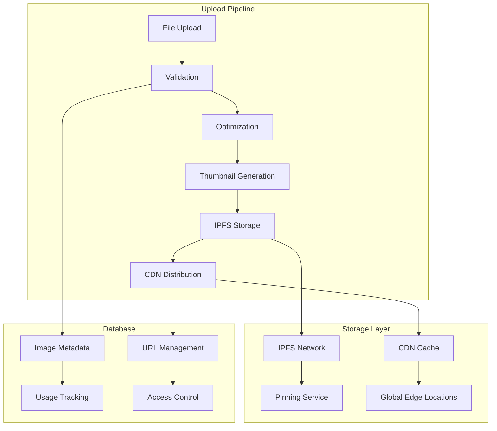

# Image Storage Architecture Documentation

## Overview

The image storage system provides comprehensive image management for marketplace listings, seller profiles, and store customization. It combines IPFS for decentralized storage with CDN optimization for fast global delivery.

## Architecture Components



## Core Services

### ImageStorageService

Main service for image upload, processing, and management.

```typescript
interface ImageStorageService {
  uploadImage(file: File, category: 'profile' | 'cover' | 'listing'): Promise<ImageUploadResult>;
  optimizeImage(buffer: Buffer, options: ImageOptimizationOptions): Promise<Buffer>;
  generateThumbnails(imageBuffer: Buffer): Promise<ThumbnailSet>;
  storeToIPFS(buffer: Buffer, metadata: ImageMetadata): Promise<string>;
  distributeToCDN(ipfsHash: string): Promise<string>;
  deleteImage(ipfsHash: string): Promise<void>;
  getImageUrls(ipfsHash: string): Promise<ImageUrlSet>;
}
```

#### Upload Process Flow

1. **File Validation**
   - File type checking (JPEG, PNG, WebP, GIF)
   - Size limits (max 10MB for listings, 5MB for profiles)
   - Content validation (malware scanning)
   - Dimension requirements

2. **Image Optimization**
   - Compression without quality loss
   - Format conversion (WebP for modern browsers)
   - Color space optimization
   - Metadata stripping for privacy

3. **Thumbnail Generation**
   - Multiple sizes: 150x150, 300x300, 600x600, 1200x1200
   - Aspect ratio preservation
   - Smart cropping for profile images
   - Progressive JPEG encoding

4. **IPFS Storage**
   - Content-addressed storage
   - Automatic pinning for persistence
   - Redundancy across multiple nodes
   - Hash verification

5. **CDN Distribution**
   - Global edge caching
   - Automatic format selection
   - Lazy loading optimization
   - Cache invalidation management

### ImageOptimizationOptions

```typescript
interface ImageOptimizationOptions {
  quality: number; // 1-100
  format: 'jpeg' | 'png' | 'webp' | 'auto';
  maxWidth: number;
  maxHeight: number;
  progressive: boolean;
  stripMetadata: boolean;
}
```

### ImageUploadResult

```typescript
interface ImageUploadResult {
  ipfsHash: string;
  cdnUrl: string;
  thumbnails: {
    small: string;    // 150x150
    medium: string;   // 300x300
    large: string;    // 600x600
    xlarge: string;   // 1200x1200
  };
  metadata: {
    width: number;
    height: number;
    format: string;
    size: number;
    aspectRatio: number;
  };
  urls: {
    ipfs: string;
    cdn: string;
    fallback: string;
  };
}
```

## API Endpoints

### POST /api/images/upload

Upload and process an image.

**Request:**
- Content-Type: `multipart/form-data`
- Fields:
  - `image`: Image file
  - `category`: 'profile' | 'cover' | 'listing'
  - `userId`: User ID for ownership

**Response:**
```json
{
  "success": true,
  "data": {
    "ipfsHash": "QmYwAPJzv5CZsnA625s3Xf2nemtYgPpHdWEz79ojWnPbdG",
    "cdnUrl": "https://cdn.example.com/images/QmYwAPJzv5CZsnA625s3Xf2nemtYgPpHdWEz79ojWnPbdG",
    "thumbnails": {
      "small": "https://cdn.example.com/thumbs/150/QmYwAPJzv5CZsnA625s3Xf2nemtYgPpHdWEz79ojWnPbdG",
      "medium": "https://cdn.example.com/thumbs/300/QmYwAPJzv5CZsnA625s3Xf2nemtYgPpHdWEz79ojWnPbdG",
      "large": "https://cdn.example.com/thumbs/600/QmYwAPJzv5CZsnA625s3Xf2nemtYgPpHdWEz79ojWnPbdG",
      "xlarge": "https://cdn.example.com/thumbs/1200/QmYwAPJzv5CZsnA625s3Xf2nemtYgPpHdWEz79ojWnPbdG"
    },
    "metadata": {
      "width": 1920,
      "height": 1080,
      "format": "jpeg",
      "size": 245760,
      "aspectRatio": 1.78
    }
  }
}
```

### GET /api/images/:ipfsHash

Get image information and URLs.

**Response:**
```json
{
  "ipfsHash": "QmYwAPJzv5CZsnA625s3Xf2nemtYgPpHdWEz79ojWnPbdG",
  "urls": {
    "original": "https://cdn.example.com/images/QmYwAPJzv5CZsnA625s3Xf2nemtYgPpHdWEz79ojWnPbdG",
    "thumbnails": {
      "small": "https://cdn.example.com/thumbs/150/QmYwAPJzv5CZsnA625s3Xf2nemtYgPpHdWEz79ojWnPbdG"
    }
  },
  "metadata": {
    "uploadedAt": "2024-01-15T10:30:00Z",
    "category": "listing",
    "owner": "user123"
  }
}
```

### DELETE /api/images/:ipfsHash

Delete an image (soft delete with cleanup).

**Response:**
```json
{
  "success": true,
  "message": "Image marked for deletion"
}
```

## Database Schema

### Image Storage Table

```sql
CREATE TABLE image_storage (
  id UUID PRIMARY KEY DEFAULT gen_random_uuid(),
  ipfs_hash VARCHAR(255) NOT NULL UNIQUE,
  cdn_url VARCHAR(500),
  original_filename VARCHAR(255),
  content_type VARCHAR(100),
  file_size INTEGER,
  width INTEGER,
  height INTEGER,
  aspect_ratio DECIMAL(10,8),
  thumbnails TEXT, -- JSON object with thumbnail URLs
  owner_id UUID REFERENCES users(id),
  usage_type VARCHAR(50), -- 'profile', 'cover', 'listing'
  upload_session_id VARCHAR(255),
  processing_status VARCHAR(20) DEFAULT 'pending',
  created_at TIMESTAMP DEFAULT NOW(),
  updated_at TIMESTAMP DEFAULT NOW(),
  deleted_at TIMESTAMP NULL,
  
  -- Indexes
  INDEX idx_owner_usage (owner_id, usage_type),
  INDEX idx_ipfs_hash (ipfs_hash),
  INDEX idx_processing_status (processing_status),
  INDEX idx_created_at (created_at)
);
```

### Image Usage Tracking

```sql
CREATE TABLE image_usage (
  id UUID PRIMARY KEY DEFAULT gen_random_uuid(),
  image_id UUID REFERENCES image_storage(id),
  entity_type VARCHAR(50), -- 'seller_profile', 'product_listing', 'store_cover'
  entity_id UUID,
  usage_context VARCHAR(100), -- 'primary_image', 'gallery_image', 'thumbnail'
  created_at TIMESTAMP DEFAULT NOW(),
  
  -- Indexes
  INDEX idx_entity (entity_type, entity_id),
  INDEX idx_image_usage (image_id, entity_type)
);
```

## Configuration

### Environment Variables

```bash
# IPFS Configuration
IPFS_API_URL=https://ipfs.infura.io:5001
IPFS_GATEWAY_URL=https://gateway.pinata.cloud/ipfs/
IPFS_PROJECT_ID=your_project_id
IPFS_PROJECT_SECRET=your_project_secret

# CDN Configuration
CDN_BASE_URL=https://cdn.yourdomain.com
CDN_API_KEY=your_cdn_api_key
CDN_ZONE_ID=your_zone_id

# Image Processing
MAX_IMAGE_SIZE=10485760  # 10MB
MAX_PROFILE_IMAGE_SIZE=5242880  # 5MB
SUPPORTED_FORMATS=jpeg,png,webp,gif
THUMBNAIL_SIZES=150,300,600,1200
IMAGE_QUALITY=85

# Storage Cleanup
CLEANUP_INTERVAL_HOURS=24
RETENTION_DAYS=30
```

## Error Handling

### Upload Errors

```typescript
enum ImageUploadError {
  FILE_TOO_LARGE = 'FILE_TOO_LARGE',
  INVALID_FORMAT = 'INVALID_FORMAT',
  PROCESSING_FAILED = 'PROCESSING_FAILED',
  IPFS_UPLOAD_FAILED = 'IPFS_UPLOAD_FAILED',
  CDN_DISTRIBUTION_FAILED = 'CDN_DISTRIBUTION_FAILED',
  THUMBNAIL_GENERATION_FAILED = 'THUMBNAIL_GENERATION_FAILED',
  QUOTA_EXCEEDED = 'QUOTA_EXCEEDED'
}
```

### Error Recovery

```typescript
interface ImageUploadErrorHandler {
  handleUploadError(error: ImageUploadError, context: UploadContext): Promise<ErrorResponse>;
  retryUpload(uploadId: string, retryCount: number): Promise<ImageUploadResult>;
  cleanupFailedUpload(uploadId: string): Promise<void>;
}
```

## Performance Optimizations

### 1. Upload Optimization
- Parallel processing pipeline
- Progressive upload with chunking
- Client-side image compression
- Background thumbnail generation

### 2. Delivery Optimization
- Global CDN with edge caching
- Automatic format selection (WebP for modern browsers)
- Lazy loading with intersection observer
- Progressive image enhancement

### 3. Storage Optimization
- Deduplication by content hash
- Automatic cleanup of unused images
- Tiered storage (hot/cold)
- Compression without quality loss

### 4. Caching Strategy
- Browser caching with long TTL
- CDN edge caching
- Application-level caching
- Database query optimization

## Security Considerations

### 1. Upload Security
- File type validation (magic number checking)
- Malware scanning
- Size limits enforcement
- Content policy validation

### 2. Access Control
- Owner-based permissions
- Signed URLs for private images
- Rate limiting on uploads
- CORS configuration

### 3. Privacy Protection
- Metadata stripping
- Anonymous upload options
- GDPR compliance (right to deletion)
- Audit logging

## Usage Examples

### Frontend Upload Component

```typescript
const ImageUpload: React.FC<ImageUploadProps> = ({ category, onUpload }) => {
  const [uploading, setUploading] = useState(false);
  const [progress, setProgress] = useState(0);

  const handleUpload = async (file: File) => {
    setUploading(true);
    
    try {
      const result = await imageStorageService.uploadImage(file, category, {
        onProgress: setProgress
      });
      
      onUpload(result);
    } catch (error) {
      handleUploadError(error);
    } finally {
      setUploading(false);
    }
  };

  return (
    <div className="image-upload">
      <input
        type="file"
        accept="image/jpeg,image/png,image/webp"
        onChange={(e) => e.target.files?.[0] && handleUpload(e.target.files[0])}
        disabled={uploading}
      />
      {uploading && <ProgressBar progress={progress} />}
    </div>
  );
};
```

### Backend Integration

```typescript
// Listing creation with images
export const createListing = async (listingData: CreateListingRequest) => {
  const listing = await createBaseListing(listingData);
  
  // Process uploaded images
  if (listingData.imageHashes?.length > 0) {
    await Promise.all(
      listingData.imageHashes.map(async (ipfsHash, index) => {
        await imageUsageService.recordUsage({
          imageId: ipfsHash,
          entityType: 'product_listing',
          entityId: listing.id,
          usageContext: index === 0 ? 'primary_image' : 'gallery_image'
        });
      })
    );
  }
  
  return listing;
};
```

## Monitoring and Analytics

### Key Metrics
- Upload success rate
- Processing time per image
- CDN cache hit ratio
- Storage usage by category
- Error rates by type

### Alerts
- High error rates
- Processing queue backlog
- Storage quota approaching limits
- CDN performance degradation

### Logging
- Upload attempts and outcomes
- Processing pipeline stages
- Error details with context
- Performance metrics