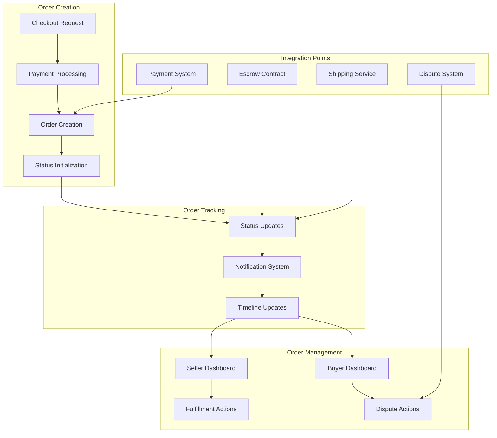

# Order Management System Documentation

## Overview

The enhanced order management system provides comprehensive order creation, tracking, and status management across all payment methods. It integrates with payment processing, escrow contracts, and provides real-time order tracking for both buyers and sellers.

## System Architecture



## Core Services

### OrderCreationService

Handles order creation from successful payments across all payment methods.

```typescript
interface OrderCreationService {
  createOrder(paymentResult: PaymentResult, checkoutData: CheckoutData): Promise<Order>;
  initializeOrderStatus(orderId: string, paymentMethod: PaymentMethod): Promise<void>;
  linkPaymentToOrder(orderId: string, paymentData: PaymentLinkData): Promise<void>;
  sendOrderConfirmation(orderId: string): Promise<void>;
}
```

#### Order Creation Flow

```typescript
const createOrder = async (paymentResult: PaymentResult, checkoutData: CheckoutData): Promise<Order> => {
  const transaction = await db.transaction();
  
  try {
    // 1. Create base order record
    const order = await transaction.orders.create({
      id: generateOrderId(),
      buyerId: checkoutData.buyerId,
      sellerId: checkoutData.sellerId,
      listingId: checkoutData.listingId,
      quantity: checkoutData.quantity,
      totalAmount: checkoutData.totalAmount,
      currency: checkoutData.currency,
      paymentMethod: paymentResult.paymentMethod,
      status: getInitialOrderStatus(paymentResult.paymentMethod),
      createdAt: new Date()
    });
    
    // 2. Link payment information
    await linkPaymentToOrder(order.id, paymentResult);
    
    // 3. Create order items
    await createOrderItems(order.id, checkoutData.items);
    
    // 4. Initialize status tracking
    await initializeOrderTracking(order.id, paymentResult.paymentMethod);
    
    // 5. Send notifications
    await sendOrderNotifications(order);
    
    await transaction.commit();
    return order;
  } catch (error) {
    await transaction.rollback();
    throw new OrderCreationError('Failed to create order', error);
  }
};
```

### OrderTrackingService

Manages order status updates and tracking throughout the order lifecycle.

```typescript
interface OrderTrackingService {
  updateOrderStatus(orderId: string, status: OrderStatus, metadata?: any): Promise<void>;
  getOrderHistory(orderId: string): Promise<OrderStatusHistory[]>;
  trackShipment(orderId: string, trackingNumber: string): Promise<ShipmentTracking>;
  getOrderTimeline(orderId: string): Promise<OrderTimeline>;
  notifyStatusChange(orderId: string, oldStatus: OrderStatus, newStatus: OrderStatus): Promise<void>;
}
```

#### Order Status Flow

```typescript
enum OrderStatus {
  // Initial statuses
  PAYMENT_PENDING = 'payment_pending',
  PAYMENT_CONFIRMED = 'payment_confirmed',
  ESCROW_LOCKED = 'escrow_locked',
  
  // Processing statuses
  ORDER_CONFIRMED = 'order_confirmed',
  PROCESSING = 'processing',
  READY_TO_SHIP = 'ready_to_ship',
  
  // Shipping statuses
  SHIPPED = 'shipped',
  IN_TRANSIT = 'in_transit',
  OUT_FOR_DELIVERY = 'out_for_delivery',
  
  // Completion statuses
  DELIVERED = 'delivered',
  COMPLETED = 'completed',
  
  // Problem statuses
  DISPUTED = 'disputed',
  CANCELLED = 'cancelled',
  REFUNDED = 'refunded',
  FAILED = 'failed'
}

const getOrderStatusFlow = (paymentMethod: PaymentMethod): OrderStatus[] => {
  const baseFlow = [
    OrderStatus.ORDER_CONFIRMED,
    OrderStatus.PROCESSING,
    OrderStatus.READY_TO_SHIP,
    OrderStatus.SHIPPED,
    OrderStatus.IN_TRANSIT,
    OrderStatus.DELIVERED,
    OrderStatus.COMPLETED
  ];
  
  switch (paymentMethod) {
    case 'crypto':
      return [OrderStatus.PAYMENT_CONFIRMED, ...baseFlow];
    case 'fiat':
      return [OrderStatus.PAYMENT_CONFIRMED, ...baseFlow];
    case 'escrow':
      return [OrderStatus.ESCROW_LOCKED, ...baseFlow];
    default:
      return baseFlow;
  }
};
```

### OrderDisplayService

Provides order information for buyer and seller dashboards.

```typescript
interface OrderDisplayService {
  getBuyerOrders(buyerId: string, filters?: OrderFilters): Promise<PaginatedOrders>;
  getSellerOrders(sellerId: string, filters?: OrderFilters): Promise<PaginatedOrders>;
  getOrderDetails(orderId: string, userId: string): Promise<OrderDetails>;
  searchOrders(query: OrderSearchQuery): Promise<OrderSearchResults>;
}
```

## Data Models

### Enhanced Order Schema

```sql
-- Enhanced orders table
CREATE TABLE orders (
  id UUID PRIMARY KEY DEFAULT gen_random_uuid(),
  order_number VARCHAR(20) UNIQUE NOT NULL, -- Human-readable order number
  buyer_id UUID REFERENCES users(id) NOT NULL,
  seller_id UUID REFERENCES users(id) NOT NULL,
  listing_id UUID REFERENCES products(id) NOT NULL,
  
  -- Order details
  quantity INTEGER NOT NULL DEFAULT 1,
  unit_price DECIMAL(18,8) NOT NULL,
  total_amount DECIMAL(18,8) NOT NULL,
  currency VARCHAR(10) NOT NULL,
  
  -- Payment information
  payment_method VARCHAR(20) NOT NULL,
  payment_status VARCHAR(20) DEFAULT 'pending',
  payment_intent_id VARCHAR(255),
  transaction_hash VARCHAR(66),
  escrow_id VARCHAR(255),
  processing_fees DECIMAL(10,2),
  gas_fees DECIMAL(18,8),
  
  -- Order status
  status VARCHAR(30) NOT NULL DEFAULT 'payment_pending',
  status_updated_at TIMESTAMP DEFAULT NOW(),
  
  -- Shipping information
  shipping_address TEXT, -- JSON object
  shipping_method VARCHAR(50),
  tracking_number VARCHAR(100),
  estimated_delivery DATE,
  actual_delivery_date TIMESTAMP,
  
  -- Additional information
  order_notes TEXT,
  special_instructions TEXT,
  metadata TEXT, -- JSON object for extensibility
  
  -- Timestamps
  created_at TIMESTAMP DEFAULT NOW(),
  updated_at TIMESTAMP DEFAULT NOW(),
  completed_at TIMESTAMP,
  cancelled_at TIMESTAMP,
  
  -- Indexes
  INDEX idx_buyer_status (buyer_id, status),
  INDEX idx_seller_status (seller_id, status),
  INDEX idx_payment_method (payment_method, status),
  INDEX idx_created_at (created_at),
  INDEX idx_order_number (order_number)
);
```

### Order Items Table

```sql
CREATE TABLE order_items (
  id UUID PRIMARY KEY DEFAULT gen_random_uuid(),
  order_id UUID REFERENCES orders(id) NOT NULL,
  listing_id UUID REFERENCES products(id) NOT NULL,
  
  -- Item details
  product_name VARCHAR(255) NOT NULL,
  product_description TEXT,
  quantity INTEGER NOT NULL DEFAULT 1,
  unit_price DECIMAL(18,8) NOT NULL,
  total_price DECIMAL(18,8) NOT NULL,
  
  -- Product snapshot (in case listing changes)
  product_snapshot TEXT, -- JSON object
  
  created_at TIMESTAMP DEFAULT NOW(),
  
  INDEX idx_order_items (order_id)
);
```

### Order Status History

```sql
CREATE TABLE order_status_history (
  id UUID PRIMARY KEY DEFAULT gen_random_uuid(),
  order_id UUID REFERENCES orders(id) NOT NULL,
  
  -- Status change details
  previous_status VARCHAR(30),
  new_status VARCHAR(30) NOT NULL,
  changed_by UUID REFERENCES users(id),
  change_reason VARCHAR(100),
  
  -- Additional context
  metadata TEXT, -- JSON object
  notes TEXT,
  
  created_at TIMESTAMP DEFAULT NOW(),
  
  INDEX idx_order_history (order_id, created_at),
  INDEX idx_status_changes (new_status, created_at)
);
```

### Order Tracking Events

```sql
CREATE TABLE order_tracking_events (
  id UUID PRIMARY KEY DEFAULT gen_random_uuid(),
  order_id UUID REFERENCES orders(id) NOT NULL,
  
  -- Event details
  event_type VARCHAR(50) NOT NULL, -- 'status_change', 'shipment_update', 'payment_update'
  event_data TEXT, -- JSON object
  event_source VARCHAR(50), -- 'system', 'seller', 'shipping_provider', 'payment_processor'
  
  -- Location and timing
  location VARCHAR(255),
  occurred_at TIMESTAMP NOT NULL,
  recorded_at TIMESTAMP DEFAULT NOW(),
  
  INDEX idx_order_events (order_id, occurred_at),
  INDEX idx_event_type (event_type, occurred_at)
);
```

## API Endpoints

### Order Creation

#### POST /api/orders

Create a new order from a successful payment.

**Request:**
```json
{
  "paymentResult": {
    "success": true,
    "paymentMethod": "escrow",
    "transactionHash": "0xabc123...",
    "escrowId": "escrow_456"
  },
  "checkoutData": {
    "buyerId": "buyer123",
    "sellerId": "seller456",
    "listingId": "listing789",
    "quantity": 2,
    "totalAmount": 200,
    "currency": "USDC",
    "shippingAddress": {
      "name": "John Doe",
      "street": "123 Main St",
      "city": "New York",
      "state": "NY",
      "zipCode": "10001",
      "country": "US"
    }
  }
}
```

**Response:**
```json
{
  "success": true,
  "order": {
    "id": "order_abc123",
    "orderNumber": "ORD-2024-001234",
    "status": "escrow_locked",
    "totalAmount": 200,
    "currency": "USDC",
    "estimatedDelivery": "2024-02-15",
    "trackingUrl": "/orders/order_abc123"
  }
}
```

### Order Tracking

#### GET /api/orders/:orderId

Get detailed order information.

**Response:**
```json
{
  "order": {
    "id": "order_abc123",
    "orderNumber": "ORD-2024-001234",
    "status": "shipped",
    "statusUpdatedAt": "2024-01-20T14:30:00Z",
    "buyer": {
      "id": "buyer123",
      "name": "John Doe",
      "email": "john@example.com"
    },
    "seller": {
      "id": "seller456",
      "name": "Alice Store",
      "storeName": "Alice's Electronics"
    },
    "items": [
      {
        "id": "item1",
        "productName": "Wireless Headphones",
        "quantity": 2,
        "unitPrice": 100,
        "totalPrice": 200
      }
    ],
    "payment": {
      "method": "escrow",
      "status": "locked",
      "transactionHash": "0xabc123...",
      "escrowId": "escrow_456"
    },
    "shipping": {
      "method": "standard",
      "trackingNumber": "1Z999AA1234567890",
      "estimatedDelivery": "2024-02-15",
      "address": {
        "name": "John Doe",
        "street": "123 Main St",
        "city": "New York",
        "state": "NY",
        "zipCode": "10001"
      }
    },
    "timeline": [
      {
        "status": "escrow_locked",
        "timestamp": "2024-01-15T10:00:00Z",
        "description": "Payment secured in escrow"
      },
      {
        "status": "order_confirmed",
        "timestamp": "2024-01-15T10:05:00Z",
        "description": "Order confirmed by seller"
      },
      {
        "status": "processing",
        "timestamp": "2024-01-16T09:00:00Z",
        "description": "Order is being prepared"
      },
      {
        "status": "shipped",
        "timestamp": "2024-01-18T15:30:00Z",
        "description": "Package shipped via UPS",
        "trackingNumber": "1Z999AA1234567890"
      }
    ]
  }
}
```

#### GET /api/orders/buyer/:buyerId

Get orders for a specific buyer.

**Query Parameters:**
- `status`: Filter by order status
- `page`: Page number for pagination
- `limit`: Number of orders per page
- `sortBy`: Sort field (createdAt, status, totalAmount)
- `sortOrder`: Sort direction (asc, desc)

**Response:**
```json
{
  "orders": [
    {
      "id": "order_abc123",
      "orderNumber": "ORD-2024-001234",
      "status": "shipped",
      "totalAmount": 200,
      "currency": "USDC",
      "seller": {
        "name": "Alice Store",
        "storeName": "Alice's Electronics"
      },
      "createdAt": "2024-01-15T10:00:00Z",
      "estimatedDelivery": "2024-02-15"
    }
  ],
  "pagination": {
    "page": 1,
    "limit": 20,
    "total": 45,
    "totalPages": 3
  }
}
```

#### GET /api/orders/seller/:sellerId

Get orders for a specific seller.

**Response:** Similar to buyer orders but with buyer information instead of seller.

### Order Status Updates

#### PUT /api/orders/:orderId/status

Update order status (seller or system only).

**Request:**
```json
{
  "status": "shipped",
  "trackingNumber": "1Z999AA1234567890",
  "notes": "Package shipped via UPS",
  "estimatedDelivery": "2024-02-15"
}
```

**Response:**
```json
{
  "success": true,
  "order": {
    "id": "order_abc123",
    "status": "shipped",
    "statusUpdatedAt": "2024-01-18T15:30:00Z",
    "trackingNumber": "1Z999AA1234567890"
  }
}
```

#### GET /api/orders/:orderId/timeline

Get order status timeline.

**Response:**
```json
{
  "timeline": [
    {
      "id": "event1",
      "status": "escrow_locked",
      "timestamp": "2024-01-15T10:00:00Z",
      "description": "Payment secured in escrow",
      "source": "system",
      "metadata": {
        "transactionHash": "0xabc123...",
        "escrowId": "escrow_456"
      }
    },
    {
      "id": "event2",
      "status": "shipped",
      "timestamp": "2024-01-18T15:30:00Z",
      "description": "Package shipped via UPS",
      "source": "seller",
      "metadata": {
        "trackingNumber": "1Z999AA1234567890",
        "carrier": "UPS"
      }
    }
  ]
}
```

## Order Status Management

### Status Transition Rules

```typescript
const statusTransitions: Record<OrderStatus, OrderStatus[]> = {
  [OrderStatus.PAYMENT_PENDING]: [
    OrderStatus.PAYMENT_CONFIRMED,
    OrderStatus.ESCROW_LOCKED,
    OrderStatus.CANCELLED,
    OrderStatus.FAILED
  ],
  [OrderStatus.PAYMENT_CONFIRMED]: [
    OrderStatus.ORDER_CONFIRMED,
    OrderStatus.CANCELLED,
    OrderStatus.REFUNDED
  ],
  [OrderStatus.ESCROW_LOCKED]: [
    OrderStatus.ORDER_CONFIRMED,
    OrderStatus.DISPUTED,
    OrderStatus.CANCELLED
  ],
  [OrderStatus.ORDER_CONFIRMED]: [
    OrderStatus.PROCESSING,
    OrderStatus.CANCELLED
  ],
  [OrderStatus.PROCESSING]: [
    OrderStatus.READY_TO_SHIP,
    OrderStatus.CANCELLED
  ],
  [OrderStatus.READY_TO_SHIP]: [
    OrderStatus.SHIPPED,
    OrderStatus.CANCELLED
  ],
  [OrderStatus.SHIPPED]: [
    OrderStatus.IN_TRANSIT,
    OrderStatus.DELIVERED
  ],
  [OrderStatus.IN_TRANSIT]: [
    OrderStatus.OUT_FOR_DELIVERY,
    OrderStatus.DELIVERED
  ],
  [OrderStatus.OUT_FOR_DELIVERY]: [
    OrderStatus.DELIVERED
  ],
  [OrderStatus.DELIVERED]: [
    OrderStatus.COMPLETED,
    OrderStatus.DISPUTED
  ],
  [OrderStatus.COMPLETED]: [], // Final status
  [OrderStatus.DISPUTED]: [
    OrderStatus.COMPLETED,
    OrderStatus.REFUNDED,
    OrderStatus.CANCELLED
  ],
  [OrderStatus.CANCELLED]: [], // Final status
  [OrderStatus.REFUNDED]: [], // Final status
  [OrderStatus.FAILED]: [] // Final status
};
```

### Automated Status Updates

```typescript
// Blockchain event listeners for escrow orders
const handleEscrowEvent = async (event: EscrowEvent) => {
  switch (event.type) {
    case 'EscrowCreated':
      await updateOrderStatus(event.orderId, OrderStatus.ESCROW_LOCKED, {
        escrowId: event.escrowId,
        transactionHash: event.transactionHash
      });
      break;
      
    case 'EscrowReleased':
      await updateOrderStatus(event.orderId, OrderStatus.COMPLETED, {
        releaseTransactionHash: event.transactionHash
      });
      break;
      
    case 'DisputeCreated':
      await updateOrderStatus(event.orderId, OrderStatus.DISPUTED, {
        disputeId: event.disputeId
      });
      break;
  }
};

// Shipping provider webhooks
const handleShippingUpdate = async (update: ShippingUpdate) => {
  const statusMapping = {
    'picked_up': OrderStatus.SHIPPED,
    'in_transit': OrderStatus.IN_TRANSIT,
    'out_for_delivery': OrderStatus.OUT_FOR_DELIVERY,
    'delivered': OrderStatus.DELIVERED
  };
  
  const newStatus = statusMapping[update.status];
  if (newStatus) {
    await updateOrderStatus(update.orderId, newStatus, {
      trackingNumber: update.trackingNumber,
      location: update.location,
      estimatedDelivery: update.estimatedDelivery
    });
  }
};
```

## Integration Points

### Payment System Integration

```typescript
// Link payment results to orders
const linkPaymentToOrder = async (orderId: string, paymentResult: PaymentResult) => {
  const updateData: any = {
    paymentStatus: 'confirmed',
    paymentMethod: paymentResult.paymentMethod
  };
  
  switch (paymentResult.paymentMethod) {
    case 'crypto':
      updateData.transactionHash = paymentResult.transactionHash;
      updateData.gasUsed = paymentResult.gasUsed;
      break;
      
    case 'fiat':
      updateData.paymentIntentId = paymentResult.paymentIntentId;
      updateData.processingFees = paymentResult.processingFee;
      break;
      
    case 'escrow':
      updateData.transactionHash = paymentResult.transactionHash;
      updateData.escrowId = paymentResult.escrowId;
      updateData.gasUsed = paymentResult.gasUsed;
      break;
  }
  
  await db.orders.update(orderId, updateData);
};
```

### Notification System Integration

```typescript
// Send order notifications
const sendOrderNotifications = async (order: Order) => {
  // Notify buyer
  await notificationService.send({
    userId: order.buyerId,
    type: 'order_created',
    title: 'Order Confirmed',
    message: `Your order ${order.orderNumber} has been confirmed`,
    data: { orderId: order.id }
  });
  
  // Notify seller
  await notificationService.send({
    userId: order.sellerId,
    type: 'new_order',
    title: 'New Order Received',
    message: `You have a new order ${order.orderNumber}`,
    data: { orderId: order.id }
  });
  
  // Send email confirmations
  await emailService.sendOrderConfirmation(order);
};
```

## Error Handling

### Order Creation Errors

```typescript
enum OrderCreationError {
  PAYMENT_NOT_CONFIRMED = 'PAYMENT_NOT_CONFIRMED',
  LISTING_UNAVAILABLE = 'LISTING_UNAVAILABLE',
  INSUFFICIENT_INVENTORY = 'INSUFFICIENT_INVENTORY',
  INVALID_SHIPPING_ADDRESS = 'INVALID_SHIPPING_ADDRESS',
  DATABASE_ERROR = 'DATABASE_ERROR'
}

const handleOrderCreationError = (error: OrderCreationError, context: any) => {
  switch (error) {
    case OrderCreationError.PAYMENT_NOT_CONFIRMED:
      return {
        message: 'Payment not confirmed. Please try again.',
        canRetry: true,
        suggestedAction: 'Verify payment status and retry'
      };
      
    case OrderCreationError.LISTING_UNAVAILABLE:
      return {
        message: 'This item is no longer available.',
        canRetry: false,
        suggestedAction: 'Browse similar items'
      };
      
    default:
      return {
        message: 'Unable to create order. Please contact support.',
        canRetry: true,
        suggestedAction: 'Try again or contact support'
      };
  }
};
```

## Performance Optimizations

### Database Optimizations

1. **Indexing Strategy**
   - Composite indexes on frequently queried columns
   - Partial indexes for active orders
   - Full-text search indexes for order search

2. **Query Optimization**
   - Efficient joins for order details
   - Pagination with cursor-based navigation
   - Aggregation queries for order statistics

3. **Caching Strategy**
   - Redis caching for frequently accessed orders
   - Cache invalidation on status updates
   - Cached order counts and statistics

### Real-time Updates

```typescript
// WebSocket integration for real-time order updates
const broadcastOrderUpdate = async (orderId: string, update: OrderUpdate) => {
  const order = await getOrderDetails(orderId);
  
  // Notify buyer
  await websocketService.sendToUser(order.buyerId, {
    type: 'order_update',
    orderId,
    update
  });
  
  // Notify seller
  await websocketService.sendToUser(order.sellerId, {
    type: 'order_update',
    orderId,
    update
  });
};
```

## Monitoring and Analytics

### Key Metrics

1. **Order Metrics**
   - Order creation rate
   - Order completion rate
   - Average order value
   - Time to fulfillment

2. **Status Metrics**
   - Status transition times
   - Orders stuck in each status
   - Cancellation rates by status

3. **Payment Method Metrics**
   - Order distribution by payment method
   - Success rates by payment method
   - Average processing times

### Alerts and Monitoring

```typescript
// Order monitoring alerts
const orderMonitoringAlerts = {
  stuckOrders: {
    condition: 'Orders in processing status > 48 hours',
    action: 'Alert seller and support team'
  },
  highCancellationRate: {
    condition: 'Cancellation rate > 10% in last 24 hours',
    action: 'Investigate and alert management'
  },
  paymentFailures: {
    condition: 'Payment failure rate > 5% in last hour',
    action: 'Check payment system status'
  }
};
```