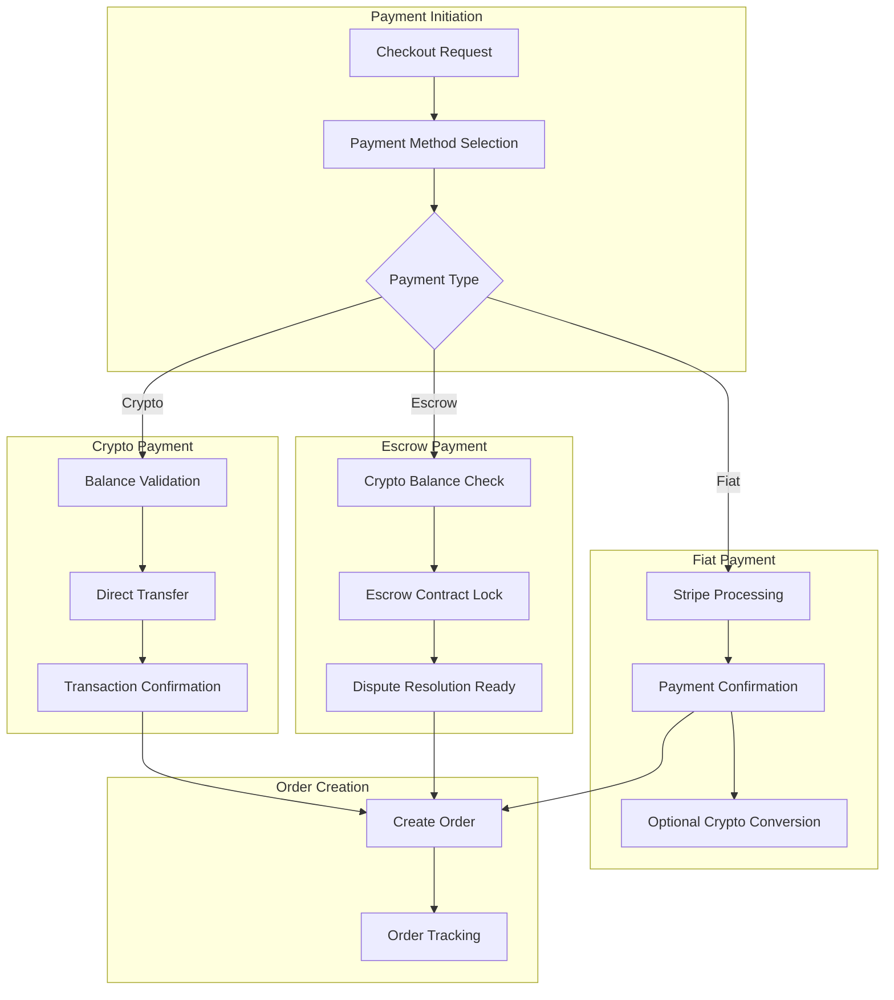

# Enhanced Payment Flow and Validation Documentation

## Overview

The enhanced payment system supports three payment methods with comprehensive validation and error handling: crypto payments, fiat payments, and escrow-protected payments. The system ensures proper balance validation, provides payment alternatives, and handles all error scenarios gracefully.

## Payment Methods Architecture



## Core Services

### PaymentValidationService

Validates payment methods and provides alternatives when validation fails.

```typescript
interface PaymentValidationService {
  validatePaymentMethod(request: PaymentValidationRequest): Promise<PaymentValidationResult>;
  checkCryptoBalance(address: string, amount: number, currency: string): Promise<BalanceCheckResult>;
  suggestPaymentAlternatives(originalMethod: PaymentMethod, amount: number): Promise<PaymentAlternative[]>;
  validateFiatPaymentMethod(paymentData: FiatPaymentData): Promise<FiatValidationResult>;
  validateEscrowRequirements(escrowData: EscrowPaymentData): Promise<EscrowValidationResult>;
}
```

#### Payment Validation Request

```typescript
interface PaymentValidationRequest {
  paymentMethod: 'crypto' | 'fiat' | 'escrow';
  amount: number;
  currency: string;
  userAddress: string;
  paymentDetails: CryptoPaymentDetails | FiatPaymentDetails | EscrowPaymentDetails;
  listingId: string;
  buyerId: string;
}

interface PaymentValidationResult {
  isValid: boolean;
  hasSufficientBalance: boolean;
  errors: ValidationError[];
  warnings: string[];
  suggestedAlternatives: PaymentAlternative[];
  estimatedGasFee?: number;
  processingFee?: number;
}
```

### Enhanced Order Processing Service

Handles the complete checkout flow with proper error handling and recovery.

```typescript
interface EnhancedOrderProcessingService {
  initiateCheckout(request: CheckoutRequest): Promise<CheckoutSession>;
  processPayment(sessionId: string, paymentData: PaymentData): Promise<PaymentResult>;
  handlePaymentFailure(sessionId: string, error: PaymentError): Promise<PaymentRecovery>;
  createOrder(paymentResult: PaymentResult): Promise<Order>;
  updateOrderStatus(orderId: string, status: OrderStatus, metadata?: any): Promise<void>;
}
```

## Payment Method Details

### 1. Crypto Payments

Direct wallet-to-wallet transfers with balance validation.

#### Validation Process

```typescript
const validateCryptoPayment = async (paymentData: CryptoPaymentDetails): Promise<CryptoValidationResult> => {
  // 1. Check wallet connection
  const isConnected = await checkWalletConnection(paymentData.walletAddress);
  if (!isConnected) {
    return { valid: false, error: 'WALLET_NOT_CONNECTED' };
  }
  
  // 2. Validate balance
  const balance = await getTokenBalance(paymentData.walletAddress, paymentData.currency);
  const requiredAmount = paymentData.amount + estimatedGasFee;
  
  if (balance < requiredAmount) {
    const alternatives = await suggestPaymentAlternatives('crypto', paymentData.amount);
    return {
      valid: false,
      error: 'INSUFFICIENT_BALANCE',
      currentBalance: balance,
      requiredAmount,
      alternatives
    };
  }
  
  // 3. Estimate gas fees
  const gasFee = await estimateGasFee(paymentData);
  
  return {
    valid: true,
    estimatedGasFee: gasFee,
    totalCost: paymentData.amount + gasFee
  };
};
```

#### Processing Flow

```typescript
const processCryptoPayment = async (paymentData: CryptoPaymentDetails): Promise<PaymentResult> => {
  try {
    // 1. Final balance check
    const validation = await validateCryptoPayment(paymentData);
    if (!validation.valid) {
      throw new PaymentError(validation.error, validation);
    }
    
    // 2. Execute transfer
    const txHash = await executeTransfer(paymentData);
    
    // 3. Wait for confirmation
    const receipt = await waitForConfirmation(txHash);
    
    return {
      success: true,
      transactionHash: txHash,
      blockNumber: receipt.blockNumber,
      gasUsed: receipt.gasUsed,
      paymentMethod: 'crypto'
    };
  } catch (error) {
    return handleCryptoPaymentError(error, paymentData);
  }
};
```

### 2. Fiat Payments

Traditional payment processing through Stripe with crypto conversion support.

#### Validation Process

```typescript
const validateFiatPayment = async (paymentData: FiatPaymentDetails): Promise<FiatValidationResult> => {
  // 1. Validate payment method
  const paymentMethod = await stripe.paymentMethods.retrieve(paymentData.paymentMethodId);
  if (!paymentMethod) {
    return { valid: false, error: 'INVALID_PAYMENT_METHOD' };
  }
  
  // 2. Check payment method status
  if (paymentMethod.status !== 'active') {
    return { valid: false, error: 'PAYMENT_METHOD_INACTIVE' };
  }
  
  // 3. Validate amount limits
  if (paymentData.amount < MIN_FIAT_AMOUNT || paymentData.amount > MAX_FIAT_AMOUNT) {
    return { valid: false, error: 'AMOUNT_OUT_OF_RANGE' };
  }
  
  return {
    valid: true,
    processingFee: calculateProcessingFee(paymentData.amount),
    estimatedTotal: paymentData.amount + calculateProcessingFee(paymentData.amount)
  };
};
```

#### Processing Flow

```typescript
const processFiatPayment = async (paymentData: FiatPaymentDetails): Promise<PaymentResult> => {
  try {
    // 1. Create payment intent
    const paymentIntent = await stripe.paymentIntents.create({
      amount: Math.round(paymentData.amount * 100), // Convert to cents
      currency: paymentData.currency.toLowerCase(),
      payment_method: paymentData.paymentMethodId,
      confirmation_method: 'manual',
      confirm: true,
      metadata: {
        orderId: paymentData.orderId,
        buyerId: paymentData.buyerId,
        listingId: paymentData.listingId
      }
    });
    
    // 2. Handle payment status
    if (paymentIntent.status === 'succeeded') {
      return {
        success: true,
        paymentIntentId: paymentIntent.id,
        paymentMethod: 'fiat',
        processingFee: calculateProcessingFee(paymentData.amount)
      };
    } else if (paymentIntent.status === 'requires_action') {
      return {
        success: false,
        requiresAction: true,
        clientSecret: paymentIntent.client_secret,
        nextAction: paymentIntent.next_action
      };
    } else {
      throw new PaymentError('PAYMENT_FAILED', { status: paymentIntent.status });
    }
  } catch (error) {
    return handleFiatPaymentError(error, paymentData);
  }
};
```

### 3. Escrow Payments

Smart contract-based escrow with buyer protection and dispute resolution.

#### Validation Process

```typescript
const validateEscrowPayment = async (paymentData: EscrowPaymentDetails): Promise<EscrowValidationResult> => {
  // 1. Check crypto balance (escrow requires crypto)
  const balance = await getTokenBalance(paymentData.walletAddress, paymentData.currency);
  const escrowAmount = paymentData.amount;
  const gasFee = await estimateEscrowGasFee(paymentData);
  const totalRequired = escrowAmount + gasFee;
  
  if (balance < totalRequired) {
    const alternatives = await suggestPaymentAlternatives('escrow', paymentData.amount);
    return {
      valid: false,
      error: 'INSUFFICIENT_BALANCE_FOR_ESCROW',
      currentBalance: balance,
      requiredAmount: totalRequired,
      alternatives
    };
  }
  
  // 2. Check escrow contract status
  const contractStatus = await checkEscrowContractStatus();
  if (!contractStatus.active) {
    return {
      valid: false,
      error: 'ESCROW_CONTRACT_UNAVAILABLE',
      alternatives: [{ method: 'fiat', description: 'Pay with credit card instead' }]
    };
  }
  
  return {
    valid: true,
    escrowFee: calculateEscrowFee(paymentData.amount),
    estimatedGasFee: gasFee,
    totalCost: escrowAmount + gasFee
  };
};
```

#### Processing Flow

```typescript
const processEscrowPayment = async (paymentData: EscrowPaymentDetails): Promise<PaymentResult> => {
  try {
    // 1. Final validation
    const validation = await validateEscrowPayment(paymentData);
    if (!validation.valid) {
      throw new PaymentError(validation.error, validation);
    }
    
    // 2. Create escrow transaction
    const escrowTx = await escrowContract.createEscrow({
      buyer: paymentData.walletAddress,
      seller: paymentData.sellerAddress,
      amount: paymentData.amount,
      currency: paymentData.currency,
      listingId: paymentData.listingId,
      disputeTimeout: DISPUTE_TIMEOUT_DAYS
    });
    
    // 3. Wait for confirmation
    const receipt = await waitForConfirmation(escrowTx.hash);
    
    // 4. Extract escrow ID from logs
    const escrowId = extractEscrowIdFromLogs(receipt.logs);
    
    return {
      success: true,
      transactionHash: escrowTx.hash,
      escrowId,
      paymentMethod: 'escrow',
      disputeDeadline: new Date(Date.now() + DISPUTE_TIMEOUT_DAYS * 24 * 60 * 60 * 1000)
    };
  } catch (error) {
    return handleEscrowPaymentError(error, paymentData);
  }
};
```

## API Endpoints

### POST /api/payments/validate

Validate a payment method before processing.

**Request:**
```json
{
  "paymentMethod": "crypto",
  "amount": 100,
  "currency": "USDC",
  "userAddress": "0x742d35Cc6634C0532925a3b8D4C9db96590b5b8c",
  "paymentDetails": {
    "walletAddress": "0x742d35Cc6634C0532925a3b8D4C9db96590b5b8c",
    "currency": "USDC",
    "amount": 100
  },
  "listingId": "listing123",
  "buyerId": "buyer456"
}
```

**Response:**
```json
{
  "isValid": false,
  "hasSufficientBalance": false,
  "errors": [
    {
      "code": "INSUFFICIENT_BALANCE",
      "message": "Insufficient USDC balance. Required: 105 USDC, Available: 50 USDC"
    }
  ],
  "suggestedAlternatives": [
    {
      "method": "fiat",
      "description": "Pay with credit card - no crypto required",
      "available": true,
      "estimatedTotal": 103.50,
      "currency": "USD"
    },
    {
      "method": "crypto",
      "description": "Pay with ETH instead of USDC",
      "available": true,
      "estimatedTotal": 0.045,
      "currency": "ETH"
    }
  ]
}
```

### POST /api/payments/process

Process a payment after validation.

**Request:**
```json
{
  "sessionId": "session_abc123",
  "paymentData": {
    "paymentMethod": "fiat",
    "paymentMethodId": "pm_1234567890",
    "amount": 100,
    "currency": "USD"
  }
}
```

**Response:**
```json
{
  "success": true,
  "paymentResult": {
    "paymentIntentId": "pi_1234567890",
    "paymentMethod": "fiat",
    "processingFee": 3.50,
    "orderId": "order_abc123"
  },
  "order": {
    "id": "order_abc123",
    "status": "payment_confirmed",
    "trackingUrl": "/orders/order_abc123"
  }
}
```

### GET /api/payments/alternatives

Get payment alternatives for a specific amount and context.

**Query Parameters:**
- `amount`: Payment amount
- `currency`: Preferred currency
- `userAddress`: User's wallet address
- `failedMethod`: Previously failed payment method

**Response:**
```json
{
  "alternatives": [
    {
      "method": "fiat",
      "title": "Credit Card Payment",
      "description": "Pay with credit card - no crypto wallet required",
      "available": true,
      "estimatedTotal": 103.50,
      "currency": "USD",
      "processingTime": "Instant",
      "fees": {
        "processing": 3.50,
        "total": 103.50
      }
    },
    {
      "method": "crypto",
      "title": "Pay with ETH",
      "description": "Use ETH instead of USDC",
      "available": true,
      "estimatedTotal": 0.045,
      "currency": "ETH",
      "processingTime": "2-5 minutes",
      "fees": {
        "gas": 0.002,
        "total": 0.047
      }
    }
  ]
}
```

## Error Handling

### Payment Error Types

```typescript
enum PaymentErrorType {
  // Crypto Errors
  INSUFFICIENT_BALANCE = 'INSUFFICIENT_BALANCE',
  WALLET_NOT_CONNECTED = 'WALLET_NOT_CONNECTED',
  TRANSACTION_FAILED = 'TRANSACTION_FAILED',
  GAS_ESTIMATION_FAILED = 'GAS_ESTIMATION_FAILED',
  
  // Fiat Errors
  PAYMENT_METHOD_DECLINED = 'PAYMENT_METHOD_DECLINED',
  INSUFFICIENT_FUNDS = 'INSUFFICIENT_FUNDS',
  PAYMENT_METHOD_EXPIRED = 'PAYMENT_METHOD_EXPIRED',
  FRAUD_DETECTED = 'FRAUD_DETECTED',
  
  // Escrow Errors
  ESCROW_CONTRACT_UNAVAILABLE = 'ESCROW_CONTRACT_UNAVAILABLE',
  INSUFFICIENT_BALANCE_FOR_ESCROW = 'INSUFFICIENT_BALANCE_FOR_ESCROW',
  ESCROW_CREATION_FAILED = 'ESCROW_CREATION_FAILED',
  
  // General Errors
  PAYMENT_PROCESSING_FAILED = 'PAYMENT_PROCESSING_FAILED',
  INVALID_PAYMENT_METHOD = 'INVALID_PAYMENT_METHOD',
  AMOUNT_OUT_OF_RANGE = 'AMOUNT_OUT_OF_RANGE',
  NETWORK_ERROR = 'NETWORK_ERROR'
}
```

### Error Recovery Strategies

```typescript
interface PaymentErrorRecovery {
  canRetry: boolean;
  suggestedActions: string[];
  alternativePaymentMethods: PaymentAlternative[];
  estimatedResolutionTime?: number;
  supportContactInfo?: string;
}

const getErrorRecovery = (error: PaymentErrorType, context: PaymentContext): PaymentErrorRecovery => {
  switch (error) {
    case PaymentErrorType.INSUFFICIENT_BALANCE:
      return {
        canRetry: false,
        suggestedActions: [
          'Add funds to your wallet',
          'Try a different payment method',
          'Use a smaller amount'
        ],
        alternativePaymentMethods: [
          { method: 'fiat', description: 'Pay with credit card' },
          { method: 'crypto', description: 'Use different cryptocurrency' }
        ]
      };
      
    case PaymentErrorType.PAYMENT_METHOD_DECLINED:
      return {
        canRetry: true,
        suggestedActions: [
          'Try a different card',
          'Contact your bank',
          'Use crypto payment instead'
        ],
        alternativePaymentMethods: [
          { method: 'crypto', description: 'Pay with cryptocurrency' }
        ]
      };
      
    case PaymentErrorType.ESCROW_CONTRACT_UNAVAILABLE:
      return {
        canRetry: false,
        suggestedActions: [
          'Use direct crypto payment',
          'Use fiat payment',
          'Try again later'
        ],
        alternativePaymentMethods: [
          { method: 'crypto', description: 'Direct crypto payment' },
          { method: 'fiat', description: 'Credit card payment' }
        ],
        estimatedResolutionTime: 30 // minutes
      };
      
    default:
      return {
        canRetry: true,
        suggestedActions: ['Try again', 'Contact support if problem persists'],
        alternativePaymentMethods: []
      };
  }
};
```

## Database Schema

### Orders Table Extensions

```sql
-- Enhanced order tracking
ALTER TABLE orders ADD COLUMN checkout_session_id VARCHAR(255);
ALTER TABLE orders ADD COLUMN payment_method VARCHAR(20);
ALTER TABLE orders ADD COLUMN payment_intent_id VARCHAR(255);
ALTER TABLE orders ADD COLUMN transaction_hash VARCHAR(66);
ALTER TABLE orders ADD COLUMN escrow_id VARCHAR(255);
ALTER TABLE orders ADD COLUMN payment_status VARCHAR(20) DEFAULT 'pending';
ALTER TABLE orders ADD COLUMN processing_fees DECIMAL(10,2);
ALTER TABLE orders ADD COLUMN gas_fees DECIMAL(18,8);
ALTER TABLE orders ADD COLUMN exchange_rate DECIMAL(18,8);
ALTER TABLE orders ADD COLUMN payment_currency VARCHAR(10);
ALTER TABLE orders ADD COLUMN payment_amount DECIMAL(18,8);
```

### Payment Attempts Table

```sql
CREATE TABLE payment_attempts (
  id UUID PRIMARY KEY DEFAULT gen_random_uuid(),
  order_id UUID REFERENCES orders(id),
  payment_method VARCHAR(20),
  amount DECIMAL(18,8),
  currency VARCHAR(10),
  status VARCHAR(20),
  error_code VARCHAR(50),
  error_message TEXT,
  transaction_hash VARCHAR(66),
  payment_intent_id VARCHAR(255),
  gas_used INTEGER,
  processing_fee DECIMAL(10,2),
  attempted_at TIMESTAMP DEFAULT NOW(),
  completed_at TIMESTAMP,
  
  INDEX idx_order_payment (order_id, payment_method),
  INDEX idx_status_attempted (status, attempted_at)
);
```

## Configuration

### Environment Variables

```bash
# Payment Configuration
STRIPE_SECRET_KEY=sk_test_...
STRIPE_PUBLISHABLE_KEY=pk_test_...
STRIPE_WEBHOOK_SECRET=whsec_...

# Crypto Configuration
WEB3_PROVIDER_URL=https://mainnet.infura.io/v3/YOUR_PROJECT_ID
ESCROW_CONTRACT_ADDRESS=0x...
PAYMENT_ROUTER_ADDRESS=0x...

# Payment Limits
MIN_CRYPTO_AMOUNT=1
MAX_CRYPTO_AMOUNT=100000
MIN_FIAT_AMOUNT=5
MAX_FIAT_AMOUNT=10000

# Fees
ESCROW_FEE_PERCENTAGE=2.5
FIAT_PROCESSING_FEE_PERCENTAGE=2.9
FIAT_PROCESSING_FEE_FIXED=0.30

# Timeouts
PAYMENT_TIMEOUT_SECONDS=300
ESCROW_DISPUTE_TIMEOUT_DAYS=7
TRANSACTION_CONFIRMATION_BLOCKS=3
```

## Best Practices

### 1. Validation First
- Always validate before processing
- Provide clear error messages
- Suggest alternatives for failed validations

### 2. Error Recovery
- Implement retry logic for transient failures
- Provide multiple payment alternatives
- Clear guidance for resolution

### 3. User Experience
- Real-time balance checking
- Progress indicators for long operations
- Clear fee disclosure

### 4. Security
- Validate all inputs
- Use secure payment processing
- Log all payment attempts for audit

### 5. Performance
- Cache balance checks appropriately
- Parallel processing where possible
- Optimize gas fee estimation