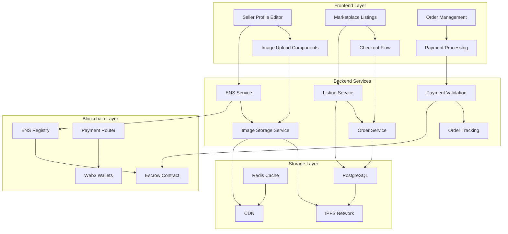

# Marketplace Enhancements Technical Documentation

## Overview

This documentation covers the comprehensive marketplace enhancements that address critical functionality gaps in seller profile management, image storage, listing visibility, and order processing. The enhancements provide a production-ready marketplace experience with robust error handling, payment validation, and order tracking.

## Documentation Structure

### Core System Documentation

1. **[ENS Integration API](./ENS_INTEGRATION_API.md)**
   - Optional ENS handle support for seller profiles
   - Validation, ownership verification, and error handling
   - API endpoints and usage examples

2. **[Image Storage Architecture](./IMAGE_STORAGE_ARCHITECTURE.md)**
   - IPFS-based decentralized image storage
   - CDN optimization for global delivery
   - Upload pipeline and processing workflow

3. **[Payment Flow and Validation](./PAYMENT_FLOW_VALIDATION.md)**
   - Multi-payment method support (crypto, fiat, escrow)
   - Comprehensive validation and error recovery
   - Balance checking and payment alternatives

4. **[Order Management System](./ORDER_MANAGEMENT_SYSTEM.md)**
   - Complete order lifecycle management
   - Status tracking and timeline updates
   - Integration with payment and shipping systems

## Key Features Implemented

### 1. Enhanced Seller Profile Management
- **Optional ENS Support**: Sellers can add ENS handles to their profiles without requirement
- **Complete Profile Editing**: All fields shown on public store pages are editable
- **Image Management**: Profile and cover image upload with optimization
- **Social Media Integration**: Twitter, Discord, and Telegram handle support
- **Real-time Synchronization**: Changes reflect immediately across all interfaces

### 2. Comprehensive Image Storage Solution
- **IPFS Storage**: Decentralized, content-addressed image storage
- **CDN Distribution**: Global edge caching for fast image delivery
- **Multi-format Support**: JPEG, PNG, WebP, GIF with automatic optimization
- **Thumbnail Generation**: Multiple sizes for different use cases
- **Metadata Tracking**: Complete image information and usage tracking

### 3. Listing Visibility and Database Integration
- **Immediate Visibility**: New listings appear in marketplace within 30 seconds
- **Database Integration**: All listing data properly stored and indexed
- **Search Optimization**: Full-text search with PostgreSQL vectors
- **Image Integration**: Multiple images per listing with gallery support
- **Status Management**: Draft, active, and published listing states

### 4. Functional Checkout and Order Management
- **Multi-Payment Support**: Crypto, fiat, and escrow payment methods
- **Balance Validation**: Real-time crypto balance checking before transactions
- **Payment Alternatives**: Automatic suggestion of alternative payment methods
- **Order Tracking**: Complete order lifecycle with status updates
- **Escrow Integration**: Smart contract-based buyer protection

## System Architecture

## Database Schema Changes

### New Tables Created

1. **image_storage** - Comprehensive image metadata and URL management
2. **ens_verifications** - ENS ownership verification tracking
3. **order_status_history** - Complete order status change tracking
4. **order_tracking_events** - Detailed order event logging
5. **payment_attempts** - Payment attempt tracking and error analysis

### Enhanced Existing Tables

1. **sellers** - Added ENS fields, image URLs, and social media handles
2. **products** - Added listing status, search vectors, and image arrays
3. **orders** - Added payment method tracking, shipping info, and metadata
4. **order_items** - Enhanced with product snapshots and detailed pricing

## API Endpoints Summary

### ENS Integration
- `GET /api/ens/validate/:ensName` - Validate ENS handle
- `POST /api/ens/verify` - Verify ENS ownership
- `GET /api/ens/suggestions/:baseName` - Get ENS alternatives

### Image Storage
- `POST /api/images/upload` - Upload and process images
- `GET /api/images/:ipfsHash` - Get image information and URLs
- `DELETE /api/images/:ipfsHash` - Delete image (soft delete)

### Payment Processing
- `POST /api/payments/validate` - Validate payment method
- `POST /api/payments/process` - Process payment
- `GET /api/payments/alternatives` - Get payment alternatives

### Order Management
- `POST /api/orders` - Create order from payment
- `GET /api/orders/:orderId` - Get order details
- `PUT /api/orders/:orderId/status` - Update order status
- `GET /api/orders/buyer/:buyerId` - Get buyer orders
- `GET /api/orders/seller/:sellerId` - Get seller orders

## Error Handling Strategy

### Graceful Degradation
- **ENS Optional**: System works without ENS when services unavailable
- **Image Fallbacks**: Default images when uploads fail
- **Payment Alternatives**: Multiple payment options when primary fails
- **Order Recovery**: Retry mechanisms for failed order creation

### Error Categories
1. **Validation Errors**: Clear messages with suggested corrections
2. **Network Errors**: Retry logic with exponential backoff
3. **Payment Errors**: Alternative payment method suggestions
4. **System Errors**: Graceful fallbacks with user-friendly messages

## Security Considerations

### Data Protection
- **Input Validation**: All user inputs validated and sanitized
- **File Security**: Image uploads scanned for malware
- **Access Control**: Proper permissions for all operations
- **Audit Logging**: Complete audit trail for all actions

### Payment Security
- **Balance Validation**: Real-time crypto balance checking
- **Escrow Verification**: Cryptographic proof of escrow transactions
- **Fiat Processing**: PCI-compliant payment processing
- **Fraud Detection**: Suspicious transaction pattern detection

## Performance Optimizations

### Caching Strategy
- **Redis Caching**: Frequently accessed data cached with appropriate TTL
- **CDN Caching**: Global image delivery with edge caching
- **Database Optimization**: Efficient indexes and query optimization
- **Connection Pooling**: Optimized database connection management

### Scalability Features
- **Horizontal Scaling**: Services designed for horizontal scaling
- **Load Balancing**: Request distribution across multiple instances
- **Queue Processing**: Background job processing for heavy operations
- **Database Sharding**: Prepared for database scaling when needed

## Monitoring and Observability

### Key Metrics Tracked
- **Upload Success Rates**: Image upload and processing success
- **Payment Success Rates**: Payment processing across all methods
- **Order Completion Rates**: Order fulfillment success rates
- **API Response Times**: Performance monitoring for all endpoints

### Alerting System
- **Error Rate Alerts**: High error rates trigger immediate alerts
- **Performance Alerts**: Slow response times monitored
- **System Health**: Overall system health monitoring
- **Business Metrics**: Order volume and revenue tracking

## Configuration Management

### Environment Variables
All services are configured through environment variables for different deployment environments:

- **Development**: Local development with test services
- **Staging**: Production-like environment for testing
- **Production**: Live environment with production services

### Feature Flags
- **ENS Integration**: Can be disabled if ENS services unavailable
- **Payment Methods**: Individual payment methods can be enabled/disabled
- **Image Processing**: Different processing levels based on environment
- **Order Features**: Gradual rollout of new order management features

## Testing Strategy

### Test Coverage
- **Unit Tests**: Individual service and function testing
- **Integration Tests**: End-to-end workflow testing
- **Performance Tests**: Load testing for high-traffic scenarios
- **Security Tests**: Vulnerability and penetration testing

### Test Environments
- **Local Testing**: Developer machine testing
- **CI/CD Testing**: Automated testing in build pipeline
- **Staging Testing**: Production-like environment testing
- **Production Monitoring**: Real-time production health monitoring

## Deployment Considerations

### Database Migrations
- **Schema Changes**: Carefully planned database migrations
- **Data Migration**: Safe migration of existing data
- **Rollback Plans**: Ability to rollback changes if needed
- **Zero Downtime**: Migrations designed for zero downtime deployment

### Service Dependencies
- **IPFS Services**: Reliable IPFS pinning service required
- **CDN Services**: Global CDN for image delivery
- **Payment Processors**: Stripe for fiat, Web3 for crypto
- **Blockchain Services**: Ethereum node access for ENS and escrow

## Support and Maintenance

### Operational Runbooks
- **Service Restart Procedures**: How to restart services safely
- **Database Maintenance**: Regular maintenance procedures
- **Backup and Recovery**: Data backup and recovery procedures
- **Incident Response**: How to handle system incidents

### Troubleshooting Guides
- **Common Issues**: Frequently encountered problems and solutions
- **Error Code Reference**: Complete error code documentation
- **Performance Issues**: How to diagnose and fix performance problems
- **Integration Issues**: Troubleshooting third-party service issues

## Future Enhancements

### Planned Features
- **Advanced Analytics**: Detailed marketplace analytics
- **Mobile Optimization**: Enhanced mobile experience
- **Multi-language Support**: Internationalization support
- **Advanced Search**: AI-powered search and recommendations

### Scalability Improvements
- **Microservices Architecture**: Breaking down into smaller services
- **Event-Driven Architecture**: Asynchronous event processing
- **Global Distribution**: Multi-region deployment
- **Advanced Caching**: More sophisticated caching strategies

## Getting Started

### For Developers
1. Review the individual service documentation
2. Set up local development environment
3. Run the test suite to verify setup
4. Start with the ENS integration for optional features

### For Operations
1. Review deployment and configuration documentation
2. Set up monitoring and alerting
3. Prepare database migration scripts
4. Plan rollout strategy for production deployment

### For Product Teams
1. Review feature capabilities and limitations
2. Understand error handling and user experience
3. Plan user communication for new features
4. Prepare support documentation for users

## Contact and Support

For technical questions or issues with this documentation:
- Review the specific service documentation for detailed information
- Check the troubleshooting guides for common issues
- Refer to the API documentation for integration details
- Contact the development team for additional support