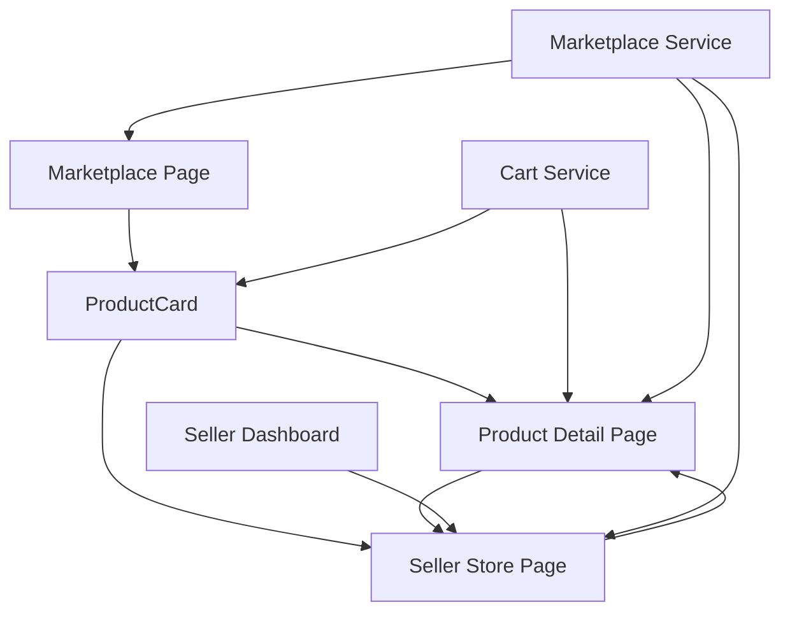

# Design Document

## Overview

This design addresses the critical interconnection issues in the marketplace by implementing a standardized navigation system, fixing broken component integrations, and creating missing page implementations. The solution focuses on establishing consistent URL patterns, connecting components properly, and ensuring data flows correctly throughout the marketplace.

## Architecture

### URL Routing Standardization

The current marketplace has inconsistent URL patterns that cause navigation failures. We'll implement a standardized routing system:

```
Current (Broken):
- /marketplace/listing/{listingId} (some components)
- /product/{id} (actual page route)
- /marketplace/seller/store/{sellerId} (SellerStorePage expects)
- /marketplace/seller/store/{walletAddress} (SellerDashboard navigates to)
- /seller/{sellerId} (some components use)

New (Standardized):
- /marketplace/listing/{id} (all product links)
- /marketplace/seller/store/{sellerId} (all seller links)
```

### Component Integration Architecture



## Components and Interfaces

### 1. Standardized ProductCard Component

**Current Issues:**
- ProductCard has optional callbacks that aren't provided
- SimpleProductCard is used instead of ProductCard in marketplace.tsx
- No direct navigation implementation

**Solution:**
```typescript
// Enhanced ProductCard with direct navigation
interface ProductCardProps {
  product: Product;
  showSellerLink?: boolean;
  className?: string;
}

const ProductCard: React.FC<ProductCardProps> = ({ product, showSellerLink = true }) => {
  const router = useRouter();
  const { addItem } = useCart();

  const handleProductClick = () => {
    router.push(`/marketplace/listing/${product.id}`);
  };

  const handleSellerClick = (e: React.MouseEvent) => {
    e.stopPropagation();
    router.push(`/marketplace/seller/store/${product.seller.id}`);
  };

  const handleAddToCart = (e: React.MouseEvent) => {
    e.stopPropagation();
    addItem(product);
  };

  // Component implementation with working navigation
};
```

### 2. Product Detail Page Implementation

**Current Issues:**
- Uses hardcoded mock data
- Route mismatch between /product/{id} and expected /marketplace/listing/{id}
- No integration with marketplace service

**Solution:**
```typescript
// pages/marketplace/listing/[id].tsx
const ProductDetailPage: NextPage = () => {
  const router = useRouter();
  const { id } = router.query;
  const [product, setProduct] = useState<ProductDetail | null>(null);
  const [loading, setLoading] = useState(true);
  const [error, setError] = useState<string | null>(null);

  useEffect(() => {
    if (id) {
      fetchProductDetails(id as string);
    }
  }, [id]);

  const fetchProductDetails = async (productId: string) => {
    try {
      setLoading(true);
      const productData = await marketplaceService.getListingById(productId);
      setProduct(productData);
    } catch (err) {
      setError('Failed to load product details');
    } finally {
      setLoading(false);
    }
  };

  // Component implementation with real data
};
```

### 3. Seller Store Page Implementation

**Current Issues:**
- Missing Next.js page route
- SellerStorePage expects sellerId but dashboard passes walletAddress
- No proper data fetching

**Solution:**
```typescript
// pages/marketplace/seller/store/[sellerId].tsx
const SellerStorePageRoute: NextPage = () => {
  const router = useRouter();
  const { sellerId } = router.query;

  return (
    <SellerStorePage 
      sellerId={sellerId as string}
      onProductClick={(productId) => router.push(`/marketplace/listing/${productId}`)}
    />
  );
};

// Enhanced SellerStorePage component
interface SellerStorePageProps {
  sellerId: string;
  onProductClick?: (productId: string) => void;
}

const SellerStorePage: React.FC<SellerStorePageProps> = ({ sellerId, onProductClick }) => {
  const [seller, setSeller] = useState<Seller | null>(null);
  const [listings, setListings] = useState<Product[]>([]);
  
  // Implementation with proper data fetching and navigation
};
```

### 4. Marketplace Browse Page Enhancement

**Current Issues:**
- Uses SimpleProductCard instead of ProductCard
- No navigation from product cards
- Missing cart integration

**Solution:**
```typescript
// marketplace.tsx enhancement
const MarketplacePage: NextPage = () => {
  const [products, setProducts] = useState<Product[]>([]);
  const [filters, setFilters] = useState<MarketplaceFilters>({});

  return (
    <div className="marketplace-container">
      <MarketplaceHeader cartItemCount={cartItems.length} />
      <FilterPanel filters={filters} onFiltersChange={setFilters} />
      <div className="products-grid">
        {products.map(product => (
          <ProductCard 
            key={product.id} 
            product={product}
            // Navigation handled internally by ProductCard
          />
        ))}
      </div>
    </div>
  );
};
```

## Data Models

### Standardized Product Interface
```typescript
interface Product {
  id: string;
  title: string;
  description: string;
  price: {
    amount: number;
    currency: string;
    cryptoPrice?: {
      amount: number;
      currency: string;
    };
  };
  images: string[];
  seller: {
    id: string;
    name: string;
    walletAddress: string;
    reputation: number;
  };
  category: string;
  status: 'active' | 'sold' | 'inactive';
  createdAt: string;
}
```

### Seller Interface
```typescript
interface Seller {
  id: string;
  name: string;
  walletAddress: string;
  ensName?: string;
  description?: string;
  coverImage?: string;
  reputation: number;
  totalSales: number;
  joinedDate: string;
  isVerified: boolean;
}
```

## Error Handling

### Navigation Error Recovery
```typescript
const NavigationErrorBoundary: React.FC = ({ children }) => {
  return (
    <ErrorBoundary
      fallback={({ error, resetError }) => (
        <div className="navigation-error">
          <h2>Navigation Error</h2>
          <p>Something went wrong while navigating.</p>
          <button onClick={resetError}>Try Again</button>
          <button onClick={() => router.push('/marketplace')}>
            Return to Marketplace
          </button>
        </div>
      )}
    >
      {children}
    </ErrorBoundary>
  );
};
```

### API Error Handling
```typescript
const withErrorHandling = async <T>(
  apiCall: () => Promise<T>,
  fallback?: T
): Promise<T> => {
  try {
    return await apiCall();
  } catch (error) {
    console.error('API Error:', error);
    if (fallback !== undefined) {
      return fallback;
    }
    throw error;
  }
};
```

## Testing Strategy

### Navigation Testing
- Test all URL patterns resolve to correct pages
- Verify ProductCard navigation works in all contexts
- Test breadcrumb navigation functionality
- Validate error page redirects

### Integration Testing
- Test marketplace browse → product detail flow
- Test product detail → seller store flow
- Test seller dashboard → seller store flow
- Test cart integration across all components

### Performance Testing
- Measure page load times for navigation
- Test navigation under high load
- Verify proper caching behavior
- Test mobile navigation performance

## Implementation Phases

### Phase 1: URL Standardization (Priority: Critical)
1. Create missing page routes
2. Update all navigation calls to use standard URLs
3. Implement URL redirects for legacy patterns
4. Update routing configuration

### Phase 2: Component Integration (Priority: Critical)
1. Fix ProductCard navigation
2. Replace SimpleProductCard usage
3. Connect cart service to ProductCard
4. Implement proper error boundaries

### Phase 3: Data Integration (Priority: High)
1. Replace mock data with real API calls
2. Implement proper loading states
3. Add error handling and retry logic
4. Optimize data fetching performance

### Phase 4: Enhancement Features (Priority: Medium)
1. Add breadcrumb navigation
2. Implement advanced filtering
3. Add performance optimizations
4. Enhance mobile navigation

## Security Considerations

- Validate all route parameters to prevent injection attacks
- Implement proper authentication checks for seller pages
- Sanitize user input in search and filter components
- Use HTTPS for all navigation and API calls
- Implement rate limiting for API endpoints

## Performance Optimizations

- Implement route-based code splitting
- Use Next.js Image optimization for product images
- Cache frequently accessed product and seller data
- Implement virtual scrolling for large product lists
- Optimize bundle size by removing unused components