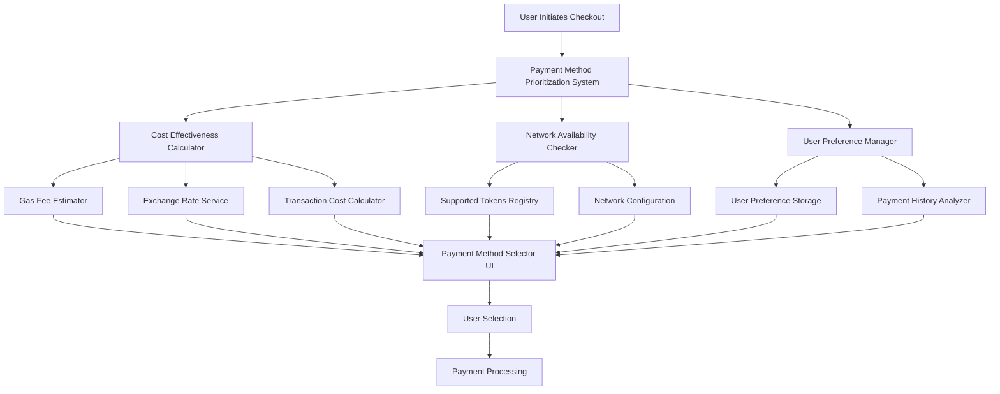
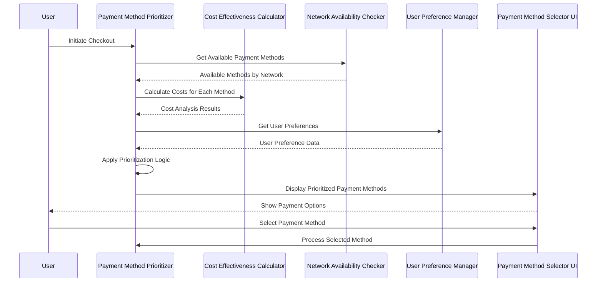

# Design Document

## Overview

The Payment Method Prioritization system implements intelligent payment method ordering based on cost-effectiveness, user preferences, and network availability. The system dynamically adjusts payment method presentation to prioritize stablecoins (USDC) first, fiat payment second, and ETH as a fallback option, while considering real-time gas fees and transaction costs.

## Architecture

### High-Level Architecture



### System Flow



## Components and Interfaces

### Core Components

#### 1. Payment Method Prioritization System

```typescript
interface PaymentMethodPrioritizationSystem {
  prioritizePaymentMethods(
    availableMethods: PaymentMethod[],
    userContext: UserContext,
    transactionAmount: number
  ): Promise<PrioritizedPaymentMethod[]>;
  
  updatePrioritization(
    currentMethods: PrioritizedPaymentMethod[],
    marketConditions: MarketConditions
  ): Promise<PrioritizedPaymentMethod[]>;
  
  getDefaultPaymentMethod(
    prioritizedMethods: PrioritizedPaymentMethod[]
  ): PaymentMethod | null;
}

interface PrioritizedPaymentMethod {
  method: PaymentMethod;
  priority: number;
  costEstimate: CostEstimate;
  availabilityStatus: AvailabilityStatus;
  userPreferenceScore: number;
  recommendationReason: string;
}
```

#### 2. Cost Effectiveness Calculator

```typescript
interface CostEffectivenessCalculator {
  calculateTransactionCost(
    paymentMethod: PaymentMethod,
    amount: number,
    networkConditions: NetworkConditions
  ): Promise<CostEstimate>;
  
  comparePaymentMethods(
    methods: PaymentMethod[],
    amount: number
  ): Promise<CostComparison[]>;
  
  isGasFeeAcceptable(
    gasEstimate: GasEstimate,
    threshold: GasFeeThreshold
  ): boolean;
}

interface CostEstimate {
  totalCost: number;
  baseCost: number;
  gasFee: number;
  exchangeRate?: number;
  estimatedTime: number;
  confidence: number; // 0-1 scale
}
```

#### 3. Network Availability Checker

```typescript
interface NetworkAvailabilityChecker {
  getAvailablePaymentMethods(chainId: number): Promise<PaymentMethod[]>;
  
  isPaymentMethodSupported(
    method: PaymentMethod,
    chainId: number
  ): boolean;
  
  getSupportedNetworks(method: PaymentMethod): number[];
  
  validateNetworkCompatibility(
    methods: PaymentMethod[],
    chainId: number
  ): Promise<NetworkCompatibilityResult[]>;
}

interface NetworkCompatibilityResult {
  method: PaymentMethod;
  isSupported: boolean;
  alternativeNetworks?: number[];
  migrationSuggestion?: string;
}
```

#### 4. User Preference Manager

```typescript
interface UserPreferenceManager {
  getUserPaymentPreferences(userId: string): Promise<PaymentPreferences>;
  
  updatePaymentPreference(
    userId: string,
    method: PaymentMethod,
    transactionContext: TransactionContext
  ): Promise<void>;
  
  calculatePreferenceScore(
    method: PaymentMethod,
    preferences: PaymentPreferences
  ): number;
  
  getRecommendedMethod(
    availableMethods: PaymentMethod[],
    preferences: PaymentPreferences
  ): PaymentMethod | null;
}

interface PaymentPreferences {
  preferredMethods: PaymentMethodPreference[];
  avoidedMethods: PaymentMethod[];
  maxGasFeeThreshold: number;
  preferStablecoins: boolean;
  preferFiat: boolean;
  lastUsedMethods: RecentPaymentMethod[];
}
```

### Data Models

#### Payment Method Configuration

```typescript
interface PaymentMethodConfig {
  basePriority: number; // 1 = highest priority
  costWeight: number; // How much cost affects priority
  preferenceWeight: number; // How much user preference affects priority
  availabilityWeight: number; // How much availability affects priority
  gasFeeThreshold: number; // Max acceptable gas fee
  displayOrder: number; // UI display order
}

const PAYMENT_METHOD_CONFIGS: Record<PaymentMethodType, PaymentMethodConfig> = {
  STABLECOIN_USDC: {
    basePriority: 1,
    costWeight: 0.4,
    preferenceWeight: 0.3,
    availabilityWeight: 0.3,
    gasFeeThreshold: 50, // $50 USD
    displayOrder: 1
  },
  STABLECOIN_USDT: {
    basePrivority: 2,
    costWeight: 0.4,
    preferenceWeight: 0.3,
    availabilityWeight: 0.3,
    gasFeeThreshold: 50,
    displayOrder: 2
  },
  FIAT_STRIPE: {
    basePrivority: 3,
    costWeight: 0.2,
    preferenceWeight: 0.4,
    availabilityWeight: 0.4,
    gasFeeThreshold: 0, // No gas fees
    displayOrder: 3
  },
  NATIVE_ETH: {
    basePrivority: 4,
    costWeight: 0.6,
    preferenceWeight: 0.2,
    availabilityWeight: 0.2,
    gasFeeThreshold: 100, // $100 USD
    displayOrder: 4
  }
};
```

#### Prioritization Algorithm

```typescript
class PaymentMethodPrioritizer {
  async prioritize(
    methods: PaymentMethod[],
    context: PrioritizationContext
  ): Promise<PrioritizedPaymentMethod[]> {
    const scoredMethods = await Promise.all(
      methods.map(method => this.scorePaymentMethod(method, context))
    );
    
    return scoredMethods
      .sort((a, b) => b.totalScore - a.totalScore)
      .map((scored, index) => ({
        ...scored,
        priority: index + 1
      }));
  }
  
  private async scorePaymentMethod(
    method: PaymentMethod,
    context: PrioritizationContext
  ): Promise<ScoredPaymentMethod> {
    const config = PAYMENT_METHOD_CONFIGS[method.type];
    const costScore = await this.calculateCostScore(method, context);
    const preferenceScore = this.calculatePreferenceScore(method, context);
    const availabilityScore = this.calculateAvailabilityScore(method, context);
    
    const totalScore = 
      (config.basePrivority * 0.3) +
      (costScore * config.costWeight) +
      (preferenceScore * config.preferenceWeight) +
      (availabilityScore * config.availabilityWeight);
    
    return {
      method,
      totalScore,
      costScore,
      preferenceScore,
      availabilityScore,
      recommendationReason: this.generateRecommendationReason(
        method, 
        { costScore, preferenceScore, availabilityScore }
      )
    };
  }
}
```

## Error Handling

### Gas Fee Threshold Exceeded

```typescript
interface GasFeeExceededHandler {
  handleHighGasFees(
    method: PaymentMethod,
    gasEstimate: GasEstimate,
    alternatives: PaymentMethod[]
  ): Promise<GasFeeHandlingResult>;
}

interface GasFeeHandlingResult {
  action: 'warn' | 'suggest_alternatives' | 'block_transaction';
  message: string;
  alternatives?: PaymentMethod[];
  costComparison?: CostComparison[];
}
```

### Network Unavailability

```typescript
interface NetworkUnavailabilityHandler {
  handleUnsupportedNetwork(
    preferredMethod: PaymentMethod,
    currentNetwork: number,
    supportedNetworks: number[]
  ): Promise<NetworkHandlingResult>;
}

interface NetworkHandlingResult {
  action: 'suggest_network_switch' | 'suggest_alternatives' | 'show_fiat_option';
  targetNetwork?: number;
  alternatives?: PaymentMethod[];
  migrationInstructions?: string;
}
```

### Payment Method Unavailability

```typescript
interface PaymentMethodUnavailabilityHandler {
  handleUnavailableMethod(
    method: PaymentMethod,
    reason: UnavailabilityReason,
    context: TransactionContext
  ): Promise<UnavailabilityHandlingResult>;
}

interface UnavailabilityHandlingResult {
  fallbackMethods: PaymentMethod[];
  userMessage: string;
  actionRequired?: UserAction;
  retryStrategy?: RetryStrategy;
}
```

## Testing Strategy

### Unit Testing

1. **Payment Method Prioritization Logic**
   - Test prioritization algorithm with various cost scenarios
   - Test user preference integration
   - Test network availability filtering

2. **Cost Calculation Accuracy**
   - Test gas fee estimation accuracy
   - Test exchange rate integration
   - Test cost comparison logic

3. **User Preference Learning**
   - Test preference score calculation
   - Test preference persistence
   - Test preference evolution over time

### Integration Testing

1. **Real-time Cost Updates**
   - Test gas price fluctuation handling
   - Test exchange rate updates
   - Test network congestion impact

2. **Cross-Network Compatibility**
   - Test payment method availability across networks
   - Test network switching scenarios
   - Test fallback behavior

3. **User Experience Flows**
   - Test complete checkout flows with different prioritizations
   - Test error handling and recovery
   - Test preference learning accuracy

### Performance Testing

1. **Response Time Requirements**
   - Payment method prioritization: < 500ms
   - Cost calculation: < 1000ms
   - Real-time updates: < 200ms

2. **Concurrent User Handling**
   - Test system under high checkout volume
   - Test cost calculation service scaling
   - Test preference storage performance

## Security Considerations

### Data Privacy
- User payment preferences stored with encryption
- Transaction history anonymized for analytics
- No sensitive payment data cached client-side

### Cost Manipulation Prevention
- Gas fee estimates validated against multiple sources
- Exchange rates sourced from reputable APIs
- Cost calculations audited for accuracy

### Network Security
- Payment method availability verified server-side
- Network compatibility validated before transaction
- Fallback mechanisms for service unavailability

## Deployment Strategy

### Phase 1: Core Prioritization (Week 1-2)
- Implement basic prioritization logic
- Deploy stablecoin-first ordering
- Add gas fee threshold warnings

### Phase 2: Dynamic Cost Integration (Week 3-4)
- Integrate real-time cost calculations
- Add cost-based reordering
- Implement user preference learning

### Phase 3: Advanced Features (Week 5-6)
- Add network-specific optimizations
- Implement advanced error handling
- Deploy performance optimizations

### Rollout Strategy
- A/B test with 10% of users initially
- Monitor cost savings and user satisfaction
- Gradual rollout to 100% based on metrics