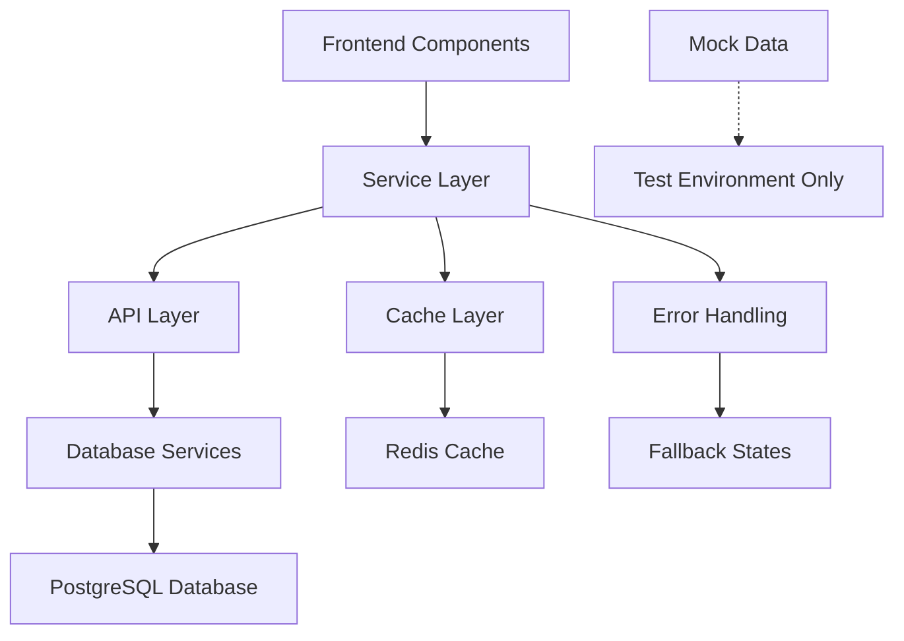

# Remove Mock Data - Design Document

## Overview

This design document outlines the systematic approach to removing mock data from the application and replacing it with real database operations. The design focuses on maintaining application stability while transitioning to production-ready data sources.

## Architecture

### Current State Analysis

The application currently uses mock data in several areas:
- Community data (`app/frontend/src/mocks/communityMockData.ts`)
- Product/marketplace data (`app/frontend/src/data/mockProducts.ts`)
- Embedded mock data in components (DashboardRightSidebar, etc.)
- Mock services for development

### Target Architecture



## Components and Interfaces

### 1. Data Service Refactoring

#### Community Service Enhancement
```typescript
interface CommunityService {
  // Replace MockCommunityService methods
  getAllCommunities(filters?: CommunityFilters): Promise<Community[]>
  getCommunityById(id: string): Promise<Community | null>
  getUserMemberships(userId: string): Promise<CommunityMembership[]>
  getCommunityPosts(communityId: string, pagination: Pagination): Promise<CommunityPost[]>
  joinCommunity(communityId: string, userId: string): Promise<CommunityMembership>
  leaveCommunity(communityId: string, userId: string): Promise<boolean>
  
  // New methods for real functionality
  getTrendingCommunities(category?: string): Promise<Community[]>
  getRelatedCommunities(communityId: string): Promise<Community[]>
  getCommunityStats(communityId: string): Promise<CommunityStats>
}
```

#### Product/Marketplace Service Enhancement
```typescript
interface MarketplaceService {
  // Replace mock product functions
  getProducts(filters: ProductFilters, pagination: Pagination): Promise<ProductPage>
  getProductById(id: string): Promise<Product | null>
  getProductsByCategory(category: string): Promise<Product[]>
  getFeaturedProducts(): Promise<Product[]>
  searchProducts(query: string, filters?: SearchFilters): Promise<Product[]>
  
  // Auction functionality
  getActiveAuctions(): Promise<Auction[]>
  getAuctionById(id: string): Promise<Auction | null>
  placeBid(auctionId: string, bid: BidData): Promise<Bid>
}
```

#### User Service Enhancement
```typescript
interface UserService {
  // Replace mock user data
  getSuggestedUsers(userId: string, limit?: number): Promise<User[]>
  getUserProfile(userId: string): Promise<UserProfile | null>
  getFollowers(userId: string): Promise<User[]>
  getFollowing(userId: string): Promise<User[]>
  followUser(followerId: string, followeeId: string): Promise<boolean>
  unfollowUser(followerId: string, followeeId: string): Promise<boolean>
  
  // Reputation system
  getUserReputation(userId: string): Promise<ReputationData>
  updateUserReputation(userId: string, change: ReputationChange): Promise<void>
}
```

#### Governance Service Enhancement
```typescript
interface GovernanceService {
  // Replace mock governance data
  getProposals(filters?: ProposalFilters): Promise<Proposal[]>
  getProposalById(id: string): Promise<Proposal | null>
  getCommunityProposals(communityId: string): Promise<Proposal[]>
  createProposal(proposalData: CreateProposalData): Promise<Proposal>
  voteOnProposal(proposalId: string, vote: VoteData): Promise<Vote>
  
  // DAO functionality
  getDAOTreasuryData(daoId: string): Promise<TreasuryData>
  getVotingPower(userId: string, daoId: string): Promise<VotingPower>
}
```

### 2. Component Refactoring Strategy

#### DashboardRightSidebar Refactoring
- Remove hardcoded mock arrays (trendingDAOs, suggestedUsers, etc.)
- Implement real data fetching with loading states
- Add error handling and empty states
- Implement caching for frequently accessed data

#### Feed Components Refactoring
- Replace mock feed data with real feed service calls
- Implement infinite scrolling with real pagination
- Add real-time updates for new content
- Implement proper error boundaries

#### Marketplace Components Refactoring
- Replace mock product data with real marketplace service
- Implement real search and filtering
- Add real auction functionality
- Implement proper image handling

### 3. Data Models

#### Enhanced Community Model
```typescript
interface Community {
  id: string
  name: string
  displayName: string
  description: string
  avatar?: string
  banner?: string
  category: string
  tags: string[]
  isPublic: boolean
  memberCount: number
  postCount: number
  createdAt: Date
  updatedAt: Date
  rules: CommunityRule[]
  moderators: string[]
  treasuryAddress?: string
  governanceToken?: string
  settings: CommunitySettings
}

interface CommunityStats {
  memberCount: number
  postCount: number
  activeMembers: number
  weeklyGrowth: number
  engagementRate: number
}
```

#### Enhanced Product Model
```typescript
interface Product {
  id: string
  title: string
  description: string
  price: Price
  category: Category
  seller: Seller
  images: string[]
  specifications?: Record<string, string>
  shipping?: ShippingInfo
  trust: TrustIndicators
  createdAt: Date
  updatedAt: Date
  views: number
  favorites: number
  status: ProductStatus
}

interface Auction extends Product {
  auctionEndTime: Date
  currentBid: Price
  bidCount: number
  minimumBid: Price
  reservePrice?: Price
}
```

## Error Handling

### Graceful Degradation Strategy

1. **Loading States**: Show skeleton loaders while fetching real data
2. **Empty States**: Display helpful messages when no data is available
3. **Error States**: Provide retry mechanisms and error reporting
4. **Fallback Content**: Use cached data when available
5. **Progressive Enhancement**: Core functionality works without advanced features

### Error Handling Patterns

```typescript
interface DataFetchResult<T> {
  data?: T
  loading: boolean
  error?: Error
  retry: () => void
}

// Usage in components
const { data: communities, loading, error, retry } = useCommunities()

if (loading) return <CommunityListSkeleton />
if (error) return <ErrorState onRetry={retry} />
if (!communities?.length) return <EmptyCommunitiesState />
```

## Testing Strategy

### Test Data Management

1. **Test Fixtures**: Replace mock data with proper test fixtures
2. **Database Seeding**: Create seed scripts for development environments
3. **API Mocking**: Use MSW (Mock Service Worker) for API testing
4. **Integration Tests**: Test real database operations in test environment

### Migration Testing

1. **A/B Testing**: Gradually roll out real data to verify functionality
2. **Performance Testing**: Ensure real data doesn't degrade performance
3. **Load Testing**: Verify system handles real data volumes
4. **User Acceptance Testing**: Validate user experience with real data

## Performance Considerations

### Caching Strategy

1. **Redis Caching**: Cache frequently accessed data
2. **Browser Caching**: Implement proper cache headers
3. **CDN Integration**: Cache static assets and images
4. **Query Optimization**: Optimize database queries for performance

### Pagination and Lazy Loading

1. **Infinite Scroll**: Implement for large datasets
2. **Virtual Scrolling**: For very large lists
3. **Lazy Loading**: Load data as needed
4. **Prefetching**: Anticipate user needs

## Security Considerations

### Data Access Control

1. **Authentication**: Verify user identity for personalized data
2. **Authorization**: Ensure users can only access permitted data
3. **Rate Limiting**: Prevent abuse of data endpoints
4. **Input Validation**: Sanitize all user inputs

### Privacy Protection

1. **Data Minimization**: Only fetch necessary data
2. **Anonymization**: Protect user privacy in aggregated data
3. **Consent Management**: Respect user privacy preferences
4. **Audit Logging**: Track data access for security

## Migration Plan

### Phase 1: Infrastructure Preparation
- Set up database schemas
- Implement base service interfaces
- Create migration scripts
- Set up monitoring

### Phase 2: Core Data Migration
- Replace community mock data
- Implement user service enhancements
- Add governance data integration
- Update feed services

### Phase 3: Marketplace Integration
- Replace product mock data
- Implement auction functionality
- Add seller services
- Integrate payment systems

### Phase 4: UI/UX Enhancement
- Update all components to use real data
- Implement proper loading states
- Add error handling
- Optimize performance

### Phase 5: Testing and Optimization
- Comprehensive testing
- Performance optimization
- Security validation
- User acceptance testing

## Monitoring and Observability

### Metrics to Track

1. **Performance Metrics**: Response times, throughput
2. **Error Rates**: Failed requests, database errors
3. **User Experience**: Loading times, interaction success
4. **Business Metrics**: User engagement, conversion rates

### Alerting Strategy

1. **Critical Alerts**: Database failures, service outages
2. **Performance Alerts**: Slow queries, high error rates
3. **Business Alerts**: Unusual user behavior, system abuse
4. **Capacity Alerts**: Resource utilization, scaling needs