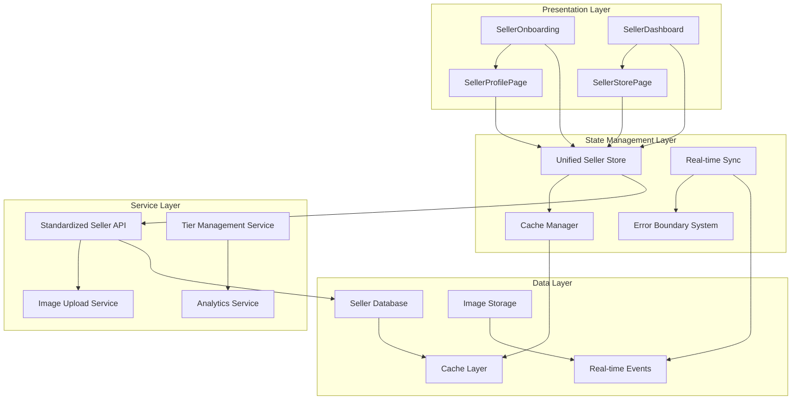

# Design Document

## Overview

This design addresses critical seller integration inconsistencies identified in the comprehensive seller implementation analysis. The solution focuses on API endpoint standardization, unified data interfaces, centralized state management, consistent error handling, and enhanced mobile optimization to create a cohesive seller experience across SellerOnboarding, SellerProfilePage, SellerDashboard, and SellerStorePage components.

## Architecture

### Current Issues Analysis

Based on the comprehensive assessment, the main integration issues are:

1. **API Endpoint Inconsistencies**: Multiple patterns causing server vs client-side rendering failures
2. **Data Type Mismatches**: Inconsistent interfaces between DisplayMarketplaceListing and SellerListing
3. **Cache Management Issues**: Profile updates not properly invalidated across components
4. **Error Handling Inconsistencies**: Different strategies causing crashes vs graceful degradation
5. **Mobile Optimization Gaps**: Limited responsiveness and touch interaction support

### Unified Seller Architecture



## Components and Interfaces

### 1. API Endpoint Standardization

#### Unified API Pattern

```typescript
// Standardized API endpoint pattern
const SELLER_API_BASE = '/api/marketplace/seller';

interface SellerAPIEndpoints {
  // Profile endpoints
  getProfile: (walletAddress: string) => `${typeof SELLER_API_BASE}/${walletAddress}/profile`;
  updateProfile: (walletAddress: string) => `${typeof SELLER_API_BASE}/${walletAddress}/profile`;
  
  // Listing endpoints
  getListings: (walletAddress: string) => `${typeof SELLER_API_BASE}/${walletAddress}/listings`;
  createListing: (walletAddress: string) => `${typeof SELLER_API_BASE}/${walletAddress}/listings`;
  
  // Dashboard endpoints
  getDashboard: (walletAddress: string) => `${typeof SELLER_API_BASE}/${walletAddress}/dashboard`;
  getAnalytics: (walletAddress: string) => `${typeof SELLER_API_BASE}/${walletAddress}/analytics`;
  
  // Store endpoints
  getStore: (walletAddress: string) => `${typeof SELLER_API_BASE}/${walletAddress}/store`;
  getStoreListings: (walletAddress: string) => `${typeof SELLER_API_BASE}/${walletAddress}/store/listings`;
}

// Unified API client with consistent error handling
class UnifiedSellerAPIClient {
  private baseURL = SELLER_API_BASE;
  
  async request<T>(endpoint: string, options?: RequestInit): Promise<T> {
    try {
      const response = await fetch(`${this.baseURL}${endpoint}`, {
        ...options,
        headers: {
          'Content-Type': 'application/json',
          ...options?.headers,
        },
      });
      
      if (!response.ok) {
        throw new SellerAPIError(response.status, await response.text());
      }
      
      return await response.json();
    } catch (error) {
      throw this.handleAPIError(error);
    }
  }
  
  private handleAPIError(error: any): SellerAPIError {
    // Consistent error handling across all API calls
    return new SellerAPIError(error.status || 500, error.message);
  }
}
```

### 2. Unified Data Interfaces

#### Standardized Data Types

```typescript
// Unified seller listing interface that resolves type mismatches
interface UnifiedSellerListing {
  id: string;
  sellerId: string;
  title: string;
  description: string;
  price: number;
  currency: 'ETH' | 'USDC' | 'DAI' | 'USD'; // Standardized currency types
  images: string[];
  category: string;
  status: 'draft' | 'active' | 'sold' | 'inactive';
  createdAt: string;
  updatedAt: string;
  
  // Display-specific fields
  displayPrice: string; // Formatted price for display
  displayCurrency: string; // User-friendly currency display
  thumbnailUrl: string; // Optimized thumbnail
  
  // Marketplace-specific fields
  escrowEnabled: boolean;
  shippingInfo?: ShippingInfo;
  metadata: ListingMetadata;
}

// Unified seller profile interface
interface UnifiedSellerProfile {
  walletAddress: string;
  displayName: string;
  bio?: string;
  profileImageUrl?: string;
  coverImageUrl?: string;
  
  // Contact information
  email?: string;
  website?: string;
  socialLinks: {
    twitter?: string;
    discord?: string;
    telegram?: string;
  };
  
  // Verification status
  verificationStatus: {
    email: boolean;
    phone: boolean;
    kyc: boolean;
  };
  
  // Tier information
  tier: SellerTier;
  tierProgress: TierProgress;
  
  // Statistics
  stats: SellerStats;
  
  // Timestamps
  createdAt: string;
  updatedAt: string;
}

// Unified seller dashboard data
interface UnifiedSellerDashboard {
  profile: UnifiedSellerProfile;
  listings: UnifiedSellerListing[];
  orders: SellerOrder[];
  analytics: SellerAnalytics;
  notifications: SellerNotification[];
  tierInfo: TierInformation;
}
```

### 3. Centralized State Management

#### Unified Seller Store with React Query

```typescript
// Centralized seller state management
interface SellerStore {
  // Profile state
  profile: UnifiedSellerProfile | null;
  profileLoading: boolean;
  profileError: string | null;
  
  // Listings state
  listings: UnifiedSellerListing[];
  listingsLoading: boolean;
  listingsError: string | null;
  
  // Dashboard state
  dashboard: UnifiedSellerDashboard | null;
  dashboardLoading: boolean;
  dashboardError: string | null;
  
  // Cache management
  lastUpdated: Record<string, number>;
  cacheInvalidationQueue: string[];
}

// React Query integration for seller data
const useSellerProfile = (walletAddress: string) => {
  return useQuery({
    queryKey: ['seller', 'profile', walletAddress],
    queryFn: () => sellerAPI.getProfile(walletAddress),
    staleTime: 5 * 60 * 1000, // 5 minutes
    cacheTime: 10 * 60 * 1000, // 10 minutes
    onError: (error) => {
      console.error('Seller profile fetch error:', error);
      // Consistent error handling
    },
  });
};

const useSellerListings = (walletAddress: string) => {
  return useQuery({
    queryKey: ['seller', 'listings', walletAddress],
    queryFn: () => sellerAPI.getListings(walletAddress),
    staleTime: 2 * 60 * 1000, // 2 minutes
    cacheTime: 5 * 60 * 1000, // 5 minutes
  });
};

// Cache invalidation service
class SellerCacheManager {
  private queryClient: QueryClient;
  
  constructor(queryClient: QueryClient) {
    this.queryClient = queryClient;
  }
  
  async invalidateSellerCache(walletAddress: string): Promise<void> {
    // Invalidate all seller-related queries
    await Promise.all([
      this.queryClient.invalidateQueries(['seller', 'profile', walletAddress]),
      this.queryClient.invalidateQueries(['seller', 'listings', walletAddress]),
      this.queryClient.invalidateQueries(['seller', 'dashboard', walletAddress]),
      this.queryClient.invalidateQueries(['seller', 'store', walletAddress]),
    ]);
    
    // Trigger refetch for active queries
    await this.queryClient.refetchQueries(['seller'], { active: true });
  }
  
  async updateSellerData(walletAddress: string, updates: Partial<UnifiedSellerProfile>): Promise<void> {
    // Optimistic updates
    this.queryClient.setQueryData(['seller', 'profile', walletAddress], (old: any) => ({
      ...old,
      ...updates,
      updatedAt: new Date().toISOString(),
    }));
    
    // Invalidate related caches
    await this.invalidateSellerCache(walletAddress);
  }
}
```

### 4. Unified Error Handling System

#### Consistent Error Boundaries and Handling

```typescript
// Unified error types for seller system
enum SellerErrorType {
  API_ERROR = 'API_ERROR',
  CACHE_ERROR = 'CACHE_ERROR',
  VALIDATION_ERROR = 'VALIDATION_ERROR',
  NETWORK_ERROR = 'NETWORK_ERROR',
  PERMISSION_ERROR = 'PERMISSION_ERROR',
}

class SellerError extends Error {
  constructor(
    public type: SellerErrorType,
    public message: string,
    public code?: string,
    public details?: any
  ) {
    super(message);
    this.name = 'SellerError';
  }
}

// Unified error boundary for seller components
class SellerErrorBoundary extends React.Component<
  { children: React.ReactNode; fallback?: React.ComponentType<any> },
  { hasError: boolean; error?: SellerError }
> {
  constructor(props: any) {
    super(props);
    this.state = { hasError: false };
  }
  
  static getDerivedStateFromError(error: Error) {
    return { hasError: true, error };
  }
  
  componentDidCatch(error: Error, errorInfo: React.ErrorInfo) {
    // Log error to monitoring service
    console.error('Seller component error:', error, errorInfo);
    
    // Report to error tracking service
    this.reportError(error, errorInfo);
  }
  
  private reportError(error: Error, errorInfo: React.ErrorInfo) {
    // Consistent error reporting across all seller components
    // Integration with error tracking service
  }
  
  render() {
    if (this.state.hasError) {
      const FallbackComponent = this.props.fallback || DefaultSellerErrorFallback;
      return <FallbackComponent error={this.state.error} />;
    }
    
    return this.props.children;
  }
}

// Graceful degradation component
const DefaultSellerErrorFallback: React.FC<{ error?: SellerError }> = ({ error }) => {
  return (
    <div className="seller-error-fallback">
      <h3>Something went wrong</h3>
      <p>We're having trouble loading your seller information.</p>
      <button onClick={() => window.location.reload()}>
        Try Again
      </button>
      {error && (
        <details className="error-details">
          <summary>Error Details</summary>
          <pre>{error.message}</pre>
        </details>
      )}
    </div>
  );
};
```

### 5. Standardized Image Upload Pipeline

#### Unified Image Management Service

```typescript
interface ImageUploadOptions {
  maxSize: number;
  allowedTypes: string[];
  quality: number;
  generateThumbnails: boolean;
}

class UnifiedImageService {
  private defaultOptions: ImageUploadOptions = {
    maxSize: 10 * 1024 * 1024, // 10MB
    allowedTypes: ['image/jpeg', 'image/png', 'image/webp'],
    quality: 0.8,
    generateThumbnails: true,
  };
  
  async uploadImage(
    file: File,
    context: 'profile' | 'cover' | 'listing',
    options?: Partial<ImageUploadOptions>
  ): Promise<ImageUploadResult> {
    const config = { ...this.defaultOptions, ...options };
    
    try {
      // Validate file
      this.validateFile(file, config);
      
      // Process image
      const processedImage = await this.processImage(file, config);
      
      // Upload to storage
      const uploadResult = await this.uploadToStorage(processedImage, context);
      
      // Generate CDN URLs
      const cdnUrls = await this.generateCDNUrls(uploadResult);
      
      return {
        originalUrl: uploadResult.url,
        cdnUrl: cdnUrls.main,
        thumbnails: cdnUrls.thumbnails,
        metadata: {
          width: processedImage.width,
          height: processedImage.height,
          size: processedImage.size,
          format: processedImage.format,
        },
      };
    } catch (error) {
      throw new SellerError(
        SellerErrorType.API_ERROR,
        `Image upload failed: ${error.message}`,
        'IMAGE_UPLOAD_ERROR',
        { context, fileName: file.name }
      );
    }
  }
  
  private validateFile(file: File, options: ImageUploadOptions): void {
    if (file.size > options.maxSize) {
      throw new Error(`File size exceeds ${options.maxSize} bytes`);
    }
    
    if (!options.allowedTypes.includes(file.type)) {
      throw new Error(`File type ${file.type} not allowed`);
    }
  }
  
  private async processImage(file: File, options: ImageUploadOptions): Promise<ProcessedImage> {
    // Consistent image processing across all seller components
    // Implementation details for image optimization
    return {} as ProcessedImage;
  }
  
  private async uploadToStorage(image: ProcessedImage, context: string): Promise<StorageResult> {
    // Unified storage upload logic
    return {} as StorageResult;
  }
  
  private async generateCDNUrls(uploadResult: StorageResult): Promise<CDNUrls> {
    // Consistent CDN URL generation
    return {} as CDNUrls;
  }
}
```

### 6. Integrated Tier System

#### Comprehensive Tier Management

```typescript
interface SellerTier {
  id: string;
  name: string;
  level: number;
  requirements: TierRequirement[];
  benefits: TierBenefit[];
  limitations: TierLimitation[];
}

interface TierRequirement {
  type: 'sales_volume' | 'rating' | 'reviews' | 'time_active';
  value: number;
  current: number;
  met: boolean;
}

interface TierBenefit {
  type: 'listing_limit' | 'commission_rate' | 'priority_support' | 'analytics_access';
  description: string;
  value: string | number;
}

interface TierLimitation {
  type: 'listing_limit' | 'withdrawal_limit' | 'feature_access';
  description: string;
  value: string | number;
}

class TierManagementService {
  async getSellerTier(walletAddress: string): Promise<SellerTier> {
    // Get current tier information
    return {} as SellerTier;
  }
  
  async checkTierUpgradeEligibility(walletAddress: string): Promise<TierUpgradeInfo> {
    // Check if seller can upgrade to next tier
    return {} as TierUpgradeInfo;
  }
  
  async applyTierLimitations(walletAddress: string, action: string): Promise<boolean> {
    // Check if action is allowed based on current tier
    const tier = await this.getSellerTier(walletAddress);
    return this.isActionAllowed(tier, action);
  }
  
  private isActionAllowed(tier: SellerTier, action: string): boolean {
    // Implement tier-based feature gating
    return true;
  }
}

// Tier-aware components
const TierAwareComponent: React.FC<{ walletAddress: string; children: React.ReactNode }> = ({
  walletAddress,
  children,
}) => {
  const { data: tier, isLoading } = useQuery({
    queryKey: ['seller', 'tier', walletAddress],
    queryFn: () => tierService.getSellerTier(walletAddress),
  });
  
  if (isLoading) return <div>Loading tier information...</div>;
  
  return (
    <TierContext.Provider value={tier}>
      {children}
    </TierContext.Provider>
  );
};
```

### 7. Enhanced Mobile Optimization

#### Mobile-First Responsive Design

```typescript
// Mobile optimization hooks
const useMobileOptimization = () => {
  const [isMobile, setIsMobile] = useState(false);
  const [orientation, setOrientation] = useState<'portrait' | 'landscape'>('portrait');
  
  useEffect(() => {
    const checkMobile = () => {
      setIsMobile(window.innerWidth < 768);
      setOrientation(window.innerHeight > window.innerWidth ? 'portrait' : 'landscape');
    };
    
    checkMobile();
    window.addEventListener('resize', checkMobile);
    window.addEventListener('orientationchange', checkMobile);
    
    return () => {
      window.removeEventListener('resize', checkMobile);
      window.removeEventListener('orientationchange', checkMobile);
    };
  }, []);
  
  return { isMobile, orientation };
};

// Mobile-optimized seller components
const MobileSellerDashboard: React.FC = () => {
  const { isMobile } = useMobileOptimization();
  
  if (isMobile) {
    return (
      <div className="mobile-seller-dashboard">
        <MobileSellerHeader />
        <MobileSellerTabs />
        <MobileSellerContent />
      </div>
    );
  }
  
  return <DesktopSellerDashboard />;
};

// Touch-optimized interactions
const TouchOptimizedButton: React.FC<{
  children: React.ReactNode;
  onClick: () => void;
  variant?: 'primary' | 'secondary';
}> = ({ children, onClick, variant = 'primary' }) => {
  return (
    <button
      className={`touch-optimized-button ${variant}`}
      onClick={onClick}
      style={{
        minHeight: '44px', // iOS touch target minimum
        minWidth: '44px',
        padding: '12px 16px',
        fontSize: '16px', // Prevent zoom on iOS
      }}
    >
      {children}
    </button>
  );
};
```

### 8. Real-time Features Implementation

#### WebSocket Integration for Live Updates

```typescript
class SellerWebSocketService {
  private ws: WebSocket | null = null;
  private reconnectAttempts = 0;
  private maxReconnectAttempts = 5;
  
  connect(walletAddress: string): void {
    const wsUrl = `${process.env.NEXT_PUBLIC_WS_URL}/seller/${walletAddress}`;
    this.ws = new WebSocket(wsUrl);
    
    this.ws.onopen = () => {
      console.log('Seller WebSocket connected');
      this.reconnectAttempts = 0;
    };
    
    this.ws.onmessage = (event) => {
      const data = JSON.parse(event.data);
      this.handleSellerUpdate(data);
    };
    
    this.ws.onclose = () => {
      console.log('Seller WebSocket disconnected');
      this.attemptReconnect(walletAddress);
    };
    
    this.ws.onerror = (error) => {
      console.error('Seller WebSocket error:', error);
    };
  }
  
  private handleSellerUpdate(data: SellerUpdateEvent): void {
    switch (data.type) {
      case 'profile_updated':
        // Invalidate profile cache
        queryClient.invalidateQueries(['seller', 'profile', data.walletAddress]);
        break;
      case 'new_order':
        // Update order notifications
        this.notifyNewOrder(data.order);
        break;
      case 'tier_upgraded':
        // Update tier information
        queryClient.invalidateQueries(['seller', 'tier', data.walletAddress]);
        break;
    }
  }
  
  private attemptReconnect(walletAddress: string): void {
    if (this.reconnectAttempts < this.maxReconnectAttempts) {
      setTimeout(() => {
        this.reconnectAttempts++;
        this.connect(walletAddress);
      }, Math.pow(2, this.reconnectAttempts) * 1000);
    }
  }
  
  private notifyNewOrder(order: SellerOrder): void {
    // Show real-time notification
    toast.success(`New order received: ${order.id}`);
  }
}
```

## Data Models

### Unified Database Schema Updates

```sql
-- Standardize seller data structure
ALTER TABLE sellers ADD COLUMN IF NOT EXISTS tier_id VARCHAR(50) DEFAULT 'bronze';
ALTER TABLE sellers ADD COLUMN IF NOT EXISTS tier_progress JSONB DEFAULT '{}';
ALTER TABLE sellers ADD COLUMN IF NOT EXISTS cache_version INTEGER DEFAULT 1;
ALTER TABLE sellers ADD COLUMN IF NOT EXISTS last_cache_invalidation TIMESTAMP DEFAULT NOW();

-- Add seller analytics tracking
CREATE TABLE IF NOT EXISTS seller_analytics (
  id UUID PRIMARY KEY DEFAULT gen_random_uuid(),
  seller_id UUID REFERENCES sellers(id),
  metric_type VARCHAR(50) NOT NULL,
  metric_value DECIMAL(10,2),
  recorded_at TIMESTAMP DEFAULT NOW(),
  metadata JSONB DEFAULT '{}'
);

-- Add seller tier definitions
CREATE TABLE IF NOT EXISTS seller_tiers (
  id VARCHAR(50) PRIMARY KEY,
  name VARCHAR(100) NOT NULL,
  level INTEGER NOT NULL,
  requirements JSONB NOT NULL,
  benefits JSONB NOT NULL,
  limitations JSONB NOT NULL,
  created_at TIMESTAMP DEFAULT NOW()
);

-- Add seller cache invalidation tracking
CREATE TABLE IF NOT EXISTS seller_cache_invalidations (
  id UUID PRIMARY KEY DEFAULT gen_random_uuid(),
  seller_id UUID REFERENCES sellers(id),
  invalidation_type VARCHAR(50) NOT NULL,
  component VARCHAR(100),
  triggered_at TIMESTAMP DEFAULT NOW(),
  completed_at TIMESTAMP
);
```

## Error Handling

### Comprehensive Error Recovery System

```typescript
interface ErrorRecoveryStrategy {
  canRecover: boolean;
  recoveryActions: RecoveryAction[];
  fallbackData?: any;
  retryConfig?: RetryConfig;
}

interface RecoveryAction {
  type: 'retry' | 'fallback' | 'redirect' | 'refresh';
  description: string;
  action: () => Promise<void>;
}

class SellerErrorRecoveryService {
  async handleError(error: SellerError, context: string): Promise<ErrorRecoveryStrategy> {
    switch (error.type) {
      case SellerErrorType.API_ERROR:
        return this.handleAPIError(error, context);
      case SellerErrorType.CACHE_ERROR:
        return this.handleCacheError(error, context);
      case SellerErrorType.NETWORK_ERROR:
        return this.handleNetworkError(error, context);
      default:
        return this.handleGenericError(error, context);
    }
  }
  
  private async handleAPIError(error: SellerError, context: string): Promise<ErrorRecoveryStrategy> {
    return {
      canRecover: true,
      recoveryActions: [
        {
          type: 'retry',
          description: 'Retry the request',
          action: async () => {
            // Implement retry logic with exponential backoff
          },
        },
        {
          type: 'fallback',
          description: 'Use cached data',
          action: async () => {
            // Load from cache if available
          },
        },
      ],
      retryConfig: {
        maxAttempts: 3,
        backoffMultiplier: 2,
        initialDelay: 1000,
      },
    };
  }
  
  private async handleCacheError(error: SellerError, context: string): Promise<ErrorRecoveryStrategy> {
    return {
      canRecover: true,
      recoveryActions: [
        {
          type: 'refresh',
          description: 'Refresh data from server',
          action: async () => {
            // Force refresh from API
          },
        },
      ],
    };
  }
  
  private async handleNetworkError(error: SellerError, context: string): Promise<ErrorRecoveryStrategy> {
    return {
      canRecover: true,
      recoveryActions: [
        {
          type: 'retry',
          description: 'Retry when connection is restored',
          action: async () => {
            // Wait for network and retry
          },
        },
        {
          type: 'fallback',
          description: 'Work offline with cached data',
          action: async () => {
            // Enable offline mode
          },
        },
      ],
    };
  }
  
  private async handleGenericError(error: SellerError, context: string): Promise<ErrorRecoveryStrategy> {
    return {
      canRecover: false,
      recoveryActions: [
        {
          type: 'refresh',
          description: 'Refresh the page',
          action: async () => {
            window.location.reload();
          },
        },
      ],
    };
  }
}
```

## Testing Strategy

### Integration Testing Framework

```typescript
// Seller integration test suite
describe('Seller Integration Tests', () => {
  describe('API Endpoint Consistency', () => {
    test('should use consistent endpoints across all components', async () => {
      const walletAddress = 'test-wallet-address';
      
      // Test that all components use the same API pattern
      const profileEndpoint = sellerAPI.getProfileEndpoint(walletAddress);
      const dashboardEndpoint = sellerAPI.getDashboardEndpoint(walletAddress);
      const storeEndpoint = sellerAPI.getStoreEndpoint(walletAddress);
      
      expect(profileEndpoint).toMatch(/^\/api\/marketplace\/seller\//);
      expect(dashboardEndpoint).toMatch(/^\/api\/marketplace\/seller\//);
      expect(storeEndpoint).toMatch(/^\/api\/marketplace\/seller\//);
    });
  });
  
  describe('Data Synchronization', () => {
    test('should sync profile updates across all components', async () => {
      const walletAddress = 'test-wallet-address';
      const updatedProfile = { displayName: 'Updated Name' };
      
      // Update profile
      await sellerAPI.updateProfile(walletAddress, updatedProfile);
      
      // Verify all components receive the update
      const profileData = await sellerAPI.getProfile(walletAddress);
      const dashboardData = await sellerAPI.getDashboard(walletAddress);
      const storeData = await sellerAPI.getStore(walletAddress);
      
      expect(profileData.displayName).toBe('Updated Name');
      expect(dashboardData.profile.displayName).toBe('Updated Name');
      expect(storeData.seller.displayName).toBe('Updated Name');
    });
  });
  
  describe('Cache Invalidation', () => {
    test('should invalidate cache across all components', async () => {
      const walletAddress = 'test-wallet-address';
      
      // Mock cache manager
      const cacheManager = new SellerCacheManager(queryClient);
      
      // Trigger cache invalidation
      await cacheManager.invalidateSellerCache(walletAddress);
      
      // Verify all relevant queries are invalidated
      expect(queryClient.getQueryState(['seller', 'profile', walletAddress])?.isInvalidated).toBe(true);
      expect(queryClient.getQueryState(['seller', 'dashboard', walletAddress])?.isInvalidated).toBe(true);
      expect(queryClient.getQueryState(['seller', 'store', walletAddress])?.isInvalidated).toBe(true);
    });
  });
  
  describe('Error Handling Consistency', () => {
    test('should handle errors consistently across components', async () => {
      const walletAddress = 'test-wallet-address';
      
      // Mock API error
      jest.spyOn(sellerAPI, 'getProfile').mockRejectedValue(
        new SellerError(SellerErrorType.API_ERROR, 'Test error')
      );
      
      // Test error handling in different components
      const profileError = await sellerAPI.getProfile(walletAddress).catch(e => e);
      const dashboardError = await sellerAPI.getDashboard(walletAddress).catch(e => e);
      
      expect(profileError).toBeInstanceOf(SellerError);
      expect(dashboardError).toBeInstanceOf(SellerError);
      expect(profileError.type).toBe(SellerErrorType.API_ERROR);
      expect(dashboardError.type).toBe(SellerErrorType.API_ERROR);
    });
  });
});
```

## Performance Optimizations

### Intelligent Caching Strategy

```typescript
class IntelligentSellerCache {
  private cache = new Map<string, CacheEntry>();
  private dependencies = new Map<string, Set<string>>();
  
  set(key: string, value: any, ttl: number = 300000): void {
    const entry: CacheEntry = {
      value,
      timestamp: Date.now(),
      ttl,
      accessCount: 0,
    };
    
    this.cache.set(key, entry);
    this.updateDependencies(key, value);
  }
  
  get(key: string): any | null {
    const entry = this.cache.get(key);
    
    if (!entry) return null;
    
    if (Date.now() - entry.timestamp > entry.ttl) {
      this.cache.delete(key);
      return null;
    }
    
    entry.accessCount++;
    return entry.value;
  }
  
  invalidate(key: string): void {
    this.cache.delete(key);
    
    // Invalidate dependent keys
    const dependents = this.dependencies.get(key);
    if (dependents) {
      dependents.forEach(dependent => this.invalidate(dependent));
    }
  }
  
  private updateDependencies(key: string, value: any): void {
    // Track dependencies based on data relationships
    if (key.includes('profile')) {
      this.addDependency('profile', 'dashboard');
      this.addDependency('profile', 'store');
    }
  }
  
  private addDependency(parent: string, child: string): void {
    if (!this.dependencies.has(parent)) {
      this.dependencies.set(parent, new Set());
    }
    this.dependencies.get(parent)!.add(child);
  }
}
```

## Security Considerations

### Seller Data Protection

```typescript
class SellerSecurityService {
  async validateSellerAccess(walletAddress: string, requestedData: string[]): Promise<boolean> {
    // Verify wallet ownership
    const isOwner = await this.verifyWalletOwnership(walletAddress);
    if (!isOwner) return false;
    
    // Check data access permissions
    return this.checkDataPermissions(walletAddress, requestedData);
  }
  
  async sanitizeSellerData(data: any): Promise<any> {
    // Remove sensitive information before caching or transmission
    const sanitized = { ...data };
    delete sanitized.privateKey;
    delete sanitized.internalNotes;
    delete sanitized.adminFlags;
    
    return sanitized;
  }
  
  private async verifyWalletOwnership(walletAddress: string): Promise<boolean> {
    // Implement wallet signature verification
    return true;
  }
  
  private async checkDataPermissions(walletAddress: string, requestedData: string[]): Promise<boolean> {
    // Implement role-based access control
    return true;
  }
}
```

This comprehensive design addresses all the critical issues identified in your seller implementation analysis, providing a unified, consistent, and robust seller experience across all components.