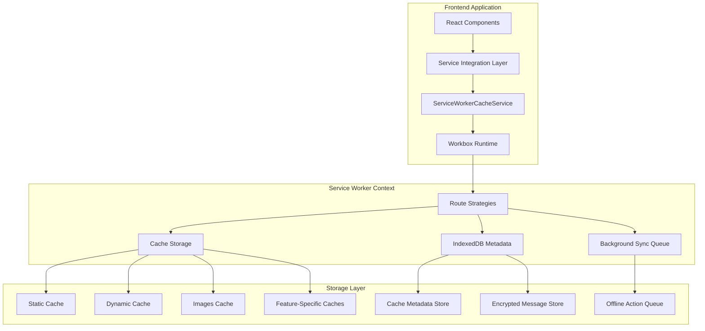

# Service Worker Cache Enhancement Design

## Overview

This design document outlines the architecture for enhancing the current service worker cache implementation to provide robust offline capabilities, improved performance, and feature-specific caching strategies. The solution adopts Workbox as the foundation while maintaining backward compatibility and implementing privacy-first storage for sensitive data.

The enhancement transforms the current basic three-cache system (static-v2, dynamic-v2, images-v2) into a sophisticated, feature-aware caching architecture that aligns with the platform's core functionalities: social feed, communities, marketplace, and wallet messaging.

## Architecture

### High-Level Architecture



### Core Components

#### 1. Workbox Integration Layer
- **Purpose**: Provides modern service worker capabilities with routing strategies
- **Components**:
  - Route registration and strategy mapping
  - Plugin system for expiration, caching rules, and background sync
  - Precaching manifest for app shell
  - Navigation preload management

#### 2. Enhanced ServiceWorkerCacheService
- **Purpose**: Centralized cache management with feature-specific logic
- **Key Methods**:
  - `fetchWithStrategy(url, strategy, options)`: Unified fetch with caching
  - `putWithMetadata(url, response, meta)`: Cache with metadata storage
  - `invalidateByTag(tag)`: Tag-based cache invalidation
  - `flushOfflineQueue()`: Background sync queue management

#### 3. Cache Metadata Management
- **Purpose**: Track cache entries with expiration, tags, and usage statistics
- **Storage**: IndexedDB for persistent metadata
- **Schema**:
  ```typescript
  interface CacheMetadata {
    url: string;
    timestamp: number;
    ttl: number;
    tags: string[];
    contentType: string;
    size: number;
    hitCount: number;
    lastAccessed: number;
  }
  ```

#### 4. Feature-Specific Cache Strategies
- **Feed Caching**: NetworkFirst with predictive preloading
- **Community Caching**: Stale-While-Revalidate with bundled preloads
- **Marketplace Caching**: Mixed strategies based on content sensitivity
- **Messaging Storage**: Privacy-first IndexedDB with encryption

## Components and Interfaces

### ServiceWorkerCacheService Enhanced API

```typescript
interface EnhancedCacheService {
  // Strategy-based fetching
  fetchWithStrategy(
    url: string, 
    strategy: CacheStrategy, 
    options?: CacheOptions
  ): Promise<Response>;
  
  // Metadata-aware caching
  putWithMetadata(
    url: string, 
    response: Response, 
    metadata: CacheMetadata
  ): Promise<void>;
  
  // Tag-based invalidation
  invalidateByTag(tag: string): Promise<void>;
  
  // Route registration
  registerRoutes(): void;
  
  // Navigation preload
  enableNavigationPreload(): Promise<void>;
  disableNavigationPreload(): Promise<void>;
  
  // Offline queue management
  flushOfflineQueue(): Promise<void>;
  
  // Performance monitoring
  getCacheStats(): Promise<CacheStats>;
}
```

### Cache Strategy Configuration

```typescript
interface CacheStrategyConfig {
  feed: {
    strategy: 'NetworkFirst';
    cacheName: 'feed-cache-v1';
    networkTimeoutSeconds: 3;
    plugins: [ExpirationPlugin, CacheableResponsePlugin];
    preloadConfig: {
      enabled: true;
      triggerDistance: 2; // screens
      maxPreloadItems: 10;
    };
  };
  
  communities: {
    strategy: 'StaleWhileRevalidate';
    cacheName: 'communities-cache-v1';
    plugins: [ExpirationPlugin];
    bundledPreload: {
      enabled: true;
      maxCommunities: 5;
      includeAssets: ['icons', 'banners'];
    };
  };
  
  marketplace: {
    listings: {
      strategy: 'NetworkFirst';
      cacheName: 'marketplace-listings-v1';
      networkTimeoutSeconds: 2;
    };
    images: {
      strategy: 'CacheFirst';
      cacheName: 'marketplace-images-v1';
      plugins: [ExpirationPlugin];
      maxAgeSeconds: 86400; // 24 hours
    };
    pricing: {
      strategy: 'NetworkFirst';
      cacheName: 'marketplace-pricing-v1';
      maxAgeSeconds: 300; // 5 minutes
      etagValidation: true;
    };
  };
  
  messaging: {
    conversations: {
      strategy: 'NetworkFirst';
      cacheName: 'messaging-conversations-v1';
    };
    storage: {
      type: 'IndexedDB';
      encryption: true;
      keyDerivation: 'session-based';
    };
  };
}
```

### Background Sync Integration

```typescript
interface OfflineActionQueue {
  // Queue management
  enqueue(action: OfflineAction): Promise<void>;
  dequeue(): Promise<OfflineAction | null>;
  
  // Sync operations
  registerSync(tag: string): Promise<void>;
  handleSync(event: SyncEvent): Promise<void>;
  
  // Retry logic
  retryWithBackoff(action: OfflineAction): Promise<void>;
  
  // Status tracking
  getQueueStatus(): Promise<QueueStatus>;
}

interface OfflineAction {
  id: string;
  type: 'post' | 'comment' | 'reaction' | 'message';
  data: any;
  timestamp: number;
  retryCount: number;
  maxRetries: number;
  tags: string[];
}
```

## Data Models

### Cache Metadata Schema

```typescript
interface CacheEntry {
  url: string;
  cacheName: string;
  timestamp: number;
  ttl: number;
  tags: string[];
  metadata: {
    contentType: string;
    size: number;
    etag?: string;
    lastModified?: string;
    userScope?: string;
  };
  usage: {
    hitCount: number;
    lastAccessed: number;
    preloadSource?: string;
  };
}
```

### Encrypted Message Storage

```typescript
interface EncryptedMessageEntry {
  conversationId: string;
  messageId: string;
  encryptedData: ArrayBuffer;
  iv: ArrayBuffer;
  timestamp: number;
  metadata: {
    sender: string;
    type: 'text' | 'attachment';
    size: number;
  };
}
```

### Performance Metrics

```typescript
interface CachePerformanceMetrics {
  hitRates: {
    [cacheName: string]: {
      hits: number;
      misses: number;
      ratio: number;
    };
  };
  
  storage: {
    used: number;
    available: number;
    percentage: number;
  };
  
  sync: {
    queueSize: number;
    successRate: number;
    averageRetryCount: number;
  };
  
  preload: {
    successRate: number;
    averageLoadTime: number;
    bandwidthSaved: number;
  };
}
```

## Error Handling

### Cache Operation Error Handling

```typescript
interface CacheErrorHandler {
  handleCacheError(error: CacheError, context: CacheContext): Promise<void>;
  handleQuotaExceeded(error: QuotaExceededError): Promise<void>;
  handleNetworkError(error: NetworkError, fallbackStrategy: string): Promise<Response>;
  handleSyncError(error: SyncError, action: OfflineAction): Promise<void>;
}
```

### Graceful Degradation Strategy

1. **Cache Miss Fallback**: Network request with timeout
2. **Network Failure**: Serve stale cache with staleness indicator
3. **Quota Exceeded**: Aggressive cleanup with user notification
4. **Sync Failure**: Exponential backoff with max retry limits
5. **Encryption Failure**: Fallback to non-persistent storage

## Testing Strategy

### Unit Testing Approach

```typescript
// Mock service worker environment
interface MockServiceWorkerEnvironment {
  caches: MockCacheStorage;
  indexedDB: MockIndexedDB;
  registration: MockServiceWorkerRegistration;
}

// Test categories
interface TestSuite {
  cacheStrategies: {
    networkFirst: CacheStrategyTest[];
    staleWhileRevalidate: CacheStrategyTest[];
    cacheFirst: CacheStrategyTest[];
  };
  
  metadata: {
    storage: MetadataTest[];
    invalidation: InvalidationTest[];
    cleanup: CleanupTest[];
  };
  
  backgroundSync: {
    queueing: QueueTest[];
    retry: RetryTest[];
    ordering: OrderingTest[];
  };
  
  security: {
    encryption: EncryptionTest[];
    isolation: IsolationTest[];
    privacy: PrivacyTest[];
  };
}
```

### Integration Testing

```typescript
interface IntegrationTestScenarios {
  offlineTransitions: {
    feedBrowsing: OfflineScenario;
    communityParticipation: OfflineScenario;
    marketplaceShopping: OfflineScenario;
    messaging: OfflineScenario;
  };
  
  cacheInvalidation: {
    userActions: InvalidationScenario[];
    dataUpdates: InvalidationScenario[];
    sessionChanges: InvalidationScenario[];
  };
  
  performanceValidation: {
    loadTimes: PerformanceTest[];
    memoryUsage: PerformanceTest[];
    storageEfficiency: PerformanceTest[];
  };
}
```

### End-to-End Testing

```typescript
interface E2ETestFlow {
  userJourney: {
    login: () => Promise<void>;
    browseFeed: () => Promise<void>;
    goOffline: () => Promise<void>;
    interactWithCachedContent: () => Promise<void>;
    goOnline: () => Promise<void>;
    verifySyncedActions: () => Promise<void>;
  };
  
  crossBrowserValidation: {
    chrome: BrowserTestSuite;
    firefox: BrowserTestSuite;
    safari: BrowserTestSuite;
    edge: BrowserTestSuite;
  };
}
```

## Security Considerations

### Data Protection

1. **Encryption at Rest**: Message data encrypted in IndexedDB using WebCrypto API
2. **Key Management**: Session-derived keys with secure key rotation
3. **Cache Isolation**: User-scoped caches with automatic cleanup on logout
4. **Privacy Headers**: Respect Cache-Control: private and no-store directives
5. **CORS Compliance**: Validate cross-origin requests before caching

### Access Control

```typescript
interface SecurityPolicy {
  cacheAccess: {
    userScoped: boolean;
    sessionBound: boolean;
    encryptionRequired: string[]; // URL patterns
  };
  
  dataHandling: {
    piiDetection: boolean;
    sensitivePatterns: RegExp[];
    autoRedaction: boolean;
  };
  
  networkSecurity: {
    httpsOnly: boolean;
    corsValidation: boolean;
    headerValidation: string[];
  };
}
```

## Performance Optimizations

### Intelligent Preloading

```typescript
interface PreloadStrategy {
  feed: {
    triggerPoints: number[]; // Scroll percentages
    batchSize: number;
    networkConditionAware: boolean;
  };
  
  communities: {
    relatedCommunities: number;
    assetPreloading: boolean;
    membershipBased: boolean;
  };
  
  marketplace: {
    categoryBased: boolean;
    userHistoryBased: boolean;
    trendingItems: number;
  };
}
```

### Storage Optimization

```typescript
interface StorageOptimization {
  compression: {
    enabled: boolean;
    algorithm: 'gzip' | 'brotli';
    threshold: number; // bytes
  };
  
  cleanup: {
    lruEviction: boolean;
    sizeBasedCleanup: boolean;
    timeBasedExpiration: boolean;
    usageBasedPriority: boolean;
  };
  
  quotaManagement: {
    warningThreshold: number; // percentage
    emergencyCleanup: boolean;
    userNotification: boolean;
  };
}
```

## Migration Strategy

### Version Management

```typescript
interface CacheMigration {
  fromVersion: string;
  toVersion: string;
  migrationSteps: MigrationStep[];
  rollbackPlan: RollbackStep[];
  dataPreservation: string[]; // Critical data to preserve
}

interface MigrationStep {
  name: string;
  execute: () => Promise<void>;
  validate: () => Promise<boolean>;
  rollback: () => Promise<void>;
}
```

### Backward Compatibility

1. **Gradual Migration**: Existing caches remain functional during transition
2. **Feature Flags**: New features can be enabled incrementally
3. **Fallback Mechanisms**: Graceful degradation to current implementation
4. **Data Preservation**: Critical user data maintained across versions

This design provides a comprehensive foundation for implementing the service worker cache enhancements while maintaining system reliability and user experience quality.