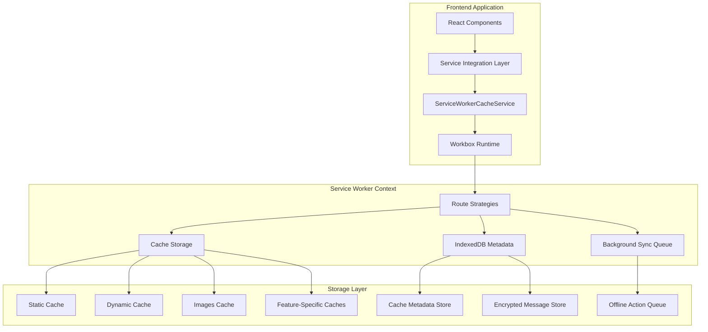

# Service Worker Cache Enhancement - Documentation

## Overview

This documentation package provides comprehensive guidance for implementing, deploying, and maintaining the enhanced service worker cache system. The system provides robust offline capabilities, improved performance, and feature-specific caching strategies for social feed, communities, marketplace, and messaging functionality.

## Documentation Structure

### 📋 [Technical Documentation](./TECHNICAL_DOCUMENTATION.md)
Complete API reference and architecture documentation including:
- Enhanced ServiceWorkerCacheService API
- Cache strategy implementations
- Data flow architecture
- Security considerations
- Troubleshooting guides

### 🚀 [Deployment and Operations Guide](./DEPLOYMENT_OPERATIONS_GUIDE.md)
Step-by-step deployment procedures and operational runbooks:
- Pre-deployment checklist
- Phased deployment procedures
- Monitoring requirements and KPIs
- Rollback procedures
- Operational runbooks

### 👨‍💻 [Developer Guide](./DEVELOPER_GUIDE.md)
Practical guide for developers implementing the cache system:
- Installation and setup
- Usage examples for each feature
- Performance optimization techniques
- Testing strategies
- Best practices

### 🔍 [Monitoring and Troubleshooting](./MONITORING_TROUBLESHOOTING.md)
Production monitoring and issue resolution:
- Real-time monitoring setup
- Key performance indicators
- Common issues and solutions
- Advanced troubleshooting tools
- Debug utilities

## Quick Start

### For Developers
1. Read the [Developer Guide](./DEVELOPER_GUIDE.md) for implementation details
2. Review the [Technical Documentation](./TECHNICAL_DOCUMENTATION.md) for API reference
3. Follow the setup instructions in the developer guide

### For DevOps/Operations
1. Review the [Deployment and Operations Guide](./DEPLOYMENT_OPERATIONS_GUIDE.md)
2. Set up monitoring using the [Monitoring and Troubleshooting](./MONITORING_TROUBLESHOOTING.md) guide
3. Familiarize yourself with rollback procedures

### For Support Teams
1. Start with the [Monitoring and Troubleshooting](./MONITORING_TROUBLESHOOTING.md) guide
2. Use the troubleshooting section in [Technical Documentation](./TECHNICAL_DOCUMENTATION.md)
3. Reference the operational runbooks for common issues

## Key Features

### 🚀 Performance Enhancements
- **Workbox Integration**: Modern service worker capabilities with routing strategies
- **Intelligent Preloading**: Predictive content loading based on user behavior
- **Storage Optimization**: Efficient quota management with LRU eviction
- **Response Time Optimization**: Sub-50ms cache hits, <2s network fallbacks

### 🔄 Feature-Specific Caching
- **Feed Caching**: NetworkFirst strategy with background refresh and predictive preloading
- **Community Caching**: StaleWhileRevalidate with bundled asset preloading
- **Marketplace Caching**: Mixed strategies optimized for inventory and pricing sensitivity
- **Messaging Storage**: Privacy-first IndexedDB with WebCrypto encryption

### 🔒 Security & Privacy
- **User Session Binding**: Automatic cache scoping and cleanup
- **PII Detection**: Automatic redaction of sensitive information
- **Encrypted Storage**: WebCrypto-based encryption for sensitive data
- **Privacy Headers**: Respect for Cache-Control and privacy directives

### 📱 Offline Capabilities
- **Background Sync**: Reliable offline action queuing with retry logic
- **Offline Indicators**: User-friendly offline state management
- **Progressive Enhancement**: Graceful degradation for unsupported browsers
- **Data Consistency**: Conflict resolution and sync ordering

## Architecture Overview

## Performance Targets

| Metric | Target | Warning | Critical |
|--------|--------|---------|----------|
| Feed Cache Hit Rate | >85% | <80% | <70% |
| Community Cache Hit Rate | >80% | <75% | <65% |
| Marketplace Cache Hit Rate | >75% | <70% | <60% |
| Cache Response Time | <50ms | >100ms | >200ms |
| Storage Utilization | <70% | >80% | >90% |
| Sync Success Rate | >95% | <90% | <80% |

## Browser Support

| Browser | Version | Support Level | Notes |
|---------|---------|---------------|-------|
| Chrome | 61+ | Full | Complete Workbox support |
| Firefox | 44+ | Full | Background sync limitations |
| Safari | 11.1+ | Partial | Limited IndexedDB in private browsing |
| Edge | 17+ | Full | Complete feature support |

## Migration Path

### From Current Implementation
1. **Phase 1**: Install Workbox and basic strategies (Week 1)
2. **Phase 2**: Implement metadata management and background sync (Week 2)
3. **Phase 3**: Add feature-specific optimizations (Week 3)
4. **Phase 4**: Enable advanced features and monitoring (Week 4)

### Backward Compatibility
- Existing cache service API remains functional
- Gradual migration with feature flags
- Automatic fallback for unsupported browsers
- Safe rollback procedures available

## Support and Maintenance

### Getting Help
1. **Common Issues**: Check [Monitoring and Troubleshooting](./MONITORING_TROUBLESHOOTING.md)
2. **API Questions**: Reference [Technical Documentation](./TECHNICAL_DOCUMENTATION.md)
3. **Implementation Help**: Follow [Developer Guide](./DEVELOPER_GUIDE.md)
4. **Deployment Issues**: Use [Deployment and Operations Guide](./DEPLOYMENT_OPERATIONS_GUIDE.md)

### Maintenance Schedule
- **Daily**: Automated monitoring and alerting
- **Weekly**: Performance analysis and optimization
- **Monthly**: Security review and dependency updates
- **Quarterly**: Architecture review and capacity planning

### Version Management
- **Semantic Versioning**: Major.Minor.Patch format
- **Cache Versioning**: Automatic cache migration between versions
- **Rollback Support**: Safe rollback to previous versions
- **Feature Flags**: Gradual rollout and A/B testing support

## Contributing

### Documentation Updates
1. Update relevant documentation files
2. Test examples and code snippets
3. Update version numbers and compatibility matrices
4. Review with team before deployment

### Code Changes
1. Follow the implementation patterns in the Developer Guide
2. Update documentation to reflect changes
3. Add appropriate tests and monitoring
4. Update deployment procedures if needed

## Changelog

### Version 1.0.0 (Current)
- Initial implementation with Workbox integration
- Feature-specific caching strategies
- Background sync and offline support
- Privacy-first messaging storage
- Comprehensive monitoring and alerting

### Planned Features
- **v1.1.0**: Enhanced preloading algorithms
- **v1.2.0**: Advanced compression and optimization
- **v1.3.0**: Machine learning-based cache optimization
- **v2.0.0**: Next-generation service worker features

## License and Legal

This documentation and associated code are part of the service worker cache enhancement project. Please ensure compliance with:
- Privacy regulations (GDPR, CCPA)
- Security requirements
- Browser vendor guidelines
- Open source license terms

---

For questions or support, please refer to the appropriate documentation section or contact the development team.