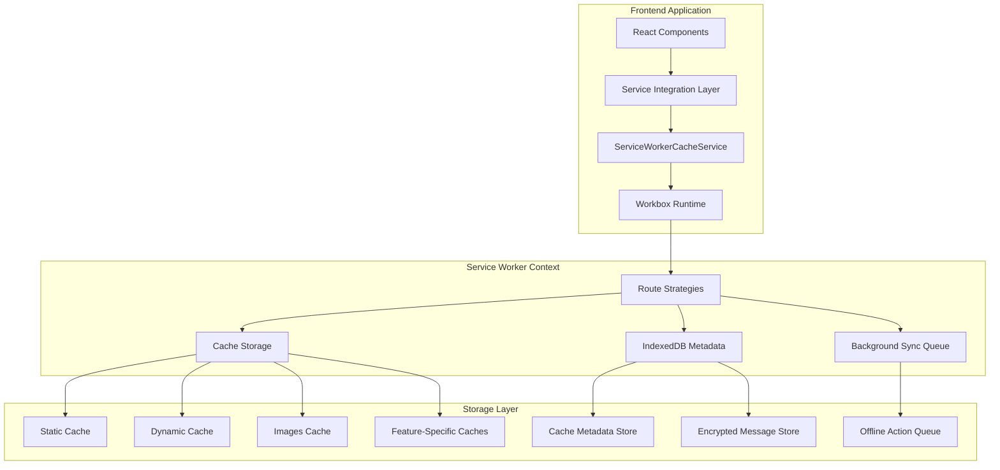
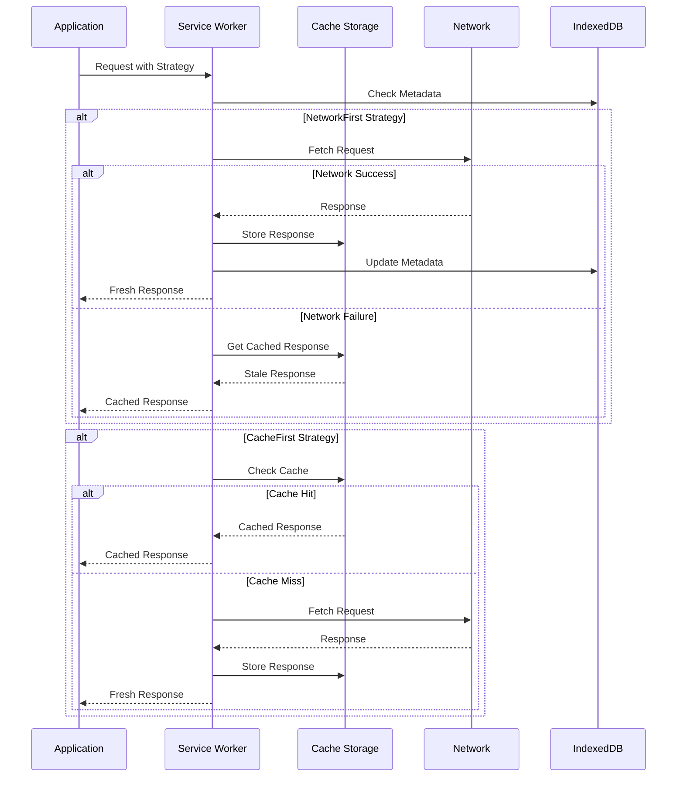

# Service Worker Cache Enhancement - Technical Documentation

## Overview

This document provides comprehensive technical documentation for the enhanced service worker cache system, including API reference, architecture details, troubleshooting guides, and security considerations.

## Enhanced ServiceWorkerCacheService API

### Core Methods

#### `fetchWithStrategy(url, strategy, options)`

Unified fetch method that applies specified caching strategies with enhanced features.

```typescript
interface CacheOptions {
  networkTimeoutSeconds?: number;
  cacheName?: string;
  plugins?: Plugin[];
  metadata?: CacheMetadata;
  tags?: string[];
}

// Usage Examples
const response = await cacheService.fetchWithStrategy(
  '/api/feed',
  'NetworkFirst',
  {
    networkTimeoutSeconds: 3,
    cacheName: 'feed-cache-v1',
    tags: ['feed', 'user-content'],
    metadata: { priority: 'high', userScope: userId }
  }
);
```

**Strategy Options:**
- `NetworkFirst`: Network request with cache fallback
- `CacheFirst`: Cache with network fallback for misses
- `StaleWhileRevalidate`: Serve from cache while updating in background
- `NetworkOnly`: Always fetch from network
- `CacheOnly`: Only serve from cache

#### `putWithMetadata(url, response, metadata)`

Stores responses in cache with associated metadata for advanced cache management.

```typescript
interface CacheMetadata {
  timestamp: number;
  ttl: number;
  tags: string[];
  contentType: string;
  size: number;
  userScope?: string;
  priority?: 'low' | 'medium' | 'high';
}

// Usage Example
await cacheService.putWithMetadata(
  '/api/community/123',
  response,
  {
    timestamp: Date.now(),
    ttl: 300000, // 5 minutes
    tags: ['community', 'community-123'],
    contentType: 'application/json',
    size: response.headers.get('content-length'),
    priority: 'medium'
  }
);
```

#### `invalidateByTag(tag)`

Removes all cache entries associated with specific tags.

```typescript
// Invalidate all feed-related cache entries
await cacheService.invalidateByTag('feed');

// Invalidate user-specific content
await cacheService.invalidateByTag(`user-${userId}`);

// Invalidate multiple tags
await Promise.all([
  cacheService.invalidateByTag('community-123'),
  cacheService.invalidateByTag('posts')
]);
```

#### `getCacheStats()`

Returns comprehensive cache performance metrics.

```typescript
interface CacheStats {
  hitRates: Record<string, { hits: number; misses: number; ratio: number }>;
  storage: { used: number; available: number; percentage: number };
  sync: { queueSize: number; successRate: number; averageRetryCount: number };
  preload: { successRate: number; averageLoadTime: number; bandwidthSaved: number };
}

const stats = await cacheService.getCacheStats();
console.log(`Feed cache hit rate: ${stats.hitRates['feed-cache-v1'].ratio}%`);
```

### Navigation Preload Methods

#### `enableNavigationPreload()`

Enables navigation preload for faster initial page loads.

```typescript
await cacheService.enableNavigationPreload();
```

#### `disableNavigationPreload()`

Disables navigation preload when not needed.

```typescript
await cacheService.disableNavigationPreload();
```

### Offline Queue Management

#### `flushOfflineQueue()`

Processes all queued offline actions using BackgroundSync.

```typescript
await cacheService.flushOfflineQueue();
```

## Architecture Documentation

### System Architecture



### Cache Strategy Flow



### Data Flow Architecture

#### Cache Metadata Management

```typescript
interface CacheEntry {
  url: string;
  cacheName: string;
  timestamp: number;
  ttl: number;
  tags: string[];
  metadata: {
    contentType: string;
    size: number;
    etag?: string;
    lastModified?: string;
    userScope?: string;
  };
  usage: {
    hitCount: number;
    lastAccessed: number;
    preloadSource?: string;
  };
}
```

#### Background Sync Queue

```typescript
interface OfflineAction {
  id: string;
  type: 'post' | 'comment' | 'reaction' | 'message';
  data: any;
  timestamp: number;
  retryCount: number;
  maxRetries: number;
  tags: string[];
}
```

### Feature-Specific Implementations

#### Feed Caching Strategy

- **Strategy**: NetworkFirst with 3-second timeout
- **Cache Name**: `feed-cache-v1`
- **TTL**: 5 minutes for posts, 1 minute for real-time updates
- **Preloading**: Next 2 pages, media thumbnails
- **Invalidation**: Tag-based on user actions

#### Community Caching Strategy

- **Strategy**: StaleWhileRevalidate
- **Cache Name**: `communities-cache-v1`
- **TTL**: 10 minutes for community data, 30 minutes for assets
- **Preloading**: Community icons, top posts, member counts
- **Invalidation**: Community-specific tags

#### Marketplace Caching Strategy

- **Listings**: NetworkFirst with 2-second timeout
- **Images**: CacheFirst with 24-hour expiration
- **Pricing**: NetworkFirst with 5-minute TTL and ETag validation
- **Cache Names**: `marketplace-listings-v1`, `marketplace-images-v1`, `marketplace-pricing-v1`

#### Messaging Storage

- **Storage**: IndexedDB with WebCrypto encryption
- **Key Derivation**: Session-based with automatic rotation
- **Conversation Lists**: NetworkFirst strategy
- **Attachments**: Privacy-aware caching with signed URLs

## Troubleshooting Guide

### Common Cache-Related Issues

#### Issue: Cache Not Updating

**Symptoms:**
- Stale content persists after updates
- New posts not appearing in feed
- User actions not reflected

**Diagnosis:**
```typescript
// Check cache metadata
const metadata = await cacheService.getCacheMetadata('/api/feed');
console.log('Cache age:', Date.now() - metadata.timestamp);
console.log('TTL remaining:', metadata.ttl - (Date.now() - metadata.timestamp));

// Check invalidation tags
console.log('Cache tags:', metadata.tags);
```

**Solutions:**
1. **Manual Invalidation:**
   ```typescript
   await cacheService.invalidateByTag('feed');
   ```

2. **Check Network Strategy:**
   ```typescript
   // Ensure NetworkFirst is used for dynamic content
   const response = await cacheService.fetchWithStrategy(
     '/api/feed',
     'NetworkFirst',
     { networkTimeoutSeconds: 3 }
   );
   ```

3. **Verify TTL Settings:**
   ```typescript
   // Reduce TTL for frequently changing content
   await cacheService.putWithMetadata(url, response, {
     ttl: 60000, // 1 minute
     tags: ['feed', 'real-time']
   });
   ```

#### Issue: Storage Quota Exceeded

**Symptoms:**
- Cache operations failing
- Console errors about storage quota
- Performance degradation

**Diagnosis:**
```typescript
const stats = await cacheService.getCacheStats();
console.log('Storage usage:', stats.storage.percentage + '%');
console.log('Available space:', stats.storage.available);
```

**Solutions:**
1. **Trigger Cleanup:**
   ```typescript
   await cacheService.performCleanup();
   ```

2. **Adjust Cache Limits:**
   ```typescript
   // Reduce maxEntries for image cache
   const imageStrategy = new CacheFirst({
     cacheName: 'images-cache-v1',
     plugins: [
       new ExpirationPlugin({
         maxEntries: 50, // Reduced from 100
         maxAgeSeconds: 86400
       })
     ]
   });
   ```

3. **Implement Proactive Monitoring:**
   ```typescript
   // Monitor storage usage
   setInterval(async () => {
     const stats = await cacheService.getCacheStats();
     if (stats.storage.percentage > 80) {
       await cacheService.performCleanup();
     }
   }, 300000); // Check every 5 minutes
   ```

#### Issue: Background Sync Not Working

**Symptoms:**
- Offline actions not syncing when online
- Queue building up without processing
- Sync events not firing

**Diagnosis:**
```typescript
const queueStatus = await cacheService.getQueueStatus();
console.log('Queue size:', queueStatus.size);
console.log('Failed actions:', queueStatus.failed);
console.log('Last sync:', queueStatus.lastSync);
```

**Solutions:**
1. **Manual Queue Flush:**
   ```typescript
   await cacheService.flushOfflineQueue();
   ```

2. **Check Browser Support:**
   ```typescript
   if ('serviceWorker' in navigator && 'sync' in window.ServiceWorkerRegistration.prototype) {
     // Background sync supported
   } else {
     // Implement fallback mechanism
     await cacheService.processQueueOnline();
   }
   ```

3. **Verify Sync Registration:**
   ```typescript
   // In service worker
   self.addEventListener('sync', event => {
     if (event.tag === 'background-sync') {
       event.waitUntil(processOfflineQueue());
     }
   });
   ```

#### Issue: Encrypted Message Storage Errors

**Symptoms:**
- Messages not storing offline
- Decryption failures
- Key rotation issues

**Diagnosis:**
```typescript
// Check encryption service status
const encryptionStatus = await messageEncryption.getStatus();
console.log('Key status:', encryptionStatus.keyStatus);
console.log('Last rotation:', encryptionStatus.lastRotation);
```

**Solutions:**
1. **Key Regeneration:**
   ```typescript
   await messageEncryption.regenerateKeys();
   ```

2. **Clear Corrupted Data:**
   ```typescript
   await messageStorage.clearCorruptedEntries();
   ```

3. **Fallback to Network:**
   ```typescript
   // Disable offline storage temporarily
   await messageStorage.setOfflineMode(false);
   ```

### Performance Troubleshooting

#### Slow Cache Operations

**Diagnosis:**
```typescript
const performanceMetrics = await cacheService.getPerformanceMetrics();
console.log('Average cache lookup time:', performanceMetrics.averageLookupTime);
console.log('Cache size:', performanceMetrics.totalCacheSize);
```

**Solutions:**
1. **Optimize Cache Structure:**
   ```typescript
   // Use separate caches for different content types
   const strategies = {
     'api/feed': 'feed-cache-v1',
     'api/communities': 'communities-cache-v1',
     'images/': 'images-cache-v1'
   };
   ```

2. **Implement Cache Warming:**
   ```typescript
   // Preload critical resources
   await cacheService.warmCache([
     '/api/feed',
     '/api/user/profile',
     '/api/communities/joined'
   ]);
   ```

#### High Memory Usage

**Solutions:**
1. **Implement Streaming:**
   ```typescript
   // Stream large responses instead of caching entirely
   const stream = await cacheService.getStream('/api/large-dataset');
   ```

2. **Use Compression:**
   ```typescript
   // Enable compression for cached responses
   const compressedResponse = await cacheService.compress(response);
   ```

### Browser-Specific Issues

#### Safari Limitations

- **Issue**: Limited IndexedDB support in private browsing
- **Solution**: Implement localStorage fallback
- **Issue**: Service worker lifecycle differences
- **Solution**: Use feature detection and graceful degradation

#### Firefox Quirks

- **Issue**: Different cache size limits
- **Solution**: Adjust maxEntries based on browser detection
- **Issue**: Background sync timing differences
- **Solution**: Implement retry logic with exponential backoff

#### Chrome Optimizations

- **Advantage**: Full Workbox support
- **Optimization**: Use Chrome-specific APIs when available
- **Monitoring**: Leverage Chrome DevTools for debugging

## Security Considerations

### Data Protection Measures

#### Cache Access Control

```typescript
interface SecurityPolicy {
  cacheAccess: {
    userScoped: boolean;
    sessionBound: boolean;
    encryptionRequired: string[]; // URL patterns
  };
  
  dataHandling: {
    piiDetection: boolean;
    sensitivePatterns: RegExp[];
    autoRedaction: boolean;
  };
  
  networkSecurity: {
    httpsOnly: boolean;
    corsValidation: boolean;
    headerValidation: string[];
  };
}
```

#### User Session Binding

All caches are automatically scoped to user sessions:

```typescript
// Cache keys include user context
const cacheKey = `${url}:${userSession.id}:${userSession.timestamp}`;

// Automatic cleanup on logout
self.addEventListener('message', event => {
  if (event.data.type === 'USER_LOGOUT') {
    await clearUserScopedCaches(event.data.userId);
  }
});
```

#### PII Detection and Redaction

```typescript
const piiPatterns = [
  /\b\d{3}-\d{2}-\d{4}\b/, // SSN
  /\b[A-Za-z0-9._%+-]+@[A-Za-z0-9.-]+\.[A-Z|a-z]{2,}\b/, // Email
  /\b\d{4}[\s-]?\d{4}[\s-]?\d{4}[\s-]?\d{4}\b/ // Credit card
];

// Automatic PII redaction before caching
const sanitizedContent = await sanitizeContent(responseText, piiPatterns);
```

### Privacy Protection Measures

#### Respect for Privacy Headers

```typescript
// Check privacy headers before caching
const cacheControl = response.headers.get('Cache-Control');
if (cacheControl?.includes('private') || cacheControl?.includes('no-store')) {
  // Skip caching for private content
  return response;
}
```

#### Encrypted Message Storage

```typescript
// WebCrypto-based encryption for sensitive data
const encryptedData = await crypto.subtle.encrypt(
  { name: 'AES-GCM', iv: iv },
  derivedKey,
  messageData
);

// Store encrypted data in IndexedDB
await messageStore.put({
  id: messageId,
  encryptedData: encryptedData,
  iv: iv,
  timestamp: Date.now()
});
```

#### Automatic Data Cleanup

```typescript
// Clean up sensitive data on session end
const cleanupSensitiveData = async () => {
  await Promise.all([
    clearCache('messaging-conversations-v1'),
    clearIndexedDBStore('encrypted-messages'),
    clearIndexedDBStore('user-preferences')
  ]);
};
```

### Network Security

#### HTTPS Enforcement

```typescript
// Only cache HTTPS requests
if (!request.url.startsWith('https://')) {
  return fetch(request);
}
```

#### CORS Validation

```typescript
// Validate CORS headers before caching
const corsHeaders = ['Access-Control-Allow-Origin', 'Access-Control-Allow-Methods'];
const hasValidCors = corsHeaders.every(header => 
  response.headers.has(header)
);

if (!hasValidCors) {
  console.warn('Invalid CORS headers, skipping cache');
  return response;
}
```

### Security Best Practices

1. **Regular Security Audits**: Implement automated security scanning
2. **Key Rotation**: Automatic encryption key rotation every 24 hours
3. **Access Logging**: Log all cache access for security monitoring
4. **Content Validation**: Validate all cached content before serving
5. **Secure Defaults**: Use secure configurations by default

### Compliance Considerations

#### GDPR Compliance

- **Right to be Forgotten**: Implement user data deletion
- **Data Minimization**: Cache only necessary data
- **Consent Management**: Respect user privacy preferences

#### Security Headers

```typescript
// Validate security headers
const requiredHeaders = [
  'Content-Security-Policy',
  'X-Frame-Options',
  'X-Content-Type-Options'
];

const hasSecurityHeaders = requiredHeaders.every(header =>
  response.headers.has(header)
);
```

This technical documentation provides comprehensive coverage of the enhanced service worker cache system, including detailed API reference, architecture documentation, troubleshooting guides, and security considerations as required by the specification.