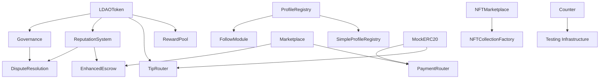

# Smart Contract Implementation Design

## Overview

This design document outlines the architecture and implementation strategy for deploying a comprehensive smart contract ecosystem consisting of 16 interconnected contracts. The system provides governance, marketplace functionality, NFT trading, reputation management, and social features for a Web3 platform.

## Architecture

### Contract Hierarchy and Dependencies



### Deployment Phases

The contracts will be deployed in four distinct phases to ensure proper dependency management:

1. **Phase 1: Foundation Layer**
   - LDAOToken (core governance token)
   - MockERC20 (for testing)
   - Counter (testing utility)

2. **Phase 2: Core Services**
   - Governance (DAO functionality)
   - ReputationSystem (user scoring)
   - ProfileRegistry & SimpleProfileRegistry (identity)
   - PaymentRouter (payment processing)

3. **Phase 3: Marketplace Layer**
   - EnhancedEscrow (transaction security)
   - DisputeResolution (conflict resolution)
   - Marketplace (main trading platform)
   - RewardPool (incentive distribution)

4. **Phase 4: Extended Features**
   - NFTMarketplace (NFT trading)
   - NFTCollectionFactory (NFT creation)
   - TipRouter (social tipping)
   - FollowModule (social connections)

## Components and Interfaces

### Core Token System

**LDAOToken Contract**
- ERC20 with permit functionality
- Staking mechanisms with multiple tiers
- Voting power calculation
- Premium membership through staking
- Activity rewards for marketplace participation

**Key Features:**
- 1 billion token initial supply
- 4 staking tiers (30d, 90d, 180d, 365d)
- Reward rates from 5% to 18% APR
- 2x voting power for staked tokens
- Discount tiers based on staking amount

### Governance System

**Governance Contract**
- Proposal creation and voting
- Category-specific governance rules
- Staking requirements for sensitive proposals
- Time-locked execution for security
- Delegate voting support

**Proposal Categories:**
- General (no staking required)
- Marketplace Policy (requires staking)
- Fee Structure (high quorum)
- Security Upgrades (highest security)
- Token Economics (critical changes)

### Marketplace Infrastructure

**Marketplace Contract**
- Multi-asset trading (ETH, ERC20, NFTs)
- Fixed price and auction listings
- Offer system for negotiations
- Order management and tracking
- Reputation integration

**EnhancedEscrow Contract**
- Automated fund release mechanisms
- Multi-signature support for high-value transactions
- Time-lock security features
- Delivery confirmation system
- Emergency refund capabilities

**DisputeResolution Contract**
- Automated arbitration for small disputes
- Community voting for medium disputes
- DAO escalation for high-value disputes
- Evidence submission and management
- Arbitrator application and approval system

### NFT Ecosystem

**NFTMarketplace Contract**
- NFT minting with metadata and royalties
- Fixed price and auction sales
- Offer system for NFTs
- Royalty distribution
- Collection verification

**NFTCollectionFactory Contract**
- Custom NFT collection creation
- Configurable minting parameters
- Whitelist management
- Royalty settings
- Collection verification system

### Social Features

**TipRouter Contract**
- Creator tipping with LDAO tokens
- Fee distribution to reward pool
- Permit-based gasless tipping
- Post-based tip tracking

**FollowModule Contract**
- User following/unfollowing
- Follower count tracking
- Social graph management

**RewardPool Contract**
- Community reward distribution
- Epoch-based funding
- Claim mechanisms
- Integration with other contracts

### Identity and Reputation

**ProfileRegistry Contract**
- NFT-based user profiles
- Handle reservation system
- Avatar and bio storage via IPFS
- ENS integration

**ReputationSystem Contract**
- Weighted reputation scoring
- Anti-gaming mechanisms
- Review verification system
- Moderator management
- Suspicious activity detection

## Data Models

### Core Data Structures

```solidity
// LDAOToken
struct StakeInfo {
    uint256 amount;
    uint256 stakingStartTime;
    uint256 lockPeriod;
    uint256 rewardRate;
    uint256 lastRewardClaim;
    bool isActive;
}

// Marketplace
struct Listing {
    uint256 id;
    address seller;
    address tokenAddress;
    uint256 price;
    uint256 quantity;
    ItemType itemType;
    ListingType listingType;
    ListingStatus status;
    // ... additional fields
}

// EnhancedEscrow
struct Escrow {
    uint256 id;
    uint256 listingId;
    address buyer;
    address seller;
    uint256 amount;
    EscrowStatus status;
    // ... additional fields
}

// ReputationSystem
struct ReputationScore {
    uint256 totalPoints;
    uint256 reviewCount;
    uint256 averageRating;
    uint256 weightedScore;
    ReputationTier tier;
    // ... additional fields
}
```

### State Management

- **Storage Optimization**: Use packed structs and efficient data types
- **Gas Efficiency**: Implement batch operations for multiple updates
- **Event Logging**: Comprehensive event emission for off-chain indexing
- **Access Patterns**: Optimize for common read/write operations

## Error Handling

### Security Measures

1. **Reentrancy Protection**: All external calls protected with ReentrancyGuard
2. **Access Control**: Role-based permissions using OpenZeppelin's AccessControl
3. **Input Validation**: Comprehensive parameter validation
4. **Overflow Protection**: Use of SafeMath or Solidity 0.8+ built-in protection
5. **Emergency Mechanisms**: Pause functionality for critical contracts

### Error Recovery

1. **Graceful Degradation**: Contracts continue operating even if dependencies fail
2. **Rollback Mechanisms**: Ability to revert state changes in case of errors
3. **Circuit Breakers**: Automatic suspension of operations under abnormal conditions
4. **Manual Overrides**: Administrative functions for emergency interventions

## Testing Strategy

### Unit Testing

- **Contract-Level Tests**: Individual contract functionality
- **Function-Level Tests**: Each public function tested independently
- **Edge Case Testing**: Boundary conditions and error scenarios
- **Gas Usage Testing**: Optimization verification

### Integration Testing

- **Cross-Contract Interactions**: Multi-contract workflows
- **End-to-End Scenarios**: Complete user journeys
- **Upgrade Testing**: Proxy upgrade scenarios
- **Performance Testing**: High-load scenarios

### Security Testing

- **Static Analysis**: Slither, MythX, and other tools
- **Formal Verification**: Critical functions mathematically proven
- **Penetration Testing**: Simulated attacks
- **Audit Preparation**: Code review and documentation

### Test Coverage Requirements

- Minimum 90% line coverage
- 100% branch coverage for critical paths
- All public functions tested
- All error conditions tested

## Deployment Strategy

### Network Configuration

**Testnet Deployment:**
- Sepolia for Ethereum testing
- Mumbai for Polygon testing
- Comprehensive testing before mainnet

**Mainnet Deployment:**
- Ethereum mainnet for core contracts
- Polygon for high-frequency operations
- Cross-chain bridge integration

### Deployment Scripts

```typescript
// Deployment sequence
1. Deploy LDAOToken with initial supply
2. Deploy Governance with token address
3. Deploy ReputationSystem
4. Deploy ProfileRegistry
5. Deploy PaymentRouter with supported tokens
6. Deploy EnhancedEscrow with governance address
7. Deploy DisputeResolution with dependencies
8. Deploy Marketplace with all dependencies
9. Deploy NFT contracts
10. Deploy social contracts
11. Configure all contract addresses
12. Transfer ownership to DAO
```

### Configuration Management

- **Environment Variables**: Secure parameter management
- **Address Registry**: Centralized contract address management
- **Parameter Updates**: DAO-controlled configuration changes
- **Verification**: Etherscan verification for all contracts

## Gas Optimization

### Optimization Strategies

1. **Storage Packing**: Efficient struct packing to minimize storage slots
2. **Batch Operations**: Multiple operations in single transaction
3. **Event Optimization**: Indexed parameters for efficient filtering
4. **Function Modifiers**: Reusable validation logic
5. **Library Usage**: Shared code through libraries

### Gas Estimates

- Token transfers: ~50,000 gas
- Marketplace listings: ~150,000 gas
- Escrow creation: ~200,000 gas
- Governance voting: ~100,000 gas
- NFT minting: ~180,000 gas

## Security Considerations

### Access Control Matrix

| Contract | Admin Functions | User Functions | Moderator Functions |
|----------|----------------|----------------|-------------------|
| LDAOToken | Mint, Burn | Stake, Transfer | None |
| Governance | Parameters | Vote, Propose | None |
| Marketplace | Fees, Pause | List, Buy | Verify |
| Escrow | Emergency | Create, Approve | Resolve |
| Reputation | Suspend | Review, Vote | Verify |

### Risk Mitigation

1. **Multi-signature Requirements**: Critical operations require multiple signatures
2. **Time Delays**: Important changes have mandatory waiting periods
3. **Rate Limiting**: Prevent spam and abuse
4. **Circuit Breakers**: Automatic shutdown under attack
5. **Upgrade Governance**: Community-controlled upgrades

## Integration Points

### External Dependencies

- **OpenZeppelin Contracts**: Security and standard implementations
- **IPFS**: Metadata and content storage
- **Chainlink Oracles**: Price feeds for multi-currency support
- **The Graph**: Event indexing and querying

### API Interfaces

- **Web3 Integration**: Direct contract interaction
- **SDK Wrappers**: Simplified integration libraries
- **Event Streaming**: Real-time updates
- **GraphQL Endpoints**: Structured data queries

### Frontend Integration

- **Contract ABIs**: Type-safe contract interactions
- **Event Listeners**: Real-time UI updates
- **Transaction Management**: User-friendly transaction flows
- **Error Handling**: Graceful error presentation

## Monitoring and Maintenance

### Operational Monitoring

- **Transaction Monitoring**: Success rates and gas usage
- **Contract State**: Key metrics and health indicators
- **User Activity**: Adoption and usage patterns
- **Security Alerts**: Unusual activity detection

### Maintenance Procedures

- **Regular Audits**: Periodic security reviews
- **Parameter Tuning**: Performance optimization
- **Bug Fixes**: Rapid response to issues
- **Feature Updates**: Community-driven enhancements

This design provides a comprehensive foundation for implementing the smart contract ecosystem with proper security, efficiency, and maintainability considerations.