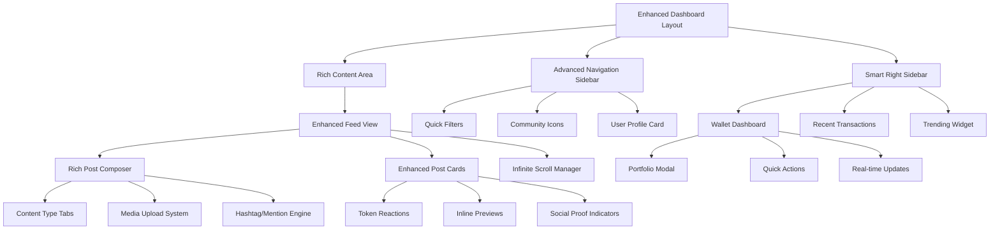
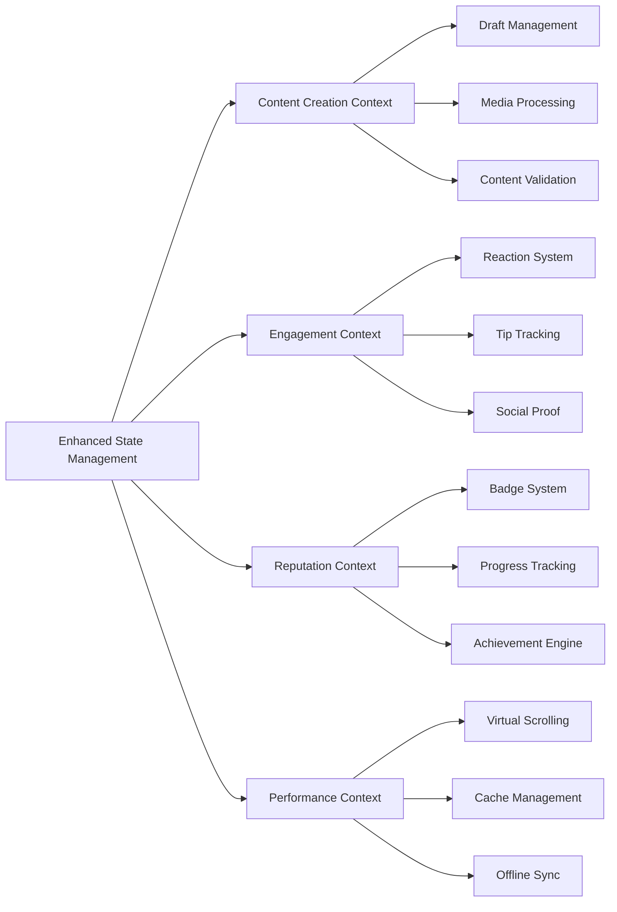

# Design Document

## Overview

This design document outlines the advanced enhancements to the existing social dashboard, transforming it into a sophisticated Web3 social platform that rivals modern social media experiences while maintaining blockchain-native features. The enhancements focus on rich content creation, token-based engagement, gamified reputation systems, and polished user experience.

The design builds upon the successful 3-column dashboard layout and extends it with advanced features that leverage Web3 capabilities for unique social interactions. The goal is to create a platform that feels familiar to traditional social media users while providing innovative blockchain-powered features.

## Architecture

### Enhanced Component Architecture



### State Management Architecture



## Components and Interfaces

### 1. Enhanced Post Composer

**Purpose**: Advanced content creation interface with multiple content types and rich features

**Component Structure**:
```typescript
interface EnhancedPostComposerProps {
  context: 'feed' | 'community';
  communityId?: string;
  initialContentType?: ContentType;
  onSubmit: (post: RichPostInput) => Promise<void>;
  onDraftSave: (draft: PostDraft) => void;
}

enum ContentType {
  TEXT = 'text',
  MEDIA = 'media',
  LINK = 'link',
  POLL = 'poll',
  PROPOSAL = 'proposal'
}

interface RichPostInput {
  contentType: ContentType;
  title?: string;
  content: string;
  media?: MediaFile[];
  links?: LinkPreview[];
  poll?: PollData;
  proposal?: ProposalData;
  hashtags: string[];
  mentions: string[];
  communityId?: string;
  scheduledAt?: Date;
}
```

**Features**:
- **Content Type Tabs**: Dynamic interface that adapts based on selected content type
- **Drag & Drop System**: Advanced file upload with preview, progress, and editing capabilities
- **Smart Autocomplete**: Real-time hashtag and mention suggestions with user/topic search
- **Rich Text Editor**: Markdown support with live preview and formatting toolbar
- **Media Processing**: Automatic image optimization, cropping tools, and format conversion
- **Draft Management**: Auto-save drafts with recovery and scheduling capabilities

**Sub-Components**:
- `ContentTypeTabs`: Tab interface for switching between content types
- `MediaUploadZone`: Drag & drop area with preview and editing tools
- `HashtagMentionInput`: Smart input with autocomplete and validation
- `PollCreator`: Interface for creating token-weighted polls
- `ProposalCreator`: Governance proposal creation with template support

### 2. Enhanced Post Cards

**Purpose**: Rich post display with inline previews, token reactions, and social proof

**Component Structure**:
```typescript
interface EnhancedPostCardProps {
  post: EnhancedPost;
  context: 'feed' | 'community';
  onReaction: (type: ReactionType, amount?: number) => void;
  onTip: (amount: number, token: string) => void;
  onShare: (platform?: string) => void;
  showSocialProof?: boolean;
}

interface EnhancedPost extends Post {
  reactions: TokenReaction[];
  tips: TipActivity[];
  previews: ContentPreview[];
  socialProof: SocialProofData;
  engagementScore: number;
  trendingStatus?: TrendingLevel;
}

interface TokenReaction {
  type: '🔥' | '🚀' | '💎' | '👍' | '❤️';
  users: ReactionUser[];
  totalAmount: number;
  tokenType: string;
}

interface ContentPreview {
  type: 'nft' | 'link' | 'proposal' | 'token';
  data: NFTPreview | LinkPreview | ProposalPreview | TokenPreview;
  thumbnail?: string;
  metadata: Record<string, any>;
}
```

**Features**:
- **Visual Hierarchy**: Emphasized titles and content with subtle metadata styling
- **Inline Previews**: Rich previews for NFTs, links, proposals, and token transactions
- **Token Reactions**: Web3-native reaction system with token staking and visual feedback
- **Social Proof**: "Liked by" style indicators showing who engaged with content
- **Trending Indicators**: Visual badges and highlights for trending content
- **Engagement Analytics**: Real-time engagement metrics and interaction history

**Sub-Components**:
- `TokenReactionBar`: Interactive reaction buttons with token amounts
- `InlinePreviewRenderer`: Dynamic preview component for different content types
- `SocialProofIndicator`: Shows engagement from followed users
- `TrendingBadge`: Visual indicator for trending content
- `TipActivityDisplay`: Shows tipping activity and top contributors

### 3. Advanced Navigation Sidebar

**Purpose**: Enhanced left sidebar with quick filters, community management, and user profile

**Component Structure**:
```typescript
interface AdvancedNavigationSidebarProps {
  user: EnhancedUserProfile;
  communities: CommunityWithIcons[];
  activeFilters: QuickFilter[];
  onFilterChange: (filters: QuickFilter[]) => void;
  onCommunitySelect: (communityId: string) => void;
}

interface QuickFilter {
  id: string;
  label: string;
  icon: string;
  count?: number;
  active: boolean;
  query: FilterQuery;
}

interface CommunityWithIcons extends Community {
  icon: string;
  unreadCount: number;
  lastActivity: Date;
  userRole: CommunityRole;
}
```

**Features**:
- **Quick Filters**: Predefined filters for My Posts, Tipped Posts, Governance Posts
- **Community Icons**: Visual community list with logos, unread counts, and activity indicators
- **Enhanced User Profile**: Expanded profile card with reputation, badges, and quick stats
- **Smart Navigation**: Context-aware navigation with breadcrumbs and history
- **Notification Indicators**: Real-time notification badges and activity indicators

**Sub-Components**:
- `QuickFilterPanel`: Filter buttons with counts and active states
- `CommunityIconList`: Visual community list with hover previews
- `EnhancedUserCard`: Rich user profile with reputation and badges
- `NavigationBreadcrumbs`: Context-aware navigation path
- `ActivityIndicators`: Real-time notification and activity badges

### 4. Smart Right Sidebar

**Purpose**: Contextual information panel with wallet integration, trending content, and quick actions

**Component Structure**:
```typescript
interface SmartRightSidebarProps {
  context: 'feed' | 'community';
  communityId?: string;
  walletData: EnhancedWalletData;
  trendingContent: TrendingItem[];
  onQuickAction: (action: QuickAction) => void;
}

interface EnhancedWalletData {
  address: string;
  balances: TokenBalance[];
  recentTransactions: Transaction[];
  portfolioValue: number;
  portfolioChange: number;
  quickActions: QuickAction[];
}

interface QuickAction {
  id: string;
  label: string;
  icon: string;
  action: () => Promise<void>;
  disabled?: boolean;
  tooltip?: string;
}
```

**Features**:
- **Wallet Dashboard**: Comprehensive wallet overview with portfolio tracking
- **Recent Transactions**: Mini-feed of recent blockchain transactions
- **Quick Actions**: One-click send/receive buttons for popular tokens
- **Portfolio Modal**: Expandable detailed portfolio view
- **Trending Widget**: Context-aware trending content and recommendations
- **Real-time Updates**: Live updates for wallet balances and transaction status

**Sub-Components**:
- `WalletDashboard`: Compact wallet overview with key metrics
- `TransactionMiniFeed`: Scrollable list of recent transactions
- `QuickActionButtons`: One-click action buttons for common operations
- `PortfolioModal`: Detailed portfolio view with charts and analytics
- `TrendingContentWidget`: Contextual trending content recommendations

### 5. Reputation and Badge System

**Purpose**: Gamified reputation system with badges, progress tracking, and achievements

**Component Structure**:
```typescript
interface ReputationSystemProps {
  user: UserReputation;
  onBadgeClick: (badge: Badge) => void;
  onProgressView: () => void;
}

interface UserReputation {
  totalScore: number;
  level: ReputationLevel;
  badges: Badge[];
  progress: ProgressMilestone[];
  breakdown: ReputationBreakdown;
  achievements: Achievement[];
}

interface Badge {
  id: string;
  name: string;
  description: string;
  icon: string;
  rarity: 'common' | 'rare' | 'epic' | 'legendary';
  earnedAt: Date;
  requirements: BadgeRequirement[];
}

interface ProgressMilestone {
  category: 'posting' | 'governance' | 'community' | 'trading';
  current: number;
  target: number;
  reward: string;
  progress: number;
}
```

**Features**:
- **Badge Display**: Visual badge collection with rarity indicators and tooltips
- **Progress Bars**: Animated progress indicators for different reputation categories
- **Mini-Profile Cards**: Hover cards showing user reputation, badges, and quick actions
- **Achievement Notifications**: Celebratory animations for milestone achievements
- **Reputation Breakdown**: Detailed view of how reputation points were earned
- **Leaderboards**: Community and global reputation rankings

**Sub-Components**:
- `BadgeCollection`: Grid display of earned badges with hover effects
- `ProgressIndicator`: Animated progress bars with milestone markers
- `MiniProfileCard`: Compact user profile with reputation highlights
- `AchievementNotification`: Toast notifications for new achievements
- `ReputationBreakdown`: Detailed reputation analytics and history

### 6. Token Reaction System

**Purpose**: Web3-native reaction system with token staking and social proof

**Component Structure**:
```typescript
interface TokenReactionSystemProps {
  postId: string;
  reactions: TokenReaction[];
  userWallet: string;
  onReact: (type: ReactionType, amount: number) => Promise<void>;
  onViewReactors: (type: ReactionType) => void;
}

interface ReactionType {
  emoji: string;
  name: string;
  tokenCost: number;
  multiplier: number;
  animation: string;
}

const REACTION_TYPES: ReactionType[] = [
  { emoji: '🔥', name: 'Fire', tokenCost: 1, multiplier: 1.5, animation: 'flame' },
  { emoji: '🚀', name: 'Rocket', tokenCost: 2, multiplier: 2.0, animation: 'launch' },
  { emoji: '💎', name: 'Diamond', tokenCost: 5, multiplier: 3.0, animation: 'sparkle' },
];
```

**Features**:
- **Token-Based Reactions**: Reactions require token staking with different costs and multipliers
- **Animated Feedback**: Smooth animations for reaction interactions
- **Social Proof Display**: Shows who reacted with token amounts
- **Reaction Analytics**: Tracks reaction trends and user preferences
- **Milestone Celebrations**: Special animations when reactions reach thresholds
- **Reactor Modal**: Detailed view of all users who reacted to content

**Sub-Components**:
- `ReactionButton`: Individual reaction button with token cost and animation
- `ReactionSummary`: Compact display of all reactions with counts
- `ReactorModal`: Modal showing all users who reacted with amounts
- `ReactionAnimation`: Custom animations for different reaction types
- `SocialProofIndicator`: Shows reactions from followed users

## Data Models

### Enhanced Post Model

```typescript
interface EnhancedPost {
  id: string;
  author: EnhancedUserProfile;
  content: RichContent;
  createdAt: Date;
  updatedAt: Date;
  
  // Engagement Data
  reactions: TokenReaction[];
  tips: TipActivity[];
  comments: EnhancedComment[];
  shares: ShareActivity[];
  views: number;
  engagementScore: number;
  
  // Content Enhancements
  previews: ContentPreview[];
  hashtags: string[];
  mentions: string[];
  media: MediaFile[];
  
  // Social Proof
  socialProof: SocialProofData;
  trendingStatus?: TrendingLevel;
  pinnedUntil?: Date;
  
  // Community Context
  communityId?: string;
  communityFlair?: string;
  moderationStatus: ModerationStatus;
}

interface RichContent {
  type: ContentType;
  title?: string;
  body: string;
  poll?: PollData;
  proposal?: ProposalData;
  formatting: ContentFormatting;
}

interface SocialProofData {
  followedUsersWhoEngaged: UserProfile[];
  totalEngagementFromFollowed: number;
  communityLeadersWhoEngaged: UserProfile[];
  verifiedUsersWhoEngaged: UserProfile[];
}
```

### Enhanced User Profile Model

```typescript
interface EnhancedUserProfile {
  id: string;
  walletAddress: string;
  username: string;
  displayName: string;
  avatar: string;
  bio: string;
  
  // Reputation System
  reputation: UserReputation;
  badges: Badge[];
  achievements: Achievement[];
  level: ReputationLevel;
  
  // Social Data
  followers: number;
  following: number;
  posts: number;
  communities: CommunityMembership[];
  
  // Web3 Data
  ensName?: string;
  nftCollections: NFTCollection[];
  tokenBalances: TokenBalance[];
  governanceParticipation: GovernanceActivity[];
  
  // Activity Data
  lastActive: Date;
  joinedAt: Date;
  activityScore: number;
  engagementRate: number;
}

interface UserReputation {
  totalScore: number;
  level: ReputationLevel;
  breakdown: {
    posting: number;
    governance: number;
    community: number;
    trading: number;
    moderation: number;
  };
  progress: ProgressMilestone[];
  history: ReputationEvent[];
}
```

### Content Preview Models

```typescript
interface NFTPreview {
  contractAddress: string;
  tokenId: string;
  name: string;
  description: string;
  image: string;
  collection: string;
  owner: string;
  price?: TokenAmount;
  rarity?: number;
}

interface LinkPreview {
  url: string;
  title: string;
  description: string;
  image: string;
  siteName: string;
  type: 'article' | 'video' | 'product' | 'website';
  metadata: Record<string, any>;
}

interface ProposalPreview {
  id: string;
  title: string;
  description: string;
  status: ProposalStatus;
  votingEnds: Date;
  yesVotes: number;
  noVotes: number;
  quorum: number;
  proposer: string;
}

interface TokenPreview {
  symbol: string;
  name: string;
  amount: number;
  usdValue: number;
  change24h: number;
  logo: string;
  contractAddress: string;
}
```

## Error Handling

### Enhanced Error Management

```typescript
interface ErrorHandlingStrategy {
  // Content Creation Errors
  contentValidation: ValidationErrorHandler;
  mediaUpload: MediaErrorHandler;
  draftRecovery: DraftRecoveryHandler;
  
  // Engagement Errors
  reactionFailure: ReactionErrorHandler;
  tipFailure: TipErrorHandler;
  walletConnection: WalletErrorHandler;
  
  // Performance Errors
  loadingFailure: LoadingErrorHandler;
  cacheFailure: CacheErrorHandler;
  offlineSync: OfflineSyncHandler;
}
```

**Error Recovery Strategies**:
1. **Graceful Degradation**: Core functionality works even when advanced features fail
2. **Retry Mechanisms**: Automatic retry for transient failures with exponential backoff
3. **Offline Support**: Queue actions when offline and sync when connection returns
4. **User Feedback**: Clear error messages with actionable recovery steps
5. **Fallback Content**: Show cached or placeholder content when live data fails

## Testing Strategy

### Comprehensive Testing Approach

**Unit Testing**:
- Component testing for all enhanced UI components
- Hook testing for reputation, engagement, and content management
- Utility testing for token calculations, content parsing, and validation
- Service testing for API interactions and blockchain operations

**Integration Testing**:
- End-to-end content creation workflows
- Token reaction and tipping flows
- Reputation system integration
- Wallet and blockchain integration
- Real-time update mechanisms

**Performance Testing**:
- Virtual scrolling with large datasets
- Media upload and processing performance
- Token reaction animation performance
- Cache effectiveness and memory usage
- Mobile device performance optimization

**Accessibility Testing**:
- Screen reader compatibility for all new features
- Keyboard navigation for complex interactions
- Color contrast compliance for new visual elements
- Focus management in modals and dynamic content

## Performance Considerations

### Optimization Strategies

**Virtual Scrolling Implementation**:
```typescript
interface VirtualScrollConfig {
  itemHeight: number;
  bufferSize: number;
  threshold: number;
  preloadCount: number;
  recycleNodes: boolean;
}
```

**Caching Strategy**:
- **Content Cache**: Intelligent caching of posts, comments, and user data
- **Media Cache**: Progressive image loading with blur-to-sharp transitions
- **Reputation Cache**: Cache reputation calculations and badge data
- **Wallet Cache**: Cache wallet balances and transaction history

**Bundle Optimization**:
- **Code Splitting**: Separate bundles for different content types and features
- **Lazy Loading**: Load advanced features only when needed
- **Tree Shaking**: Remove unused code from Web3 and UI libraries
- **Dynamic Imports**: Load components on demand based on user interactions

**Real-time Performance**:
- **WebSocket Optimization**: Efficient real-time updates with connection pooling
- **Debounced Updates**: Batch rapid updates to prevent UI thrashing
- **Selective Rendering**: Update only changed components in large lists
- **Memory Management**: Proper cleanup of event listeners and subscriptions

## Security Considerations

### Enhanced Security Measures

**Content Security**:
- **Input Sanitization**: Comprehensive XSS prevention for rich content
- **Media Validation**: Secure file upload with type and size validation
- **Link Verification**: Safe link preview generation with sandbox execution
- **Content Moderation**: AI-powered content filtering integration

**Web3 Security**:
- **Transaction Validation**: Verify all token transactions and smart contract calls
- **Wallet Security**: Secure wallet connection with session management
- **Token Approval**: Safe token approval flows with clear user consent
- **Smart Contract Integration**: Secure interaction with deployed contracts

**Privacy Protection**:
- **Data Minimization**: Collect only necessary user data
- **Encryption**: Encrypt sensitive user data and communications
- **Access Control**: Role-based access for community and moderation features
- **Audit Logging**: Comprehensive logging for security monitoring

## Migration and Deployment

### Phased Rollout Strategy

**Phase 1: Enhanced Content Creation (Week 1-2)**
- Deploy enhanced post composer with content type tabs
- Add drag & drop media upload system
- Implement hashtag and mention autocomplete
- Test with limited user group

**Phase 2: Token Reactions and Engagement (Week 3-4)**
- Roll out token-based reaction system
- Add inline content previews
- Implement social proof indicators
- Deploy to broader user base

**Phase 3: Reputation and Gamification (Week 5-6)**
- Launch badge and achievement system
- Add reputation progress tracking
- Implement mini-profile cards
- Full feature testing and optimization

**Phase 4: Visual Polish and Performance (Week 7-8)**
- Apply glassmorphism and animation enhancements
- Implement virtual scrolling and performance optimizations
- Add dark/light theme toggle
- Final testing and production deployment

### Rollback Strategy

- **Feature Flags**: Use feature flags to enable/disable new features
- **Database Migrations**: Reversible database schema changes
- **Component Fallbacks**: Fallback to original components if new ones fail
- **Monitoring**: Comprehensive monitoring to detect issues early

## Future Enhancements

### Advanced Features Roadmap

**AI-Powered Features**:
- Smart content recommendations based on user behavior
- Automated content moderation with human oversight
- Intelligent hashtag and mention suggestions
- Personalized feed curation algorithms

**Advanced Web3 Integration**:
- Cross-chain token reactions and tipping
- NFT-gated communities and content
- DeFi yield farming integration in communities
- Advanced governance features with delegation

**Social Features**:
- Direct messaging with encryption
- Live streaming and video content
- Community events and calendar integration
- Advanced analytics and insights dashboard

**Mobile Enhancements**:
- Native mobile app with push notifications
- Biometric authentication integration
- Offline-first architecture with sync
- Mobile-specific UI optimizations