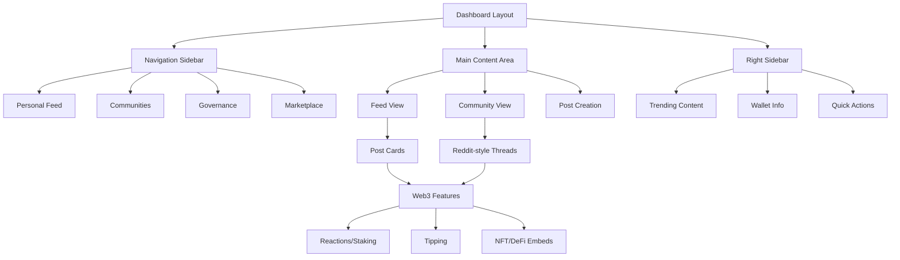

# Design Document

## Overview

This design transforms the existing web3 social platform into a unified, Facebook-style dashboard that integrates personal feeds, community discussions, and web3 functionality. The redesign consolidates the current separate pages (dashboard, social, communities) into a cohesive experience while maintaining all existing web3 features and adding Reddit-style community functionality.

The design leverages the existing component architecture and extends it with new layouts, navigation patterns, and community features. The goal is to create an intuitive, modern social platform that feels familiar to users of traditional social media while providing advanced web3 capabilities.

## Architecture

### High-Level Architecture



### Component Hierarchy

```
DashboardLayout
├── NavigationSidebar
│   ├── UserProfile
│   ├── NavigationMenu
│   └── CommunityList
├── MainContentArea
│   ├── FeedView
│   │   ├── PostCreationInterface
│   │   └── PostFeed
│   └── CommunityView
│       ├── CommunityHeader
│       ├── PostCreationInterface
│       └── ThreadedDiscussions
└── RightSidebar
    ├── TrendingWidget
    ├── WalletWidget
    └── QuickActionsWidget
```

### State Management

The application will use React Context and hooks for state management:

- **Web3Context**: Wallet connection, user authentication
- **FeedContext**: Personal feed data, post interactions
- **CommunityContext**: Community data, memberships, discussions
- **UIContext**: Layout state, active views, modals

## Components and Interfaces

### 1. DashboardLayout Component

**Purpose**: Main layout wrapper that provides the Facebook-style three-column layout

**Props**:
```typescript
interface DashboardLayoutProps {
  children: React.ReactNode;
  activeView: 'feed' | 'community';
  communityId?: string;
}
```

**Features**:
- Responsive three-column layout (sidebar, main, right sidebar)
- Mobile-first design with collapsible sidebars
- Sticky navigation and quick actions
- Smooth transitions between views

### 2. NavigationSidebar Component

**Purpose**: Left sidebar containing user profile, navigation, and community list

**Features**:
- User profile summary with avatar, reputation, and quick stats
- Main navigation menu (Feed, Communities, Governance, Marketplace)
- Joined communities list with unread indicators
- Community discovery and join functionality
- Collapsible on mobile with overlay

**Structure**:
```typescript
interface NavigationSidebarProps {
  user: UserProfile;
  communities: Community[];
  activeView: string;
  onViewChange: (view: string) => void;
  onCommunitySelect: (communityId: string) => void;
}
```

### 3. FeedView Component

**Purpose**: Main content area for personal feed display

**Features**:
- Integrated post creation interface at the top
- Chronological feed of followed users' posts
- Infinite scroll with pagination
- Filter options (All, Following, Trending)
- Empty state with suggested users to follow

**Integration Points**:
- Reuses existing `Web3SocialPostCard` component
- Integrates with existing `useFeed` hook
- Maintains all current web3 features (reactions, tipping, embeds)

### 4. CommunityView Component

**Purpose**: Reddit-style community discussion interface

**Features**:
- Community header with info, rules, and join/leave button
- Post creation interface specific to community
- Threaded discussion layout
- Sorting options (Hot, New, Top, Rising)
- Community-specific moderation features

**Structure**:
```typescript
interface CommunityViewProps {
  community: Community;
  posts: CommunityPost[];
  userMembership: CommunityMembership | null;
  onJoinCommunity: () => void;
  onLeaveCommunity: () => void;
  onCreatePost: (post: CreatePostInput) => void;
}
```

### 5. CommunityPostCard Component

**Purpose**: Reddit-style post card for community discussions

**Features**:
- Upvote/downvote system with token staking
- Threaded comment system
- Community-specific flair and tags
- Moderation actions for community moderators
- Integration with existing web3 features

**Differences from Web3SocialPostCard**:
- Vertical voting buttons on the left
- More compact layout for list view
- Thread-style comment display
- Community context and rules integration

### 6. RightSidebar Component

**Purpose**: Right sidebar with contextual information and quick actions

**Features**:
- Trending content widget
- Wallet information and quick actions
- Community suggestions
- Governance notifications
- Marketplace highlights

**Adaptive Content**:
- Shows different content based on current view (feed vs community)
- Personalizes recommendations based on user activity
- Integrates with existing wallet and DeFi components

### 7. UnifiedPostCreation Component

**Purpose**: Enhanced post creation interface that works in both feed and community contexts

**Features**:
- Context-aware interface (personal feed vs community)
- Rich text editor with markdown support
- Media upload and web3 embed options
- Community-specific options (flair, tags, post type)
- Draft saving and scheduling

**Structure**:
```typescript
interface UnifiedPostCreationProps {
  context: 'feed' | 'community';
  communityId?: string;
  onSubmit: (post: CreatePostInput) => void;
  placeholder?: string;
}
```

## Data Models

### Enhanced Community Model

```typescript
interface Community {
  id: string;
  name: string;
  displayName: string;
  description: string;
  rules: string[];
  memberCount: number;
  createdAt: Date;
  avatar?: string;
  banner?: string;
  category: string;
  tags: string[];
  isPublic: boolean;
  moderators: string[];
  treasuryAddress?: string;
  governanceToken?: string;
  settings: CommunitySettings;
}

interface CommunitySettings {
  allowedPostTypes: PostType[];
  requireApproval: boolean;
  minimumReputation: number;
  stakingRequirements: StakingRequirement[];
}

interface CommunityMembership {
  userId: string;
  communityId: string;
  role: 'member' | 'moderator' | 'admin';
  joinedAt: Date;
  reputation: number;
  contributions: number;
}
```

### Enhanced Post Model

```typescript
interface CommunityPost extends Post {
  communityId: string;
  flair?: string;
  isPinned: boolean;
  isLocked: boolean;
  upvotes: number;
  downvotes: number;
  comments: Comment[];
  parentId?: string; // For threaded discussions
}

interface Comment {
  id: string;
  postId: string;
  parentId?: string;
  author: string;
  content: string;
  createdAt: Date;
  upvotes: number;
  downvotes: number;
  replies: Comment[];
  depth: number;
}
```

### Navigation State Model

```typescript
interface NavigationState {
  activeView: 'feed' | 'community';
  activeCommunity?: string;
  sidebarCollapsed: boolean;
  rightSidebarVisible: boolean;
  modalState: {
    postCreation: boolean;
    communityJoin: boolean;
    userProfile: boolean;
  };
}
```

## Error Handling

### Error Boundaries

- **FeedErrorBoundary**: Handles errors in feed loading and post interactions
- **CommunityErrorBoundary**: Handles community-specific errors
- **Web3ErrorBoundary**: Handles wallet and blockchain interaction errors

### Error States

1. **Network Errors**: Graceful degradation with offline indicators
2. **Authentication Errors**: Clear prompts to reconnect wallet
3. **Community Access Errors**: Appropriate messaging for private communities
4. **Transaction Errors**: Detailed error messages for failed web3 transactions

### Fallback Mechanisms

- **Cached Data**: Show cached content when network is unavailable
- **Mock Data**: Development fallbacks for testing
- **Progressive Enhancement**: Core functionality works without web3 features

## Testing Strategy

### Unit Testing

- **Component Testing**: Jest + React Testing Library for all new components
- **Hook Testing**: Custom hooks for community management and navigation
- **Utility Testing**: Helper functions for data formatting and validation

### Integration Testing

- **Feed Integration**: Test feed loading, post creation, and interactions
- **Community Integration**: Test community joining, posting, and moderation
- **Web3 Integration**: Test wallet connections and blockchain interactions

### E2E Testing

- **User Flows**: Complete user journeys from login to posting
- **Cross-Platform**: Mobile and desktop responsive behavior
- **Performance**: Load testing with large feeds and communities

### Accessibility Testing

- **Screen Reader**: Full navigation and interaction support
- **Keyboard Navigation**: Complete keyboard accessibility
- **Color Contrast**: WCAG 2.1 AA compliance
- **Focus Management**: Proper focus handling in modals and navigation

## Performance Considerations

### Optimization Strategies

1. **Virtual Scrolling**: For large feeds and comment threads
2. **Image Lazy Loading**: Progressive loading of media content
3. **Code Splitting**: Route-based and component-based splitting
4. **Caching**: Intelligent caching of user data and community information

### Bundle Optimization

- **Tree Shaking**: Remove unused code from web3 libraries
- **Dynamic Imports**: Load community features only when needed
- **Service Worker**: Cache static assets and API responses

### Mobile Performance

- **Touch Optimization**: Optimized touch targets and gestures
- **Reduced Motion**: Respect user preferences for animations
- **Offline Support**: Basic functionality without network connection

## Security Considerations

### Authentication & Authorization

- **Wallet-Based Auth**: Secure wallet signature verification
- **Role-Based Access**: Community moderator and admin permissions
- **Rate Limiting**: Prevent spam and abuse

### Data Protection

- **Input Sanitization**: Prevent XSS attacks in user content
- **Content Validation**: Validate all user inputs and uploads
- **Privacy Controls**: User control over data sharing and visibility

### Web3 Security

- **Transaction Validation**: Verify all blockchain transactions
- **Smart Contract Integration**: Secure interaction with deployed contracts
- **Wallet Security**: Best practices for wallet connection and signing

## Migration Strategy

### Phase 1: Layout Migration

1. Create new `DashboardLayout` component
2. Migrate existing dashboard page to use new layout
3. Preserve all existing functionality
4. Test responsive behavior

### Phase 2: Feed Integration

1. Move social feed into main dashboard
2. Integrate post creation interface
3. Maintain existing post card functionality
4. Add navigation between feed and communities

### Phase 3: Community Features

1. Implement community data models
2. Create community view components
3. Add Reddit-style threading
4. Implement community management features

### Phase 4: Polish & Optimization

1. Performance optimization
2. Accessibility improvements
3. Mobile experience refinement
4. Advanced features (notifications, search, etc.)

## Future Enhancements

### Advanced Features

- **Real-time Updates**: WebSocket integration for live updates
- **Advanced Search**: Full-text search across posts and communities
- **Content Moderation**: AI-powered content filtering
- **Analytics Dashboard**: Community and user analytics

### Web3 Enhancements

- **Cross-Chain Support**: Multi-blockchain community support
- **NFT Integration**: Enhanced NFT display and trading
- **DeFi Widgets**: Advanced DeFi protocol integrations
- **Governance Tools**: Advanced DAO governance features

### Social Features

- **Direct Messaging**: Private messaging between users
- **Live Streaming**: Community live streaming features
- **Events**: Community event planning and management
- **Reputation System**: Advanced reputation and achievement system