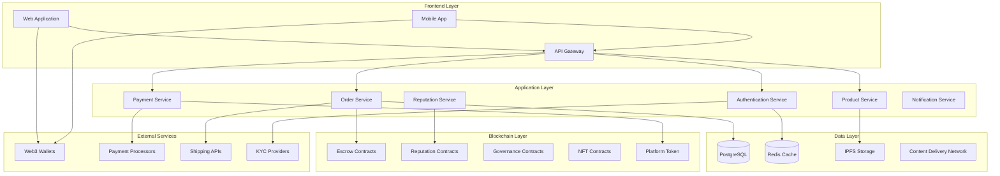

# Web3 Marketplace Design Document

## Overview

The Web3 Marketplace is a decentralized e-commerce platform designed to compete with traditional marketplaces like Amazon while leveraging blockchain technology for enhanced security, transparency, and reduced fees. The platform implements a hybrid architecture combining on-chain smart contracts for critical operations with off-chain systems for performance optimization.

### Key Design Principles

- **Decentralization**: Core transactions and governance on blockchain while maintaining performance
- **Scalability**: Layer 2 solutions and hybrid architecture for high throughput
- **User Experience**: Web2-like experience with Web3 benefits running transparently
- **Security**: Multi-signature contracts, automated escrow, and comprehensive audit trails
- **Interoperability**: Multi-chain support and cross-platform compatibility

## Architecture

### High-Level System Architecture



### Technology Stack

**Frontend**
- Framework: Next.js 14 with TypeScript and App Router
- State Management: Zustand with persistence and Web3 wallet state
- UI Library: Tailwind CSS with Headless UI components and glassmorphism styling
- Animation: Framer Motion for smooth transitions, hover effects, and page animations
- Web3 Integration: Wagmi + Viem for Ethereum interactions with multi-chain support
- Wallet Connection: WalletConnect v2, MetaMask SDK, Coinbase Wallet, Trust Wallet
- PWA: Service Worker implementation for offline capabilities and app installation
- Performance: Lazy loading, skeleton screens, virtual scrolling, and CDN optimization
- Testing: Jest, React Testing Library, Playwright for E2E testing
- Build Tools: Webpack 5 with optimizations, Bundle Analyzer for performance monitoring

**Backend**
- Runtime: Node.js with Express.js
- API: GraphQL with Apollo Server
- Database: PostgreSQL with Prisma ORM
- Cache: Redis for session and data caching
- Queue: Bull Queue with Redis for background jobs

**Blockchain**
- Primary Chain: Ethereum Mainnet
- Layer 2: Polygon, Arbitrum for cost optimization
- Smart Contracts: Solidity 0.8.19+
- Development: Hardhat framework with comprehensive testing

**Infrastructure**
- Cloud Provider: AWS with multi-region deployment
- Container Orchestration: Kubernetes with Helm charts
- CDN: CloudFlare for global content delivery with edge caching
- Monitoring: DataDog for application and infrastructure monitoring
- Performance: Lighthouse CI for automated performance testing
- Security: Web3 security audits, dependency scanning, and penetration testing

## Components and Interfaces

### Frontend Component Architecture

#### Glassmorphism Design System

```typescript
// Core design tokens for glassmorphism
const designTokens = {
  glassmorphism: {
    background: 'rgba(255, 255, 255, 0.1)',
    backdropFilter: 'blur(10px)',
    border: '1px solid rgba(255, 255, 255, 0.2)',
    borderRadius: '16px',
    boxShadow: '0 8px 32px 0 rgba(31, 38, 135, 0.37)'
  },
  gradients: {
    primary: 'linear-gradient(135deg, #667eea 0%, #764ba2 100%)',
    secondary: 'linear-gradient(135deg, #f093fb 0%, #f5576c 100%)',
    techInspired: 'linear-gradient(135deg, #4f46e5 0%, #06b6d4 100%)'
  },
  animations: {
    hover: 'transform: translateY(-2px); transition: all 0.3s ease',
    ripple: 'animation: ripple 0.6s linear',
    fadeIn: 'animation: fadeIn 0.5s ease-in-out'
  }
};
```

#### Homepage Layout Components

```typescript
interface HomepageLayoutProps {
  children: React.ReactNode;
}

// Sticky Navigation Header
const GlassmorphicNavbar: React.FC = () => {
  return (
    <nav className="sticky top-0 z-50 glassmorphic-panel">
      <div className="flex items-center justify-between px-6 py-4">
        <Logo className="web3-inspired" />
        <SearchBar 
          placeholder="Search products, NFTs, services..."
          autoSuggest={true}
          cached={true}
        />
        <div className="flex items-center space-x-4">
          <CurrencyToggle options={['USD', 'ETH', 'USDC']} />
          <LanguageSelector />
          <WalletConnectButton 
            providers={['MetaMask', 'WalletConnect', 'Coinbase']}
          />
        </div>
      </div>
    </nav>
  );
};

// Hero Section with Call-to-Action
const HeroSection: React.FC = () => {
  return (
    <section className="hero-gradient min-h-[60vh] flex items-center">
      <div className="container mx-auto text-center">
        <motion.h1 
          initial={{ opacity: 0, y: 20 }}
          animate={{ opacity: 1, y: 0 }}
          className="text-6xl font-bold text-white mb-6"
        >
          Buy. Sell. Bid. Own — Powered by Web3
        </motion.h1>
        <div className="flex justify-center space-x-6 mt-8">
          <Button variant="primary" size="large">Start Selling</Button>
          <Button variant="secondary" size="large">Browse Marketplace</Button>
        </div>
        <FeaturedProductCarousel 
          products={featuredProducts}
          autoRotate={true}
          showNFTBadges={true}
        />
      </div>
    </section>
  );
};

// Category Grid with DAO Highlights
const CategoryGrid: React.FC = () => {
  return (
    <section className="py-16">
      <div className="grid grid-cols-2 md:grid-cols-4 lg:grid-cols-6 gap-6">
        {categories.map((category) => (
          <CategoryCard
            key={category.id}
            icon={category.icon}
            name={category.name}
            daoApproved={category.daoApproved}
            className={category.daoApproved ? 'dao-glow-border' : ''}
          />
        ))}
      </div>
    </section>
  );
};
```

#### Product Display Components

```typescript
// Glassmorphic Product Card
interface ProductCardProps {
  product: Product;
  showTrustIndicators?: boolean;
  variant?: 'grid' | 'list';
}

const ProductCard: React.FC<ProductCardProps> = ({ 
  product, 
  showTrustIndicators = true,
  variant = 'grid' 
}) => {
  return (
    <motion.div 
      className="glassmorphic-card nft-shadow-border"
      whileHover={{ y: -4 }}
      transition={{ duration: 0.3 }}
    >
      <OptimizedImage
        src={product.images[0]}
        alt={product.title}
        className="w-full h-48 object-cover rounded-t-lg"
        loading="lazy"
        skeleton={true}
      />
      
      <div className="p-4">
        <div className="flex items-center justify-between mb-2">
          <SellerBadge 
            seller={product.seller}
            verified={product.seller.verified}
            reputation={product.seller.reputation}
          />
          {showTrustIndicators && (
            <TrustIndicators
              escrowProtected={product.escrowProtected}
              onChainCertified={product.onChainCertified}
              verified={product.verified}
            />
          )}
        </div>
        
        <h3 className="font-semibold text-lg mb-2">{product.title}</h3>
        
        <DualPricing
          cryptoPrice={product.price.crypto}
          fiatPrice={product.price.fiat}
          currency={product.price.currency}
          realTimeConversion={true}
        />
        
        <div className="flex space-x-2 mt-4">
          <Button variant="primary" size="small">Buy Now</Button>
          <Button variant="outline" size="small">Place Bid</Button>
          <Button variant="ghost" size="small">♡</Button>
        </div>
      </div>
    </motion.div>
  );
};

// Product Detail Page Layout
const ProductDetailPage: React.FC<{ productId: string }> = ({ productId }) => {
  return (
    <div className="container mx-auto py-8">
      <div className="grid grid-cols-1 lg:grid-cols-2 gap-8">
        <MediaViewer
          media={product.media}
          supports3D={true}
          supportsVideo={true}
          nftMetadata={product.nftMetadata}
        />
        
        <div className="space-y-6">
          <ProductInfo product={product} />
          <DualPricing 
            cryptoPrice="0.15 ETH"
            fiatEquivalent="≈ $260"
            realTime={true}
          />
          <SellerInfoCard seller={product.seller} />
          <TrustLayer
            escrowGuarantee={true}
            authenticityNFT={product.authenticityNFT}
            buyerProtection={true}
          />
          <ActionButtons
            onBuyNow={handleBuyNow}
            onPlaceBid={handlePlaceBid}
            onAddToWishlist={handleWishlist}
          />
        </div>
      </div>
    </div>
  );
};
```

#### Mobile-First Components

```typescript
// Mobile Navigation
const MobileNavigation: React.FC = () => {
  return (
    <nav className="fixed bottom-0 left-0 right-0 z-50 glassmorphic-panel md:hidden">
      <div className="flex justify-around py-2">
        <NavItem icon="🏠" label="Home" />
        <NavItem icon="🔍" label="Search" />
        <NavItem icon="➕" label="Sell" />
        <NavItem icon="👛" label="Wallet" />
        <NavItem icon="👤" label="Profile" />
      </div>
    </nav>
  );
};

// Collapsible Filter Drawer
const FilterDrawer: React.FC = () => {
  return (
    <BottomSheet>
      <div className="p-6 space-y-4">
        <PriceRangeFilter />
        <CategoryFilter />
        <LocationFilter />
        <PaymentMethodFilter />
        <ShippingFilter />
      </div>
    </BottomSheet>
  );
};

// Swipe-Friendly Product Cards
const SwipeableProductGrid: React.FC = () => {
  return (
    <div className="overflow-x-auto">
      <div className="flex space-x-4 pb-4">
        {products.map((product) => (
          <ProductCard
            key={product.id}
            product={product}
            className="min-w-[280px] flex-shrink-0"
          />
        ))}
      </div>
    </div>
  );
};
```

#### Performance Optimization Components

```typescript
// Lazy Loading with Skeleton
const OptimizedImage: React.FC<ImageProps> = ({ 
  src, 
  alt, 
  skeleton = true,
  ...props 
}) => {
  const [loading, setLoading] = useState(true);
  
  return (
    <div className="relative">
      {loading && skeleton && <ImageSkeleton />}
       setLoading(false)}
        className={`transition-opacity duration-300 ${
          loading ? 'opacity-0' : 'opacity-100'
        }`}
        {...props}
      />
    </div>
  );
};

// Virtual Scrolling for Large Lists
const VirtualizedProductList: React.FC = () => {
  return (
    <VirtualList
      height={600}
      itemCount={products.length}
      itemSize={120}
      renderItem={({ index, style }) => (
        <div style={style}>
          <ProductCard product={products[index]} variant="list" />
        </div>
      )}
    />
  );
};

// Progressive Web App Features
const PWAInstallPrompt: React.FC = () => {
  const [showInstallPrompt, setShowInstallPrompt] = useState(false);
  
  return (
    <>
      {showInstallPrompt && (
        <motion.div 
          initial={{ y: 100 }}
          animate={{ y: 0 }}
          className="fixed bottom-20 left-4 right-4 glassmorphic-panel p-4"
        >
          <div className="flex items-center justify-between">
            <span>Install Web3 Marketplace for better experience</span>
            <Button onClick={handleInstall}>Install</Button>
          </div>
        </motion.div>
      )}
    </>
  );
};
```

### Core Smart Contracts

#### MarketplaceEscrow Contract

```solidity
contract MarketplaceEscrow {
    struct Order {
        uint256 orderId;
        address buyer;
        address seller;
        uint256 amount;
        address token;
        OrderStatus status;
        uint256 createdAt;
        uint256 deliveryDeadline;
        bytes32 productHash;
    }
    
    enum OrderStatus {
        Created,
        Paid,
        Shipped,
        Delivered,
        Disputed,
        Completed,
        Cancelled,
        Refunded
    }
    
    mapping(uint256 => Order) public orders;
    mapping(address => uint256) public sellerReputation;
    mapping(address => uint256) public buyerReputation;
    
    event OrderCreated(uint256 indexed orderId, address indexed buyer, address indexed seller);
    event PaymentReleased(uint256 indexed orderId, address indexed seller, uint256 amount);
    event DisputeInitiated(uint256 indexed orderId, address indexed initiator);
    
    function createOrder(
        address seller,
        uint256 amount,
        address token,
        uint256 deliveryDeadline,
        bytes32 productHash
    ) external payable returns (uint256);
    
    function confirmDelivery(uint256 orderId) external;
    function initiateDispute(uint256 orderId, string calldata reason) external;
    function resolveDispute(uint256 orderId, bool favorBuyer) external;
    function emergencyRefund(uint256 orderId) external;
}
```

#### ReputationSystem Contract

```solidity
contract ReputationSystem {
    struct Review {
        address reviewer;
        address reviewee;
        uint8 rating;
        string ipfsHash;
        uint256 orderId;
        uint256 timestamp;
        bool verified;
    }
    
    struct ReputationScore {
        uint256 totalRating;
        uint256 reviewCount;
        uint256 weightedScore;
        uint256 lastUpdated;
    }
    
    mapping(address => ReputationScore) public reputation;
    mapping(uint256 => Review) public reviews;
    mapping(address => mapping(address => bool)) public hasReviewed;
    
    function submitReview(
        address reviewee,
        uint8 rating,
        string calldata ipfsHash,
        uint256 orderId
    ) external;
    
    function calculateWeightedScore(address user) external view returns (uint256);
    function getReputationTier(address user) external view returns (uint8);
}
```

### API Layer Design

#### GraphQL Schema Structure

```graphql
type User {
  id: ID!
  address: String!
  profile: UserProfile
  reputation: ReputationScore
  orders: [Order!]!
  products: [Product!]!
  reviews: [Review!]!
}

type Product {
  id: ID!
  seller: User!
  title: String!
  description: String!
  price: Price!
  category: Category!
  images: [String!]!
  metadata: ProductMetadata
  inventory: Int!
  status: ProductStatus!
  nftContract: String
  nftTokenId: String
}

type Order {
  id: ID!
  buyer: User!
  seller: User!
  product: Product!
  quantity: Int!
  totalAmount: Price!
  status: OrderStatus!
  escrowContract: String!
  transactionHash: String
  shippingInfo: ShippingInfo
  createdAt: DateTime!
  updatedAt: DateTime!
}

type Mutation {
  createProduct(input: CreateProductInput!): Product!
  updateProduct(id: ID!, input: UpdateProductInput!): Product!
  createOrder(input: CreateOrderInput!): Order!
  confirmDelivery(orderId: ID!): Order!
  submitReview(input: ReviewInput!): Review!
  initiateDispute(orderId: ID!, reason: String!): Dispute!
}

type Query {
  products(filter: ProductFilter, sort: ProductSort, pagination: Pagination): ProductConnection!
  orders(filter: OrderFilter): [Order!]!
  user(address: String!): User
  reputation(address: String!): ReputationScore
}
```

### Database Schema

#### Core Tables

```sql
-- Users table
CREATE TABLE users (
    id UUID PRIMARY KEY DEFAULT gen_random_uuid(),
    wallet_address VARCHAR(42) UNIQUE NOT NULL,
    email VARCHAR(255),
    username VARCHAR(50),
    profile_data JSONB,
    kyc_status VARCHAR(20) DEFAULT 'none',
    created_at TIMESTAMP DEFAULT NOW(),
    updated_at TIMESTAMP DEFAULT NOW()
);

-- Products table
CREATE TABLE products (
    id UUID PRIMARY KEY DEFAULT gen_random_uuid(),
    seller_id UUID REFERENCES users(id),
    title VARCHAR(255) NOT NULL,
    description TEXT,
    price_amount DECIMAL(20,8) NOT NULL,
    price_currency VARCHAR(10) NOT NULL,
    category_id UUID REFERENCES categories(id),
    images TEXT[],
    metadata JSONB,
    inventory_count INTEGER DEFAULT 0,
    status VARCHAR(20) DEFAULT 'active',
    ipfs_hash VARCHAR(64),
    nft_contract VARCHAR(42),
    nft_token_id VARCHAR(78),
    created_at TIMESTAMP DEFAULT NOW(),
    updated_at TIMESTAMP DEFAULT NOW()
);

-- Orders table
CREATE TABLE orders (
    id UUID PRIMARY KEY DEFAULT gen_random_uuid(),
    buyer_id UUID REFERENCES users(id),
    seller_id UUID REFERENCES users(id),
    product_id UUID REFERENCES products(id),
    quantity INTEGER NOT NULL,
    total_amount DECIMAL(20,8) NOT NULL,
    currency VARCHAR(10) NOT NULL,
    status VARCHAR(20) DEFAULT 'created',
    escrow_contract VARCHAR(42),
    transaction_hash VARCHAR(66),
    shipping_data JSONB,
    created_at TIMESTAMP DEFAULT NOW(),
    updated_at TIMESTAMP DEFAULT NOW()
);

-- Reviews table
CREATE TABLE reviews (
    id UUID PRIMARY KEY DEFAULT gen_random_uuid(),
    reviewer_id UUID REFERENCES users(id),
    reviewee_id UUID REFERENCES users(id),
    order_id UUID REFERENCES orders(id),
    rating INTEGER CHECK (rating >= 1 AND rating <= 5),
    comment TEXT,
    ipfs_hash VARCHAR(64),
    blockchain_tx VARCHAR(66),
    created_at TIMESTAMP DEFAULT NOW()
);
```

## Data Models

### Product Data Model

```typescript
interface Product {
  id: string;
  sellerId: string;
  title: string;
  description: string;
  price: {
    amount: string;
    currency: string;
    usdEquivalent?: string;
  };
  category: {
    id: string;
    name: string;
    path: string[];
  };
  images: string[];
  metadata: {
    weight?: number;
    dimensions?: {
      length: number;
      width: number;
      height: number;
    };
    materials?: string[];
    brand?: string;
    model?: string;
    condition?: 'new' | 'used' | 'refurbished';
  };
  inventory: number;
  status: 'active' | 'inactive' | 'sold_out' | 'suspended';
  nft?: {
    contractAddress: string;
    tokenId: string;
    metadata: NFTMetadata;
  };
  shipping: {
    weight: number;
    dimensions: Dimensions;
    freeShipping: boolean;
    shippingCost?: string;
  };
  createdAt: Date;
  updatedAt: Date;
}
```

### Order Data Model

```typescript
interface Order {
  id: string;
  buyerId: string;
  sellerId: string;
  productId: string;
  quantity: number;
  pricing: {
    productPrice: string;
    shippingCost: string;
    platformFee: string;
    totalAmount: string;
    currency: string;
  };
  status: OrderStatus;
  blockchain: {
    escrowContract: string;
    transactionHash?: string;
    blockNumber?: number;
    gasUsed?: string;
  };
  shipping: {
    address: ShippingAddress;
    method: string;
    trackingNumber?: string;
    estimatedDelivery?: Date;
    actualDelivery?: Date;
  };
  timeline: OrderEvent[];
  createdAt: Date;
  updatedAt: Date;
}

enum OrderStatus {
  CREATED = 'created',
  PAYMENT_PENDING = 'payment_pending',
  PAID = 'paid',
  PROCESSING = 'processing',
  SHIPPED = 'shipped',
  DELIVERED = 'delivered',
  COMPLETED = 'completed',
  DISPUTED = 'disputed',
  CANCELLED = 'cancelled',
  REFUNDED = 'refunded'
}
```

## Error Handling

### Error Classification System

```typescript
enum ErrorType {
  VALIDATION_ERROR = 'VALIDATION_ERROR',
  AUTHENTICATION_ERROR = 'AUTHENTICATION_ERROR',
  AUTHORIZATION_ERROR = 'AUTHORIZATION_ERROR',
  BLOCKCHAIN_ERROR = 'BLOCKCHAIN_ERROR',
  PAYMENT_ERROR = 'PAYMENT_ERROR',
  NETWORK_ERROR = 'NETWORK_ERROR',
  SYSTEM_ERROR = 'SYSTEM_ERROR'
}

interface ApplicationError {
  type: ErrorType;
  code: string;
  message: string;
  details?: any;
  timestamp: Date;
  requestId: string;
  userId?: string;
}
```

### Blockchain Error Handling

```typescript
class BlockchainErrorHandler {
  static handleTransactionError(error: any): ApplicationError {
    if (error.code === 'INSUFFICIENT_FUNDS') {
      return {
        type: ErrorType.BLOCKCHAIN_ERROR,
        code: 'INSUFFICIENT_FUNDS',
        message: 'Insufficient funds for transaction',
        details: { requiredAmount: error.requiredAmount }
      };
    }
    
    if (error.code === 'TRANSACTION_REVERTED') {
      return {
        type: ErrorType.BLOCKCHAIN_ERROR,
        code: 'TRANSACTION_REVERTED',
        message: 'Smart contract execution failed',
        details: { reason: error.reason }
      };
    }
    
    // Handle other blockchain-specific errors
    return this.createGenericError(error);
  }
}
```

### Circuit Breaker Pattern

```typescript
class CircuitBreaker {
  private failureCount = 0;
  private lastFailureTime?: Date;
  private state: 'CLOSED' | 'OPEN' | 'HALF_OPEN' = 'CLOSED';
  
  constructor(
    private threshold: number = 5,
    private timeout: number = 60000
  ) {}
  
  async execute<T>(operation: () => Promise<T>): Promise<T> {
    if (this.state === 'OPEN') {
      if (this.shouldAttemptReset()) {
        this.state = 'HALF_OPEN';
      } else {
        throw new Error('Circuit breaker is OPEN');
      }
    }
    
    try {
      const result = await operation();
      this.onSuccess();
      return result;
    } catch (error) {
      this.onFailure();
      throw error;
    }
  }
}
```

## Testing Strategy

### Smart Contract Testing

```typescript
// Example test structure for escrow contract
describe('MarketplaceEscrow', () => {
  let escrow: MarketplaceEscrow;
  let buyer: SignerWithAddress;
  let seller: SignerWithAddress;
  let token: MockERC20;
  
  beforeEach(async () => {
    // Deploy contracts and setup test environment
  });
  
  describe('Order Creation', () => {
    it('should create order with correct parameters', async () => {
      const orderId = await escrow.createOrder(
        seller.address,
        ethers.utils.parseEther('1'),
        token.address,
        Math.floor(Date.now() / 1000) + 86400,
        ethers.utils.keccak256(ethers.utils.toUtf8Bytes('product-hash'))
      );
      
      const order = await escrow.orders(orderId);
      expect(order.buyer).to.equal(buyer.address);
      expect(order.seller).to.equal(seller.address);
    });
    
    it('should revert with insufficient payment', async () => {
      await expect(
        escrow.createOrder(/* insufficient amount */)
      ).to.be.revertedWith('Insufficient payment');
    });
  });
  
  describe('Dispute Resolution', () => {
    it('should handle dispute initiation correctly', async () => {
      // Test dispute workflow
    });
  });
});
```

### Integration Testing Strategy

```typescript
// API integration tests
describe('Product API Integration', () => {
  let app: Application;
  let testUser: User;
  
  beforeAll(async () => {
    app = await createTestApp();
    testUser = await createTestUser();
  });
  
  describe('POST /api/products', () => {
    it('should create product with valid data', async () => {
      const response = await request(app)
        .post('/api/products')
        .set('Authorization', `Bearer ${testUser.token}`)
        .send({
          title: 'Test Product',
          description: 'Test Description',
          price: { amount: '100', currency: 'USDC' }
        });
        
      expect(response.status).toBe(201);
      expect(response.body.data.title).toBe('Test Product');
    });
  });
});
```

### End-to-End Testing

```typescript
// E2E test scenarios
describe('Complete Purchase Flow', () => {
  it('should complete full purchase workflow', async () => {
    // 1. Seller creates product
    // 2. Buyer searches and finds product
    // 3. Buyer adds to cart and initiates checkout
    // 4. Payment processing and escrow creation
    // 5. Seller ships product
    // 6. Buyer confirms delivery
    // 7. Payment release and review submission
  });
});
```

### Performance Testing

- **Load Testing**: Simulate concurrent users using Artillery.js
- **Stress Testing**: Test system limits and failure points
- **Blockchain Performance**: Gas optimization and transaction throughput testing
- **Database Performance**: Query optimization and connection pooling validation

### Security Testing

- **Smart Contract Audits**: Comprehensive security audits by third-party firms
- **Penetration Testing**: Regular security assessments of API endpoints
- **Dependency Scanning**: Automated vulnerability scanning of dependencies
- **Access Control Testing**: Verification of authentication and authorization mechanisms