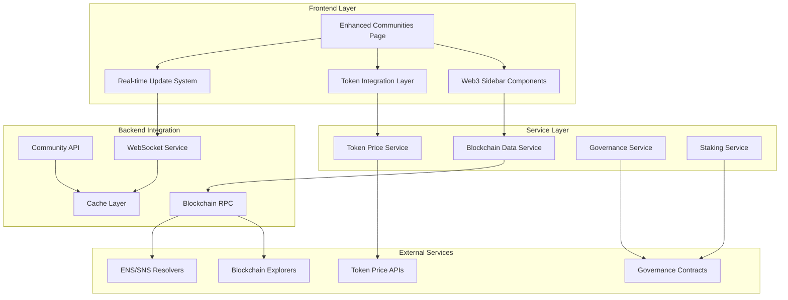

# Design Document

## Overview

The Web3-Native Community Enhancements will transform the existing Communities page into a sophisticated, blockchain-integrated social platform that feels native to Web3 users. The design leverages modern React patterns, real-time blockchain data integration, and advanced caching strategies to deliver a responsive, visually appealing experience that showcases token economics, governance participation, and on-chain verification.

This enhancement builds upon the existing community infrastructure while adding Web3-specific components, services, and integrations. The architecture emphasizes modularity, performance, and real-time updates to handle the dynamic nature of blockchain data and user interactions.

## Architecture

### High-Level Architecture



### Component Architecture

The design follows a modular component architecture with clear separation of concerns:

1. **Enhanced Layout Components** - Upgraded sidebar and main content areas
2. **Web3 Integration Components** - Token displays, staking interfaces, governance widgets
3. **Real-time Data Components** - Live price feeds, voting progress, activity streams
4. **Mobile-Optimized Components** - Touch-friendly interfaces and gesture handlers

## Components and Interfaces

### Core Layout Components

#### EnhancedLeftSidebar
```typescript
interface EnhancedLeftSidebarProps {
  communities: CommunityWithWeb3Data[];
  userRoles: UserRoleMap;
  tokenBalances: TokenBalanceMap;
  onCommunitySelect: (communityId: string) => void;
  onCreateCommunity: () => void;
}

interface CommunityWithWeb3Data extends Community {
  memberCount: number;
  isActive: boolean;
  userRole: 'admin' | 'moderator' | 'member';
  tokenRequirement?: TokenRequirement;
  userTokenBalance?: number;
  governanceNotifications?: number;
}
```

#### EnhancedPostCard
```typescript
interface EnhancedPostCardProps {
  post: PostWithWeb3Data;
  onStake: (postId: string, amount: number) => void;
  onTip: (postId: string, amount: number) => void;
  onReact: (postId: string, reaction: Web3Reaction) => void;
}

interface PostWithWeb3Data extends Post {
  stakingInfo: StakingInfo;
  engagementScore: number;
  postType: 'governance' | 'discussion' | 'showcase';
  onChainProof?: OnChainProof;
  tokenActivity?: TokenActivity[];
}

interface StakingInfo {
  totalStaked: number;
  stakerCount: number;
  userStake?: number;
  stakingTier: 'gold' | 'silver' | 'bronze' | 'none';
}
```

#### EnhancedRightSidebar
```typescript
interface EnhancedRightSidebarProps {
  currentCommunity?: Community;
  suggestedCommunities: SuggestedCommunity[];
  governanceData: GovernanceData;
  userVotingPower: number;
  walletActivity: WalletActivity[];
}

interface SuggestedCommunity extends Community {
  mutualMembers: number;
  recentActivity: ActivitySnapshot;
  trendingTopics: string[];
  treasuryBalance?: number;
}

interface GovernanceData {
  activeProposals: Proposal[];
  userVotingPower: number;
  expiringVotes: ExpiringVote[];
  governanceToken?: TokenInfo;
}
```

### Web3 Integration Components

#### TokenStakingWidget
```typescript
interface TokenStakingWidgetProps {
  postId: string;
  currentStaking: StakingInfo;
  userBalance: number;
  onStake: (amount: number) => Promise<void>;
  onUnstake: (amount: number) => Promise<void>;
}
```

#### GovernanceWidget
```typescript
interface GovernanceWidgetProps {
  proposals: Proposal[];
  userVotingPower: number;
  onVote: (proposalId: string, choice: VoteChoice) => Promise<void>;
  onDelegate: (delegatee: string) => Promise<void>;
}
```

#### OnChainVerificationBadge
```typescript
interface OnChainVerificationBadgeProps {
  proof: OnChainProof;
  explorerBaseUrl: string;
  onViewTransaction: (txHash: string) => void;
}

interface OnChainProof {
  transactionHash: string;
  blockNumber: number;
  contractAddress: string;
  verified: boolean;
  proofType: 'governance_vote' | 'token_transfer' | 'nft_mint' | 'custom';
}
```

### Real-time Data Components

#### LiveTokenPriceDisplay
```typescript
interface LiveTokenPriceDisplayProps {
  tokenAddress: string;
  displayFormat: 'compact' | 'detailed';
  showChange?: boolean;
  updateInterval?: number;
}
```

#### RealTimeActivityFeed
```typescript
interface RealTimeActivityFeedProps {
  communityId?: string;
  activityTypes: ActivityType[];
  maxItems: number;
  onActivityClick: (activity: Activity) => void;
}

type ActivityType = 'tip' | 'stake' | 'vote' | 'post' | 'comment' | 'join';
```

## Data Models

### Enhanced Community Model
```typescript
interface EnhancedCommunity {
  id: string;
  name: string;
  description: string;
  avatar: string;
  memberCount: number;
  isActive: boolean;
  
  // Web3 specific fields
  governanceToken?: {
    address: string;
    symbol: string;
    decimals: number;
    totalSupply: number;
  };
  
  treasuryBalance?: {
    tokens: TokenBalance[];
    totalValueUSD: number;
  };
  
  stakingRequirements?: {
    minimumStake: number;
    stakingToken: string;
    benefits: string[];
  };
  
  onChainData?: {
    contractAddress: string;
    chainId: number;
    governanceContract?: string;
  };
}
```

### Token Activity Model
```typescript
interface TokenActivity {
  id: string;
  type: 'tip' | 'stake' | 'reward' | 'governance';
  amount: number;
  token: TokenInfo;
  fromAddress: string;
  toAddress: string;
  timestamp: Date;
  transactionHash?: string;
  relatedPostId?: string;
  relatedProposalId?: string;
}

interface TokenInfo {
  address: string;
  symbol: string;
  decimals: number;
  name: string;
  logoUrl?: string;
  priceUSD?: number;
  priceChange24h?: number;
}
```

### Governance Model
```typescript
interface Proposal {
  id: string;
  title: string;
  description: string;
  proposer: string;
  status: 'active' | 'passed' | 'failed' | 'executed';
  votingPower: {
    for: number;
    against: number;
    abstain: number;
  };
  startTime: Date;
  endTime: Date;
  executionTime?: Date;
  onChainId?: string;
  contractAddress?: string;
}

interface UserVote {
  proposalId: string;
  choice: 'for' | 'against' | 'abstain';
  votingPower: number;
  timestamp: Date;
  transactionHash?: string;
}
```

## Error Handling

### Blockchain Integration Error Handling

The system implements comprehensive error handling for blockchain interactions:

1. **Network Errors** - Graceful fallbacks when blockchain RPCs are unavailable
2. **Transaction Failures** - Clear user feedback with retry mechanisms
3. **Price Feed Failures** - Cached price data with staleness indicators
4. **Wallet Connection Issues** - Progressive enhancement with non-Web3 fallbacks

```typescript
interface Web3ErrorHandler {
  handleRPCError(error: RPCError): ErrorResponse;
  handleTransactionError(error: TransactionError): ErrorResponse;
  handlePriceFeedError(error: PriceFeedError): ErrorResponse;
  handleWalletError(error: WalletError): ErrorResponse;
}

interface ErrorResponse {
  message: string;
  severity: 'low' | 'medium' | 'high';
  fallbackAction?: () => void;
  retryAction?: () => void;
}
```

### Progressive Enhancement Strategy

The design ensures functionality even when Web3 features are unavailable:

1. **Core Features** - Basic community browsing works without Web3
2. **Enhanced Features** - Token displays and staking require wallet connection
3. **Premium Features** - Governance and on-chain verification require full Web3 setup

## Testing Strategy

### Component Testing
- Unit tests for all Web3 integration components
- Mock blockchain data for consistent testing
- Accessibility testing for all enhanced UI elements

### Integration Testing
- End-to-end tests for complete user workflows
- Blockchain integration tests with test networks
- Performance testing with large datasets

### User Acceptance Testing
- Web3 user journey testing with real wallets
- Mobile device testing across different screen sizes
- Cross-browser compatibility testing

### Performance Testing
- Real-time data update performance
- Large community list rendering performance
- Mobile performance optimization validation

## Security Considerations

### Wallet Integration Security
- Secure wallet connection handling
- Transaction signing verification
- Private key protection (never stored)

### Data Validation
- On-chain data verification
- Input sanitization for all user inputs
- Rate limiting for blockchain API calls

### Privacy Protection
- Optional Web3 feature participation
- User control over data sharing
- Secure handling of wallet addresses

## Performance Optimization

### Caching Strategy
```typescript
interface CacheStrategy {
  tokenPrices: {
    ttl: 30000; // 30 seconds
    strategy: 'memory-first';
  };
  
  communityData: {
    ttl: 300000; // 5 minutes
    strategy: 'stale-while-revalidate';
  };
  
  governanceData: {
    ttl: 60000; // 1 minute
    strategy: 'network-first';
  };
  
  userBalances: {
    ttl: 120000; // 2 minutes
    strategy: 'cache-first';
  };
}
```

### Real-time Update Optimization
- WebSocket connection pooling
- Selective data subscriptions
- Efficient state updates with React optimizations

### Mobile Performance
- Lazy loading for non-critical components
- Image optimization and compression
- Touch gesture debouncing
- Efficient scroll handling

## Deployment Considerations

### Feature Flags
- Gradual rollout of Web3 features
- A/B testing for UI enhancements
- Emergency disable switches

### Monitoring
- Real-time performance metrics
- Blockchain API health monitoring
- User engagement analytics
- Error rate tracking

### Scalability
- Horizontal scaling for WebSocket connections
- CDN optimization for static assets
- Database optimization for community queries
- Blockchain RPC load balancing