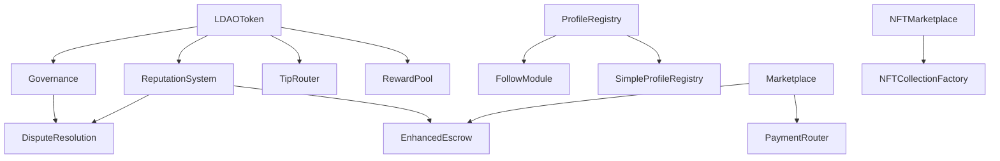

# Smart Contract API Documentation

## Overview

This document provides comprehensive API documentation for all smart contracts in the Web3 marketplace ecosystem. Each contract includes detailed function signatures, parameters, return values, events, and usage examples.

## Contract Architecture



## Core Contracts

### LDAOToken

**Description**: ERC20 governance token with staking and voting capabilities.

#### Functions

##### `initialize(address treasury)`
Initializes the token contract with initial supply.

**Parameters:**
- `treasury` (address): Address to receive initial token supply

**Events:**
- `Transfer(address indexed from, address indexed to, uint256 value)`

**Example:**
```javascript
const ldaoToken = await ethers.getContractAt("LDAOToken", tokenAddress);
await ldaoToken.initialize(treasuryAddress);
```

##### `stake(uint256 amount, uint256 lockPeriod)`
Stakes tokens for voting power and rewards.

**Parameters:**
- `amount` (uint256): Amount of tokens to stake
- `lockPeriod` (uint256): Lock period in seconds (30d, 90d, 180d, 365d)

**Returns:**
- `stakeId` (uint256): Unique identifier for the stake

**Events:**
- `Staked(address indexed user, uint256 amount, uint256 lockPeriod, uint256 stakeId)`

**Example:**
```javascript
// Stake 1000 tokens for 90 days
const stakeId = await ldaoToken.stake(
  ethers.parseEther("1000"),
  90 * 24 * 60 * 60 // 90 days in seconds
);
```

##### `unstake(uint256 stakeId)`
Unstakes tokens after lock period expires.

**Parameters:**
- `stakeId` (uint256): ID of the stake to unstake

**Events:**
- `Unstaked(address indexed user, uint256 amount, uint256 stakeId)`

##### `claimRewards(uint256 stakeId)`
Claims accumulated staking rewards.

**Parameters:**
- `stakeId` (uint256): ID of the stake to claim rewards for

**Returns:**
- `rewards` (uint256): Amount of rewards claimed

**Events:**
- `RewardsClaimed(address indexed user, uint256 rewards, uint256 stakeId)`

##### `getVotingPower(address account)`
Gets the voting power of an account.

**Parameters:**
- `account` (address): Address to check voting power for

**Returns:**
- `votingPower` (uint256): Total voting power including staked tokens

##### `getStakeInfo(uint256 stakeId)`
Gets detailed information about a stake.

**Parameters:**
- `stakeId` (uint256): ID of the stake

**Returns:**
- `amount` (uint256): Staked amount
- `lockPeriod` (uint256): Lock period in seconds
- `startTime` (uint256): Stake start timestamp
- `rewardRate` (uint256): Reward rate (basis points)
- `lastRewardClaim` (uint256): Last reward claim timestamp

#### Events

##### `Staked(address indexed user, uint256 amount, uint256 lockPeriod, uint256 stakeId)`
Emitted when tokens are staked.

##### `Unstaked(address indexed user, uint256 amount, uint256 stakeId)`
Emitted when tokens are unstaked.

##### `RewardsClaimed(address indexed user, uint256 rewards, uint256 stakeId)`
Emitted when staking rewards are claimed.

### Governance

**Description**: DAO governance contract for proposal creation and voting.

#### Functions

##### `initialize(address token)`
Initializes the governance contract.

**Parameters:**
- `token` (address): Address of the governance token (LDAOToken)

##### `createProposal(string memory description, uint256 category, bytes memory data)`
Creates a new governance proposal.

**Parameters:**
- `description` (string): Proposal description
- `category` (uint256): Proposal category (0=General, 1=Marketplace, 2=Fee, 3=Security, 4=Token)
- `data` (bytes): Encoded function call data

**Returns:**
- `proposalId` (uint256): Unique identifier for the proposal

**Events:**
- `ProposalCreated(uint256 indexed proposalId, address indexed proposer, string description)`

**Example:**
```javascript
const governance = await ethers.getContractAt("Governance", governanceAddress);

// Create a proposal to change marketplace fee
const proposalId = await governance.createProposal(
  "Reduce marketplace fee to 2%",
  1, // Marketplace category
  encodedFunctionCall
);
```

##### `vote(uint256 proposalId, bool support)`
Votes on a proposal.

**Parameters:**
- `proposalId` (uint256): ID of the proposal to vote on
- `support` (bool): true for support, false for against

**Events:**
- `VoteCast(uint256 indexed proposalId, address indexed voter, bool support, uint256 votingPower)`

##### `executeProposal(uint256 proposalId)`
Executes a successful proposal.

**Parameters:**
- `proposalId` (uint256): ID of the proposal to execute

**Events:**
- `ProposalExecuted(uint256 indexed proposalId)`

##### `getProposal(uint256 proposalId)`
Gets detailed information about a proposal.

**Returns:**
- `proposer` (address): Address of the proposer
- `description` (string): Proposal description
- `forVotes` (uint256): Votes in favor
- `againstVotes` (uint256): Votes against
- `executed` (bool): Whether proposal was executed
- `category` (uint256): Proposal category

### Marketplace

**Description**: Main marketplace contract for trading assets.

#### Functions

##### `initialize(address escrow, address paymentRouter, address reputation)`
Initializes the marketplace contract.

**Parameters:**
- `escrow` (address): Address of the escrow contract
- `paymentRouter` (address): Address of the payment router
- `reputation` (address): Address of the reputation system

##### `createListing(address tokenAddress, uint256 tokenId, uint256 price, uint256 quantity, uint8 listingType)`
Creates a new marketplace listing.

**Parameters:**
- `tokenAddress` (address): Address of the token contract (0x0 for ETH)
- `tokenId` (uint256): Token ID (for NFTs) or 0 for fungible tokens
- `price` (uint256): Listing price
- `quantity` (uint256): Quantity to sell
- `listingType` (uint8): 0=Fixed Price, 1=Auction

**Returns:**
- `listingId` (uint256): Unique identifier for the listing

**Events:**
- `ListingCreated(uint256 indexed listingId, address indexed seller, uint256 price)`

**Example:**
```javascript
const marketplace = await ethers.getContractAt("Marketplace", marketplaceAddress);

// Create a fixed-price listing for 1 ETH
const listingId = await marketplace.createListing(
  ethers.ZeroAddress, // ETH
  0, // No token ID for ETH
  ethers.parseEther("1"), // 1 ETH price
  1, // Quantity of 1
  0 // Fixed price listing
);
```

##### `buyItem(uint256 listingId, uint256 quantity)`
Purchases an item from a listing.

**Parameters:**
- `listingId` (uint256): ID of the listing to purchase from
- `quantity` (uint256): Quantity to purchase

**Events:**
- `ItemPurchased(uint256 indexed listingId, address indexed buyer, uint256 quantity, uint256 totalPrice)`

##### `createOffer(uint256 listingId, uint256 price, uint256 quantity, uint256 expiration)`
Creates an offer on a listing.

**Parameters:**
- `listingId` (uint256): ID of the listing
- `price` (uint256): Offer price
- `quantity` (uint256): Quantity offered for
- `expiration` (uint256): Offer expiration timestamp

**Returns:**
- `offerId` (uint256): Unique identifier for the offer

##### `acceptOffer(uint256 offerId)`
Accepts an offer (seller only).

**Parameters:**
- `offerId` (uint256): ID of the offer to accept

**Events:**
- `OfferAccepted(uint256 indexed offerId, uint256 indexed listingId)`

##### `getListing(uint256 listingId)`
Gets detailed information about a listing.

**Returns:**
- `seller` (address): Address of the seller
- `tokenAddress` (address): Token contract address
- `price` (uint256): Listing price
- `quantity` (uint256): Available quantity
- `listingType` (uint8): Type of listing
- `status` (uint8): Current status

### EnhancedEscrow

**Description**: Escrow contract for secure transactions with automated release.

#### Functions

##### `initialize(address governance)`
Initializes the escrow contract.

##### `createEscrow(uint256 listingId, address seller, address buyer, uint256 amount, uint256 releaseTime)`
Creates a new escrow for a transaction.

**Parameters:**
- `listingId` (uint256): Associated marketplace listing ID
- `seller` (address): Seller address
- `buyer` (address): Buyer address
- `amount` (uint256): Escrow amount
- `releaseTime` (uint256): Automatic release timestamp

**Returns:**
- `escrowId` (uint256): Unique identifier for the escrow

**Events:**
- `EscrowCreated(uint256 indexed escrowId, uint256 indexed listingId, address seller, address buyer, uint256 amount)`

##### `confirmDelivery(uint256 escrowId)`
Confirms delivery and releases funds (buyer only).

**Parameters:**
- `escrowId` (uint256): ID of the escrow

**Events:**
- `DeliveryConfirmed(uint256 indexed escrowId)`

##### `releaseEscrow(uint256 escrowId)`
Releases escrow funds to seller.

**Parameters:**
- `escrowId` (uint256): ID of the escrow to release

##### `refundEscrow(uint256 escrowId)`
Refunds escrow to buyer (in case of dispute resolution).

**Parameters:**
- `escrowId` (uint256): ID of the escrow to refund

##### `getEscrow(uint256 escrowId)`
Gets detailed information about an escrow.

**Returns:**
- `listingId` (uint256): Associated listing ID
- `seller` (address): Seller address
- `buyer` (address): Buyer address
- `amount` (uint256): Escrow amount
- `status` (uint8): Current status
- `releaseTime` (uint256): Automatic release time

### DisputeResolution

**Description**: Multi-tier dispute resolution system.

#### Functions

##### `initialize(address reputation, address governance)`
Initializes the dispute resolution contract.

##### `createDispute(uint256 escrowId, string memory reason, bytes memory evidence)`
Creates a new dispute for an escrow.

**Parameters:**
- `escrowId` (uint256): ID of the escrow in dispute
- `reason` (string): Reason for the dispute
- `evidence` (bytes): Evidence supporting the dispute

**Returns:**
- `disputeId` (uint256): Unique identifier for the dispute

**Events:**
- `DisputeCreated(uint256 indexed disputeId, uint256 indexed escrowId, address indexed initiator)`

##### `submitEvidence(uint256 disputeId, bytes memory evidence)`
Submits additional evidence for a dispute.

**Parameters:**
- `disputeId` (uint256): ID of the dispute
- `evidence` (bytes): Additional evidence

##### `voteOnDispute(uint256 disputeId, bool favorBuyer)`
Community vote on a dispute (for community-tier disputes).

**Parameters:**
- `disputeId` (uint256): ID of the dispute
- `favorBuyer` (bool): true to favor buyer, false to favor seller

##### `resolveDispute(uint256 disputeId, bool favorBuyer)`
Resolves a dispute (arbitrator only).

**Parameters:**
- `disputeId` (uint256): ID of the dispute to resolve
- `favorBuyer` (bool): Resolution decision

**Events:**
- `DisputeResolved(uint256 indexed disputeId, bool favorBuyer, address resolver)`

### ReputationSystem

**Description**: User reputation tracking and management.

#### Functions

##### `initialize()`
Initializes the reputation system.

##### `submitReview(address user, uint8 rating, string memory comment, uint256 transactionId)`
Submits a review for a user.

**Parameters:**
- `user` (address): Address of the user being reviewed
- `rating` (uint8): Rating from 1-5
- `comment` (string): Review comment
- `transactionId` (uint256): Associated transaction ID

**Events:**
- `ReviewSubmitted(address indexed reviewer, address indexed reviewee, uint8 rating, uint256 transactionId)`

##### `getReputationScore(address user)`
Gets the reputation score for a user.

**Parameters:**
- `user` (address): Address to check reputation for

**Returns:**
- `score` (uint256): Weighted reputation score
- `reviewCount` (uint256): Total number of reviews
- `averageRating` (uint256): Average rating (scaled by 100)
- `tier` (uint8): Reputation tier (0-4)

##### `getReputationTier(address user)`
Gets the reputation tier for a user.

**Returns:**
- `tier` (uint8): Reputation tier (0=Newcomer, 1=Bronze, 2=Silver, 3=Gold, 4=Platinum)

### NFTMarketplace

**Description**: Specialized marketplace for NFT trading.

#### Functions

##### `initialize(address paymentRouter)`
Initializes the NFT marketplace.

##### `mintNFT(address to, string memory tokenURI, uint256 royaltyBasisPoints)`
Mints a new NFT with royalty settings.

**Parameters:**
- `to` (address): Address to mint NFT to
- `tokenURI` (string): Metadata URI for the NFT
- `royaltyBasisPoints` (uint256): Royalty percentage (basis points)

**Returns:**
- `tokenId` (uint256): ID of the minted NFT

**Events:**
- `NFTMinted(address indexed to, uint256 indexed tokenId, string tokenURI)`

##### `listNFT(uint256 tokenId, uint256 price, uint8 listingType)`
Lists an NFT for sale.

**Parameters:**
- `tokenId` (uint256): ID of the NFT to list
- `price` (uint256): Listing price
- `listingType` (uint8): 0=Fixed Price, 1=Auction

**Returns:**
- `listingId` (uint256): Unique identifier for the listing

##### `buyNFT(uint256 listingId)`
Purchases an NFT from a listing.

**Parameters:**
- `listingId` (uint256): ID of the listing to purchase

**Events:**
- `NFTPurchased(uint256 indexed listingId, uint256 indexed tokenId, address buyer, uint256 price)`

##### `createAuction(uint256 tokenId, uint256 startingPrice, uint256 duration)`
Creates an auction for an NFT.

**Parameters:**
- `tokenId` (uint256): ID of the NFT to auction
- `startingPrice` (uint256): Starting bid price
- `duration` (uint256): Auction duration in seconds

**Returns:**
- `auctionId` (uint256): Unique identifier for the auction

##### `placeBid(uint256 auctionId)`
Places a bid on an NFT auction.

**Parameters:**
- `auctionId` (uint256): ID of the auction to bid on

**Events:**
- `BidPlaced(uint256 indexed auctionId, address indexed bidder, uint256 amount)`

### PaymentRouter

**Description**: Handles multi-token payments and fee distribution.

#### Functions

##### `initialize(uint256 feeBasisPoints, address feeCollector)`
Initializes the payment router.

**Parameters:**
- `feeBasisPoints` (uint256): Fee percentage in basis points
- `feeCollector` (address): Address to collect fees

##### `processPayment(address token, uint256 amount, address recipient)`
Processes a payment with fee deduction.

**Parameters:**
- `token` (address): Token contract address (0x0 for ETH)
- `amount` (uint256): Payment amount
- `recipient` (address): Payment recipient

**Events:**
- `PaymentProcessed(address indexed token, uint256 amount, address indexed recipient, uint256 fee)`

##### `setTokenSupported(address token, bool supported)`
Sets whether a token is supported for payments.

**Parameters:**
- `token` (address): Token contract address
- `supported` (bool): Whether token is supported

##### `isTokenSupported(address token)`
Checks if a token is supported for payments.

**Returns:**
- `supported` (bool): Whether token is supported

### TipRouter

**Description**: Handles creator tipping with LDAO tokens.

#### Functions

##### `initialize(address ldaoToken, address rewardPool)`
Initializes the tip router.

##### `tip(address creator, uint256 amount, uint256 postId)`
Tips a creator with LDAO tokens.

**Parameters:**
- `creator` (address): Address of the creator to tip
- `amount` (uint256): Amount of LDAO tokens to tip
- `postId` (uint256): ID of the post being tipped for

**Events:**
- `TipSent(address indexed tipper, address indexed creator, uint256 amount, uint256 postId)`

##### `getTipTotal(address creator)`
Gets total tips received by a creator.

**Returns:**
- `total` (uint256): Total tips received

### FollowModule

**Description**: Manages social following relationships.

#### Functions

##### `follow(address user)`
Follows a user.

**Parameters:**
- `user` (address): Address of the user to follow

**Events:**
- `Followed(address indexed follower, address indexed followee)`

##### `unfollow(address user)`
Unfollows a user.

**Parameters:**
- `user` (address): Address of the user to unfollow

**Events:**
- `Unfollowed(address indexed follower, address indexed followee)`

##### `isFollowing(address follower, address followee)`
Checks if one user is following another.

**Returns:**
- `following` (bool): Whether follower is following followee

##### `followerCount(address user)`
Gets the number of followers for a user.

**Returns:**
- `count` (uint256): Number of followers

##### `followingCount(address user)`
Gets the number of users a user is following.

**Returns:**
- `count` (uint256): Number of users being followed

## Integration Examples

### Complete Purchase Flow

```javascript
// 1. Create marketplace listing
const marketplace = await ethers.getContractAt("Marketplace", marketplaceAddress);
const listingId = await marketplace.createListing(
  tokenAddress,
  tokenId,
  price,
  quantity,
  0 // Fixed price
);

// 2. Buyer purchases item
await marketplace.connect(buyer).buyItem(listingId, 1, { value: price });

// 3. Escrow is automatically created
const escrowId = await marketplace.getListingEscrow(listingId);

// 4. Buyer confirms delivery
const escrow = await ethers.getContractAt("EnhancedEscrow", escrowAddress);
await escrow.connect(buyer).confirmDelivery(escrowId);

// 5. Submit review
const reputation = await ethers.getContractAt("ReputationSystem", reputationAddress);
await reputation.connect(buyer).submitReview(
  sellerAddress,
  5, // 5-star rating
  "Great seller!",
  listingId
);
```

### Governance Proposal Flow

```javascript
// 1. Create proposal
const governance = await ethers.getContractAt("Governance", governanceAddress);
const proposalId = await governance.createProposal(
  "Reduce marketplace fees",
  1, // Marketplace category
  encodedCallData
);

// 2. Vote on proposal
await governance.connect(voter).vote(proposalId, true);

// 3. Execute proposal (after voting period)
await governance.executeProposal(proposalId);
```

### NFT Trading Flow

```javascript
// 1. Mint NFT
const nftMarketplace = await ethers.getContractAt("NFTMarketplace", nftMarketplaceAddress);
const tokenId = await nftMarketplace.mintNFT(
  creatorAddress,
  "ipfs://metadata-hash",
  500 // 5% royalty
);

// 2. List NFT for sale
const listingId = await nftMarketplace.listNFT(
  tokenId,
  ethers.parseEther("1"), // 1 ETH
  0 // Fixed price
);

// 3. Buy NFT
await nftMarketplace.connect(buyer).buyNFT(listingId, { 
  value: ethers.parseEther("1") 
});
```

## Error Handling

### Common Errors

#### `InsufficientBalance()`
- **Cause**: User doesn't have enough tokens/ETH
- **Solution**: Check balance before transaction

#### `NotAuthorized()`
- **Cause**: User doesn't have permission for action
- **Solution**: Verify user permissions

#### `InvalidInput()`
- **Cause**: Invalid parameters provided
- **Solution**: Validate input parameters

#### `ContractPaused()`
- **Cause**: Contract is paused for maintenance
- **Solution**: Wait for contract to be unpaused

### Error Handling Example

```javascript
try {
  await marketplace.buyItem(listingId, quantity, { value: price });
} catch (error) {
  if (error.message.includes("InsufficientBalance")) {
    console.log("Not enough ETH to complete purchase");
  } else if (error.message.includes("ListingNotActive")) {
    console.log("This listing is no longer available");
  } else {
    console.log("Transaction failed:", error.message);
  }
}
```

## Gas Optimization

### Estimated Gas Costs

| Function | Gas Cost | Notes |
|----------|----------|-------|
| `createListing` | ~150,000 | Marketplace listing creation |
| `buyItem` | ~200,000 | Purchase with escrow creation |
| `vote` | ~100,000 | Governance voting |
| `mintNFT` | ~180,000 | NFT minting with metadata |
| `tip` | ~80,000 | Creator tipping |
| `follow` | ~50,000 | Social following |

### Gas Optimization Tips

1. **Batch Operations**: Use batch functions when available
2. **Approve Once**: Set high allowances to avoid repeated approvals
3. **Off-chain Data**: Store large data off-chain (IPFS)
4. **Event Indexing**: Use indexed parameters for efficient filtering

## Security Considerations

### Access Control
- All administrative functions require proper permissions
- Multi-signature requirements for critical operations
- Time delays for sensitive changes

### Input Validation
- All user inputs are validated
- Overflow/underflow protection
- Reentrancy guards on external calls

### Emergency Procedures
- Pause functionality for critical contracts
- Emergency withdrawal mechanisms
- Upgrade procedures with governance approval

## Support and Resources

### Documentation
- [Contract Source Code](../contracts/)
- [Test Suite](../test/)
- [Deployment Scripts](../scripts/)

### Community
- [Discord](https://discord.gg/example)
- [Forum](https://forum.example.com)
- [GitHub](https://github.com/example/contracts)

### Technical Support
- Email: tech-support@example.com
- Emergency: emergency@example.com
- Bug Reports: bugs@example.com